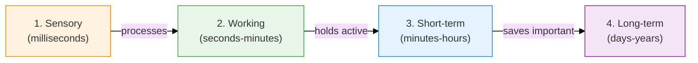
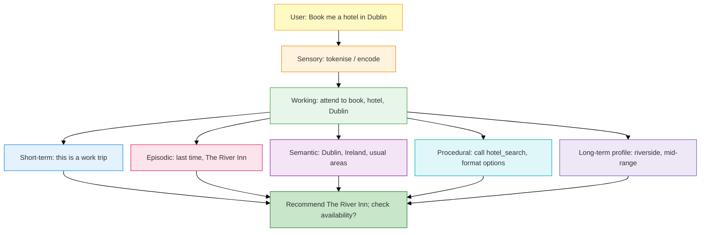

Ever wondered how AI agents **remember** things?

You've probably used ChatGPT or similar tools and noticed:

> Sometimes it remembers your name. Sometimes it forgets everything. Sometimes it seems to "know" things it was never told.

And thought:

> **"How does an AI agent's memory actually work? Does it have one brain or many?"**

There isn't one memory. There are several stores, each solving a different problem — the same way you do not keep the current stack frame, this morning's standup, last month's outage, and "HTTP 404 means not found" in the same place.

This is the second post in the series: PEFT changes **weights**. This post is about what you store **outside** the model (and what the model already baked in during training). The next post is semantic caching — reusing *answers*, which is not the same as remembering *a user*.

<p class="series">
  <strong>Also in this series:</strong>
  <a href="{{ '/posts/peft-lora-qlora-guide/' | relative_url }}">PEFT, LoRA, and QLoRA</a> ·
  <em>AI agent memory (this post)</em> ·
  <a href="{{ '/posts/rag-semantic-caching/' | relative_url }}">Semantic caching</a>
</p>


---

## Who this is for — and when "memory" is the right tool

If you can ship a CRUD app, you can ship agent memory. The trap is treating "memory" as a single vector database you turn on.

**Start here:**

| Situation | What to build first |
|---|---|
| One chat session, user can repeat themselves | Context window only. No extra store. |
| Same user, next week, should still know their stack | Structured **profile** (Postgres row), not a pile of embeddings. |
| Answers must cite *our* wiki / runbooks | **RAG** over docs (semantic knowledge). That is retrieval, not a diary. |
| Agent retries a task and should not repeat a failed fix | **Episodic** logs: what we tried, what happened. |
| Same workflow every time (test → diff → PR) | **Procedural** memory: system prompt, tools, runbook — not a novel. |

**Do not start with seven databases.** The seven types below are a *mental model*. A real v1 is usually: current context + one persistent store with a few record types (facts, events, skills).

---

## Jargon Buster — Read This First

| Term | Plain English |
|---|---|
| **AI Agent** | A program that can plan and take actions (tools, APIs), not only complete one prompt. |
| **Context window** | How much text the model can see *this call*. Measured in **tokens**, not pages. |
| **Token** | A chunk of text the model reads — often a short word or part of a word. "Hello world" is a handful of tokens, not two mystical units. |
| **Vector / embedding** | A list of numbers that represents meaning. Similar ideas land near each other. |
| **Vector store** | A database good at "find nearest neighbours in embedding space." A **mechanism**, not a memory type. |
| **RAG** | Search first, then generate. External knowledge pulled into the prompt. |
| **Prompt / system prompt** | The user message, plus hidden standing instructions ("you are a coding assistant"). |
| **Session** | One continuous conversation. New chat = new session unless you reload memory. |
| **Inference** | The model running: reading tokens, writing tokens. |
| **Latency** | How long until a response. Memory retrieval adds latency; dumping everything into context adds tokens and cost. |
| **Pre-training / fine-tuning** | Weights learn language and skills. That is **not** the same as a row in your DB about Vijay preferring TypeScript. |
| **Persistent / volatile** | Survives tomorrow vs wiped when the session ends. |

---

## Two distinctions that save you from a bad architecture

### 1. Context ≠ memory

> **Context** = what you put on the model's desk *this request*.
> **Memory** = what you stored so you *could* put it on the desk later.

If yesterday's chat is not retrieved and inserted, the model does not "have" it. Weights do not silently keep your Slack thread.

### 2. A vector database is not a kind of memory

A vector DB can store:

- company docs (semantic / RAG)
- past episodes ("we already raised the pool size; it failed")
- cached questions (next post)

Same retrieval engine; **different purpose**. If you only remember "we use Pinecone," you have not designed memory yet.

### 3. Memory ≠ RAG ≠ PEFT

| Lever | Question it answers | Typical store |
|---|---|---|
| **PEFT / fine-tune** | Should this behaviour live in **weights**? | Adapter / checkpoint |
| **RAG** | What **shared knowledge** is relevant to this question? | Docs + embeddings |
| **Agent memory** | What should I remember about **this user, task, or past attempt**? | Profile, event log, sometimes embeddings |

Fine-tuning "our Python style" into weights is a product decision. Storing "Vijay prefers concise answers" in a user table is an engineering decision. Do not fine-tune a preference you should `UPDATE`.

---

## The Big Picture

A developer already uses several memories:

- **Right now:** error on screen, value of `user_id`
- **This task:** hypothesis, files open, what you already tried
- **This session:** what the user said 20 minutes ago
- **Long-term:** Python, the team's style guide, last week's incident

Agents have the same split. Psychology labels (sensory, working, episodic…) are borrowed on purpose — they are *categories*, and frameworks will use the words interchangeably. Working memory and short-term memory especially get mashed together. Use the **question** in the table, not the brand name.



Long-term then splits into **semantic / episodic / procedural** — facts, events, how-to. The overview figure also shows a **reasoning & planning** step between working memory and action. That step is not an eighth database. It is the agent using the other stores to decide what to do next.

---

## 1. Sensory Memory — "What just hit my screen?"

**Duration:** milliseconds to seconds  
**Question:** What am I receiving right now?

Raw input before you decide it matters: text, image, audio, tool output, a webhook payload.

| Developer's version | Agent's version |
|---|---|
| Eyes on the stack trace, Slack ding | User message, uploaded screenshot, API body |

You do not archive every pixel. You tokenise text, encode images, turn the useful part into model-ready numbers, and throw the raw buffer away unless a product rule says "keep the file."

**Why it matters:** multimodal agents are not "smarter chat." They have more *sensors*. Your job is to normalise those sensors into one input path (and not leak raw PII into logs by default).

---

## 2. Working Memory — "What am I thinking about right now?"

**Duration:** seconds to minutes  
**Question:** What am I using to finish *this* step?

The mental workbench. Humans hold a handful of items (the old "7 ± 2" figure is a teaching aid, not a hard CPU spec). Interrupt the developer and the hypothesis falls on the floor.

For an agent, working memory is the **live scratchpad**:

```text
Goal:           fix payment 500s
Observation:    HTTP 500, DB timeout
Hypothesis:     connection pool exhausted
Next action:    inspect pool config
```

Inside a single model call, the closest hardware analogue is **attention**: at each new token, the model scores earlier tokens ("how relevant are you to what I'm writing now?") and blends their values. Query / Key / Value is that lookup:

- **Query** — what am I looking for?
- **Key** — what does this past token advertise?
- **Value** — what content do I actually pull?

The formula `softmax(QKᵀ / √d) V` is "score, squash to a distribution, take a weighted mix." You do not need to implement it; you need to remember that **working memory is volatile and tiny**. Do not pretend the model is "holding the whole monorepo in working memory." You retrieve, then it attends.

---

## 3. Short-Term Memory — "What happened earlier in this conversation?"

**Duration:** minutes to hours (this session)  
**Question:** What just happened in *this* interaction?

Pair-programming for an hour: you both remember "we picked a HashMap" without juggling it as the current thought. Tomorrow the details fade unless you wrote them down.

For the agent, this is almost always the **context window**: system prompt + recent turns + the new message, concatenated and sent again. The model is not recalling. You are **re-supplying**.

### Context windows (snapshot, not a spec)

Windows are counted in **tokens**. Product numbers move every release. As a planning range, hosted models commonly offer **tens of thousands to a million+ tokens**. Check the model's current card before you design "just stuff the whole PDF in."

When you overflow:

| Strategy | What it does | Failure mode |
|---|---|---|
| **Truncation** | Drop oldest turns | Forgets the original goal |
| **Sliding window** | Keep system + tail, drop the middle | Loses the decision in the middle |
| **Summarisation** | Compress old turns into a shorter note | Summary can lie or omit a constraint |

**KV cache** is an inference speed trick, not long-term memory. It stores already-computed keys/values so a new user token does not re-encode the whole prompt. It costs **GPU memory**. Long chats get expensive even when you are "just chatting."

---

## 4. Long-Term Memory — "What do I know about this user or project?"

**Duration:** days to years, if *you* persist it  
**Question:** What should still be true next session?

The model does not keep a user profile in weights between chats. You build that:

1. **Structured profile** — name, default language, "prefers TypeScript." A regular table. Query by `user_id`.
2. **Extracted notes** — after a session, a job writes "building a FastAPI app, Postgres, wants type hints."
3. **Embeddings of notes** — when the next question is fuzzy ("that database thing we discussed").
4. **RAG over company knowledge** — often grouped under semantic memory below.

```text
Conversation
    → decide what is worth saving
    → write to store
New conversation
    → retrieve relevant rows / neighbours
    → insert into context
```

The product is the **policy** (what to save), not the database brand.

---

## 5. Episodic Memory — "What happened that time when…?"

**Duration:** persistent  
**Question:** What happened, in what situation, with what outcome?

Facts: "User prefers riverside hotels."  
Episode: "15 March, work trip, chose The River Inn, said it was perfect, walking distance to the venue."

Episodes help decisions. "Should we bump the pool size?" is different if last Tuesday you already did that and the 500s stayed.

```text
Episode
  when:        2024-03-15
  task:        book Dublin hotel near the river
  actions:     searched → 3 options → user picked The River Inn
  outcome:     booked; user feedback positive
  lesson:      riverside + mid-range + walkable to venue
```

Implement as **structured event records** (timestamp, actors, tools, outcome, feedback), optionally embedded so "similar incident" search works. Same idea as a post-mortem: the story beats the slogan "servers can go down."

Psychology note: Tulving's episodic vs semantic split (1972) is the source of the "remembering" vs "knowing" language. Useful metaphor; you still design tables.

---

## 6. Semantic Memory — "What do I know about the world?"

**Duration:** persistent  
**Question:** What is true in general — not tied to one Tuesday?

"Python is a language." "404 means not found." You rarely remember the *afternoon* you learned it.

Agents get semantic knowledge from two places:

**1. Pre-training (baked into weights).**  
"Dublin is the capital of Ireland" is not a row you `SELECT`. It is a statistical pattern. Powerful (can combine facts) and fragile (can hallucinate). There is a **knowledge cutoff**: after the training data ends, the weights do not know the new CEO.

**2. External knowledge (RAG).**  
Engineering docs, API specs, policy PDFs. Embed the question, retrieve chunks, put them in context. That *functions* as external semantic memory for "how do *we* authenticate to payments?"

Do not store "HTTP 404 means not found" as an agent memory. The model already has it. Store **your** deviations: "our public API uses 404 for both missing users *and* hidden users."

---

## 7. Procedural Memory — "How do I actually do this?"

**Duration:** persistent  
**Question:** What is the playbook?

Not *what* Docker is (semantic), not *that last deploy failed* (episodic) — **the steps**:

```text
build image → tests → push → deploy → health check → watch logs
```

In agents this is usually:

1. **Skills in weights** — write code, explain, follow ReAct-ish patterns (from training / fine-tune / PEFT).
2. **Tool schemas** — `get_weather(city)`, `run_tests()`. The model emits structured calls; your runtime executes.
3. **Runbooks in the system prompt or a skill file** — "when the user asks for a coding change: clarify language → patch → test → summarise diff."
4. **Explicit graphs** — if the procedure must not drift, do not leave it to the model. Encode the DAG in code.

```text
Thought: need order status
Action:  search_orders(#12345)
Observe: shipped 10 Mar, ETA 15 Mar
Thought: enough to answer
Action:  reply to user
```

That loop is a procedure. Muscle memory for an agent is **weights + tools + your orchestration**, not a mystic seventh pinecone index.

---

## How the types work together

### Scenario A — "Book me a hotel in Dublin"



### Scenario B — coding agent ("Fix the auth issue")

| Type | Example contents |
|---|---|
| Sensory | User text, repo snapshot, error logs |
| Working | Goal = JWT validation; files `auth.ts`, `middleware.ts` |
| Short-term | "Broke after yesterday's deploy"; `JWT_SECRET` changed |
| Semantic | "Auth service uses JWT, 15-minute expiry" (from *your* docs) |
| Episodic | Similar incident three months ago: env-var mismatch, not algorithm choice |
| Procedural | patch → unit tests → integration → security checks → review diff |

A bare prompt "Fix authentication" has none of that. The architecture is: **decide / store / retrieve / insert / act**.

```text
USER
  → input (sensory)
  → working scratchpad
       ├─ recent context (short-term)
       └─ retrieve semantic / episodic / procedural
  → reason & plan
  → tool
  → observation back into working memory
```

---

## Full comparison

| Type | Question | Developer example | Agent example |
|---|---|---|---|
| Sensory | What am I receiving? | Stack trace hits the retina | Tokens / pixels / tool JSON |
| Working | What am I using *now*? | `user_id`, current hypothesis | Live plan + attention |
| Short-term | What just happened here? | This pairing session | Context window |
| Long-term | What should I keep? | Client prefers dark mode | Profile + saved notes |
| Episodic | What happened before? | Black Friday pool exhaustion | Timestamped attempt + outcome |
| Semantic | What do I know? | 404 = not found | Weights + RAG docs |
| Procedural | How do I do it? | `git add/commit/push` | Tools + runbook + ReAct |

---

## Do not remember everything — and do forget

Storing every turn forever gives you:

```text
millions of memories → noisy retrieval → bloated context → worse answers
```

**Worth saving:** "User's primary language is TypeScript."  
**Not worth saving:** "User asked what time it was."

You need the same hygiene as any cache or CRM:

- **Importance / allow-list** — extract only certain kinds of facts
- **Update, don't append** — "prefers Python" then six months later "mostly TypeScript" is an `UPDATE`, not two contradictory rows
- **Expiry and deletion** — projects end; GDPR is not optional
- **Dedup / consolidate** — nightly pass that merges "dark mode" and "dark theme"

Human forgetting is a feature. Agent forgetting is an **explicit job**.

---

## A v1 you can actually ship

Do not implement seven stores. Implement two buckets:

```text
                    Agent
                      │
          ┌───────────┴───────────┐
          │                       │
          ▼                       ▼
    Current context         Persistent store
    (window + scratch)      facts | events | skills
```

Then grow only when a failure mode shows up:

| Failure you see in prod | Add |
|---|---|
| Forgets the goal mid-chat | Better window policy / running summary |
| Forgets the user next week | Profile table |
| Repeats a failed fix | Episode log + retrieve-similar |
| Ignores the style guide | RAG over the guide (or a LoRA if style must be baked in) |
| Skips required checks | Procedure in **code**, not a hopeful prompt |

A **code-review agent** that is worth building toward:

- Working: current PR, files, findings
- Short-term: this review conversation
- Semantic: coding standards, architecture docs
- Episodic: what happened after similar comments on past PRs
- Procedural: your team's review checklist

That is when memory stops being a slide and starts changing the decision.

---

## Takeaways

1. **Agents do not have one memory.** They have stores with different lifetimes and jobs — same as you.
2. **Context is a payload. Memory is a store.** If you did not retrieve it, the model does not have it.
3. **Working memory is the live workbench** (attention + scratch state). **Short-term** is the recent transcript in the window.
4. **Long-term memory is an application you write**: profiles, notes, logs. Weights are not a CRM.
5. **Semantic / episodic / procedural** = what I know / what happened / how I do it. Keep those record types distinct even if they share Postgres.
6. **A vector DB is plumbing.** RAG, episodes, and caches can all use it. Purpose first.
7. **PEFT writes into weights. Memory writes into your systems.** Use the next post (semantic cache) when the problem is *repeat questions*, not *this user*.

---
