Coming from **software development** and diving into AI/ML?

You've probably heard these terms flying around:

> LoRA, QLoRA, Adapters, Prefix Tuning, Prompt Tuning, P-Tuning, IA3, BitFit...

And thought:

> **"Why are there so many ways to fine-tune a model?"**

Let's skip the matrices-first explanation. Instead, follow a **child growing up to become a software engineer** — and map that journey to how we adapt AI models.

This post is the first in a three-post series for full-stack engineers moving into AI work: **cheaply specialise a model (this post)**, then give an agent memory, then cache repeated questions by meaning.

  <strong>Also in this series:</strong>
  <em>PEFT, LoRA, and QLoRA (this post)</em> ·
  <a href="{{ '/posts/ai-agent-memory-guide/' | relative_url }}">AI agent memory</a> ·
  <a href="{{ '/posts/rag-semantic-caching/' | relative_url }}">Semantic caching</a>

---

## Who this is for — and when PEFT is the right tool

If you already ship APIs, you already know the pattern: **don't rebuild the whole service to change one behaviour**. PEFT is that instinct applied to a pretrained model.

**Use PEFT when:**

- You have a strong base model and a **real training set** (hundreds to thousands of examples, not three Slack messages).
- You need a **style, format, domain dialect, or tool-use habit** that prompting and RAG keep missing.
- You want **several specialisations of one base model** (support, code review, internal docs) without storing a full copy each time.
- GPU memory is tight — especially for 30B+ models — and you still want to train something.

**Do not start with PEFT when:**

- You only have an API key. Closed APIs do not let you train LoRA, prompt-tuning vectors, or adapters. You prompt, retrieve, or fine-tune through the vendor's own job API.
- The missing knowledge is in **your documents**. Try RAG first. It is cheaper to iterate than a training run.
- You need a one-off answer. That is a prompt, not a fine-tune.

**Default choice:** LoRA. If the base model will not fit in GPU memory, QLoRA. Everything else in this post is "know why it exists."

---

## Jargon Buster — Read This First

| Term | Plain English |
|---|---|
| **Model** | A program that has learned patterns from huge amounts of text/data. Think of it as a brain that has read millions of books. |
| **Weights** | The billions of numbers inside a model's brain. Each number is a tiny piece of learned knowledge. |
| **Parameters** | Weights plus a few extras called biases. "A 7B model" means about 7 billion of these numbers. |
| **Matrix** | A grid of numbers, like a spreadsheet. Model weights live in lots of these grids. |
| **Frozen** | "Don't touch these numbers." Locked weights do not change during training. |
| **Training** | Adjusting numbers so the model gets better at a task. Studying for an exam. |
| **Fine-tuning** | Training a model that *already* knows a lot, for one specific job. A general doctor becoming a heart surgeon. |
| **GPU / VRAM** | A chip that is fast at maths on many numbers at once, plus its workspace. If the model does not fit in VRAM, you cannot train it the naive way. |
| **Inference** | Using the trained model — answering questions, generating text. Training is studying; inference is the exam. |
| **Layers** | A stack of processing steps. Deeper layers tend to handle more abstract patterns. |
| **Activations** | The signals flowing through the model while it processes your input. |
| **Vector / tensor** | A list of numbers, or numbers organised as a list, grid, or cube. |
| **Rank (`r`)** | How much capacity a LoRA adapter has. Higher rank = more learning power and a bigger adapter. |
| **Alpha (`lora_alpha`)** | A scaling knob on the LoRA update. Common default: scale by `alpha / r`. |
| **Target modules** | Which layers get a LoRA sticky note — often attention projections such as `q_proj` and `v_proj`. |
| **Low-rank** | Represent a huge grid of changes with two thin grids. Capture the important delta with far fewer numbers. |
| **Quantisation** | Storing each number with fewer bits. Rounding 3.14159 to 3.1: less space, a little less detail. |
| **4-bit / 16-bit** | How many bits store each number. Fewer bits = less memory, slightly less precision. |
| **Bias** | A tiny default nudge added to a layer's output. "Lean slightly towards yes." |
| **Embeddings** | Numbers that represent words or concepts. Similar words get similar numbers. |
| **Soft prompts** | Learned instruction vectors (not readable words) prepended to the input. |
| **Adapter** | A small add-on that gives the model a new skill without rewriting the base. |
| **Merging** | Baking the adapter into the base weights so you no longer load a separate file. |

---

## 1. The Journey: From Child to Engineer

The key insight: **the child never throws away what they already know.** They add specialisation on top.

| Child's Stage | AI Equivalent |
|---|---|
| Basic survival | Pre-training (raw pattern learning) |
| School education | Pre-trained foundation model |
| Higher education | Continued training / adaptation |
| Software engineer | **Fine-tuning** for a specific task |

The overview figure uses the same idea: one childhood, several PEFT "specialist modules." The methods differ in **where** learning is allowed — input, inserted layers, weight updates, activations, or biases.

---

## 2. Full Fine-Tuning = "Retrain the Entire Engineer"

Want your engineer to become a **medical imaging specialist**?

One option: send them back to school and retrain *everything*. That is **full fine-tuning** — you update almost **all** of the model's parameters.

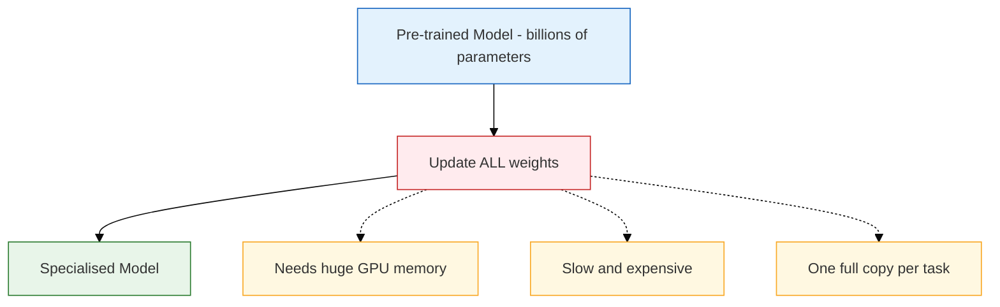

**Costs you actually feel as an engineer:**

- **VRAM**: optimiser states (Adam keeps extra tensors per parameter), gradients, and activations sit next to the weights. A model that *serves* on one GPU often will not *train* on that same GPU.
- **Storage**: one full checkpoint per specialisation.
- **Ops**: every task gets its own multi-gigabyte artefact to version, evaluate, and roll back.

**When full fine-tuning is still the right call:** huge compute budget, you need maximum flexibility, and the task is far from the model's original training — for example, adapting a model heavily toward a low-resource language. For most product work, it is overkill. The LoRA paper is largely motivated by how impractical full updates become as models grow. ([arXiv][1])

**This is the problem PEFT solves.**

---

## 3. PEFT = "Don't Retrain the Entire Engineer"

**Parameter-Efficient Fine-Tuning (PEFT)** in one sentence:

> **Keep most of the model's numbers locked (frozen). Only train a tiny set of extra (or selected) numbers.**

Hugging Face describes PEFT as training a small number of parameters on top of a pretrained model, cutting memory and optimisation cost. ([Hugging Face][2])

Your engineer already knows programming, algorithms, and databases. You do not erase that. You hand them a **small specialist training module**.

**LoRA is one *technique* inside PEFT.** PEFT is the category; LoRA is the item you will actually use first.

---

## 4. The PEFT Family at a Glance

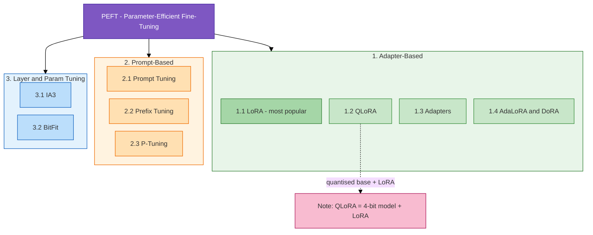

> **QLoRA is not a separate PEFT method.** It is LoRA on top of a frozen, compressed 4-bit base model. The QLoRA paper describes backpropagating through that frozen 4-bit model into small LoRA add-ons. ([arXiv][3])

You will also see names such as LoHa, LoKr, OFT/BOFT, and LayerNorm-only tuning. Treat those as Level-3 "know they exist" until LoRA is boring.

---

## 5. Adapter-Based Methods

### 5.1 LoRA — Low-Rank Adaptation

**The single most important PEFT technique.** If you learn only one, learn this.

#### What it does

Imagine the model's brain is a massive spreadsheet of weights `W`. Full fine-tuning changes every cell. LoRA says: **don't touch the original spreadsheet. Create a tiny sticky note of changes and lay it on top.**

1. **Freeze** `W`.
2. Train two thin matrices `A` and `B` only.
3. At run time: **W' = W + B × A** (often scaled by `alpha / r`).

`B × A` is a **low-rank** stand-in for a full update matrix `ΔW`. You capture the useful change with far fewer trainable numbers than `|W|`. The original LoRA paper freezes pretrained weights and injects those trainable low-rank matrices into Transformer layers. ([arXiv][1])

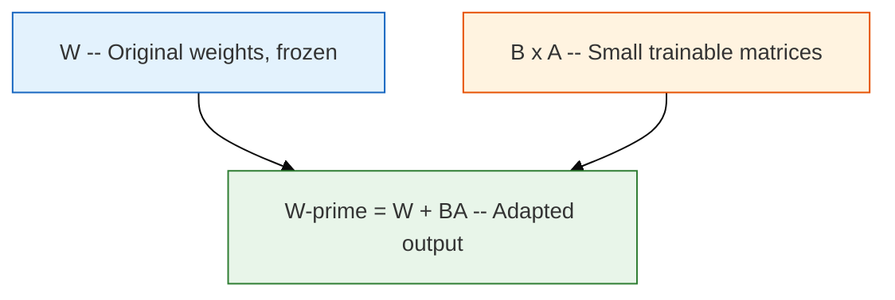

**Engineer analogy:** the experienced engineer gets a "Medical Imaging Expertise Module." Programming, algorithms, and databases stay intact.

#### The knobs you will actually set

These are the names that show up in Hugging Face `LoraConfig`. Learn them before you tune anything else.

| Knob | What it means | Practical starting intuition |
|---|---|---|
| **`r` (rank)** | Thickness of the sticky note. Capacity of `A` and `B`. | Small `r` (8–16) for style/format; raise if the adapter underfits. Too large and you lose the efficiency win. |
| **`lora_alpha`** | Scales the update. Commonly `alpha / r`. Rank-stabilised LoRA uses `alpha / sqrt(r)` instead. | Many configs start with `alpha = 2r` (for example `r=16`, `alpha=32`). Treat that as a convention, not a law. |
| **`target_modules`** | Which layers get adapters. | Attention projections first (`q_proj`, `v_proj`, sometimes `k_proj` / `o_proj`). `all-linear` is more capacity and more VRAM. |
| **`lora_dropout`** | Dropout on the adapter path. | A regulariser. Useful if the dataset is small and the adapter starts memorising. |
| **Merge vs keep separate** | Bake `BA` into `W`, or load base + adapter. | Merge for one production skill and lower inference overhead. Keep separate to hot-swap many skills on one base. |

You still need a **dataset**, a **loss**, and an **eval set**. LoRA is cheaper training, not "training without data."

#### When to use LoRA

- Teach a new skill or domain: legal tone, internal ticket style, a specific framework.
- You have hundreds to thousands of examples and at least one GPU (a consumer GPU can be enough for smaller bases).
- You want several specialisations of the same base — swap adapters instead of cloning 14GB files.

**Worked product example:** one general 7B–8B instruct model, 5,000 labelled support conversations, one LoRA for "our support voice," another for "code review comments." Same base weights on disk; two small adapter files. Serve by loading the adapter that matches the route.

| Pros | Cons |
|---|---|
| Few trainable params | Still requires real training data |
| Much lower memory than full FT | Rank and target-layer choice matters |
| Fast training, tiny artefacts | Can underfit if `r` is too low |
| Many adapters per base | Not guaranteed to match full FT |
| Can merge for inference | Separate adapters add a little inference cost until merged |

---

### 5.2 QLoRA — LoRA + Compression

LoRA is great until the **base model itself** will not load. QLoRA **compresses the frozen base first** (typically 16-bit → 4-bit), then trains LoRA on top.

The engineer's reference library is 10,000 bookshelves. You reprint it as pocket editions (some fine print is gone, the knowledge is mostly there). **Then** you add the specialist module.

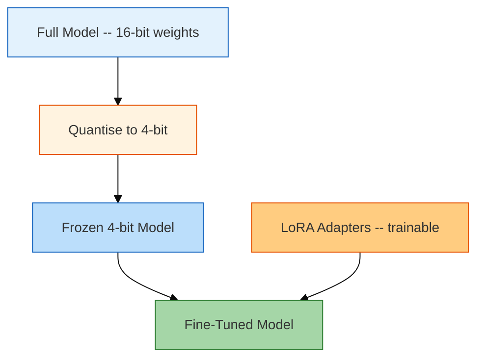

The QLoRA paper showed fine-tuning a **65B-parameter model on a single 48GB GPU**, and introduced three memory tricks worth knowing by name: ([arXiv][3])

1. **NF4 (4-bit NormalFloat)** — a 4-bit type chosen to match how neural net weights are usually distributed.
2. **Double quantisation** — even the quantisation constants get compressed, shaving extra bits per parameter.
3. **Paged optimisers** — when a training step spikes memory, optimiser state can page to CPU RAM instead of OOM-ing.

Important implementation detail: **weights are stored in 4-bit; the actual matmuls still run in 16-bit** (often BF16). You are not doing the whole forward pass in 4-bit arithmetic.

> **Remember:** QLoRA = quantised frozen base + LoRA. Not a third religion.

#### When to use QLoRA

- LoRA is what you want, but VRAM cannot hold the full-precision base.
- You are targeting large models (30B, 65B, 70B-class) on one mid-range GPU.
- You accept a **small quality tradeoff** from compression, and you will eval it on *your* task.

**Worked product example:** you want a 70B-class specialist and only have a 24GB card. 4-bit weights plus LoRA adapters are the usual path. Whether a *specific* 70B + sequence length + batch size fits is a measurement, not a promise — activations and optimiser state still exist.

| Pros | Cons |
|---|---|
| Extremely memory efficient | More moving parts (bitsandbytes, NF4, paging) |
| Makes large-model FT feasible | Compression is an approximation |
| Same LoRA workflow on top | Config and stack versions matter |

---

### 5.3 Adapters — Bolt-On Specialist Modules

Adapters **insert tiny trainable modules between existing layers**. The laptop stays the same; the USB accessory adds capability. This approach predates LoRA. The original adapter paper added a small fraction of parameters per NLP task while freezing the base. ([Google Research][4])

**Difference from LoRA:** LoRA adds a low-rank *update* to existing weight matrices. Classic adapters add *new mini-layers* into the stack. Extra layers usually mean extra latency unless you merge them away.

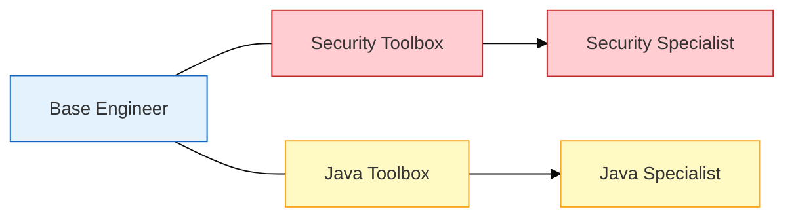

#### When to use adapters

- You already have an adapter-era NLP pipeline and need to keep it.
- You want a mentally simple "plug in a module" story for many tasks on one frozen base.

**Worked product example:** a multilingual classifier that loads a French, German, or Japanese adapter per request. Same backbone, swapped toolbox.

Today, **LoRA is the default** for LLM work. Hugging Face's PEFT overview treats LoRA as the common low-rank formulation and notes that inserted adapters can add runtime overhead. ([Hugging Face][5])

| Pros | Cons |
|---|---|
| Base frozen; small per-task modules | Extra layers → inference overhead |
| Easy multi-task mental model | Usually less efficient than LoRA |
| Mature older NLP tooling | LoRA has the current ecosystem |

---

### 5.4 LoRA Variants: AdaLoRA and DoRA

Once LoRA is solid, you will meet relatives:

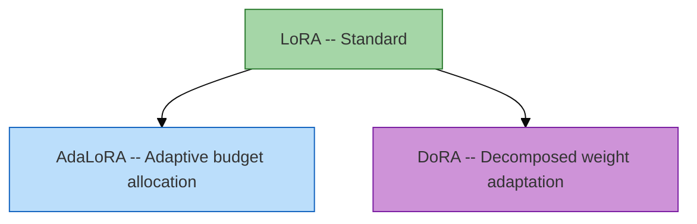

- **AdaLoRA:** do not spend the same rank budget on every layer. Put more capacity where the task actually needs it — like training security harder than UI chrome. ([Hugging Face][5])
- **DoRA:** splits how a weight update is applied (magnitude vs direction) and aims to close some of the gap to full fine-tuning.

Both are **LoRA family**. Learn standard LoRA, ship something, then A/B a variant if eval is stuck.

---

## 6. Prompt-Based Methods

### 6.1 Prompt Tuning — Learned Instruction Cards

Two different things people mash together:

- **Prompting** = writing instructions in English. **No training.**
- **Prompt Tuning** = **training** a small set of vectors that are silently prepended to every input.

Those "soft prompts" are not readable words. They are learned tensors. Hugging Face distinguishes hard (human-written) prompts from soft (optimised) prompts. ([Hugging Face][5])

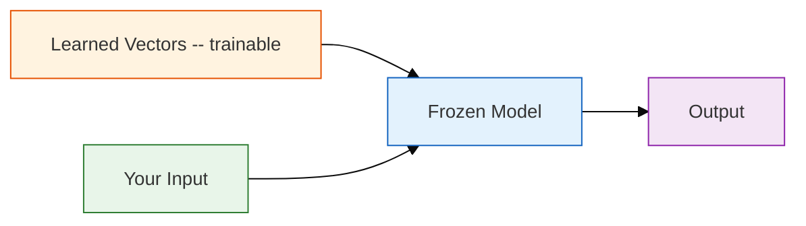

**Analogy:** you do not retrain the engineer. Before every task you hand them a **learned instruction card**.

**Important correction:** prompt tuning needs gradients into those vectors. You **cannot** do this against a typical chat API that only accepts text. For an API model you write hard prompts (or use the vendor's fine-tune product). Prompt tuning is for **weights you can run locally** (or a training stack that exposes embeddings).

#### When to use prompt tuning

- The model is already capable; you need a gentle, cheap steer.
- You want the smallest possible trained artefact — a handful of vectors per task.
- You will serve many light tasks on one frozen model you host yourself.

**Worked product example:** 50 internal classification heads (intent, topic, urgency) on one hosted model. Fifty tiny vector files instead of fifty LoRAs — if quality holds on your eval set.

| Pros | Cons |
|---|---|
| Extremely few params | Less expressive than LoRA |
| Base stays frozen | Soft prompts are unreadable |
| Tiny storage | Weak for big behaviour shifts |
| | Soft prompt still occupies context tokens |

---

### 6.2 Prefix Tuning — Learned Context That Follows You

Prompt tuning adds learned vectors **at the input**. Prefix tuning injects learned prefixes **into layers / attention**, so the "advisor" whispers at more than one step.

- Prompt Tuning = instruction card **once, at the start**
- Prefix Tuning = specialist context **through the whole problem**

**When to use:** same situations as prompt tuning, when you need more steering — especially generation (summarisation, translation) that must stay consistent across tokens. Still less common than LoRA for LLM product work. ([Hugging Face][5])

---

### 6.3 P-Tuning — Smarter Soft Prompts

Same family: learned virtual tokens, but a small network **generates** those vectors instead of storing them as raw parameters. Try prompt tuning first; reach for P-Tuning if that underperforms and you are still committed to a prompt-based method.

---

## 7. Layer and Parameter Tuning

### 7.1 IA3 — Amplify What Matters

**IA3** = Infused Adapter by Inhibiting and Amplifying Inner Activations.

It does not add a new skill so much as learn **which existing signals to turn up or down**. Tiny scaling vectors multiply attention and feed-forward activations. `× 3.0` amplifies; `× 0.5` quiets. ([GitHub][6])

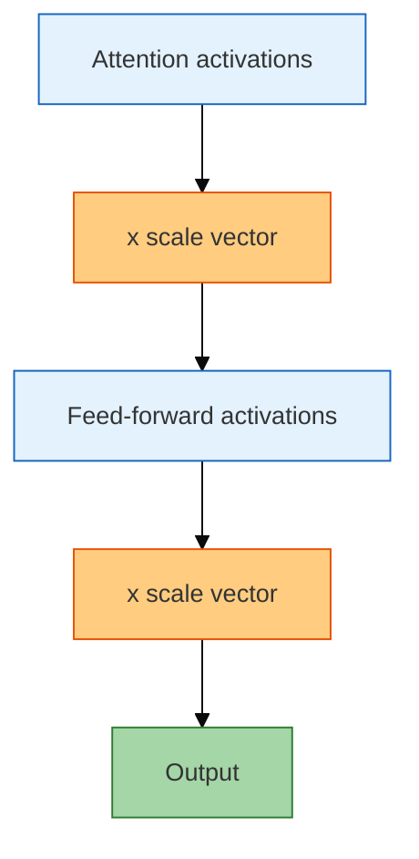

**Analogy:** "For security reviews, pay 3× attention to auth. For performance reviews, 2× on DB queries." No new toolbox — just a mixer board.

**When to use:** the model already knows the task; you need emphasis, few-shot data, and almost no extra inference cost (IA3 can be merged). Less expressive than LoRA; smaller ecosystem.

---

### 7.2 BitFit — Just Tweak the Defaults

Train **only the bias terms**. Everything else stays frozen. You are adjusting default tendencies, not installing a skill.

**When to use:** tiny style/tone nudges, extreme compute limits, or a research baseline. Not a mainstream production LLM recipe.

| Pros | Cons |
|---|---|
| Dead simple, tiny footprint | Very limited expressiveness |
| Easy to reason about | Cannot carry a new domain |

---

## 8. Which Method for Which Situation?

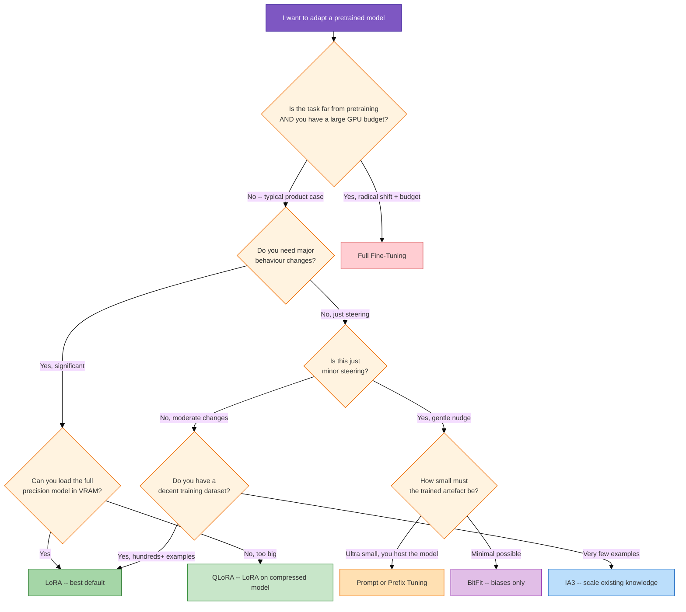

> **Unsure? Start with LoRA.** If VRAM says no, QLoRA. If you only have an API, you are not in this flowchart yet.

### Comparison

| Method | Best for | What gets trained | Efficiency (typical) |
|---|---|---|---|
| **Full FT** | Max flexibility, radical domain shift, big budget | Almost everything | Low |
| **LoRA** | Most product tasks — default | Low-rank `ΔW` | High |
| **QLoRA** | Large models on small GPUs | LoRA on 4-bit frozen base | Very high (memory) |
| **Adapters** | Older NLP stacks, hot-swap modules | Inserted mini-layers | High, extra latency |
| **Prompt Tuning** | Many light tasks, hosted frozen model | Soft input vectors | Very high |
| **Prefix Tuning** | Generation that needs ongoing steer | Learned layer prefixes | Very high |
| **IA3** | Emphasis shift, few-shot | Scaling vectors | Very high |
| **BitFit** | Tiny tweaks, baselines | Biases only | Very high |
| **AdaLoRA / DoRA** | LoRA + smarter / more expressive updates | LoRA-family matrices | High |

Efficiency and quality rankings are **not universal**. Fewer trainable parameters usually means less expressive adaptation; matching full fine-tuning is not guaranteed. ([Hugging Face][5])

---

## 9. The Simplest Way to Remember All Methods

Do not memorise names. Ask: **"Where is the model allowed to learn?"**

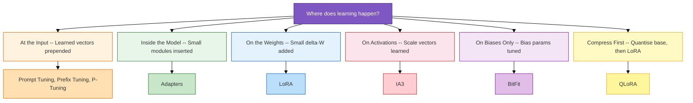

One distinction that saves weeks of confusion:

> **Quantisation** is how the model is *stored and computed*.
> **LoRA** is how the model is *adapted*.
> **QLoRA** combines both.

---

## 10. What a Full-Stack Engineer Should Actually Learn

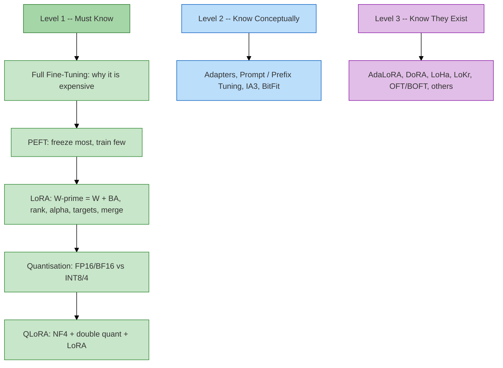

**A sane study split for the transition:** most of your time on **LoRA + quantisation + QLoRA**, some time on adapters / prompt methods / IA3 so you can explain them in a design review, and only a glance at the research variants. Hugging Face's PEFT catalogue is large; memorising it is not useful. ([Hugging Face][5])

**A sane build order for a product:**

1. Prompt the hosted or API model. Measure failure modes.
2. Add RAG if the failures are "doesn't know *our* facts."
3. Collect a real dataset from those failures.
4. Train LoRA (or QLoRA) on a model you can actually run.
5. Eval on held-out tickets, not vibes. Keep the adapter separate until one skill wins, then decide merge vs multi-adapter serve.

That is the same instinct as shipping a feature flag before a rewrite.

---

## 11. Takeaways

> **A pretrained model is like an already-educated software engineer. PEFT specialises that engineer without making them relearn their entire education.**

| Method | The question it answers |
|---|---|
| **LoRA** | Can I add a small learned adjustment to existing knowledge? |
| **Adapters** | Can I plug in a specialist toolbox? |
| **Prompt / Prefix / P-Tuning** | Can I learn instructions or context that steer a frozen model? |
| **IA3** | Can I amplify or suppress what it already knows? |
| **BitFit** | Can I get by changing only the default settings? |
| **QLoRA** | Can I compress the library first, then LoRA? |

**Carry this into the next two posts:** PEFT changes **weights** (or a tiny add-on to weights). Agent memory and semantic cache usually change **what you store outside the model and put back into context**. Those are different levers. Mixing them up is how teams fine-tune when they needed a database, or cache when they needed a preference store.

---

## References

1. [LoRA: Low-Rank Adaptation of Large Language Models](https://arxiv.org/abs/2106.09685) — arXiv
2. [Parameter-efficient fine-tuning - Hugging Face Transformers](https://huggingface.co/docs/transformers/peft) — Hugging Face
3. [QLoRA: Efficient Finetuning of Quantized LLMs](https://arxiv.org/abs/2305.14314) — arXiv
4. [Parameter Efficient Transfer Learning for NLP](https://research.google/pubs/parameter-efficient-transfer-learning-for-nlp/) — Google Research
5. [PEFT adapters — conceptual guide](https://huggingface.co/docs/peft/main/en/conceptual_guides/adapter) — Hugging Face PEFT
6. [IA3 - Hugging Face PEFT](https://huggingface.co/docs/peft/main/en/package_reference/ia3) — Hugging Face

[1]: https://arxiv.org/abs/2106.09685 "LoRA: Low-Rank Adaptation of Large Language Models"
[2]: https://huggingface.co/docs/transformers/peft "Parameter-efficient fine-tuning - Hugging Face"
[3]: https://arxiv.org/abs/2305.14314 "QLoRA: Efficient Finetuning of Quantized LLMs"
[4]: https://research.google/pubs/parameter-efficient-transfer-learning-for-nlp/ "Parameter Efficient Transfer Learning for NLP"
[5]: https://huggingface.co/docs/peft/main/en/conceptual_guides/adapter "PEFT adapter conceptual guide - Hugging Face"
[6]: https://huggingface.co/docs/peft/main/en/package_reference/ia3 "IA3 - Hugging Face PEFT"
