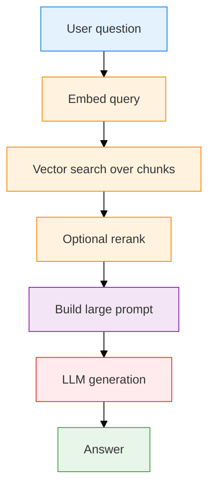
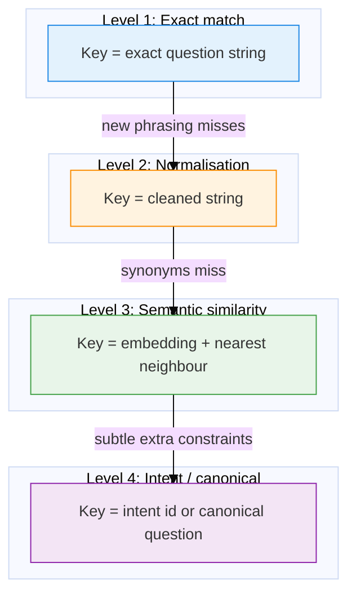
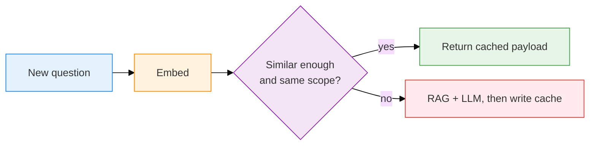
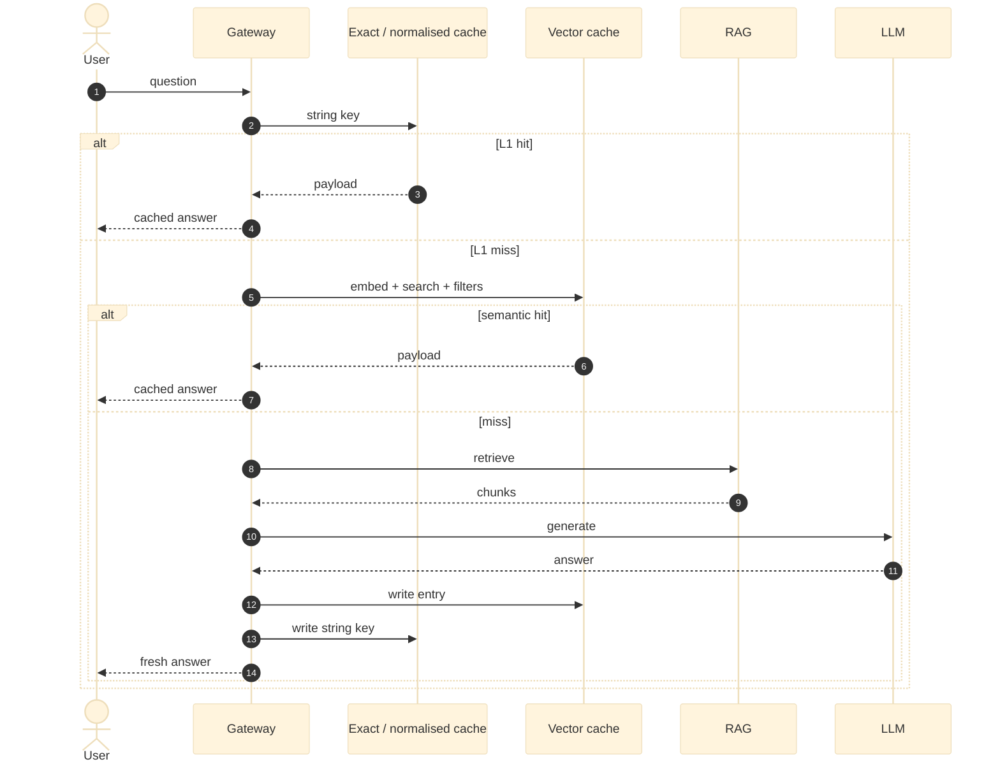

If a teammate asks *"Where is the sprint dashboard?"* you paste the link. Five minutes later someone asks *"Can you share the sprint board URL?"* you do not rebuild the dashboard. You reuse the answer.

Now the same pattern in a company assistant:

> "How do I reset my password?"
> "I forgot my password. What should I do?"
> "Can you tell me how to change my password?"

A human hears one intent. A string-keyed cache hears three misses — and pays for embedding, retrieval, rerank, and a full LLM call each time.

**Semantic caching** means: *have I already answered a sufficiently similar question, and is it still safe to reuse that answer?*

This is the third post in the series. PEFT changes **weights**. Agent memory remembers **a user or a past attempt**. A semantic cache remembers **work already done**. Do not collapse those three into one Pinecone index.

<p class="series">
  <strong>Also in this series:</strong>
  <a href="{{ '/posts/peft-lora-qlora-guide/' | relative_url }}">PEFT, LoRA, and QLoRA</a> ·
  <a href="{{ '/posts/ai-agent-memory-guide/' | relative_url }}">AI agent memory</a> ·
  <em>Semantic caching (this post)</em>
</p>


---

## Who this is for — and when to use it

You already cache `GET /users/42`. This post is what changes when the key is English.

**Use a semantic cache when:**

- Traffic repeats the same *intents* (FAQs, policy, "how do I…") with different wording.
- The miss path is expensive: retrieval + large prompt + LLM.
- Answers are **stable enough** to reuse: docs, runbooks, product FAQs.

**Do not cache (or isolate hard) when the correct answer depends on:**

- **Who** is asking (balance, invoices, "my" anything)
- **When** (prices, Bitcoin, "today's" incident status)
- **Which tenant** (Company A's SSO ≠ Company B's SSO)
- **Which role** (intern vs admin runbook)
- Fast-changing source docs with no invalidation story

**Build order:** exact match → normalisation → embedding similarity + metadata filters → only then an intent model. Do not call a large LLM to decide whether you can skip a large LLM.

---

## Jargon Buster

| Term | Meaning | Developer analogy |
|---|---|---|
| **Cache / hit / miss** | Stash of finished work; found vs must recompute | Sticky note vs rereading the wiki |
| **Semantic** | About meaning, not spelling | `user_id` and `customer_id` can be the same person |
| **Semantic cache** | Reuse an answer when a *new* question is close enough in meaning | Senior who hears three phrasings of "Wi-Fi died" |
| **Exact-match cache** | Key = exact string | Terminal up-arrow |
| **Normalisation** | Lowercase, trim, strip punctuation | Running Prettier before diff |
| **Embedding / vector** | Numbers that locate a sentence in meaning-space | Coordinates on a map with hundreds of axes |
| **Cosine similarity** | How aligned two vectors are (`1` same direction, `0` orthogonal) | Two fingers pointing at the same box on the diagram |
| **Threshold** | Minimum score to count as a hit | Bouncer: how close is "close enough"? |
| **Canonical form** | Official wording of an intent | One git command instead of ten aliases |
| **RAG / LLM** | Retrieve docs then generate / the generator itself | Search the wiki, then the expensive senior writes |
| **TTL / invalidation** | Expiry / actively dropping stale entries | Milk date / DevOps changed the staging IP |
| **Multi-tenancy** | Shared infra, isolated data | One building, locked apartments |

---

## Why your Redis instincts fail

Classic cache:

```text
GET /api/v1/users/42/profile
key == key  →  hit
```

Natural language:

```text
"How do I reset my password?"
    ==
"I forgot my password. What should I do?"
    →  false
```

A miss in a CRUD app is often a cheap SQL round-trip. A miss in RAG is a pipeline:



Exact timings and dollar costs depend on model, prompt size, and vendor. What does **not** depend on a blog post's imagination: generation dominates latency and cost; a cache hit that skips retrieval + generation is usually **orders of magnitude** cheaper. Measure yours.

**Junior vs senior:** the junior treats "clone the repo" and "download the code" as different tickets. The senior reuses `git clone …`. Semantic caching is that senior's pattern, automated.

---

## Four levels — cheapest first

The overview figure shows the same ladder. You do not need level 4 on day one.



### Level 1 — Exact match ("terminal up-arrow")

```text
Key:   "How to reset my password?"
Value: "Go to Settings → Security → Reset Password…"
```

| Pros | Cons |
|---|---|
| Fastest, simplest, no wrong-meaning hits | One extra space or capital and you miss |
| Perfect when users paste the same FAQ title | Conversational traffic rarely repeats strings |

Ship this first. It is free correctness.

### Level 2 — Normalisation ("the linter")

Before lookup: lowercase, strip punctuation, collapse whitespace, maybe drop stopwords.

```text
"HOW DO I RESET PASSWORD???"  →  "how do i reset password"
"Reset password!!!"           →  "reset password"   (if you drop stopwords)
```

| Pros | Cons |
|---|---|
| Still a string compare; still cheap | `"forgot login credential"` will not become `"reset password"` |
| Catches shouting / punctuation | Hand-built synonym lists become a junk drawer |

Useful. Not sufficient.

### Level 3 — Semantic similarity (the usual production step)

Embed the question. Search previous questions by cosine (or equivalent). If the neighbour clears your **threshold** *and* metadata matches, reuse the payload.



You need an embedding model and a place that can do nearest-neighbour search (pgvector, a vector DB, Redis-with-vectors, etc.). Threshold is a **product decision**, not a universal `0.85`.

### Level 4 — Intent / canonical form

A classifier or small model maps many phrasings onto `identity.password.reset`. Powerful for closed domains. The trap:

> If the goal is to skip an expensive LLM, do not spend most of that cost on the cache lookup.

Use a **tiny** classifier, or only run this on misses / ambiguous neighbours. For most RAG FAQs, level 3 plus metadata is enough.

---

## Embeddings and cosine, without the fog

An embedding model turns a sentence into a long list of numbers. Similar meanings land in similar directions.

**Ice-cream version:** rate flavours on sweetness / fruit / chocolate. Double chocolate and brownie swirl sit next to each other; strawberry sorbet does not. Real models use hundreds or thousands of axes you do not name by hand.

**Flashlight version:** treat each vector as an arrow from the origin.

- Same meaning → arrows almost parallel → cosine near **1**
- Unrelated → about **90°** → cosine near **0**
- Opposite → **180°** → cosine near **−1**

```text
cosine(A, B) = (A · B) / (|A| |B|)
```

Dot product = "do we light up the same axes?" Dividing by lengths ignores "this sentence is longer" so you compare **direction**, not essay size. In practice, FAQ pairs you care about live in a high-positive band; you still **cannot** treat `0.91` as "same answer."

---

## Similarity is not equivalence

This is the part that burns teams.

| Question A | Question B | Similar words? | Same safe answer? |
|---|---|---|---|
| Deploy to **staging** | Deploy to **production** | Yes | **No** |
| Pro price **today** | Pro price **last year** | Yes | **No** |
| Cancel my account | Cancel **and get a full refund** | Yes | **No** |
| Reset my password | I forgot my password | Yes | Often **yes** |

A loose threshold raises hit rate and **wrong** hits. A paranoid threshold is safe and barely saves money. Pick the number with a **labelled pair set**, not a tweet.

### How to choose a threshold (eval, not vibes)

Build a small golden set:

```text
question_a | question_b | same_intent? | notes
```

Include **near-miss danger pairs** (staging vs prod) on purpose. Sweep thresholds:

```text
threshold   hits on "yes" pairs    hits on "no" pairs
0.80        high                   too many
0.90        medium                 few
0.95        low                    rare
```

Those rows are a **worksheet**, not this blog's production metrics. Your embedding model and domain will move the numbers. Prefer a low wrong-hit rate over a pretty hit-rate dashboard.

Add **metadata constraints** so similarity is never the only gate:

```text
similar enough
AND tenant_id
AND role / ACL
AND product
AND knowledge_version
AND language
AND (optional) model_version / prompt_version
```

Rule of thumb for the key:

> If changing a field could change the correct answer, that field belongs in isolation or invalidation.

---

## Where the cache sits

In front of the expensive path. Waterfall: cheapest check first.



```text
fast / cheap
  exact key
  normalised key
  embedding neighbour + metadata
  retrieve chunks
  LLM
slow / expensive
```

### Cache the answer, or cache a step?

You can cache more than the final paragraph:

| Layer | Maps | Saves | Staleness risk |
|---|---|---|---|
| Embedding cache | exact text → vector | Repeat embed calls | Low |
| Retrieval cache | question → chunk IDs | Vector search | Docs moved |
| Response cache | question → final answer | Search + generation | Highest value, strictest freshness |

Downstream caches save more and demand better invalidation. Start with response cache for FAQs; add the others if embed or retrieval shows up on the bill.

---

## What to store

Do not store only the string answer. RAG answers need to be **auditable and killable**.

```json
{
  "cache_id": "…",
  "question": "How do I reset my password?",
  "canonical_question": "How do I reset my account password?",
  "embedding": [0.01, -0.04],
  "answer": "Settings → Security → Reset Password, then use the email link.",
  "citations": [
    { "document": "security_handbook.pdf", "page": 14, "chunk_id": "sec_908" }
  ],
  "tenant_id": "acme",
  "role": "employee",
  "model": "…",
  "prompt_version": "v3.2",
  "knowledge_version": "kb_v48",
  "created_at": "2026-09-07T01:30:00Z",
  "ttl_expires_at": "2026-09-14T01:30:00Z"
}
```

The embedding array is illustrative (two floats, not a real dimension). Persist citations so a user can ask "where did this come from?" and so you can purge by `chunk_id` when that file changes.

**Model / prompt versions:** if you ship a better system prompt tomorrow, you may not want last week's wording. Put versions in the key or bump them to invalidate.

---

## Invalidation (the actually hard part)

Phil Karlton's joke still applies: cache invalidation and naming things.

Doc yesterday: *lunch expense cap $25.*  
Doc today: *$40.*  
Cache still says $25 until you kill it.

| Strategy | How | Tradeoff |
|---|---|---|
| **TTL** | Expire in N hours | Simple; stale until the timer |
| **Version stamp** | `knowledge_version++` on any publish | Instant global flush; may drop still-valid entries |
| **Event purge** | Webhook: `travel_policy.md` changed → delete entries that *cite* it | Precise; needs citation IDs you actually stored |

Use TTL as a backstop even if you have events.

---

## Security: never serve Alice's answer to Bob

```text
Alice: "What's my account balance?"  →  $4,200
Bob:   "How much money do I have?"   →  cosine looks great
Naive cache: "Your balance is $4,200"
```

**Rules:**

1. **Do not globally cache personal questions.** Detect first-person finance / HR / "my ticket" and skip or scope to `user_id` with a short TTL.
2. **Filter by tenant and role before similarity.** Neighbour search inside a namespace, not across the whole SaaS.
3. **Same string, different tenant** — Company A and Company B both ask "How do I configure SSO?" and must not share an entry.

Isolation is part of the key, not a later patch.

---

## Where to put the bytes

Brand is secondary. You need **low-latency get-by-key** and **nearest neighbour over question embeddings**, plus metadata filters.

| Tool | Fits |
|---|---|
| **Redis** (and cloud siblings) | L1/L2, TTL, session-ish exact keys |
| **Postgres + pgvector** | One box you already run; relational metadata + vectors |
| **Dedicated vector DBs** (Qdrant, Weaviate, Pinecone, Milvus, …) | Large neighbour-search volume, HNSW-style indexes |

Start where the rest of the app already lives.

---

## Semantic cache vs RAG vs agent memory

| | RAG | Agent memory | Semantic cache |
|---|---|---|---|
| Asks | What **docs** are relevant? | What do I know about **this user / past attempt**? | Did we **already answer** this intent? |
| Store | Chunks | Profile, episodes, skills | Question + payload |
| Hit means | Better grounded generation | Personalised or experienced agent | Skip the pipeline |

Memory: *"Vijay prefers TypeScript."*  
Cache: *"The Docker restart command is `sudo systemctl restart docker` — anyone can reuse that."*

---

## When semantic caching is a bad idea

Skip or tightly scope if answers depend on:

- live prices, inventory, incidents
- account state or identity
- permissions you cannot encode in the key
- docs that change hourly with no hook
- highly personalised context (the retrieved memory *is* the answer)

"What's Bitcoin at?" and "What's *my* balance?" are the two exam questions. If your cache cannot fail those, do not turn it on.

---

## How to know it worked

A high hit rate with wrong answers is a regression, not a win.

Track at least:

- requests, L1 hits, L3 hits, misses
- similarity score histogram
- **false hits** (sampled or from the golden set)
- LLM/RAG calls avoided
- latency on hit vs miss
- estimated cost avoided (**from your billing**, not a template)

Consistency is a real third benefit: one hundred users asking the same policy question can get the **same approved wording**, not 100 LLM paraphrases. That matters for support and compliance.

Do not publish a dashboard of invented monthly savings. Instrument, then quote *your* week-1 numbers.

---

## Implementation ladder

1. Exact question → answer. Measure hit rate.
2. Add normalisation. Measure again.
3. Embeddings + threshold + **eval set including danger pairs**.
4. Add tenant / role / knowledge version.
5. Invalidate on document change (and keep TTL).

Stop when the next layer's complexity exceeds the measured miss cost.

---

## Takeaways

- Cache **meaning**, not just bytes — but only when meaning-plus-metadata implies the **same safe answer**.
- **Cheapest check first:** exact → normalised → vector → RAG → LLM.
- **Threshold + isolation + invalidation** are the product. The vector DB is a library.
- Store **answer + citations + versions**. You cannot purge what you did not tag.
- **Cache ≠ memory ≠ RAG ≠ PEFT.** Reused computation, remembered people, retrieved docs, changed weights.
- Start simple, measure false hits, then get fancy.

---
