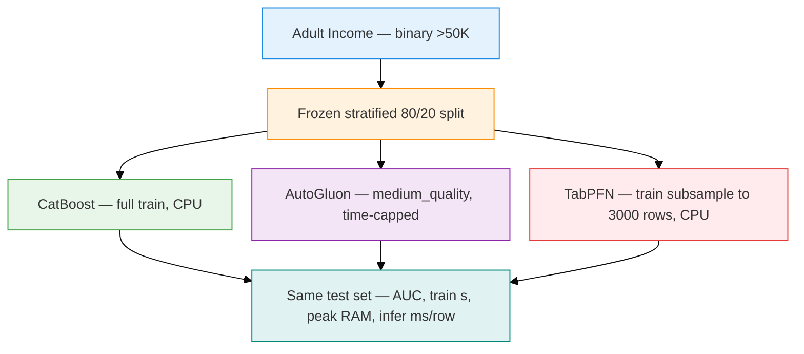
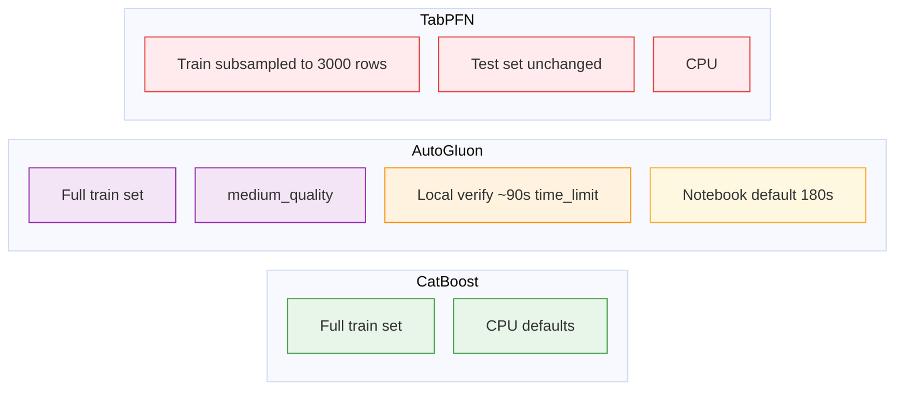
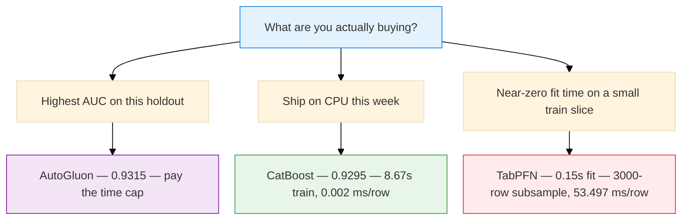

Monday standup. Someone says tabular foundation models are done cooking AutoML. *You just fit TabPFN. No search. No stack. It already knows tables.*

An hour later, Slack. A coworker pastes a screenshot: three rows, one circled AUC, a fire emoji. The screenshot does not mention train time, RAM, or how many rows the foundation model actually saw.

I asked the only useful question:

> Same split. Same test set. What budget did each method get?

That is this bake-off. Not a Kaggle medal chase. A coworker-table argument, run honestly.

  <strong>Runnable source of truth:</strong>
  <a href="https://www.kaggle.com/code/vijaykr0701/tabpfn-vs-autogluon-catboost-bakeoff">TabPFN vs AutoGluon CatBoost Bakeoff</a>
  on Kaggle — Adult Income, frozen stratified split, documented budgets. The numbers in this post are from a local end-to-end run on 20 September 2026. I did not invent extra metrics.

---

## Who this is for

You already ship a CatBoost or LightGBM baseline. Someone on the team wants to swap it for **TabPFN** or **AutoGluon** because a notebook looked decisive.

**Use this post when you need:**

- A same-protocol comparison, not three screenshots from three different weekends.
- The cost of the win: wall-clock, peak RAM, inference ms/row.
- Language for the next Slack thread: *Kaggle LB ≠ production.*

**Do not take the table as a universal ranking.** One binary task. One holdout. Labeled budget differences. Re-run the notebook if your table is wider, messier, or has a latency SLA.

---

## The Slack table, then the protocol

The Slack table was a ranking. The bake-off is a protocol.

Three methods. One Adult Income task: predict whether income is `>50K`. One stratified 80/20 holdout (`SEED=42`). The same train and test indices for every arm. Identifier-like `fnlwgt` dropped. No extra leaderboard tricks.

| Method | Role in the argument |
|---|---|
| **CatBoost** | The CPU baseline you would actually ship on Friday |
| **AutoGluon** | AutoML stack (`medium_quality` + a wall-clock cap) |
| **TabPFN** | Foundation-model-style tabular classifier — train subsample if the set is large |

If the Notes column is different, the ranking is not a fair fight. Write the budget into the table or do not post the table.

---

## The budgets that did not make the Slack screenshot

This is the part a fire-emoji screenshot drops.

Two labels that have to travel with any “winner”:

- **TabPFN did not train on the full train set.** If the train split is larger than 3,000 rows, only that arm is stratified-subsampled. The test set stays whole. That is a labeled budget difference, not a footnote you hide after the AUC.
- **AutoGluon was time-capped.** The published notebook defaults to `TIME_LIMIT_AG = 180` seconds. The local verification run that produced the numbers below used about **90 seconds** — and the measured train time was 89.7s, which is the cap showing up in the stopwatch. A longer cap can change the AutoGluon row. It cannot be assumed from this table.

CatBoost ran on CPU. No GPU claim in this run.

---

## The table from the 20 September 2026 local run

These are the only metrics I am publishing from that run.

| Method | AUC | Train (s) | Peak RAM (MiB) | Infer ms/row | Notes |
|---|---:|---:|---:|---:|---|
| CatBoost | 0.9295 | 8.67 | 951.1 | 0.002 | CPU |
| AutoGluon | 0.9315 | 89.7 | 1379.3 | 0.0105 | `medium_quality`; verify used ~90s `time_limit` (notebook default 180s) |
| TabPFN | 0.9105 | 0.15 | 1406.5 | 53.497 | Train subsampled to 3000 rows on CPU — labeled budget difference |

If you only circle AUC, AutoGluon wins: **0.9315** against CatBoost **0.9295**. Two thousandths. Ten times the train time. More RAM. Still cheap at inference.

If you only circle train time, TabPFN looks like magic: **0.15s**. Then you read the Notes, and the inference column: **53.497 ms/row**. Against CatBoost at **0.002 ms/row**, that is not a rounding error. It is a different product.

Peak RAM is in the same band for AutoGluon and TabPFN (~1.4 GiB). CatBoost was the lightest of the three at **951.1 MiB**.

I am not adding log-loss, accuracy, or a leaderboard score. Those were not part of the verified local table.

---

## How I would answer Slack now

**“TabPFN beat AutoML.”** Not on this run. Not on AUC, and not on the production-shaped columns. It trained instantly on a **3,000-row** CPU subsample and was the slowest to score a row by a wide margin.

**“AutoGluon won.”** On AUC, yes — by 0.0020 over CatBoost, under a ~90s cap. That is a real edge and a small one. I would not rewrite a serving stack for it without a second seed and the 180s notebook default.

**“So we keep CatBoost.”** For a CPU service that cares about ms/row, that is the row I would take to standup. Eight seconds to train. Two-thousandths of a millisecond per row. AUC within shouting distance of the AutoML stack.

---

## Honest takeaways

**Kaggle LB ≠ production.** A public notebook is the right place to *reproduce* the protocol. It is the wrong place to decide p95 latency, install friction, or who owns the model when AutoGluon’s stack picks a different winner next month.

**Budgets matter more than the library name.** Full-train CatBoost, time-capped AutoGluon, and subsampled TabPFN are three different experiments that happen to share a test set. Rank them only after you read the Notes.

**TabPFN’s 0.15s is not a free lunch.** The fit is cheap because this arm saw 3,000 training rows on CPU. Inference is where the foundation-model bill showed up.

**AutoGluon’s 89.7s is the cap, not “AutoML is slow.”** The verify run used ~90s. The notebook default is 180s. If someone quotes this table against a 10-minute AutoGluon run, they are quoting a different bake-off.

**A 0.002 AUC gap is a conversation, not a migration.** On Adult Income, with this split, I would keep the CatBoost baseline in production and keep the Kaggle notebook as the place we re-run the argument.

---

## Re-run it yourself

The notebook is the source of truth for code, seeds, and how each arm is measured:

**[https://www.kaggle.com/code/vijaykr0701/tabpfn-vs-autogluon-catboost-bakeoff](https://www.kaggle.com/code/vijaykr0701/tabpfn-vs-autogluon-catboost-bakeoff)**

Change `SEED`, `TIME_LIMIT_AG`, or `TABPFN_MAX_TRAIN_ROWS` if you want a sensitivity check. Do not paste a new screenshot without the Notes column.

If the next standup still starts with a single circled AUC, paste this table back — and ask what the method was allowed to spend.
