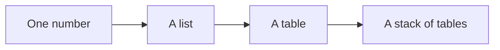
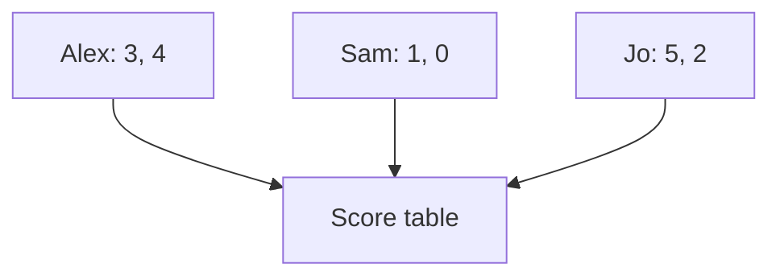
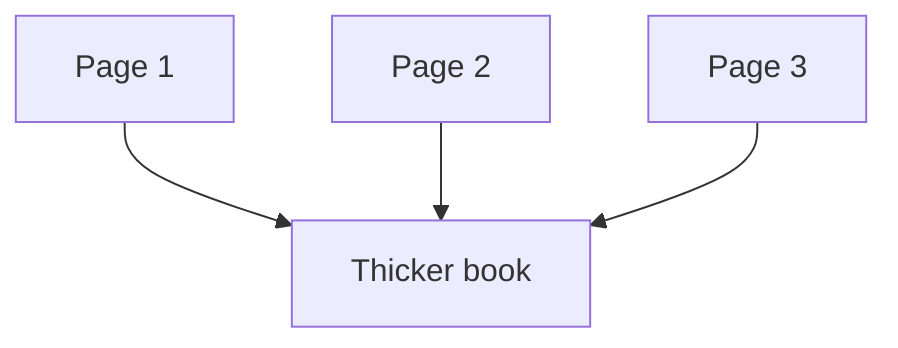

Grown-ups keep saying **tensor**.

It sounds like a robot word. It is not.

**A tensor is just stacking.**

One number. Then a list. Then a table. Then a stack of tables — like pages in a book.

That is the whole trick. The rest of this post is a treasure map, some LEGO, school scores, and a photo album.

---

## One number on a map

You find a treasure map.

It says: walk **3** steps across.

That **3** is a **coordinate**.

A coordinate is **one** number on **one** line. How far across. Or how far up. Not both.

It is like one slot on a lunch tray. The juice slot. Just that slot.

It is **not** the whole trip. It is not an arrow. It is one clue.

Say it out loud:

> “Across equals 3.”

That is a coordinate.

---

## Two numbers make an arrow

The map is not done.

It also says: walk **4** steps up.

Now you have two clues:

- across = 3
- up = 4

Put them in one short list: `(3, 4)`.

That list is a **vector**.

A vector is an **arrow**. It says “go this way, this far.” Two numbers. Still **one** arrow.

Say it out loud:

> “The arrow is three across and four up.”

One number? Coordinate.  
Two numbers together? Vector.

A vector can have more numbers too. `(3, 4, 5)` is still one arrow — across, up, and maybe “into the cave.” It is still **one list**. Not a table.

Think of LEGO bricks in a **row**. Two bricks. Or three. Still one row.

---

## A short list is not a table

Here is the mix-up grown-ups make too.

`(3, 4)` has **two** numbers. People call that a “2D vector” because the map has two directions.

That does **not** make it a table.

A table has **rows and columns**. Many lists, side by side or stacked.

A 2D vector is still **one short list**. One lunch-tray row. One LEGO row.

Say it out loud:

> “Two numbers in a row is still one list. A table is lots of rows.”

If you only have Alex’s two scores, you have a vector.  
If you have Alex **and** Sam **and** Jo, now you can make a table.

---

## Stack the lists. Now you have a table.

Monday at school.

Alex: 3, 4  
Sam: 1, 0  
Jo: 5, 2  

Each friend has **one list**. Slide those lists together. You get a **score table**.

That table is a **matrix**.

A matrix is a rectangle of numbers. Rows **and** columns.

| Friend | Game 1 | Game 2 |
| --- | --- | --- |
| Alex | 3 | 4 |
| Sam | 1 | 0 |
| Jo | 5 | 2 |

Three lists stacked. That is all.

A picture made of gray squares is a table too. Each square is how dark that spot is. Still rows and columns. Still a matrix.

Swap the rows and columns and you have a **different** table. Same numbers. Different meaning. Like swapping first names and last names on a class list.

---

## Stack the tables. Now you have a book.

One photo is a table of tiny color squares.

A photo album has **many pages**.

Stack the pages. The book gets thicker.

That thicker book is a **tensor**.

A tensor is “keep stacking.” A list of tables. Or a stack of stacks.

You already know this:

| Kid thing | What you stacked | Grown-up name |
| --- | --- | --- |
| One clue on the map | one number | coordinate |
| One arrow | one list | vector |
| Score sheet | lists stacked | matrix |
| Photo album | tables stacked | tensor |

A computer does the same thing with a **batch** of photos. One photo is a page. Many photos is the book. That book is a tensor.

If each photo also has three color layers (red, green, blue), the book is even thicker. Still stacking. Still a tensor.

---

## How to read the size

Computers write the size as a **shape**.

Shape means: how long is each stack?

| What you have | Shape (kid words) |
| --- | --- |
| Across = 3 | one number |
| Arrow `(3, 4)` | a list of 2 |
| Three friends, two games | 3 rows, 2 columns |
| Four photos, each 2 by 2 | 4 pages, each a small table |

Same pile of numbers can sit in different shapes.

`(3, 4)` is one arrow.  
A tiny table with one row — `1` by `2` — can hold the same two numbers.  
They are **not** the same job. One is an arrow. One is a one-row table.

Before you argue about the “smart computer,” **look at the shape.** Count the stacks. Name them: number, list, table, book.

---

## Grown-up names (tiny box)

You do not need this to get the story. It is here so the robot talks make sense later.

| Kid word | Grown-up name | Computer shape | ML example |
| --- | --- | --- | --- |
| One number | **coordinate** (a scalar) | `()` | a single score, like a loss |
| One list | **vector** | `(2,)` or `(768,)` | a map arrow, or a word turned into 768 numbers |
| A table | **matrix** | `(3, 2)` | friends’ scores, or one gray photo |
| A stack of tables | **tensor** | `(4, 2, 2)` or `(8, 3, 224, 224)` | a photo book; a batch of color pictures |

In school math, “tensor” can mean extra rules. In the computer (PyTorch, NumPy), **tensor just means a stack of numbers with a shape.**

A 2D vector is still a list. Do not call it a table.

---

## Say this back

**Start with one number. Make a list. Stack lists into a table. Stack tables into a book.**
