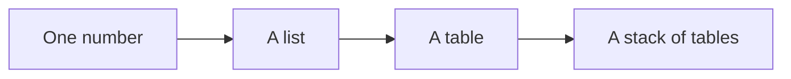
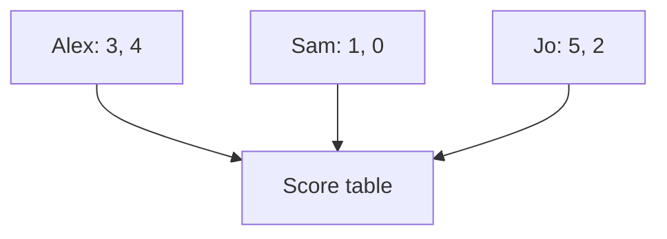
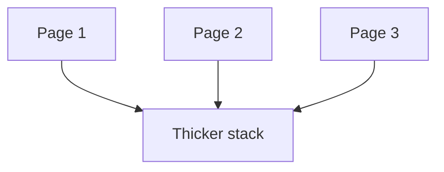

People keep saying **tensor** in ML meetings.

It sounds heavy. In NumPy and PyTorch, it is simpler.

**A tensor is just stacking.**

One number. Then a list. Then a table. Then a stack of tables.

```mermaid
flowchart LR
  A[One number] --> B[A list]
  B --> C[A table]
  C --> D[A stack of tables]
```

That is the whole idea. The rest of this post walks through it with a map, a few score lists, and a batch of photos.

---

## One number on a map

You have a map.

It says: walk **3** steps across.

That **3** is a **coordinate**.

A coordinate is **one** number on **one** axis. How far across. Or how far up. Not both.

It is **not** the whole trip. It is not an arrow. It is one value.

In short: **across = 3**. That is a coordinate. When it is just a single value, people also call it a **scalar**.

---

## Two numbers make an arrow

The map is not done.

It also says: walk **4** steps up.

Now you have two values:

- across = 3
- up = 4

Put them in one short list: `(3, 4)`.

That list is a **vector**.

A vector is an **arrow**. It says “go this way, this far.” Two numbers. Still **one** arrow.

The arrow is three across and four up.

One number? Coordinate.  
Two numbers together? Vector.

A vector can have more numbers too. `(3, 4, 5)` is still one arrow — across, up, and a third axis. It is still **one list**. Not a table.

Think of values in a **row**. Two values. Or three. Still one row.

---

## A short list is not a table

Here is the mix-up I still see in reviews.

`(3, 4)` has **two** numbers. People call that a “2D vector” because the map has two directions.

That does **not** make it a table.

A table has **rows and columns**. Many lists, side by side or stacked.

A 2D vector is still **one short list**. One row.

Two numbers in a row is still one list. A table is lots of rows.

If you only have Alex’s two scores, you have a vector.  
If you have Alex **and** Sam **and** Jo, now you can make a table.

---

## Stack the lists. Now you have a table.

Monday scores:

Alex: 3, 4  
Sam: 1, 0  
Jo: 5, 2  

Each person has **one list**. Slide those lists together. You get a **score table**.

That table is a **matrix**.

A matrix is a rectangle of numbers. Rows **and** columns.

| Person | Game 1 | Game 2 |
| --- | --- | --- |
| Alex | 3 | 4 |
| Sam | 1 | 0 |
| Jo | 5 | 2 |

Three lists stacked. That is all.

```mermaid
flowchart TB
  A["Alex: 3, 4"] --> T[Score table]
  S["Sam: 1, 0"] --> T
  J["Jo: 5, 2"] --> T
```

A grayscale image is a table too. Each cell is how dark that pixel is. Still rows and columns. Still a matrix.

Swap the rows and columns and you have a **different** table. Same numbers. Different meaning. Like swapping first name and last name on a roster.

---

## Stack the tables. Now you have a batch.

One photo is a table of tiny colour cells.

A photo set has **many pages**.

Stack the pages. The pile gets thicker.

That thicker pile is a **tensor**.

A tensor is “keep stacking.” A list of tables. Or a stack of stacks.

```mermaid
flowchart TB
  P1[Page 1] --> B[Thicker stack]
  P2[Page 2] --> B
  P3[Page 3] --> B
```

Same idea in a training loop:

| Everyday picture | What you stacked | Name |
| --- | --- | --- |
| One clue on the map | one number | coordinate |
| One arrow | one list | vector |
| Score sheet | lists stacked | matrix |
| Photo batch | tables stacked | tensor |

A computer does the same thing with a **batch** of photos. One photo is a page. Many photos is the stack. That stack is a tensor.

If each photo also has three colour layers (red, green, blue), you add another axis. Still stacking. Still a tensor.

---

## How to read the size

Computers write the size as a **shape**.

Shape means: how long is each axis?

| What you have | Shape |
| --- | --- |
| Across = 3 | one number |
| Arrow `(3, 4)` | a list of 2 |
| Three people, two games | 3 rows, 2 columns |
| Four photos, each 2 by 2 | 4 pages, each a small table |

The same pile of numbers can sit in different shapes.

`(3, 4)` is one arrow.  
A tiny table with one row — `1` by `2` — can hold the same two numbers.  
They are **not** the same job. One is an arrow. One is a one-row table.

Before you argue about the model, **look at the shape.** Count the axes. Name them: number, list, table, stack.

---

## Names you will see in code

You do not need this to get the idea. It is here so the library docs make sense later.

| Plain name | Usual name | Computer shape | ML example |
| --- | --- | --- | --- |
| One number | **coordinate** (a scalar) | `()` | a single score, like a loss |
| One list | **vector** | `(2,)` or `(768,)` | a map arrow, or a word turned into 768 numbers |
| A table | **matrix** | `(3, 2)` | scores, or one gray photo |
| A stack of tables | **tensor** | `(4, 2, 2)` or `(8, 3, 224, 224)` | a photo batch; a batch of colour pictures |

In school maths, “tensor” can mean extra rules. In the computer (PyTorch, NumPy), **tensor just means a stack of numbers with a shape.**

A 2D vector is still a list. Do not call it a table.

---

## Short recap

Start with one number. Make a list. Stack lists into a table. Stack tables into a batch.
