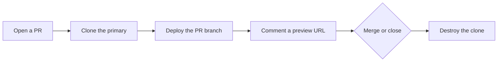

The class has **one** sandbox.

Two kids want it. One kid already dumped sand on the floor.

QA is waiting. The ticket says “works on my machine.” That means: we never played with the **whole** toy together.

A **preview environment** (Bunnyshell calls it an **ephemeral environment**) is the fix.

**Ephemeral** means “it is only here for a little while.” Like a sandcastle. You build it. You play. Then the tide takes it.

Bunnyshell clones the **full stack** for that pull request.

A **pull request** (PR) is a “please check my homework” note.

The **full stack** is not only the shop window. It is the cash register and the storage room too — the app, the database, and the other services it talks to.

Reviewers get a URL. When the PR merges or closes, the clone is thrown away.

This is **not** a frontend screenshot toy. If your checkout page needs Postgres, Redis, and a worker, the preview needs those too.



That is the whole loop. The rest of this post is one sandbox vs many, a file named `bunnyshell.yaml`, two doorbells, a nap button, and when the clone is more trouble than a shared box.

---

## The problem is not “we need more servers”

The problem is a **fight over one toy**.

Grown-ups call that **contention**. Contention means everyone grabs the same box at once.

One shared staging cluster means every branch fights for:

- the same schema (the filing cabinet shape)
- the same seed data (the starter toys in the box)
- the same **ingress** (the front door on the street)

You get:

- **Blocked QA.** Reviewers wait for “the” environment.
- **False failures.** PR B’s **migration** (a change to the filing cabinet) makes PR A look broken.
- **False confidence.** A green local run that never saw the worker, the cron, or the real Compose graph.

Ephemeral environments trade that queue for **isolation**. Isolation means each homework gets its own cubby.

Each PR gets:

- its own **namespace** (its own cubby)
- its own volumes (its own shelves)
- its own URL

You can break it on purpose — drop the database, flip a **feature flag** (a light switch for a feature), hit a bad migration — then discard the environment. The **primary** stays intact.

The primary is the original toy. The master copy.

Bunnyshell’s docs put it plainly: ephemerals are meant to be identical replicas of the primary, except in size. Same shape. Smaller. Predictable context is the product.


Say it out loud:

> “Shared staging is a line. A clone per PR is your own sandbox.”

---

## How Bunnyshell fits

Bunnyshell is **Environments-as-a-Service**. That means: you do not babysit every box yourself. You describe the playground. Bunnyshell builds it, sleeps it, and throws it away.

You connect:

- a **Kubernetes** cluster
- a Git account

**Kubernetes** is a factory that runs lots of little computers.

The environment definition lives in `bunnyshell.yaml`.

A **primary** environment is the template. An ephemeral is a clone of that primary with the PR’s branch swapped onto the matching components.

Two things have to be true before a clone appears:

1. The primary has already deployed successfully (`Running` or `Stopped`).
2. On that primary, **Create ephemeral environments on pull request** is **ON**. It is **OFF** by default.

Destroy is a separate toggle: **Destroy environment after merge or close pull request**. Also **OFF** by default.

Turn both on, or you will grow a graveyard of paid cubbies.

You can point ephemerals at a **different cluster** than the primary. That is the usual way to keep preview noise off the production control plane (the factory that runs the real shop).

If a preview turns out to be the new baseline, Bunnyshell can **convert an ephemeral to a primary**. Treat that as a promotion, not a habit.


| Kid picture | Grown-up name |
| --- | --- |
| The original toy | **primary** environment |
| A short-lived copy | **ephemeral** / preview |
| Please-check-my-homework note | **pull request** |
| The whole shop, not just the window | **full stack** |
| Its own cubby | **namespace** |
| The front door on the street | **ingress** |
| A factory of little computers | **Kubernetes** |

---

## The definition file

`bunnyshell.yaml` is the environment. It is **not** a CI pipeline.

**CI** is the robot that builds and tests your homework. Bunnyshell manages the playground’s life: create, sleep, wake, destroy.

Components can come from:

- Docker Compose (a list of boxes that start together)
- Helm charts (a recipe book for Kubernetes)
- raw Kubernetes manifests
- Terraform modules (a list of cloud toys to build)
- generic scripts / runner images

Compose is the fastest on-ramp.

Import is **one-way**: Bunnyshell parses `docker-compose.yaml` once, writes components into `bunnyshell.yaml`, and then **only** `bunnyshell.yaml` is the source of truth. Later edits to Compose do not flow back. Plan for that, or you will “fix compose” and watch the preview ignore you.

A sketch, not a sales dump:

```yaml
kind: Environment
name: books-primary
type: primary
components:
  - kind: Application
    name: api
    gitRepo: 'https://github.com/acme/books.git'
    gitBranch: main
    dockerCompose:
      build:
        context: ./api
        dockerfile: Dockerfile
    dependsOn:
      - postgres
  - kind: Database
    name: postgres
    dockerCompose:
      image: postgres:16
    volumes:
      - name: db-data
        mount: /var/lib/postgresql/data
```

`dependsOn` is the deploy graph. Independent components start in parallel. Helm / manifests / Terraform run through a runner image; you own the deploy and destroy commands. DNS is created from Ingress endpoints after deploy.

As of the current docs, `bunnyshell.yaml` is stored **solely in Bunnyshell**. Keep your own copy in Git if the team reviews environment changes like code.

---

## Webhook path vs Actions path

Two legal ways to get the same URL. Do **not** run both.

**Webhook (default).** A webhook is a doorbell. You connect GitHub (or another supported VCS). Bunnyshell hangs the doorbell. On a new PR, if the primary contains components from that repo and the PR target matches the deployed branch, it clones, deploys the PR branch, and comments the preview URL. Close or merge destroys it. Re-open recreates it.

**GitHub Actions.** Use this when CI should own the moment: build images first, run migrations yourself, then call Bunnyshell. The official wrapper is `bunnyshell/deploy-action@v2` (token, org, environment id, wait, timeout). Under the hood it is `bns environments deploy`. If webhook mode is still ON, you will get **duplicate** environments. Pick one trigger.

ChatOps sits on top of either path: `/bns:deploy`, `/bns:stop`, `/bns:start` from the PR. Useful when a reviewer wants a wake-up without opening the Bunnyshell UI.


| Path | When to pick it | Watch-out |
| --- | --- | --- |
| Git webhook (default) | Bunnyshell may own the moment | Still ON while Actions runs → **two** clones |
| `bunnyshell/deploy-action@v2` | CI should build images and migrate first | Under the hood: `bns environments deploy` |
| ChatOps (`/bns:deploy`, `/bns:stop`, `/bns:start`) | A reviewer wants a wake-up from the PR | Sits on top of **either** path. Not a third trigger. |

Say it out loud:

> “One doorbell. Not two.”

---

## Sleep is part of the design

Idle previews are a bill, not a badge.

Bunnyshell can **auto-sleep** an environment:

- scale Docker Compose deployments to zero after inactivity
- or on a project / environment schedule (stop at 20:00, start at 08:00)

The next HTTP hit wakes it. Expect a **cold start**, not instant. A cold start means the toys were in the closet. You wait while they come back.

Auto-sleep is an environment setting, not a field you sprinkle into every component. If wake-up does nothing, the ingress path has to support the wake mechanism — Bunnyshell’s own guides call out the `bns-nginx` class for that case.

Destroy on merge is still the real cost control.

- Sleep stops the waste of a forgotten **open** PR.
- Destroy stops the waste of a **merged** one.


---

## When it shines

- **Full-stack PRs.** UI + API + worker + database, reviewed on one URL.
- **Destructive tests.** Break the schema, retry, delete the env.
- **Parallel review.** Five PRs, five clones, no “who has staging?”
- **QA that is not a developer.** A link is enough. No local Docker story.

## When it is the wrong tool

- **Cost.** A clone of “almost prod” per PR is not free. Sleep and destroy are not optional extras.
- **Stateful data.** An empty Postgres is not a review. You need a seed job, a sanitized dump, or a slim fixture. That is your work, not Bunnyshell’s.
- **Secrets.** Preview clusters still need hidden passwords. Do not copy production keys into a PR-scoped namespace. Use a dedicated secret group and rotate it.
- **Long-lived “ephemerals.”** If a branch lives for six weeks, you have a second staging. Convert it or stop pretending it is temporary.
- **Tiny frontends with no backend.** A static preview host is cheaper.
- **No working primary.** Ephemerals clone a successful primary. If you cannot deploy main, you cannot preview a branch.

---

## First-setup checklist

Conceptual. Confirm the current toggles in [Bunnyshell’s ephemeral docs](https://documentation.bunnyshell.com/docs/quickstart-ephemeral-environments) before you click.

1. Connect a Kubernetes cluster you are willing to pay for, plus Git.
2. Deploy a **primary** from `bunnyshell.yaml` until it is `Running`.
3. Decide Compose vs Helm vs manifests vs Terraform. If you import Compose, accept the one-way conversion.
4. Turn **ON**: create ephemeral on PR. Turn **ON**: destroy on merge or close.
5. Pick **one** trigger: Git webhook **or** `bunnyshell/deploy-action@v2`. Not both.
6. Set auto-sleep (inactivity and/or a nightly schedule).
7. Seed data on deploy. An empty database is a 404 with extra steps.
8. Point secrets at a **preview** vault, not production.
9. Open a tiny PR. Confirm the comment URL, a reviewer can click it, and close destroys the namespace.

---

## What this post is not

It is not a migration off GitHub Actions. Actions still builds, tests, and lints. Bunnyshell manages **environment lifecycle** — create, sleep, wake, destroy. Complementary, not a replacement.

Official references (read these; do not copy them):

- [Ephemeral environments](https://documentation.bunnyshell.com/docs/quickstart-ephemeral-environments)
- [Create and destroy an ephemeral](https://documentation.bunnyshell.com/docs/quickstart-create-an-ephemeral-environment)
- [`bunnyshell.yaml` definition](https://documentation.bunnyshell.com/docs/ref-yaml-definition)
- [How Bunnyshell works](https://documentation.bunnyshell.com/docs/how-bunnyshell-works)
- [Git provider webhooks](https://documentation.bunnyshell.com/docs/git-providers)

---

## Grown-up names (tiny box)

You do not need this to get the story. It is here so the robot talks make sense later.

| Kid word | Grown-up name |
| --- | --- |
| Short-lived copy of the whole shop | **ephemeral** / preview environment |
| Original toy / template | **primary** |
| Fight over one box | **contention** |
| Own cubby | **isolation** / **namespace** |
| Front door | **ingress** |
| Factory of little computers | **Kubernetes** |
| List of boxes that start together | **Docker Compose** |
| Recipe book for Kubernetes | **Helm** |
| List of cloud toys to build | **Terraform** |
| Doorbell on GitHub | **webhook** |
| Robot that builds and tests | **CI** / GitHub Actions |
| Nap button | **auto-sleep** |
| Toys coming back from the closet | **cold start** |
| Starter toys in the box | **seed data** |
| Hidden passwords | **secrets** |
| Light switch for a feature | **feature flag** |
| Change to the filing cabinet | **migration** |

---

## Say this back

**Clone the primary per PR. Comment the URL. Destroy on merge. Seed the data and sleep the idle ones, or you just invented a more expensive staging.**
