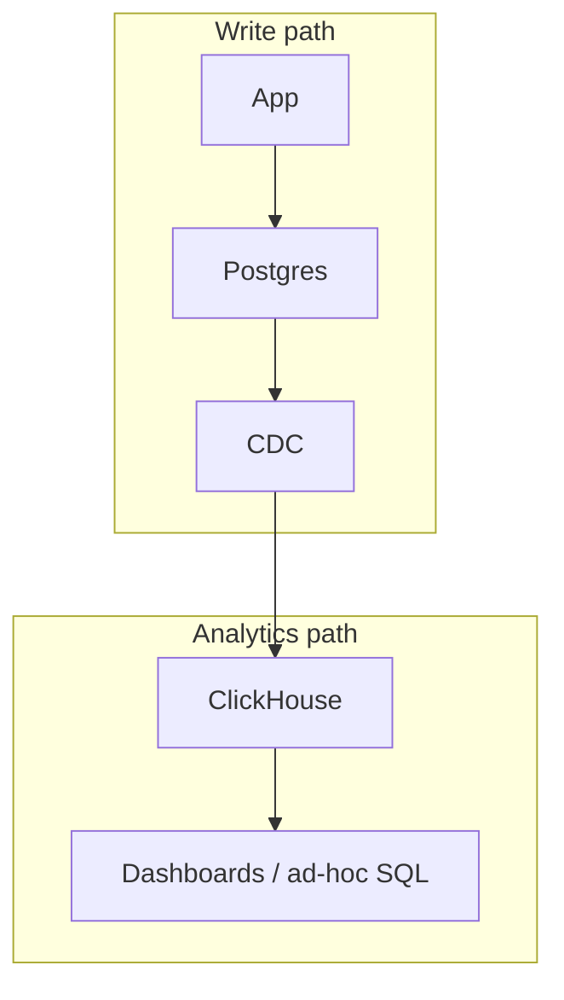
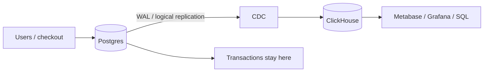

Postgres is very good at “this one order, this one customer, this one write.”

It is less good at “sum latency by day for the last 90 days, across tens of millions of events, every time someone opens a dashboard.”

That second question is **OLAP** — analytical processing. Many rows, a few columns, aggregates. The first is **OLTP** — transactional processing. Point lookups, joins, updates, constraints.

**ClickHouse** is a columnar OLAP database. It stores each column together on disk, compresses it, and reads only the columns a query names. That is why `SUM` / `GROUP BY` over a fat events table is the sweet spot — and why you should not replace Postgres with it for the checkout path.



Keep the system of record where the transactions live. Ship a copy of the facts into ClickHouse for the questions that scan.

---

## OLTP vs OLAP, without the brochure

| | OLTP (Postgres) | OLAP (ClickHouse) |
| --- | --- | --- |
| Typical question | Fetch order `42` and update it | Average latency by day and path |
| Shape | Few rows, many columns, random | Many rows, few columns, sequential |
| Writes | Small, concurrent, transactional | Append-heavy; updates are a design problem |
| Index instinct | B-tree to a row | Sparse index to a *block* of rows |

You can force either engine into the other job. You will pay for it. A wide `SELECT *` of a single user in ClickHouse can be slower than Postgres. A dashboard `GROUP BY` on raw `events` in Postgres will eventually become a 2 a.m. `VACUUM` conversation.

---

## Why columns win on aggregates

Row stores write a row as one record: `user_id`, `path`, `latency_ms`, `payload_json`, all together. To average `latency_ms` you still walk past the JSON.

Column stores write `latency_ms` in its own file (plus a matching file for `day`, for `path`, …). `avg(latency_ms)` reads that file — and the columns in `GROUP BY` — and skips the rest.

Compression likes this. A column of HTTP status codes or dates is repetitive. Run-length and dictionary encoding shrink it. Scanning a compressed integer column is the cheap work ClickHouse was built for.

The cost is the other direction: reconstructing a full wide row, or mutating one field in one event, is not the happy path.

---

## MergeTree, kept light

Most tables you will create use the **MergeTree** family.

Mental model:

1. **Inserts land as parts.** A batch becomes a sorted slice on disk, not a row-by-row heap update.
2. **Background merges** combine small parts into larger ones. That is the “merge” in the name. You insert fast; the engine tidies later.
3. Each part is sorted by `ORDER BY` (the clustering / primary-key columns).
4. Each part is cut into **granules** — by default about **8,192 rows**. A granule is the smallest chunk ClickHouse will read.
5. The **primary index is sparse**. One mark per granule: the primary-key values of the *first* row in that granule. The index stays small enough to sit in memory. It does **not** point at every row the way a Postgres B-tree does.

A query on the primary key binary-searches those marks, skips granules that cannot match, and reads the rest. You may read extra rows inside a granule. That is the deal: a tiny index, good range scans, weak “give me exactly this primary key” behaviour compared with OLTP.

Choose `ORDER BY` for the filters you actually run. `(day, user_id)` helps “this day, this user” and “this day.” It does **not** help “this `user_id` across all time” unless `user_id` is a left prefix — it is not, if `day` comes first.

Replicated and summing / aggregating / collapsing variants exist. You do not need them to understand the engine. Start with `MergeTree`.

---

## A typical architecture

Do not take writes on ClickHouse and hope.



**Postgres** remains the source of truth: constraints, foreign keys, “this payment succeeded.”

**CDC** copies inserts and updates into ClickHouse. In ClickHouse Cloud the first-party path is **ClickPipes Postgres CDC** (PeerDB under the hood): snapshot, then WAL. Self-managed teams use PeerDB, Debezium plus a sink, or a batch job if “T+1” is enough.

Point CDC at the **database**, not a pooler (PgBouncer, RDS Proxy, Supabase pooler). Logical replication needs the real endpoint.

Model the ClickHouse table for **reads**, not as a 1:1 clone of the OLTP schema. Drop wide JSON you never group by. Pick an `ORDER BY` that matches the dashboard. Deduplicate CDC updates with the strategy you chose — ReplacingMergeTree, a version column, or a query-time `LIMIT 1 BY` — and be explicit about it. Silent duplicates are how “the dashboard disagrees with finance.”

---

## Tiny toy SQL

```sql
CREATE TABLE events
(
    day        Date,
    user_id    UInt64,
    path       LowCardinality(String),
    latency_ms UInt32
)
ENGINE = MergeTree
ORDER BY (day, user_id);

INSERT INTO events VALUES
    ('2026-09-22', 42, '/checkout', 180),
    ('2026-09-22', 42, '/pay',      240),
    ('2026-09-22', 7,  '/checkout', 90);

SELECT
    count(),
    avg(latency_ms)
FROM events
WHERE day = '2026-09-22';
```

`LowCardinality(String)` is a dictionary for low-n unique values (`path`, status, country). It is not a magic index.

You can add `PARTITION BY toYYYYMM(day)` later so drops and cold storage happen by month. Do not partition by high-cardinality `user_id`.

---

## When not to use ClickHouse

- **The app’s primary store.** No useful foreign keys, weak UPDATE/DELETE story, different transaction model. Keep Postgres (or whatever OLTP you already trust).
- **Point lookups as the main load.** “Give me user 42’s current row” is a B-tree job. Sparse granules will read a block to find one row.
- **Frequent single-row mutations.** ClickHouse can mutate. You will feel it. Prefer append + CDC, or a table engine that collapses versions in the background.
- **Tiny data.** A million rows in Postgres with a decent index does not need a second database.
- **Need for serializable multi-table transactions.** That is OLTP.
- **You have not chosen an `ORDER BY`.** A MergeTree with a random key is a column store you cannot skip in. Measure with `EXPLAIN` after you pick the key; do not invent speedups.

ClickHouse Cloud, self-hosted, and the various MergeTree cousins are deployment details. The decision is: **do we scan columns for analytics, or do we transact rows?**

---

Official references:

- [MergeTree](https://clickhouse.com/docs/reference/engines/table-engines/mergetree-family/mergetree)
- [Sparse primary indexes](https://clickhouse.com/docs/concepts/core-concepts/primary-indexes)
- [Postgres CDC via ClickPipes](https://clickhouse.com/docs/integrations/clickpipes/postgres)

---

## Takeaway

ClickHouse is the scan engine. Postgres is the ledger.

**Write events (or a CDC copy of them) into a MergeTree ordered by the filters you actually run. Leave the row that must be correct — and the transaction around it — in OLTP.**
