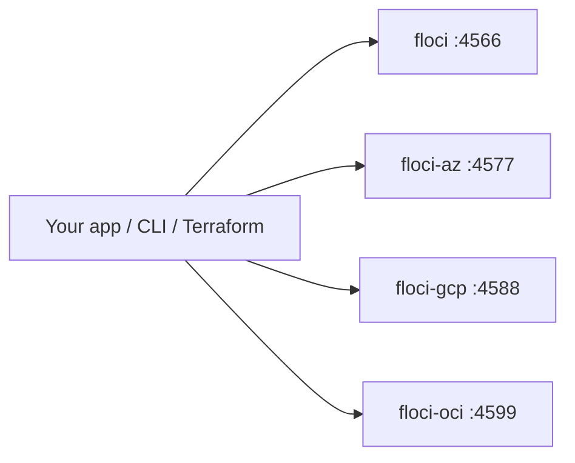

You do not need a real cloud account to find out your prefix logic is wrong.

Waiting on a shared account is a slow loop. So is paying for a stack you only needed for twenty minutes. So is watching an AI agent reach for a live bill.

**Floci** is a family of pretend clouds that live on your laptop.

An **emulator** is a toy that talks like the real thing.

Four binaries. Four doors. No cloud login. No start token. [Floci’s site](https://floci.io/) says the code is **MIT** and free.

| Binary | Cloud | Door (port) |
| --- | --- | --- |
| `floci` | AWS | **4566** |
| `floci-az` | Azure | **4577** |
| `floci-gcp` | GCP | **4588** |
| `floci-oci` | OCI | **4599** |

Those ports, and the service counts below, come from [floci.io](https://floci.io/) (checked 23 Sep 2026). They are Floci’s numbers, not ours.



That is the whole trick. The rest of this post is a laptop vs a far-away cloud, four doors, a tiny bucket loop, and when you still pay the real cloud.

---

## The problem is the far-away cloud

A typical “just try it on the real cloud” afternoon looks like this:

1. Wait for a **login**. Someone has to let you in.
2. Create a bucket, a queue, a table.
3. Burn a small bill on a forgotten worker.
4. Still cannot copy the failure that only happens with your fixture data.

Local work wants **seconds**, not a console session.

**CI** wants a sealed box. The test should not write into the company account. **CI** means the robot that runs your tests.

**IaC** wants a dry-run that actually creates toys, not only a plan against a remote account you share. **IaC** means “Infrastructure as Code.” You write the cloud toys in a file. Terraform is one of those files.

That is the job:

- faster loops
- tests that do not leak
- a sandbox you can wipe
- a place an AI agent can poke without a real bill


Say it out loud:

> “The cloud is far. Floci is a box on the desk that talks like the cloud.”

---

## Four doors

Pick the cloud you already use. Start that box. Talk to **that** door.


Floci’s homepage names these starting toys. Each row is “what they list,” not a promise that every API call matches the real cloud.

| Door | Box | Cloud | Floci’s service count | Toys they name first |
| --- | --- | --- | --- | --- |
| **4566** | `floci` | AWS | ~**119** | S3, SQS, Lambda, DynamoDB, RDS, EKS, … |
| **4577** | `floci-az` | Azure | ~**28** | Blob, Queue, Table, Functions, Key Vault, Event Hubs, Service Bus, … |
| **4588** | `floci-gcp` | GCP | ~**25** | GCS, Pub/Sub, Firestore, Cloud Run, Cloud SQL, GKE, … |
| **4599** | `floci-oci` | OCI | ~**8** | Object Storage, Identity, Queue, Streaming, KMS, Vault, Functions, … |

Kid pictures for the AWS door, because that is the loop below:

| Kid picture | Grown-up name |
| --- | --- |
| Labeled closet for files | **S3** |
| Waiting line | **SQS** |
| Tiny worker | **Lambda** |
| Fast notebook of rows | **DynamoDB** |
| Real-shaped database | **RDS** (they say it uses real PostgreSQL / MySQL) |
| Kubernetes-in-AWS | **EKS** |

The other doors have their own closet / line / worker words (Blob, GCS, Object Storage). Same idea. Different street.


---

## How you start it

From [Floci’s install](https://floci.io/):

```bash
curl -fsSL https://floci.io/install.sh | sh
floci start && eval $(floci env)
```

`floci start` wakes the AWS box on **4566**. `eval $(floci env)` points your shell at that door so `aws` does not call the far-away cloud.

Same family, other doors:

```bash
floci az start      # Azure on 4577
floci gcp start     # GCP on 4588
floci oci start     # OCI on 4599
floci doctor        # is the box awake?
```

`floci-cli` is the one remote control: start, stop, doctor, env. `floci-ui` is the picture dashboard — browse buckets and queues without a cloud console.

Docker images, if you would rather pull a box:

| Image | Door |
| --- | --- |
| `floci/floci` | 4566 |
| `floci/floci-az` | 4577 |
| `floci/floci-gcp` | 4588 |
| `floci/floci-oci` | 4599 |

```bash
docker run --rm -p 4566:4566 \
  -v /var/run/docker.sock:/var/run/docker.sock \
  floci/floci:latest
```

The socket mount is for toys that start extra containers (Lambda is the usual reason). Dummy keys such as `test` / `test` are fine. Floci’s site says you do not need a cloud account or a start token.

---

## A tiny loop: bucket, put, list

Hands-on on the AWS door. After `floci start && eval $(floci env)`:

```bash
aws s3 mb s3://demo-inbox
echo "hello from the desk" > hello.txt
aws s3 cp hello.txt s3://demo-inbox/hello.txt
aws s3 ls s3://demo-inbox
```

Same shape in application code. One client constructor is enough:

```python
import boto3

s3 = boto3.client("s3", endpoint_url="http://localhost:4566")
s3.create_bucket(Bucket="demo-inbox")
s3.put_object(Bucket="demo-inbox", Key="hello.txt", Body=b"ok")
print(s3.list_objects_v2(Bucket="demo-inbox")["Contents"])
```

If the CLI still talks to the far-away cloud, the endpoint was not set. Run `eval $(floci env)` again, or pass `--endpoint-url http://localhost:4566`.


Say it out loud:

> “Point at 4566. Make a closet. Put a file in. List it. No real account.”

The other doors have the same “closet, put, list” shape — Blob on 4577, GCS on 4588, Object Storage on 4599. Confirm the current CLI flags on [floci.io](https://floci.io/).

---

## Real engines, not empty boxes

Floci’s site claims some toys are **real-shaped engines**, not empty mocks:

- Lambda runs in real Docker containers
- RDS uses real PostgreSQL / MySQL
- cache toys can run real Redis

Kid English: the worker is a real little computer, not a cardboard cut-out that only smiles.

They also publish a **~24 ms** start and a small idle memory number. Those are **Floci’s published claims**. We did not sit with a stopwatch. Do not treat them as our benchmarks.

Coverage is still a **list**, not a magic “100% of the cloud.” If a test only passes on the laptop box, it is not done.

---

## A sandbox an agent cannot bill

Coding agents write cloud calls faster than you can review them.

A live account in the agent’s pocket is a leak and a bill. Point the agent at Floci instead:

- throwaway keys
- no real secret to steal
- worst case, you reset a local box


```bash
export AWS_ENDPOINT_URL=http://localhost:4566
pytest tests/
```

Works with the SDKs, CLIs, and Terraform / OpenTofu modules you already have. No special agent plugin. Floci’s site is the source for that claim.

---

## When the laptop is enough

Use the desk box when the bug is in **your** API calls.

Use the real cloud when the bug is in the **managed service**, the network path, or an account wall.

| Use Floci when… | Use the real cloud when… |
| --- | --- |
| You want seconds, not tickets | You need the real network path |
| CI must stay sealed | You are testing a managed-service quirk |
| `terraform apply` should mutate a sandbox | You need a real account boundary |
| An agent should not hold live keys | You need the cloud’s real IAM / VPC story |
| A workshop should not open a bill | You are signing off production behaviour |

---

## A working order that does not lie to you

1. Install with the script on [floci.io](https://floci.io/), or pull the Docker image for the cloud you use.
2. `floci start && eval $(floci env)` (or `floci az start` / `gcp` / `oci`).
3. `floci doctor` until the door answers.
4. Exercise **one** toy your app already uses. S3 (or Blob / GCS) is enough.
5. Point the SDK at that door behind a config flag.
6. Keep a thin **real-cloud** smoke test for the two calls that have bitten you before.

Official references (read these; do not copy them):

- [Floci — local cloud emulators](https://floci.io/)
- [floci-io on GitHub](https://github.com/floci-io)
- [floci-cli](https://github.com/floci-io/floci-cli)

---

## Grown-up names (tiny box)

You do not need this to get the story. It is here so the robot talks make sense later.

| Kid word | Grown-up name |
| --- | --- |
| Pretend clouds on the desk | **Floci** |
| Toy that talks like the real thing | **emulator** |
| The door | **endpoint** / port |
| AWS door | **`localhost:4566`** (`floci`) |
| Azure door | **`localhost:4577`** (`floci-az`) |
| GCP door | **`localhost:4588`** (`floci-gcp`) |
| OCI door | **`localhost:4599`** (`floci-oci`) |
| One remote control | **`floci-cli`** (`start`, `stop`, `doctor`, `env`) |
| Picture dashboard | **`floci-ui`** |
| Little computer in a box | **Docker** / container |
| Dummy keys `test` / `test` | **credentials** |
| Sealed test box | **hermetic** CI |
| Cloud toys written in a file | **IaC** (Terraform / OpenTofu) |
| Labeled closet | **S3** / **Blob** / **GCS** / **Object Storage** |
| Waiting line | **SQS** / **Queue** / **Pub/Sub** |
| Tiny worker | **Lambda** / **Functions** |
| Fast notebook | **DynamoDB** / **Table** / **Firestore** |
| Real-shaped engine | their claim: not an empty **mock** |

---

## Say this back

**Four doors: 4566, 4577, 4588, 4599. Start the box. Point the CLI at the door. Make a closet, put a file, list it. Pay the real cloud when the behaviour you need is the cloud’s, not the emulator’s.**
