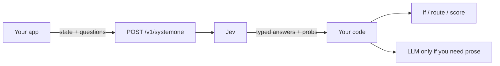
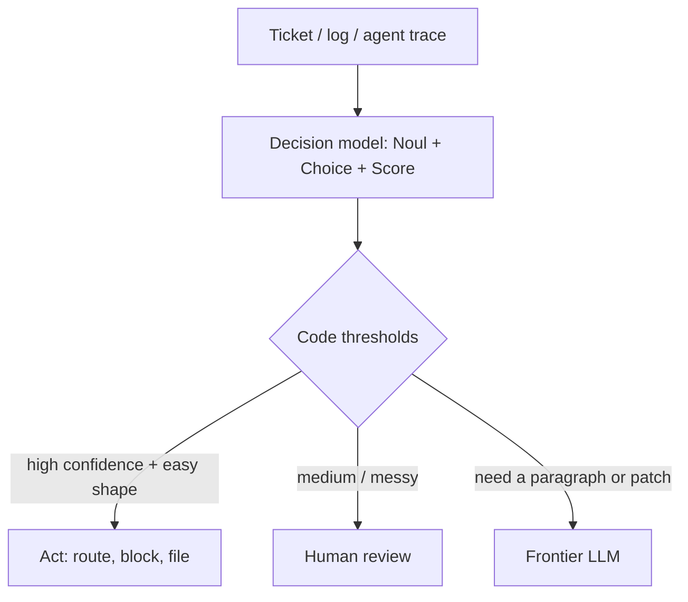

Chat models write letters.

**Jev** fills labeled boxes.

It is **not** a chat LLM. You send facts and a list of questions. It sends back **typed guesses** your code can read — a yes/no number, one winning label, a spot on a ladder.

A chat model writes a lunch note: “Hmm, maybe juice…” Jev stamps **urgent?** **which desk?** **how bad?** Then your code moves the tray.


---

## What Jev is

**TypeSafe AI** made it (San Francisco, 2024). Jev is their first public **System One** model. Early access: **15 September 2026**.

Founder **Diogo Almeida** has said in TypeSafe’s launch post that he helped build the **RLHF** / InstructGPT-era methods that made models follow instructions and talk. That is **his claim**. Do not turn it into “he invented ChatGPT.”



Keep the letter-writer for letters. Keep Jev for **smart if-statements**.

---

## Two names

**System One** is the *kind* of model. TypeSafe borrowed it from Daniel Kahneman: **System 1** is fast (catch the ball); **System 2** is slow (write the essay). They want snap judgments a person could make in a second if they had the facts.

**Jev** is named after **William Stanley Jevons**. Kid version of the **Jevons paradox**: cheaper coal meant *more* engines, not fewer. TypeSafe’s bet: cheap guesses go into more places — routing, scoring, guardrails.

> “System One is the *kind*. Jev is *this* model.”

---

## How you talk to it

One door: `POST https://api.typesafe.ai/v1/systemone`

Three pockets:

1. **`state`** — the facts. Text, JSON, or a list of text. Official docs: text only. No pictures, no audio, no video (yet).
2. **`model`** — who looks. `jev-latest` is the alias. Official models page (as of this draft): that alias points at **`jev-1.13.0`**. Pin the versioned id in production.
3. **`questions`** — a map of judgments. You name the keys. Answers come back under the same keys. Write the real question in `instructions`.

Jev looks at the state **once**. It answers every question in **one parallel pass**.

You list the legal boxes first. TypeSafe’s claim: Jev **cannot** emit a value outside that list. Easy to falsify if it ever happens.

A box can still be the **wrong** box. That is not a type error. That is a bad guess.

---

## Three toys

There is no fourth type. Official TypeSafe docs: **Noul**, **Choice**, **Score**. TypeSafe has not said what **Noul** stands for. Treat it as a made-up name.

| Type | Kid idea | Returns | Official limits |
| --- | --- | --- | --- |
| **Noul** | Yes/no coin | Probability **0–1**. No extra confidence field. The number *is* the belief. | Yes/no only. `0.5` means “I cannot tell,” not “medium.” |
| **Choice** | Pick one labeled box | Winner + **all** probabilities + **confidence** | Up to **255** options |
| **Score** | Place on an ordered ladder | Score (can sit **between** rungs) + probs + confidence | **2–10** levels |


Noul: is this true, by itself? Choice: who wins *this* race (add `other` if the list might miss). Score: where on *this* ladder? Three rungs live on 0, 1, 2; **1.6** sits between 1 and 2. Threshold if you want. Do not treat 1.6 as “80% angry.”

**They do not swap.** TypeSafe published this trap. Same refund question: a **Noul** said **0.22**; a yes/no **Choice** said **no** at **0.99**. Opposite vibes. Two Nouls that look like opposites do not have to add to 1. Never copy a Noul cut onto a Choice.

---

## One ticket, three stamps

Made-up ticket. No real people. The numbers are a **teaching story**, not a live Jev call. The **shape** follows TypeSafe’s published examples.

Shared state: *“I was charged twice. Please refund the extra charge today.”*

| Name | Toy | What you asked | Teaching answer | What it is **not** |
| --- | --- | --- | --- | --- |
| **team** | **Choice** | Which desk? | `billing` | Not a reply to the customer |
| **urgency** | **Score** | How soon? **0** routine, **1** today, **2** now | **1.05** — between “today” and “now” | **Not hours** |
| **refund_requested** | **Noul** | Did they *ask* for a refund? | **0.95** | **Not approved** — they asked |

```json
{
  "state": {
    "ticket": "I was charged twice. Please refund the extra charge today."
  },
  "model": "jev-1.13.0",
  "questions": {
    "team": {
      "type": "choice",
      "instructions": "Which desk should handle this?",
      "criteria": {
        "billing": "Money, refunds, charges",
        "technical": "Bugs, broken buttons, outages",
        "sales": "Pricing, upgrades, new accounts",
        "other": "None of those"
      }
    },
    "urgency": {
      "type": "score",
      "instructions": "How soon does this need a person?",
      "criteria": ["Routine. It can wait.", "Today.", "Now."]
    },
    "refund_requested": {
      "type": "noul",
      "instructions": "Did the customer ask for a refund?"
    }
  }
}
```

Your code: billing queue; **you** pick the “today” cut; they almost surely *asked* — a person still owns the money.


**None peek.** All three read the same ticket. None sees another’s answer. Official docs: ask every shared-state question in **one** request (output is free; they run in parallel). Need a chain — “now that it is billing, is this a chargeback?” — send a **second call**.

---

## The boxes travel with the request

A usual fine-tuned classifier learns its boxes at training time. Those hooks stay frozen. Want “subscriptions”? Collect more labels and train again.

Jev reads the boxes **from the request**. TypeSafe does **not** offer customer fine-tuning. Official models page: same weights for every account. You still need known stamps to *check* a new box. You do not need to train to *try* it.

Fair caveat: some **NLI** zero-shot tools can also take new boxes at call time. We are comparing Jev with the **usual frozen classifier**, not every encoder trick. This is **behavior**, not Jev’s insides. TypeSafe has not published those. Do **not** say Jev is BERT.

---

## Same shape from the LLM you already have

Production agents often need a **fixed set of answers**, not a sentence. Which desk? Jailbreak or not? How bad? Those jobs sit in **routing** and **guardrails**, before or beside the chat model that writes.

A common LLM shortcut: one **forward pass**, then read the scores on the allowed answers. You peek at the numbers on each box. You do not write a letter.

Two traps:

1. **Order-flip** — shuffle the options and the winner can change.
2. **Uncalibrated probabilities** — the numbers look sure, but they lean. “90%” might not mean “right 90 times out of 100.”

Fixes, conceptually:

- **No labels?** Training-free debiasing. Example: score every cyclic shift of the list so order is less of a cheat, then fix the model’s favorite-label habit without looking at answers (a label-free prior).
- **Have labels?** Post-hoc calibration, like **temperature scaling** — stretch or squash the numbers so they match how often you are really right.

Useful names in kid English:

| Metric | Kid idea |
| --- | --- |
| **Order-flip rate** | How often the winner changes when you shuffle the list |
| **Calibration error** | How far the “I’m 90%” pile is from being right 90% of the time |
| **Auto-decide at a chosen risk** | If you only act when you stay under a mistake line you picked, how many tickets still get a stamp? |

**AnyJev** is one public open kit for this wrap. GitHub [`MorrisZJ/AnyJev`](https://github.com/MorrisZJ/AnyJev). `pip install anyjev`. It wraps the LLM you already run so answers come back **typed**, with probabilities, **training-free by default**.

It is **not affiliated with TypeSafe**. It is **not** “Jev went open source.” Do **not** claim it matches Jev’s speed or quality. AnyJev’s own benches are **theirs**, not a shared bake-off.

You would still want dedicated **Jev** or **Laya** when you want a hosted restaurant, a published kitchen kit, or TypeSafe’s published latency/price story — and you do not want to run and babysit your own wrap.

---

## Beliefs and cuts

TypeSafe’s training name is **RLCD** — **Reinforcement Learning for Calibrated Decisions**.

- **RLHF** (chat-era) rewards “text people like.”
- **RLCD** (their name) rewards “probabilities that match how often you are actually right.”

**Calibrated** means: when it says about **90%** on many guesses, it should be right about **90%** of the time. One picnic can still get rained on. RLCD is a **vendor target**, not a certificate for *your* tickets.

**Confidence** (Choice and Score) is how bunched the pile is. It is **not** a second test. Pick cuts on tickets where you already know the stamp. A wrong refund and a wrong queue cost different amounts.

TypeSafe’s published claims (theirs, not ours):

| Claim | What they published | How to hold it |
| --- | --- | --- |
| Speed | ~**70–500 ms** end-to-end | Company number. They note many evals were run from West Coast laptops near the service. |
| Price | **$0.042** per million **input** tokens; **output free** | Official models page. Output “too cheap to meter.” Your bill is mostly how fat `state` is and how often you send it. |
| Type errors | **Cannot** emit a value outside the schema you sent | By construction, they say. Easy to falsify if it ever happens. |
| Context | **64k** tokens per request; **32k** for `state` plus the longest question | Official models page. |


They also publish big “faster / cheaper” multipliers from **their** workflow evals and say those sit at the **high end**. Official: they say they do **not** train on customer requests. They have **not** published architecture or weights. Do not invent layers.

---

## Two kitchens and a wrap

- **Jev (TypeSafe)** = dedicated System One decision model. A **restaurant**. You `POST`. They stamp the tray.
- **Laya** (Convai Innovations) = **open kitchen kit** with the same three stamps. Apache 2.0. `pip install laya`. You run it. Convai publishes more of its recipe (encoder + typed head). That is Convai’s, not Jev’s.
- **AnyJev-style wrap** = the LLM you already run, answering like a decision model (typed + probs). Complementary. Not “Jev is open source.”


| | Jev (TypeSafe) | Laya (Convai) | AnyJev-style wrap |
| --- | --- | --- | --- |
| What it is | Hosted decision model | Open-weight kit; you run it | Layer on the LLM you already have |
| Toys | Noul / Choice / Score | Same three | Same *shape* (typed + probs) |
| Training | Hosted; you change the request | You may fine-tune a checkpoint | Training-free by default; labels only if you calibrate |
| Best first try | Managed API + published token price | Local / air-gap / own weights | You already run an LLM and want boxes, not a new house |

Convai publishes a “Laya vs Jev” scoreboard. **That is Convai’s comparison, not an independent shared bake-off.** We will not invent a winner. Test **your** tickets.

> “Jev is the restaurant. Laya is the kit. The wrap uses the cook you already hired.”

---

## When to use it

Start with the answer your product needs.

| Start with **code** when… | Try a **decision model** when… | Use a **generative LLM** when… |
| --- | --- | --- |
| You can calculate it exactly | You can **list** the answers: a category, a yes/no, a rung | You need a **reply**, an explanation, or a plan |
| The rule is an `if` you can write | You want to pick, rate, or check something in text | You need deeper reasoning |
| You already found the candidate values | You pick from values your code already found | There is **no** fixed list |

It cannot pick an email your code missed. It is not a search box.

**Use it** for snaps your code can act on: if-statements, routing, scoring, map-reduce, ~100 ms UX (TypeSafe’s story), guardrails. **Skip it** for essays, open chat, or answers that are not a coin, a box, or a short ladder. No pictures / audio / video as input.

**Cascade** — cheap snap first, letter last:




> “Stamp the box. Code moves the tray. The LLM writes the note — if a note is even needed.”

---

## Honest caveats

- **Early access.** Pin **`jev-1.13.0`** (or the version you tuned). `jev-latest` can move.
- **Company evals are theirs.** Speed, price, and the big “faster / cheaper” multipliers are TypeSafe’s numbers. They say the multipliers are likely **upper end**.
- **Wrong ≠ type error.** Schema safety does not make a high-stakes refund automatic. Set cuts. Escalate.
- **Choice and Noul are not twins.** Relative vs absolute. Do not swap them and keep the same cut.
- **RLCD is a target, not a certificate.** Confidence is how bunched the pile is — not a second test.
- **New labels still need a quiz.** Boxes travel in the request. You still need known stamps to see if guesses are good enough.
- **Architecture is unpublished.** Describe what Jev does. Do not claim it is BERT. Laya’s encoder is Convai’s.
- **Wraps and scoreboards are not Jev.** AnyJev is not affiliated with TypeSafe and does not claim Jev’s speed or quality. Convai’s Jev table is not a shared bake-off.

---

Official references:

- [Introducing System One Models & Jev](https://typesafe.ai/blog/introducing-system-one-models-and-jev) (TypeSafe launch, 15 Sep 2026)
- [System One](https://docs.typesafe.ai/concepts/system-one)
- [Primitives](https://docs.typesafe.ai/primitives)
- [HTTP API](https://docs.typesafe.ai/api)
- [Models, price, limits](https://docs.typesafe.ai/models)
- [Noul / Choice / Score tutorials](https://learnjev.com/tutorials/three-primitives)
- [First call](https://learnjev.com/tutorials/first-call)

Laya / Convai (vendor pages; claims are theirs):

- [Hugging Face: convaiinnovations/laya](https://huggingface.co/convaiinnovations/laya)
- [PyPI: laya](https://pypi.org/project/laya/)

AnyJev (independent; not affiliated with TypeSafe):

- [GitHub: MorrisZJ/AnyJev](https://github.com/MorrisZJ/AnyJev)
- [PyPI: anyjev](https://pypi.org/project/anyjev/)

---

## Say this back

**Chat writes letters. Decision models stamp labeled boxes.** Send state plus named questions. Get numbers your `if` can read. One ticket can feed many independent stamps — none peeks. Start with code when you can calculate. Use Jev, Laya, or an LLM wrap to pick, rate, or check. Keep the chat model for the letter.
