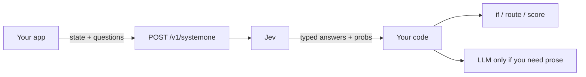
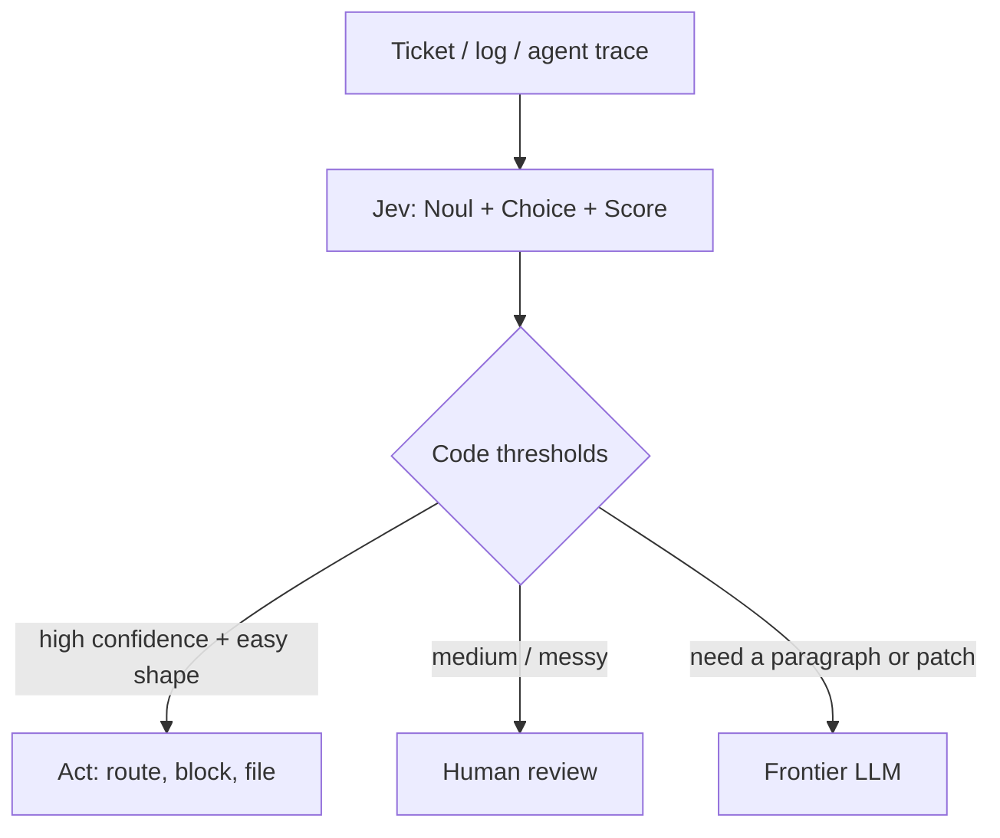
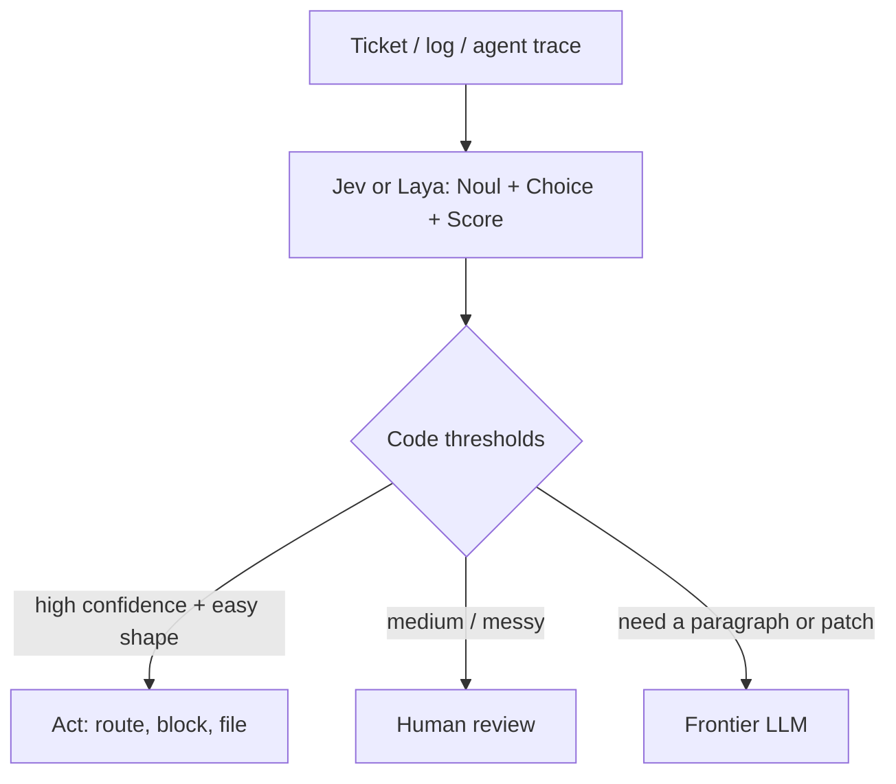

Chat models write letters.

**Jev** fills labeled boxes.

It is **not** a chat LLM. You do not ask it for a poem. You do not ask it for a function. You send it a pile of facts and a list of questions. It sends back **typed guesses** your code can read — yes/no numbers, one winning label, a spot on a ladder.

[Denis Timonin](https://www.linkedin.com/pulse/jev-llm-decisions-chat-denis-timonin-nzxue) wrote a LinkedIn Pulse called *Jev: an LLM for decisions, not chat*. This post keeps our lunch-line story. It also borrows a few teaching points from that Pulse — in our words, not a copy. Credit goes to Denis for the ticket walk-through and the “labels ride with the request” idea.

Think of a lunch line.

A chat model writes a note: “Hmm, maybe this kid wants juice, or maybe a sandwich, let me explain…”

Jev stamps three boxes: **which desk?** **how soon?** **did they ask for a refund?** Then your code moves the tray.

**TypeSafe AI** made it. San Francisco. Founded in 2024. The company calls Jev its first public **System One** model. Early access was announced on **15 September 2026**. Wikipedia and the press put a seed of about **$40 million**, led by **DCVC**. Treat that as reporting, not a bank statement we audited.

The founder, **Diogo Almeida**, has said he worked on the **RLHF** / InstructGPT-era work at OpenAI — the methods that helped models follow instructions and talk. That is **his claim**, and it is how the launch post and later reporting tell the story. Phrase it that way. Do not turn it into “he invented ChatGPT.”



Keep the letter-writer for letters. Keep Jev for **smart if-statements**.

TypeSafe says the architecture is new. They have **not** published the design. So this post talks about **what the stamps do**, not how the kitchen is built. From the outside, nobody can say whose face is behind the mask.

Another house uses the same three stamps. That is **Laya**. Same toys. Different kitchen. The comparison is below.


---

## Two names, both playground-simple

**System One** is a class name. TypeSafe borrowed it from Daniel Kahneman’s **System 1** vs **System 2**.

- **System 1** is fast. Catch the ball. Pick the red cup.
- **System 2** is slow. Do the long division. Write the essay.

TypeSafe wants **fast decisions inside software**, not slow chat essays. Their docs say the emphasis is on snap judgments a person could make in a second if they had the facts.

**Jev** is named after **William Stanley Jevons** and the **Jevons paradox**.

Kid version: when coal got cheaper, people did not use *less* coal. They built more engines.

TypeSafe’s bet: when a guess gets cheap and fast, you do not ask *fewer* questions. You put guesses in more places — routing, scoring, guardrails, map-reduce over a pile of tickets.


Say it out loud:

> “System One is the *kind* of model. Jev is *this* model. Cheap guesses should mean more uses, not fewer.”

---

## How you talk to it

One door.

```http
POST https://api.typesafe.ai/v1/systemone
```

Every request has three pockets:

1. **`state`** — the facts. Text, JSON, or a list of text. The ticket. The log. The program snapshot. Official docs: text only. No pictures, no audio, no video (yet).
2. **`model`** — who looks. `jev-latest` is the alias. Official models page (as of this draft): that alias points at **`jev-1.13.0`**. Pin the versioned id in production.
3. **`questions`** — a map of judgments. You name the keys. The answers come back under the same keys. The key is a label for *your* code. Write the real question in `instructions`.

Jev looks at the state **once**. It answers every question in **one parallel pass**. It does not write token, then token, then token.

TypeSafe’s published claims (theirs, not ours):

| Claim | What they published | How to hold it |
| --- | --- | --- |
| Speed | ~**70–500 ms** end-to-end | Company number. They note many evals were run from West Coast laptops near the service. |
| Price | **$0.042** per million **input** tokens; **output free** | Official models page: $42 per billion input tokens. Output “too cheap to meter.” |
| Faster / cheaper vs frontier LLMs | Launch post: **40x–200x** faster on System One shaped queries. Homepage: **193.6x** faster, **444.6x** cheaper | Those two big multipliers are from **their workflow evals**. They say they expect that to sit at the **high end** of real-world gains. |
| Type errors | **Cannot** emit a value outside the schema you sent | By construction, they say. Easy to falsify if it ever happens. |
| Context | **64k** tokens per request; **32k** for `state` plus the longest question | Official models page. |
| Rate limits | **250,000** tokens/sec, **1,200** requests/min | Official, and they say these can move without notice while demand is huge. |

Wrong answers are still allowed. A box can be the *wrong* box. That is not a type error. That is a bad guess.


---

## Three toys. That is the whole API.

There is no fourth type. No free-text extraction. No “just write a number.” Official TypeSafe docs: **Noul**, **Choice**, **Score**.

| Type | Kid idea | Returns | Limits (official API) |
| --- | --- | --- | --- |
| **Noul** | Yes/no coin feel | Probability **0–1**. No separate confidence field. The number *is* the belief. | Yes/no only. `0.5` means “I cannot tell,” not “medium.” |
| **Choice** | Pick one labeled box | Winning option + **all** probabilities + **confidence** | Up to **255** options |
| **Score** | Place on an ordered ladder | Score (can sit **between** rungs) + probs + confidence | **2–10** levels |

TypeSafe has not said what **Noul** stands for. Treat it as a made-up name.


### Noul

Ask: “Is this true?”

Get: a number from 0 to 1.

Near 1 = strong yes. Near 0 = strong no. Near 0.5 = the model has nothing to go on.

There is **no** extra `confidence` field. If you wanted a *spectrum* (“how good is this?”), you wanted a **Score**. A Noul of 0.5 is not “sort of good.” It is “I do not know.”

### Choice

Ask: “Which of these labels?”

Get: the winner (the argmax), the full pile of probabilities, and a confidence number.

The probabilities must add up to 1. If your list might miss a case, add **`other`** or **`none`**. If you do not, leftover belief lands on whichever label is *least wrong* — and it can look sure.

TypeSafe’s own Wikiracing note: above 255 options they do a two-step (score, then pick). That is why a huge list can sometimes feel slower.

A Choice is **relative**. It picks a winner among the labels you wrote. It is not the same as asking a Noul for each label.

### Score

Ask: “Where on *this* ladder?”

You write 2 to 10 rungs, low end first. The returned `score` is a probability-weighted spot. Three rungs live on 0, 1, 2. A score of **1.6** sits between rung 1 and rung 2.

TypeSafe is blunt: you may **threshold** (`score > 1.5`). You may **not** treat 1.6 as “80% angry” and do arithmetic as if the rungs were a ruler.

### They do not swap

TypeSafe published this trap on the jev-1.13 jaggedness page, and Learn Jev repeats it.

Ask “is the customer asking for a refund?” as a **Noul** and as a yes/no **Choice**. On one of their tickets the Noul said **0.22**. The Choice said **no** at **0.99**. Same question. Two toys. Opposite vibes.

Two Nouls that look like opposites (`refund` / `not_refund`) do not have to add to 1.

Never copy a threshold from a Noul onto a Choice. Never pretend N Nouls = one Choice.

Say it out loud:

> “Choice is ‘who wins the race.’ Noul is ‘how true is this, by itself.’”

---

## A tiny support ticket

Made-up state. No real people. We wrote the ticket. The answer **shapes** and sample numbers follow TypeSafe’s published examples. They are **not** a live Jev call on this note, and they are **not** a promise about your queue.

One ticket. Three named questions. Typed answers come back under the same names. Jev does **not** write the reply.

```json
{
  "state": {
    "ticket": "The shop charged me twice for juice. Please refund the extra charge. I have a class demo today."
  },
  "model": "jev-1.13.0",
  "questions": {
    "team": {
      "type": "choice",
      "instructions": "Which desk should handle this ticket?",
      "criteria": {
        "billing": "Payments, invoices and refunds",
        "technical": "Bugs, broken buttons, outages",
        "sales": "Questions before buying"
      }
    },
    "urgency": {
      "type": "score",
      "instructions": "How soon does this need a person?",
      "criteria": [
        "Routine. It can wait.",
        "Handle it today.",
        "Handle it now."
      ]
    },
    "refund_requested": {
      "type": "noul",
      "instructions": "Did the customer ask for a refund?"
    }
  }
}
```

Story answers, so you can see the shape:

```json
{
  "model": "jev-1.13.0",
  "answers": {
    "team": {
      "type": "choice",
      "choice": "billing",
      "probabilities": {
        "billing": 0.87,
        "technical": 0.13,
        "sales": 0.00
      },
      "confidence": 0.80
    },
    "urgency": {
      "type": "score",
      "score": 1.05,
      "legend": {
        "0": "Routine. It can wait.",
        "1": "Handle it today.",
        "2": "Handle it now."
      },
      "probabilities": { "0": 0.00, "1": 0.95, "2": 0.05 },
      "confidence": 0.92
    },
    "refund_requested": { "type": "noul", "noul": 0.95 }
  }
}
```

Read those stamps like this:

- **`team`** is a **Choice**. The desk is `billing`. Your code opens that queue.
- **`urgency`** is a **Score**. `1.05` sits **between** “today” and “now”. That is allowed. It is a spot on *your* ladder. It is **not** a number of hours.
- **`refund_requested`** is a **Noul**. `0.95` means “this note looks like they asked.” It does **not** mean the refund is approved. Your code (and a person) still decide the money.

Choice and Score also send **confidence**. Score sends a **legend** that maps rung numbers to the words you wrote. Noul has **no** extra confidence field. The number *is* the belief.

Official docs: ask every question that shares the same state in **one** request. Extra questions are cheap (output is free; they run in parallel). The instinct to ask one thing at a time is the expensive habit.

---

## Independent questions do not peek

All three stamps read the **same** ticket. These are **independent questions**. Each stamp works **alone**. The team guess does not see the urgency guess. The refund guess does not see either of them.

If a later question needs an earlier answer — “now that it is billing, which billing skill?” — that is a **second request**. Put the first answer into the next `state`, or pick the next labels in your code, then ask again.

If your code can already combine the three numbers with `if`, keep them in **one** call. Two calls are for a real chain, not a habit.


Say it out loud:

> “Same ticket. Private stamps. Need a chain? Send a second request.”

---

## Labels ride on the request

**BERT** is an old, famous reader model from Google. A usual fine-tuned BERT classifier learns its boxes at school. A small output layer has one slot per label. Those labels freeze into the model. Want a new “subscriptions” desk? You need new examples and another round of training. Serving that model behind an API does not change the rule.

**Jev** takes the labels in the **request**. The question, the options, and a plain-English note for each option travel with every call. Adding “subscriptions” means adding one option to `criteria`. TypeSafe does **not** offer customer fine-tuning, so the request is the thing you change. Official models page: same weights for every account.

You still need a pile of tickets with **known answers** to check if the guesses are good enough. You just do not need to train a new head to *try* a new question.

One fair caveat: some “no extra homework” classifiers — often built on **NLI** models, which guess if one sentence follows from another — can also take labels at request time. The comparison here is with the usual frozen fine-tune, not with every encoder trick.

---

## Jev vs a chat LLM

Do not replace chat with Jev. Stack them.

| | Chat LLM | Jev (System One) |
| --- | --- | --- |
| Output | A **string**. Chat, code, a story, a refusal, a hallucination | A **typed** value you listed in advance |
| Sampling | **Sequential.** One token, then the next | **Parallel.** All questions in one pass |
| Cost (TypeSafe’s table) | Input often **$0.20–$10** / million tokens; output ~5× input | Input **$0.042** / million; output **free** |
| Speed (TypeSafe’s table) | Frontier e2e **3–329 seconds** on their comparison | **70–500 ms** e2e |
| Confidence | You can *ask* for a number. They say models are often overconfident | Choice/Score include confidence; Noul’s probability *is* the belief. They train for **calibration** |
| Type errors / string hallucinations | Always some risk you must parse and validate | Cannot leave the schema. Wrong **decision** still possible |
| Best job | Essays, chat, code-as-prose, open answers | Classify, route, score, guardrail, map-reduce, ~100 ms UX |
| Kid picture | Turtle writing a letter | Flash filling three boxes |


**Cascade** — the grown-up pattern:

1. **Jev** does the cheap snap: classify / route / score / “is this a jailbreak?”
2. **Your code** reads the numbers. Ifs. Thresholds. Queues.
3. A **frontier LLM** writes the hard text — the reply, the patch, the essay — only when you actually need a string.




TypeSafe’s own use-case list matches this: smart if-statements, map-reduce over lots of text, real-time UX around **100 ms**, and **judge / guardrail** work on LLM traces. They also showed a Doom bot and Wikiracing as toys — structured *state*, not pixels.

That cascade stays. Jev or Laya for the snap. Code for the `if`. A generative LLM only when you need a letter.

Say it out loud:

> “Jev picks the box. Code moves the tray. The LLM writes the note — if a note is even needed.”

---

## Jev vs Laya

Same three toys. Different houses.

**Laya** is another **System One** / **System 1** decision model. **Convai Innovations** made it. India. Project materials often name **Nandakishor M** as CEO. Treat that as their materials, not a company we audited.

Same idea as Jev. You send **state** plus typed questions. You get typed answers with probabilities. **No letter.** No poem. No function.

Same three toys: **Noul**, **Choice**, **Score**. Convai’s helpers use a Jev-shaped request. The stamps look familiar on purpose.

The house is different.

- **Jev** is a restaurant. You sit down. You `POST` to TypeSafe. They stamp the tray.
- **Laya** is a stamp kit. **Apache 2.0** weights on Hugging Face. `pip install laya`. You run it on **your** GPU or CPU. This story is not a hosted TypeSafe-style API.


### What Convai publishes (theirs)

| Claim | What they published | How to hold it |
| --- | --- | --- |
| Internals | **ModernBERT-large** encoder + a typed decision head ≈ **421M** (English). Multilingual **mmBERT-base** ≈ **322M**. | They published this. Jev has not published a matching diagram. Do not copy those layers onto TypeSafe. |
| License / run | Apache 2.0. `pip install laya`. Your machine. | Weights are free. You pay GPU, CPU, and ops. |
| Context | Often **512** tokens (English) or **1024** (other checkpoints) per question | Much smaller than Jev’s documented **64k** request / **32k** state+longest-question budget. |
| Many Choice labels | Publishers commonly advise fewer options (~**20** at defaults). Options share a prompt budget. | Jev’s official cap is **255**. Convai’s own note says Jev leads when the list is long. |
| Training | They also call it **RLCD**. They publish more of the recipe (encoder, head, reward). | TypeSafe uses the same name and does **not** publish Jev’s recipe. |
| Languages | **100+** languages + a router that picks a checkpoint | Convai’s claim. Test the languages you care about. |
| Speed | About **33 ms** on their GPU figures. They say faster than Jev. | **Convai’s numbers.** Not a shared bake-off. Some write-ups warn the head-to-head mixes sources. |
| Fine-tune | You can train a checkpoint on your data | Jev is a versioned hosted model. You shape it with prompts and pin a version. |

Wrong answers are still allowed. A kitchen kit can still stamp the wrong box.

### Fair lunch-line table

| | Jev (TypeSafe) | Laya (Convai) |
| --- | --- | --- |
| Deployment | Hosted API | Open weights; you run it |
| Internals | Parallel sampling + RLCD described; network unpublished | ModernBERT/mmBERT + typed head documented |
| Same toys? | Noul / Choice / Score | Same three |
| Big inputs | Larger documented token budget | Smaller default budgets |
| Many labels | Up to 255 Choice options | Prefer fewer options at defaults |
| Adapt | Change prompts/state; pin version | Fine-tune checkpoint + calibration |
| Money | Input token price (output free) | Weights free; you pay GPU/ops |
| Best first try | Want a managed decision API | Need local / air-gap / own weights |


### Do not invent a winner

Convai publishes a “Laya vs Jev” scoreboard. They also say some Jev numbers were **not** measured on their machines (no TypeSafe API access; they cite third-party write-ups). Independent notes warn those tables mix sources — a fine-tuned Laya checkpoint next to hosted Jev, their T4 milliseconds next to someone else’s p50.

**That is Convai’s published comparison. It is not an independent shared bake-off.**

We will not paste their full “beats Jev on X” table as proven fact. We will not invent accuracy numbers of our own.

Pick the house for the job. Then test **your** tickets.

### Cascade still works

Both models can sit in the same chair:

1. **Jev or Laya** does the cheap snap.
2. **Your code** reads the numbers.
3. A **chat LLM** writes the letter — only if a letter is needed.



Say it out loud:

> “Same three stamps. Jev is the restaurant. Laya is the kit you keep at home.”

---

## Training, kept light

TypeSafe’s training name is **RLCD** — **Reinforcement Learning for Calibrated Decisions**. That is **their claim** about the training target. It is not proof that *your* tickets are calibrated.

**RLHF** (the chat-era method) rewards “text people like.”

**RLCD** (their name) rewards “probabilities that match how often you are actually right.”

**Calibrated** means: gather many cases where the model said about **0.7**. About **70%** of that pile should turn out true. That describes a **group**, not a promise about one ticket. A 70% weather forecast can still ruin one picnic.

You still need **eval examples** — tickets where a person already marked the true answer. Check the pile. Then pick a cutoff. A wrong refund and a wrong queue need **different** cutoffs. Estimate the mistakes and the review work each cut will cost.

**Confidence** (on Choice and Score) says how peaked the probability pile is. It is **not** a second, independently checked chance of being right. Do not skip a person just because confidence looks high, until you have checked it on *your* examples.

They have **not** published architecture, weights, or a paper. Do not invent layers, parameter counts, or “it is just BERT.” Outside write-ups guess. That is guesswork. This post describes **behavior**, not internals.

**Laya** (the other house) *does* publish an encoder + head and more of the RLCD recipe. That is Convai’s model, not Jev’s. Do not copy those layers onto TypeSafe. ModernBERT, NeoBERT, and mmBERT explain the encoder *story*. They are not Jev’s family tree.

What *is* sourced:

- The company says it built “a new model architecture” and a **parallel sampler**. That is a claim, not a diagram.
- Almeida told TechCrunch Jev is **transformer-based** and trained on **synthetic data** with RLCD. Tight-lipped on the rest. Observers guess an open-weight backbone. That is **not** confirmed.
- Official models page: same weights for every account. No customer LoRA. You shape answers with `state` + `instructions` + `criteria`.
- Official: they say they do **not** train on customer requests.

---

## When to use it / when not to

Start with the answer your product needs.

- **Exact sums, dates, counts?** Start in **code**. Jev is a guesser. TypeSafe lists weak spots in arithmetic, counting, dates, and sneaky instructions inside the text.
- **Known boxes?** Try **Jev** (or **Laya**). Pick a team. Rate a ladder. Check a yes/no.
- **A letter, a plan, or an open hunt?** Use a **generative LLM**. Jev will not write the email. It also will not pick an address your code never listed.

Kid table:

| Job | First try |
| --- | --- |
| Add the two charges. Compare two dates. | **Code** |
| Which desk? How urgent? Did they ask for a refund? | **Jev** or **Laya** |
| Write the reply. Plan the next tool call. Hunt with no list. | **Generative LLM** |
| Filter easy tickets, then escalate the messy ones | **Cascade** (stays the same) |

**Use Jev when** the job is a snap your code can act on:

- Smart **if-statements** (“does this ask for a refund?”)
- **Routing** (which desk, which skill, which model next)
- **Scoring** (severity, frustration, evidence strength)
- **Map-reduce** over a pile of tickets or logs
- **Real-time UX** where TypeSafe’s ~100 ms story matters
- **Judge / guardrail** on another model’s output (jailbreak, “did it follow the rule?”)

**Do not use Jev when** you need a free-form string:

- Writing essays or emails
- Code generation as prose
- Open chat
- Anything whose answer is not already in a coin, a labeled box, or a short ladder
- Pictures / audio / video as input (not supported)
- A value your code never found (Jev cannot invent a missing email)
- An **embedding** search. Jev does not document an embedding door. That list-of-numbers search is a different tool.

| Use Jev when… | Use a chat LLM when… |
| --- | --- |
| The answer is a box you already drew | The answer is a paragraph |
| You will `if` on a number | A person will read the text |
| You need many questions on one state, fast | You need a tool-using agent to *write* |
| You want a cheap guardrail *on* an LLM | You want the LLM itself |

| First try **Jev** when… | First try **Laya** when… |
| --- | --- |
| You want a managed API and a published token price | You need the weights on *your* machine (local / air-gap) |
| Inputs can be fat (TypeSafe’s 64k story) | You can live with a smaller default context |
| You may need a long Choice list | You can keep Choice lists shorter, or raise Laya’s budget yourself |

---

## Honest caveats

- **Early access.** Waitlists. Pin **`jev-1.13.0`** (or whatever version you tuned) once thresholds matter. `jev-latest` can move.
- **Company evals are theirs.** The 193.6× / 444.6× headlines are workflow evals TypeSafe built. They say the workflows were *not* in the training set, *were* written by their capabilities team (possible bias), and the multipliers are likely **upper end**.
- **Wrong ≠ type error.** Schema safety does not make a high-stakes refund automatic. Set thresholds. Escalate. A person still owns the sharp edges.
- **Choice and Noul are not twins.** Relative vs absolute. Do not swap them and keep the same cut.
- **Documented example outputs are not tests.** Learn Jev notes a launch-week report that an official Python sample did not match the docs. Run it. Believe *your* distribution.
- **Output-is-free is a Jev billing story**, not “Jev output tokens = LLM output tokens.” TypeSafe’s CEO said on Hacker News they are not really comparable. Your bill is mostly **how fat `state` is** and **how often you send it**.
- **English first.** Official models page: other languages work less evenly. Test.
- **Convai’s Jev scoreboard is theirs.** Not a shared bake-off. Their card even says some Jev figures were never measured in their lab. Treat Laya speed and “faster than Jev” as **Convai’s numbers**.
- **TypeSafe lists weak spots** in arithmetic, counting, dates, indirect reasoning, hostile instructions inside the input, and long leftover context. Keep the calculator in code. Test sneaky tickets. A legal box is not a correct box.
- **A valid answer shape is not a correct decision.** Schema safety does not finish the eval.

---

Official references:

- [Introducing System One Models & Jev](https://typesafe.ai/blog/introducing-system-one-models-and-jev) (TypeSafe launch, 15 Sep 2026)
- [System One](https://docs.typesafe.ai/concepts/system-one)
- [Primitives](https://docs.typesafe.ai/primitives)
- [HTTP API](https://docs.typesafe.ai/api)
- [Models, price, limits](https://docs.typesafe.ai/models)
- [Noul / Choice / Score tutorials](https://learnjev.com/tutorials/three-primitives)
- [First call](https://learnjev.com/tutorials/first-call)

Secondary (company facts, not architecture):

- [Wikipedia: Jev (AI model)](https://en.wikipedia.org/wiki/Jev_(AI_model))
- [TechCrunch, 18 Sep 2026](https://techcrunch.com/2026/09/18/a-new-kind-of-ai-model-from-a-chatgpt-inventor-is-thrilling-developers/) (transformer-based + synthetic data, as Almeida told them)
- [Denis Timonin, LinkedIn Pulse: Jev: an LLM for decisions, not chat](https://www.linkedin.com/pulse/jev-llm-decisions-chat-denis-timonin-nzxue) (21 Sep 2026; teaching ticket and caveats, paraphrased here)

Laya / Convai (vendor pages; claims are theirs):

- [Hugging Face: convaiinnovations/laya](https://huggingface.co/convaiinnovations/laya)
- [PyPI: laya](https://pypi.org/project/laya/)
- [GitHub: NandhaKishorM/laya](https://github.com/NandhaKishorM/laya)
- [laya.convaiinnovations.com](https://laya.convaiinnovations.com/)

---

## Grown-up names (tiny box)

You do not need this to get the story. It is here so the robot talks make sense later.

| Kid word | Grown-up name |
| --- | --- |
| Fast snap vs slow essay | **System 1 / System 2** (Kahneman); TypeSafe’s class is **System One** |
| The model that fills boxes | **Jev** (`jev-1.13.0`, alias `jev-latest`) |
| Cheaper fuel → more engines | **Jevons paradox** |
| The facts you send | **`state`** |
| The map of judgments | **`questions`** |
| Yes/no probability | **Noul** |
| One label from a list | **Choice** |
| Spot on an ordered rubric | **Score** |
| All questions at once | **parallel sampler** / one-pass |
| “90% means ~90% over many guesses” | **calibration** |
| Train for honest probabilities | **RLCD** (Reinforcement Learning for Calibrated Decisions) |
| Train for chat people like | **RLHF** |
| Jev first, code next, LLM last | **cascade** |
| Cannot leave the listed boxes | **schema / type-safe outputs** |
| Still a bad pick | **decision error** (not a type error) |
| The other house with the same stamps | **Laya** (Convai Innovations) |
| Restaurant door vs kitchen kit | **hosted API** vs **open weights** (Apache 2.0) |
| Encoder Laya published | **ModernBERT-large** / **mmBERT-base** |
| Labels travel with the call | **request-time criteria** (not a frozen BERT head) |
| Usual “labels at request time” caveat | **NLI zero-shot** classifiers |
| Stamps do not see each other | **independent questions** |
| Later guess needs an earlier answer | **second request** |
| “0.7 on a pile ≈ 70% true” | **calibration** (group, not one ticket) |
| How peaked the probability pile is | **confidence** (not a second checked chance) |

---

## Say this back

**Send state plus three kinds of questions. Get numbers your `if` can read. A Score can sit between rungs. A refund Noul is “they asked,” not “pay them.” Stamps do not peek; a chain needs a second request. Labels ride on the call. Check a pile of known answers before you trust the odds. Let Jev (or Laya) classify, route, score, and guardrail. Keep code for exact math. Keep the chat model for the letter. Jev is the restaurant. Laya is the kitchen kit. Thanks to Denis Timonin for the Pulse this update leans on.**
