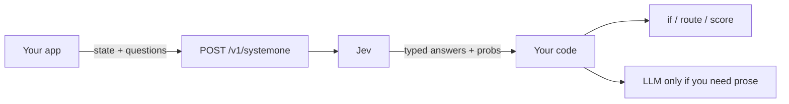
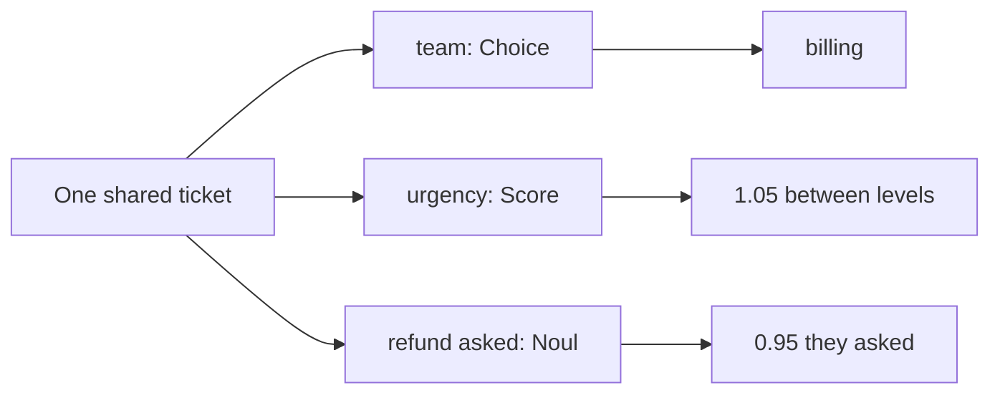
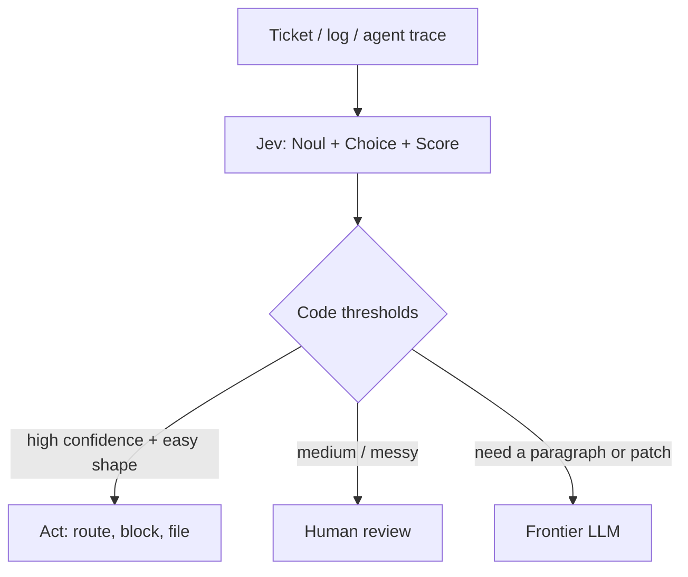
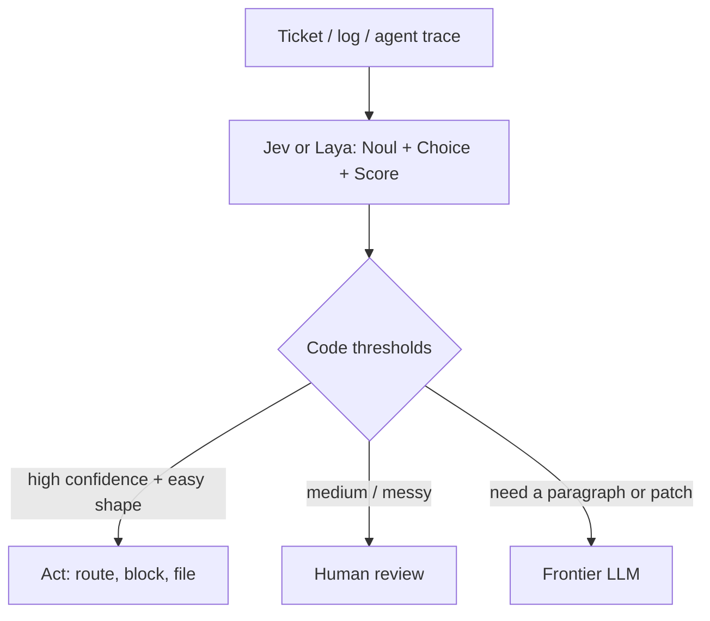

Chat models write letters.

**Jev** fills labeled boxes.

It is **not** a chat LLM. You do not ask it for a poem. You do not ask it for a function. You send it a pile of facts and a list of questions. It sends back **typed guesses** your code can read — yes/no numbers, one winning label, a spot on a ladder.

Think of a lunch line.

A chat model writes a note: “Hmm, maybe this kid wants juice, or maybe a sandwich, let me explain…”

Jev stamps three boxes: **urgent?** **which desk?** **how bad?** Then your code moves the tray.

**TypeSafe AI** made it. San Francisco. Founded in 2024. The company calls Jev its first public **System One** model. Early access was announced on **15 September 2026**. Wikipedia and the press put a seed of about **$40 million**, led by **DCVC**. Treat that as reporting, not a bank statement we audited.

The founder, **Diogo Almeida**, has said he worked on the **RLHF** / InstructGPT-era work at OpenAI — the methods that helped models follow instructions and talk. That is **his claim**, and it is how the launch post and later reporting tell the story. Phrase it that way. Do not turn it into “he invented ChatGPT.”



Keep the letter-writer for letters. Keep Jev for **smart if-statements**.

**Denis Timonin** called it an LLM for decisions, not chat. Same idea. It is **not** a chat LLM. It fills labeled boxes. It does not write a reply.

Another house uses the same three stamps. That is **Laya**. Same toys. Different kitchen. The comparison is below.


---

## Two names, both playground-simple

**System One** is a class name. TypeSafe borrowed it from Daniel Kahneman’s **System 1** vs **System 2**.

- **System 1** is fast. Catch the ball. Pick the red cup.
- **System 2** is slow. Do the long division. Write the essay.

TypeSafe wants **fast decisions inside software**, not slow chat essays. Their docs say the emphasis is on snap judgments a person could make in a second if they had the facts.

**Jev** is named after **William Stanley Jevons** and the **Jevons paradox**.

Kid version: when coal got cheaper, people did not use *less* coal. They built more engines.

TypeSafe’s bet: when a guess gets cheap and fast, you do not ask *fewer* questions. You put guesses in more places — routing, scoring, guardrails, map-reduce over a pile of tickets.


Say it out loud:

> “System One is the *kind* of model. Jev is *this* model. Cheap guesses should mean more uses, not fewer.”

---

## How you talk to it

One door.

```http
POST https://api.typesafe.ai/v1/systemone
```

Every request has three pockets:

1. **`state`** — the facts. Text, JSON, or a list of text. The ticket. The log. The program snapshot. Official docs: text only. No pictures, no audio, no video (yet).
2. **`model`** — who looks. `jev-latest` is the alias. Official models page (as of this draft): that alias points at **`jev-1.13.0`**. Pin the versioned id in production.
3. **`questions`** — a map of judgments. You name the keys. The answers come back under the same keys. The key is a label for *your* code. Write the real question in `instructions`.

Jev looks at the state **once**. It answers every question in **one parallel pass**. It does not write token, then token, then token.

TypeSafe’s published claims (theirs, not ours):

| Claim | What they published | How to hold it |
| --- | --- | --- |
| Speed | ~**70–500 ms** end-to-end | Company number. They note many evals were run from West Coast laptops near the service. |
| Price | **$0.042** per million **input** tokens; **output free** | Official models page: $42 per billion input tokens. Output “too cheap to meter.” |
| Faster / cheaper vs frontier LLMs | Launch post: **40x–200x** faster on System One shaped queries. Homepage: **193.6x** faster, **444.6x** cheaper | Those two big multipliers are from **their workflow evals**. They say they expect that to sit at the **high end** of real-world gains. |
| Type errors | **Cannot** emit a value outside the schema you sent | By construction, they say. Easy to falsify if it ever happens. |
| Context | **64k** tokens per request; **32k** for `state` plus the longest question | Official models page. |
| Rate limits | **250,000** tokens/sec, **1,200** requests/min | Official, and they say these can move without notice while demand is huge. |

Wrong answers are still allowed. A box can be the *wrong* box. That is not a type error. That is a bad guess.


---

## Three toys. That is the whole API.

There is no fourth type. No free-text extraction. No “just write a number.” Official TypeSafe docs: **Noul**, **Choice**, **Score**.

| Type | Kid idea | Returns | Limits (official API) |
| --- | --- | --- | --- |
| **Noul** | Yes/no coin feel | Probability **0–1**. No separate confidence field. The number *is* the belief. | Yes/no only. `0.5` means “I cannot tell,” not “medium.” |
| **Choice** | Pick one labeled box | Winning option + **all** probabilities + **confidence** | Up to **255** options |
| **Score** | Place on an ordered ladder | Score (can sit **between** rungs) + probs + confidence | **2–10** levels |

TypeSafe has not said what **Noul** stands for. Treat it as a made-up name.


### Noul

Ask: “Is this true?”

Get: a number from 0 to 1.

Near 1 = strong yes. Near 0 = strong no. Near 0.5 = the model has nothing to go on.

There is **no** extra `confidence` field. If you wanted a *spectrum* (“how good is this?”), you wanted a **Score**. A Noul of 0.5 is not “sort of good.” It is “I do not know.”

### Choice

Ask: “Which of these labels?”

Get: the winner (the argmax), the full pile of probabilities, and a confidence number.

The probabilities must add up to 1. If your list might miss a case, add **`other`** or **`none`**. If you do not, leftover belief lands on whichever label is *least wrong* — and it can look sure.

TypeSafe’s own Wikiracing note: above 255 options they do a two-step (score, then pick). That is why a huge list can sometimes feel slower.

A Choice is **relative**. It picks a winner among the labels you wrote. It is not the same as asking a Noul for each label.

### Score

Ask: “Where on *this* ladder?”

You write 2 to 10 rungs, low end first. The returned `score` is a probability-weighted spot. Three rungs live on 0, 1, 2. A score of **1.6** sits between rung 1 and rung 2.

TypeSafe is blunt: you may **threshold** (`score > 1.5`). You may **not** treat 1.6 as “80% angry” and do arithmetic as if the rungs were a ruler.

### They do not swap

TypeSafe published this trap on the jev-1.13 jaggedness page, and Learn Jev repeats it.

Ask “is the customer asking for a refund?” as a **Noul** and as a yes/no **Choice**. On one of their tickets the Noul said **0.22**. The Choice said **no** at **0.99**. Same question. Two toys. Opposite vibes.

Two Nouls that look like opposites (`refund` / `not_refund`) do not have to add to 1.

Never copy a threshold from a Noul onto a Choice. Never pretend N Nouls = one Choice.

Say it out loud:

> “Choice is ‘who wins the race.’ Noul is ‘how true is this, by itself.’”

---

## A tiny toy ticket

Made-up state. No real people. The numbers below are a **teaching story**, not a live Jev call.

```json
{
  "state": {
    "ticket": "The shop cart froze on the juice page. I have a class demo in 20 minutes."
  },
  "model": "jev-1.13.0",
  "questions": {
    "is_urgent": {
      "type": "noul",
      "instructions": "Does this message express urgency or a deadline?"
    },
    "route": {
      "type": "choice",
      "instructions": "Which desk should see this first?",
      "criteria": {
        "billing": "Money, refunds, charges",
        "technical": "Bugs, broken buttons, outages",
        "sales": "Pricing, upgrades, new accounts",
        "other": "None of those"
      }
    },
    "severity": {
      "type": "score",
      "instructions": "How severe is the breakage for the customer right now?",
      "criteria": [
        "Annoyed, can wait",
        "Blocked on something important",
        "Everything is on fire"
      ]
    }
  }
}
```

Story answers, so you can see the shape:

```json
{
  "model": "jev-1.13.0",
  "answers": {
    "is_urgent": { "type": "noul", "noul": 0.91 },
    "route": {
      "type": "choice",
      "choice": "technical",
      "probabilities": {
        "billing": 0.06,
        "technical": 0.84,
        "sales": 0.03,
        "other": 0.07
      },
      "confidence": 0.74
    },
    "severity": {
      "type": "score",
      "score": 1.4,
      "legend": {
        "0": "Annoyed, can wait",
        "1": "Blocked on something important",
        "2": "Everything is on fire"
      },
      "probabilities": { "0": 0.10, "1": 0.40, "2": 0.50 },
      "confidence": 0.58
    }
  }
}
```

What your code does with that:

- `is_urgent` near 0.91 → jump the line.
- `route` = `technical` → open that queue.
- `severity` = 1.4 → above a “page someone” threshold you chose, or not. **You** pick the cut.

Official docs: ask every question that shares the same state in **one** request. Extra questions are cheap (output is free; they run in parallel). The instinct to ask one thing at a time is the expensive habit.

They still do **not** peek. Same state. Separate answers. If a later question needs an earlier answer, that is a **second request**.

---

## One ticket. Three named questions.

The juice-cart ticket above used a **Noul** for “is this urgent?”, a **Choice** for the desk, and a **Score** for how bad the break felt.

You can remix the toys. Here is a second teaching ticket. The words are ours. The **shape** of the answers (a Choice winner, a Score that can sit between rungs, a Noul near 1) follows TypeSafe’s published examples. These numbers are **not** a live Jev call, and they are **not** a prediction for this ticket.

Shared state:

> “I was charged twice. Please refund the extra charge today.”

Three named questions. Same ticket. Each one needs a name, a toy type, and the real ask in `instructions`. Choice and Score also need a list you wrote: the desks, or the ladder rungs.

| Name | Toy | What you asked | Teaching answer | What it is **not** |
| --- | --- | --- | --- | --- |
| **team** | **Choice** | Which desk should handle this? | `billing` (plus a probability for each desk) | Not a written reply to the customer |
| **urgency** | **Score** | How soon? Levels: **0** routine, **1** today, **2** now | **1.05** — between “today” and “now” | **Not hours.** 1.05 is not “one hour and a bit.” |
| **refund_requested** | **Noul** | Did the customer *ask* for a refund? | **0.95** | **Not approved.** It is an estimated 95% chance of *yes, they asked.* |

Choice and Score also come back with **confidence**. Score comes back with a **legend** that maps 0 / 1 / 2 to the words you wrote. Noul has **no** extra confidence field. The number *is* the belief.




### They do not peek

All three questions read the **same** ticket. None of them sees another’s answer.

- **team** does not know that urgency landed at 1.05.
- **urgency** does not know that team picked billing.
- **refund_requested** does not know either stamp.

That is why you can send them together. They are independent.

If a later decision needs an earlier result — “now that we know it is billing, is this a chargeback?” — make **another request**. A chain is a second call, not a secret look.

Say it out loud:

> “One ticket. Three named boxes. None peeks. Need a chain? Send again.”

---

## Jev vs a chat LLM

Do not replace chat with Jev. Stack them.

| | Chat LLM | Jev (System One) |
| --- | --- | --- |
| Output | A **string**. Chat, code, a story, a refusal, a hallucination | A **typed** value you listed in advance |
| Sampling | **Sequential.** One token, then the next | **Parallel.** All questions in one pass |
| Cost (TypeSafe’s table) | Input often **$0.20–$10** / million tokens; output ~5× input | Input **$0.042** / million; output **free** |
| Speed (TypeSafe’s table) | Frontier e2e **3–329 seconds** on their comparison | **70–500 ms** e2e |
| Confidence | You can *ask* for a number. They say models are often overconfident | Choice/Score include confidence; Noul’s probability *is* the belief. They train for **calibration** |
| Type errors / string hallucinations | Always some risk you must parse and validate | Cannot leave the schema. Wrong **decision** still possible |
| Best job | Essays, chat, code-as-prose, open answers | Classify, route, score, guardrail, map-reduce, ~100 ms UX |
| Kid picture | Turtle writing a letter | Flash filling three boxes |


**Cascade** — the grown-up pattern:

1. **Jev** does the cheap snap: classify / route / score / “is this a jailbreak?”
2. **Your code** reads the numbers. Ifs. Thresholds. Queues.
3. A **frontier LLM** writes the hard text — the reply, the patch, the essay — only when you actually need a string.




TypeSafe’s own use-case list matches this: smart if-statements, map-reduce over lots of text, real-time UX around **100 ms**, and **judge / guardrail** work on LLM traces. They also showed a Doom bot and Wikiracing as toys — structured *state*, not pixels.

Say it out loud:

> “Jev picks the box. Code moves the tray. The LLM writes the note — if a note is even needed.”

---

## Jev vs Laya

Same three toys. Different houses.

**Laya** is another **System One** / **System 1** decision model. **Convai Innovations** made it. India. Project materials often name **Nandakishor M** as CEO. Treat that as their materials, not a company we audited.

Same idea as Jev. You send **state** plus typed questions. You get typed answers with probabilities. **No letter.** No poem. No function.

Same three toys: **Noul**, **Choice**, **Score**. Convai’s helpers use a Jev-shaped request. The stamps look familiar on purpose.

The house is different.

- **Jev** is a restaurant. You sit down. You `POST` to TypeSafe. They stamp the tray.
- **Laya** is a stamp kit. **Apache 2.0** weights on Hugging Face. `pip install laya`. You run it on **your** GPU or CPU. This story is not a hosted TypeSafe-style API.


### What Convai publishes (theirs)

| Claim | What they published | How to hold it |
| --- | --- | --- |
| Internals | **ModernBERT-large** encoder + a typed decision head ≈ **421M** (English). Multilingual **mmBERT-base** ≈ **322M**. | They published this. Jev has not published a matching diagram. Do not copy those layers onto TypeSafe. |
| License / run | Apache 2.0. `pip install laya`. Your machine. | Weights are free. You pay GPU, CPU, and ops. |
| Context | Often **512** tokens (English) or **1024** (other checkpoints) per question | Much smaller than Jev’s documented **64k** request / **32k** state+longest-question budget. |
| Many Choice labels | Publishers commonly advise fewer options (~**20** at defaults). Options share a prompt budget. | Jev’s official cap is **255**. Convai’s own note says Jev leads when the list is long. |
| Training | They also call it **RLCD**. They publish more of the recipe (encoder, head, reward). | TypeSafe uses the same name and does **not** publish Jev’s recipe. |
| Languages | **100+** languages + a router that picks a checkpoint | Convai’s claim. Test the languages you care about. |
| Speed | About **33 ms** on their GPU figures. They say faster than Jev. | **Convai’s numbers.** Not a shared bake-off. Some write-ups warn the head-to-head mixes sources. |
| Fine-tune | You can train a checkpoint on your data | Jev is a versioned hosted model. You shape it with prompts and pin a version. |

Wrong answers are still allowed. A kitchen kit can still stamp the wrong box.

### Fair lunch-line table

| | Jev (TypeSafe) | Laya (Convai) |
| --- | --- | --- |
| Deployment | Hosted API | Open weights; you run it |
| Internals | Parallel sampling + RLCD described; network unpublished | ModernBERT/mmBERT + typed head documented |
| Same toys? | Noul / Choice / Score | Same three |
| Big inputs | Larger documented token budget | Smaller default budgets |
| Many labels | Up to 255 Choice options | Prefer fewer options at defaults |
| Adapt | Change prompts/state; pin version | Fine-tune checkpoint + calibration |
| Money | Input token price (output free) | Weights free; you pay GPU/ops |
| Best first try | Want a managed decision API | Need local / air-gap / own weights |


### Do not invent a winner

Convai publishes a “Laya vs Jev” scoreboard. They also say some Jev numbers were **not** measured on their machines (no TypeSafe API access; they cite third-party write-ups). Independent notes warn those tables mix sources — a fine-tuned Laya checkpoint next to hosted Jev, their T4 milliseconds next to someone else’s p50.

**That is Convai’s published comparison. It is not an independent shared bake-off.**

We will not paste their full “beats Jev on X” table as proven fact. We will not invent accuracy numbers of our own.

Pick the house for the job. Then test **your** tickets.

### Cascade still works

Both models can sit in the same chair:

1. **Jev or Laya** does the cheap snap.
2. **Your code** reads the numbers.
3. A **chat LLM** writes the letter — only if a letter is needed.



Say it out loud:

> “Same three stamps. Jev is the restaurant. Laya is the kit you keep at home.”

---

## Training, kept light

TypeSafe’s training name is **RLCD** — **Reinforcement Learning for Calibrated Decisions**.

**RLHF** (the chat-era method) rewards “text people like.”

**RLCD** (their name) rewards “probabilities that match how often you are actually right.”

**Calibrated** means: when it says about **90%** on many guesses, it should be right about **90%** of the time. One guess can still be wrong. A 90% weather forecast can still rain on a picnic.

A kid check: gather many tickets where the model said about **0.7**. About **70%** of those should turn out true. That is a story about a **pile**, not a promise about this one ticket.

TypeSafe’s name for the training — **Reinforcement Learning for Calibrated Decisions** — is a **vendor target**. It is not proof that *your* tickets, *your* labels, or *your* cutoff already meet it.

The **confidence** field (Choice and Score) says how bunched the answer probabilities are. It does **not** mean a second test already proved the guess. Do not use it to skip a person until you have checked it on real examples.

A cutoff is where *your* software acts. Check calibration on tickets where you already know the stamp. Then pick the cut. A wrong **refund** and a wrong **queue** need different cuts. The mistakes cost different amounts.

You still need a pile of tickets with known stamps to see if the guesses are good enough. You do not need to train a new model just to try a new question.

They have **not** published architecture, weights, or a paper. Do not invent layers, parameter counts, or “it is just BERT.” Outside write-ups guess. That is guesswork.

**Laya** (the other house) *does* publish an encoder + head and more of the RLCD recipe. That is Convai’s model, not Jev’s. Do not copy those layers onto TypeSafe.

What *is* sourced:

- The company says it built “a new model architecture” and a **parallel sampler**. That is a claim, not a diagram.
- Almeida told TechCrunch Jev is **transformer-based** and trained on **synthetic data** with RLCD. Tight-lipped on the rest. Observers guess an open-weight backbone. That is **not** confirmed.
- Official models page: same weights for every account. No customer LoRA. You shape answers with `state` + `instructions` + `criteria`.
- Official: they say they do **not** train on customer requests.

### Labels travel with the request

A usual fine-tuned **BERT** classifier learns its boxes at training time. It gets one hook per label, glued on during practice. Those hooks stay frozen. Even if someone puts it behind an API, you cannot send a new category. Want “subscriptions”? You collect more labeled tickets and train again.

Jev reads the boxes **from the request**. You send the question, the allowed boxes, and a kid-plain note for each box, every time. Want a “subscriptions” desk? Add that box to the next call.

TypeSafe does **not** offer customer fine-tuning. The request is the thing you change. (Official: same weights for every account. No customer LoRA.)

One fair caveat: some **zero-shot** tools built on **NLI** models (“does this sentence follow from that one?”) can also take new boxes at call time. We are comparing Jev with the **usual frozen, fine-tuned classifier** — not with every encoder trick in the world.

You still need tickets with known stamps to see if the new boxes work. You just do not need to train anything to *try* the new question.

### A reader kid and a writer kid

This is a picture of **behavior**, not a diagram of Jev’s insides. TypeSafe has not published those insides. Do **not** say Jev is BERT.

Think of two kids.

- A **writer kid** (a chat / generative LLM) writes one piece of text, then the next, then the next. Grown-ups call those pieces **tokens**. The model can read the input in one look. Ordinary writing is still one token after another.
- A **reader kid** (an **encoder**) reads the whole sentence and builds number-pictures of the meaning. It practiced, in part, by filling holes while looking at words on **both** sides. **BERT** is a famous reader kid. Google put it into search ranking and featured snippets in **2019**. A year later Google said BERT sat behind almost every English search. Later reader kids have names like ModernBERT, NeoBERT, and mmBERT. That is the **history of the comparison**. It is **not** Jev’s family tree.

**Laya** published that it uses a ModernBERT-style reader plus a typed head. That is Convai’s model.

Jev has not shown its face. From the outside we can say what it **does**: it fills labeled boxes. We cannot say whose kitchen is behind the door.

Skipping the letter-writing step can save work. That fact alone does **not** prove how much faster any one call will be. TypeSafe’s speed numbers stay **their** claims.

---

## When to use it / when not to

**Use Jev when** the job is a snap your code can act on:

- Smart **if-statements** (“does this ask for a refund?”)
- **Routing** (which desk, which skill, which model next)
- **Scoring** (severity, frustration, evidence strength)
- **Map-reduce** over a pile of tickets or logs
- **Real-time UX** where TypeSafe’s ~100 ms story matters
- **Judge / guardrail** on another model’s output (jailbreak, “did it follow the rule?”)

**Do not use Jev when** you need a free-form string:

- Writing essays or emails
- Code generation as prose
- Open chat
- Anything whose answer is not already in a coin, a labeled box, or a short ladder
- Pictures / audio / video as input (not supported)

Start with the answer your product needs.

| Start with **code** when… | Try **Jev or Laya** when… | Use a **generative LLM** when… |
| --- | --- | --- |
| You can calculate it exactly (math, counts, dates your code already knows) | You can **list** the answers: a category, a yes/no, a rung on a ladder | You need a **reply**, an explanation, or a plan |
| The rule is an `if` you can write by hand | You want to pick, rate, or check something in text | You need deeper reasoning or an ambiguous comparison |
| You already found the candidate values | You pick from values your code already found | There is **no** fixed candidate list |
| The path is a known recipe | You route **known** cases and check conditions | You must plan, or handle an unfamiliar case |

Jev cannot pick an email address your code missed. It is not a search box. It also does not document an embedding endpoint. (An **embedding** is a list of numbers that helps a search tool find writing that *means* the same thing. That hunt is a different system.)

| Use Jev when… | Use a chat LLM when… |
| --- | --- |
| The answer is a box you already drew | The answer is a paragraph |
| You will `if` on a number | A person will read the text |
| You need many questions on one state, fast | You need a tool-using agent to *write* |
| You want a cheap guardrail *on* an LLM | You want the LLM itself |

The **cascade** does not change. Jev or Laya does the cheap snap. Your code reads the numbers. A chat model writes the letter only if a letter is needed.

| First try **Jev** when… | First try **Laya** when… |
| --- | --- |
| You want a managed API and a published token price | You need the weights on *your* machine (local / air-gap) |
| Inputs can be fat (TypeSafe’s 64k story) | You can live with a smaller default context |
| You may need a long Choice list | You can keep Choice lists shorter, or raise Laya’s budget yourself |

---

## Honest caveats

- **Early access.** Waitlists. Pin **`jev-1.13.0`** (or whatever version you tuned) once thresholds matter. `jev-latest` can move.
- **Company evals are theirs.** The 193.6× / 444.6× headlines are workflow evals TypeSafe built. They say the workflows were *not* in the training set, *were* written by their capabilities team (possible bias), and the multipliers are likely **upper end**.
- **Wrong ≠ type error.** Schema safety does not make a high-stakes refund automatic. Set thresholds. Escalate. A person still owns the sharp edges.
- **Choice and Noul are not twins.** Relative vs absolute. Do not swap them and keep the same cut.
- **Documented example outputs are not tests.** Learn Jev notes a launch-week report that an official Python sample did not match the docs. Run it. Believe *your* distribution.
- **Output-is-free is a Jev billing story**, not “Jev output tokens = LLM output tokens.” TypeSafe’s CEO said on Hacker News they are not really comparable. Your bill is mostly **how fat `state` is** and **how often you send it**.
- **English first.** Official models page: other languages work less evenly. Test.
- **Convai’s Jev scoreboard is theirs.** Not a shared bake-off. Their card even says some Jev figures were never measured in their lab. Treat Laya speed and “faster than Jev” as **Convai’s numbers**.
- **RLCD is a target, not a certificate.** TypeSafe trains toward calibrated decisions. That does not prove your workload is calibrated. Check examples. Then pick a cutoff.
- **Confidence is not a second test.** It says how bunched the Choice/Score probabilities are. Check it on real tickets before you use it to skip a person.
- **New labels still need a quiz.** Labels travel in the request, so you can try a new desk tomorrow. You still need known stamps to see if the guesses are good enough.
- **Questions do not peek.** Same ticket, separate answers. A chain is a second request.
- **Architecture is unpublished.** Describe what Jev does. Do not claim it is BERT. Laya’s encoder is Convai’s, not TypeSafe’s.

---

Official references:

- [Introducing System One Models & Jev](https://typesafe.ai/blog/introducing-system-one-models-and-jev) (TypeSafe launch, 15 Sep 2026)
- [System One](https://docs.typesafe.ai/concepts/system-one)
- [Primitives](https://docs.typesafe.ai/primitives)
- [HTTP API](https://docs.typesafe.ai/api)
- [Models, price, limits](https://docs.typesafe.ai/models)
- [Noul / Choice / Score tutorials](https://learnjev.com/tutorials/three-primitives)
- [First call](https://learnjev.com/tutorials/first-call)

Secondary (company facts, not architecture):

- [Wikipedia: Jev (AI model)](https://en.wikipedia.org/wiki/Jev_(AI_model))
- [TechCrunch, 18 Sep 2026](https://techcrunch.com/2026/09/18/a-new-kind-of-ai-model-from-a-chatgpt-inventor-is-thrilling-developers/) (transformer-based + synthetic data, as Almeida told them)

Laya / Convai (vendor pages; claims are theirs):

- [Hugging Face: convaiinnovations/laya](https://huggingface.co/convaiinnovations/laya)
- [PyPI: laya](https://pypi.org/project/laya/)
- [GitHub: NandhaKishorM/laya](https://github.com/NandhaKishorM/laya)
- [laya.convaiinnovations.com](https://laya.convaiinnovations.com/)

Further reading (paraphrased here; not copied):

- [Jev: an LLM for decisions, not chat](https://www.linkedin.com/pulse/jev-llm-decisions-chat-denis-timonin-nzxue) — **Denis Timonin**, LinkedIn Pulse. Ticket walkthrough, labels-in-the-request vs a frozen classifier, and the calibration caution.

---

## Grown-up names (tiny box)

You do not need this to get the story. It is here so the robot talks make sense later.

| Kid word | Grown-up name |
| --- | --- |
| Fast snap vs slow essay | **System 1 / System 2** (Kahneman); TypeSafe’s class is **System One** |
| The model that fills boxes | **Jev** (`jev-1.13.0`, alias `jev-latest`) |
| Cheaper fuel → more engines | **Jevons paradox** |
| The facts you send | **`state`** |
| The map of judgments | **`questions`** |
| Yes/no probability | **Noul** |
| One label from a list | **Choice** |
| Spot on an ordered rubric | **Score** |
| All questions at once | **parallel sampler** / one-pass |
| “90% means ~90% over many guesses” | **calibration** |
| Train for honest probabilities | **RLCD** (Reinforcement Learning for Calibrated Decisions) |
| Train for chat people like | **RLHF** |
| Jev first, code next, LLM last | **cascade** |
| Cannot leave the listed boxes | **schema / type-safe outputs** |
| Still a bad pick | **decision error** (not a type error) |
| The other house with the same stamps | **Laya** (Convai Innovations) |
| Restaurant door vs kitchen kit | **hosted API** vs **open weights** (Apache 2.0) |
| Encoder Laya published | **ModernBERT-large** / **mmBERT-base** |
| Reader kid vs writer kid | **encoder** vs **generative / decoder** LLM (behavior picture, not Jev’s internals) |
| Labels in the call, not baked in | **request-time criteria** vs a **frozen fine-tuned classifier** |
| Labels-at-call-time also exists here | **NLI zero-shot** (fair caveat; not Jev) |
| None sees another’s answer | **independent questions**; a chain is a **second request** |
| Score can sit between rungs | **probability-weighted score** (not hours) |
| Noul 0.95 on “did they ask?” | **P(yes they asked)**, not “refund approved” |
| How bunched the Choice/Score pile is | **confidence** (not a second proven accuracy) |

---

## Say this back

**Send state plus named questions. Get numbers your `if` can read. One ticket can feed many independent boxes — none peeks. Start with code when you can calculate. Use Jev or Laya to pick, rate, or check. Keep the chat model for the letter. Jev is the restaurant. Laya is the kitchen kit.**
