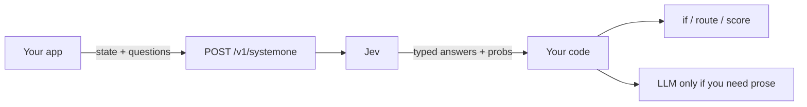
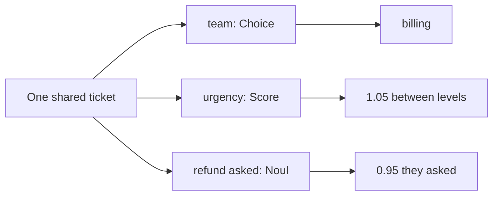
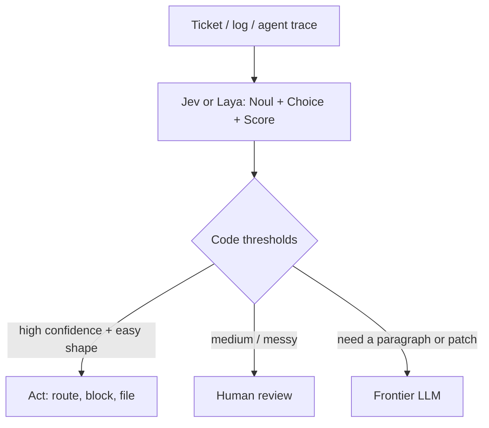

Chat models write letters.

**Jev** stamps labeled boxes.

It is **not** a chat LLM. You do not ask it for a poem. You do not ask it for a function. You send it a pile of facts and a list of questions. It sends back **typed guesses** your code can read — yes/no numbers, one winning label, a spot on a ladder.

A chat model writes a note: “Hmm, maybe this kid wants juice, or maybe a sandwich, let me explain…”

Jev stamps three boxes: **urgent?** **which desk?** **how bad?** Then your code moves the tray.

**TypeSafe AI** made it. The company calls Jev its first public **System One** model. Early access was announced on **15 September 2026**. Official models page (as of this draft): `jev-latest` points at **`jev-1.13.0`**. Pin the versioned id in production.



Keep the letter-writer for letters. Keep Jev for **smart if-statements**.


---

## Three toys. That is the whole API.

One door:

```http
POST https://api.typesafe.ai/v1/systemone
```

Every request has three pockets:

1. **`state`** — the facts. Text, JSON, or a list of text. Official docs: text only. No pictures, no audio, no video (yet).
2. **`model`** — who looks. Pin **`jev-1.13.0`** in production.
3. **`questions`** — a map of judgments. You name the keys. The answers come back under the same keys. Write the real question in `instructions`.

Jev looks at the state **once**. It answers every question in **one parallel pass**. You list the legal boxes first. Jev **cannot** emit a value outside that list. Wrong answers are still allowed. A box can be the *wrong* box. That is not a type error. That is a bad guess.

There is no fourth type. Official TypeSafe docs: **Noul**, **Choice**, **Score**.

| Type | Kid idea | Returns | Limits (official API) |
| --- | --- | --- | --- |
| **Noul** | Yes/no coin feel | Probability **0–1**. No separate confidence field. The number *is* the belief. | Yes/no only. `0.5` means “I cannot tell,” not “medium.” |
| **Choice** | Pick one labeled box | Winning option + **all** probabilities + **confidence** | Up to **255** options |
| **Score** | Place on an ordered ladder | Score (can sit **between** rungs) + probs + confidence | **2–10** levels |

TypeSafe has not said what **Noul** stands for. Treat it as a made-up name.


**Noul** asks “Is this true?” Near 1 = strong yes. Near 0 = strong no. Near 0.5 = the model has nothing to go on. If you wanted a *spectrum*, you wanted a **Score**.

**Choice** asks “Which of these labels?” You get the winner, the full pile of probabilities, and a confidence number. If your list might miss a case, add **`other`** or **`none`**. A Choice is **relative**. It is not the same as asking a Noul for each label.

**Score** asks “Where on *this* ladder?” You write 2 to 10 rungs, low end first. The returned `score` is a probability-weighted spot. You may **threshold** (`score > 1.5`). You may **not** treat 1.6 as “80% angry.”

### They do not swap

Ask “is the customer asking for a refund?” as a **Noul** and as a yes/no **Choice**. TypeSafe’s jev-1.13 jaggedness page: on one ticket the Noul said **0.22**. The Choice said **no** at **0.99**. Same question. Two toys. Opposite vibes.

Never copy a threshold from a Noul onto a Choice.

> “Choice is ‘who wins the race.’ Noul is ‘how true is this, by itself.’”

---

## One ticket. Three stamps.

Here is one made-up ticket. No real people. The numbers below are a **teaching story**, not a live Jev call. The **shape** follows TypeSafe’s published examples.

Shared state:

> “I was charged twice. Please refund the extra charge today.”

| Name | Toy | What you asked | Teaching answer | What it is **not** |
| --- | --- | --- | --- | --- |
| **team** | **Choice** | Which desk should handle this? | `billing` (plus a probability for each desk) | Not a written reply to the customer |
| **urgency** | **Score** | How soon? Levels: **0** routine, **1** today, **2** now | **1.05** — between “today” and “now” | **Not hours.** 1.05 is not “one hour and a bit.” |
| **refund_requested** | **Noul** | Did the customer *ask* for a refund? | **0.95** | **Not approved.** It is an estimated 95% chance of *yes, they asked.* |

```json
{
  "state": {
    "ticket": "I was charged twice. Please refund the extra charge today."
  },
  "model": "jev-1.13.0",
  "questions": {
    "team": {
      "type": "choice",
      "instructions": "Which desk should handle this?",
      "criteria": {
        "billing": "Money, refunds, charges",
        "technical": "Bugs, broken buttons, outages",
        "sales": "Pricing, upgrades, new accounts",
        "other": "None of those"
      }
    },
    "urgency": {
      "type": "score",
      "instructions": "How soon does this need a person?",
      "criteria": [
        "Routine. It can wait.",
        "Today.",
        "Now."
      ]
    },
    "refund_requested": {
      "type": "noul",
      "instructions": "Did the customer ask for a refund?"
    }
  }
}
```

Story answers, so you can see the shape:

```json
{
  "model": "jev-1.13.0",
  "answers": {
    "team": {
      "type": "choice",
      "choice": "billing",
      "probabilities": {
        "billing": 0.88,
        "technical": 0.04,
        "sales": 0.03,
        "other": 0.05
      },
      "confidence": 0.79
    },
    "urgency": {
      "type": "score",
      "score": 1.05,
      "legend": {
        "0": "Routine. It can wait.",
        "1": "Today.",
        "2": "Now."
      },
      "probabilities": { "0": 0.10, "1": 0.75, "2": 0.15 },
      "confidence": 0.61
    },
    "refund_requested": { "type": "noul", "noul": 0.95 }
  }
}
```

What your code does with that:

- `team` = `billing` → open that queue.
- `urgency` = 1.05 → above a “do this today” cut you chose, or not. **You** pick the cut.
- `refund_requested` near 0.95 → they almost surely *asked*. A person still owns “approve the money.”




### They do not peek

All three questions read the **same** ticket. None of them sees another’s answer. That is why you can send them together.

Official docs: ask every question that shares the same state in **one** request. Extra questions are cheap (output is free; they run in parallel). If a later decision needs an earlier result, make **another request**. A chain is a second call, not a secret look.

> “One ticket. Three named boxes. None peeks. Need a chain? Send again.”

The boxes travel with the request. A usual fine-tuned classifier learns its labels at training time. Jev reads the boxes **from the call**. TypeSafe does **not** offer customer fine-tuning. Official models page: same weights for every account.

---

## Wrap the LLM. Don't replace it.

Jev does not write the reply. It stamps the decision your `if` can read. The letter-writer stays in the stack — **after** the stamp, and **only** when you actually need a string.

**Cascade:**

1. **Jev** (or Laya) does the cheap snap: classify / route / score / “is this a jailbreak?”
2. **Your code** reads the numbers. Ifs. Thresholds. Queues.
3. A **frontier LLM** writes the hard text — the reply, the patch, the essay — only when you need a string.




TypeSafe’s published claims (theirs, not ours): ~**70–500 ms** end-to-end; **$0.042** per million **input** tokens; **output free**; launch post **40x–200x** faster on System One shaped queries. Homepage **193.6x** / **444.6x** are **their workflow evals**, likely the high end. Context: **64k** tokens per request; **32k** for `state` plus the longest question. Rate limits: **250,000** tokens/sec, **1,200** requests/min — they say these can move.


Skipping the letter-writing step can save work. That fact alone does **not** prove how much faster any one call will be.

TypeSafe’s training name is **RLCD** — **Reinforcement Learning for Calibrated Decisions**. The target: when it says about **90%** on many guesses, it should be right about **90%** of the time. One guess can still be wrong. Check calibration on **your** tickets, then pick the cut.

> “Jev picks the box. Code moves the tray. The LLM writes the note — if a note is even needed.”

---

## Two kitchens. Same stamps.

**Laya** is another **System One** decision model. **Convai Innovations** made it. Same idea as Jev. You send **state** plus typed questions. You get typed answers with probabilities. **No letter.**

Same three toys: **Noul**, **Choice**, **Score**.

The house is different.

- **Jev** is a restaurant. You `POST` to TypeSafe. They stamp the tray.
- **Laya** is a stamp kit. **Apache 2.0** weights on Hugging Face. `pip install laya`. You run it on **your** GPU or CPU.


**AnyJev** is a third kitchen: wrap an open LLM so it answers the same three toys, training-free by default. Not TypeSafe. Not Convai. Official pages only below.

| | Jev (TypeSafe) | Laya (Convai) |
| --- | --- | --- |
| Deployment | Hosted API | Open weights; you run it |
| Internals | Parallel sampling + RLCD described; network unpublished | ModernBERT/mmBERT + typed head documented |
| Same toys? | Noul / Choice / Score | Same three |
| Big inputs | Larger documented token budget | Smaller default budgets |
| Many labels | Up to 255 Choice options | Prefer fewer options at defaults |
| Adapt | Change prompts/state; pin version | Fine-tune checkpoint + calibration |
| Money | Input token price (output free) | Weights free; you pay GPU/ops |
| Best first try | Want a managed decision API | Need local / air-gap / own weights |

Convai publishes a “Laya vs Jev” scoreboard. They also say some Jev numbers were **not** measured on their machines. **That is Convai’s published comparison. It is not an independent shared bake-off.**

Pick the house for the job. Then test **your** tickets.

> “Same three stamps. Jev is the restaurant. Laya is the kit you keep at home.”

---

## When to use it

Start with the answer your product needs.

| Start with **code** when… | Try **Jev or Laya** when… | Use a **generative LLM** when… |
| --- | --- | --- |
| You can calculate it exactly (math, counts, dates your code already knows) | You can **list** the answers: a category, a yes/no, a rung on a ladder | You need a **reply**, an explanation, or a plan |
| The rule is an `if` you can write by hand | You want to pick, rate, or check something in text | You need deeper reasoning or an ambiguous comparison |
| You already found the candidate values | You pick from values your code already found | There is **no** fixed candidate list |
| The path is a known recipe | You route **known** cases and check conditions | You must plan, or handle an unfamiliar case |

**Use a System One model when** the job is a snap your code can act on: smart **if-statements**, **routing**, **scoring**, **map-reduce** over a pile of tickets, **real-time UX** where TypeSafe’s ~100 ms story matters, **judge / guardrail** on another model’s output.

**Do not use it when** you need a free-form string: essays, emails, code-as-prose, open chat, or pictures / audio / video as input (not supported).

| | Chat LLM | System One (Jev or Laya) |
| --- | --- | --- |
| Output | A **string**. Chat, code, a story, a refusal, a hallucination | A **typed** value you listed in advance |
| Sampling | **Sequential.** One token, then the next | **Parallel.** All questions in one pass |
| Best job | Essays, chat, code-as-prose, open answers | Classify, route, score, guardrail, map-reduce, ~100 ms UX |
| Kid picture | Turtle writing a letter | Flash filling three boxes |

| First try **Jev** when… | First try **Laya** when… |
| --- | --- |
| You want a managed API and a published token price | You need the weights on *your* machine (local / air-gap) |
| Inputs can be fat (TypeSafe’s 64k story) | You can live with a smaller default context |
| You may need a long Choice list | You can keep Choice lists shorter, or raise Laya’s budget yourself |

---

## Honest caveats

- **Early access.** Waitlists. Pin **`jev-1.13.0`** once thresholds matter. `jev-latest` can move.
- **Company evals are theirs.** The 193.6× / 444.6× headlines are workflow evals TypeSafe built. Likely **upper end**.
- **Wrong ≠ type error.** Schema safety does not make a high-stakes refund automatic.
- **Choice and Noul are not twins.** Do not swap them and keep the same cut.
- **Documented example outputs are not tests.** Run it. Believe *your* distribution.
- **English first.** Official models page: other languages work less evenly.
- **Convai’s Jev scoreboard is theirs.** Not a shared bake-off.
- **RLCD is a target, not a certificate.** Check examples. Then pick a cutoff.
- **Confidence is not a second test.** It says how bunched the Choice/Score probabilities are.
- **Questions do not peek.** A chain is a second request.
- **Architecture is unpublished.** Describe what Jev does. Do not claim it is BERT. Laya’s encoder is Convai’s. AnyJev wraps an LLM you already run.

---

Official references:

- [Introducing System One Models & Jev](https://typesafe.ai/blog/introducing-system-one-models-and-jev) (TypeSafe launch, 15 Sep 2026)
- [System One](https://docs.typesafe.ai/concepts/system-one)
- [Primitives](https://docs.typesafe.ai/primitives)
- [HTTP API](https://docs.typesafe.ai/api)
- [Models, price, limits](https://docs.typesafe.ai/models)
- [Noul / Choice / Score tutorials](https://learnjev.com/tutorials/three-primitives)
- [First call](https://learnjev.com/tutorials/first-call)

Laya / Convai (vendor pages; claims are theirs):

- [Hugging Face: convaiinnovations/laya](https://huggingface.co/convaiinnovations/laya)
- [PyPI: laya](https://pypi.org/project/laya/)
- [GitHub: NandhaKishorM/laya](https://github.com/NandhaKishorM/laya)

AnyJev (independent; not TypeSafe):

- [GitHub: MorrisZJ/AnyJev](https://github.com/MorrisZJ/AnyJev)
- [PyPI: anyjev](https://pypi.org/project/anyjev/)
