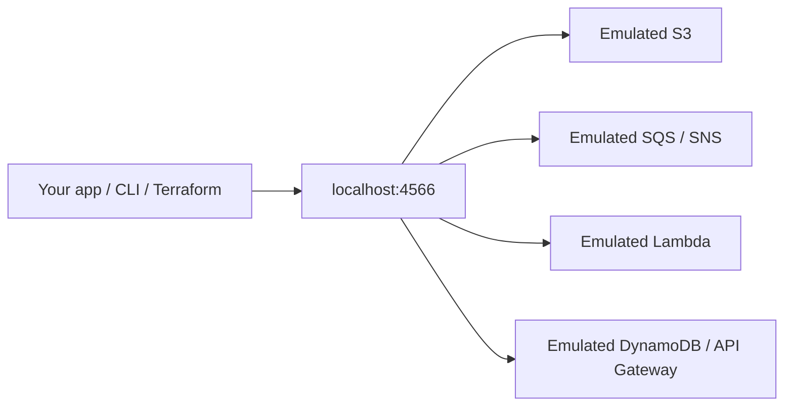

You do not need a real S3 bucket to find out your prefix logic is wrong.

Waiting on a shared AWS account is a slow loop. So is paying for a stack you only needed for twenty minutes. So is discovering, in CI, that nobody can create a queue without a ticket.

**LocalStack** is a Docker-based emulator for AWS APIs. One container. Default gateway **`http://localhost:4566`**. Your app, the AWS CLI, Terraform, and the SDKs talk to that endpoint instead of `amazonaws.com`.

It is not a second AWS region. It is a local stand-in with enough API surface to develop and test against — and honest holes where the real cloud still wins.



---

## The problem is the round trip

A typical “just try it on AWS” afternoon looks like this:

1. Wait for IAM.
2. Create a bucket, a queue, a table.
3. Burn a small bill on a forgotten Lambda.
4. Still cannot reproduce the failure that only happens with your fixture data.

Local development wants **seconds**, not a console session. CI wants **hermetic** AWS-shaped APIs without writing into the company account. IaC wants a **dry-run that actually creates resources**, not only `terraform plan` against a remote backend you share with five other people.

That is the job: faster loops, integration tests in CI, Terraform / CDK / CloudFormation experiments, and a sandbox you can wipe by killing a container.

---

## How you actually talk to it

Same idea on every client: **override the endpoint**.

| Client | Typical move |
| --- | --- |
| AWS CLI | `aws --endpoint-url http://localhost:4566 …` |
| `awslocal` | Same CLI, endpoint already set |
| `tflocal` | Terraform pointed at LocalStack |
| SDKs | `endpoint_url` / custom endpoint on the client |

Credentials can be dummy values (`test` / `test`, region `us-east-1`). LocalStack is not checking your real IAM user. As of 2026 it **is** checking that *it* may start — see the auth note below.

From another Compose service, `localhost` is the wrong host. Use the LocalStack service name (`http://localstack:4566`) or `localhost.localstack.cloud`, which resolves into the emulator when LocalStack is the DNS.

Port **4566** is the gateway. Extra ports `4510–4559` show up when a service binds its own listener (Lambda is the usual reason you also mount the Docker socket).

---

## Services worth starting with

Do not turn on the whole catalog on day one. These six cover most application code:

- **S3** — object storage, prefixes, presigned URLs (check the flavour you need).
- **DynamoDB** — tables, queries, streams if you are careful.
- **SQS** — queues, visibility timeout, the bugs you only see with a consumer.
- **SNS** — topics and subscriptions, often paired with SQS.
- **Lambda** — functions that the emulator starts as extra containers.
- **API Gateway** — REST on the Hobby/Base path; HTTP / WebSocket APIs are a higher plan.

Coverage is a **matrix**, not a boolean. LocalStack’s own licensing table lists which *services exist* on Hobby vs paid. It does **not** claim 100% API parity inside a service. Read the service page for the calls you actually use.

---

## A tiny loop: bucket, put, list

Pseudo-CLI. Auth token comes from your LocalStack account, not from AWS.

```bash
export LOCALSTACK_AUTH_TOKEN=ls-...   # from app.localstack.cloud
export AWS_ACCESS_KEY_ID=test
export AWS_SECRET_ACCESS_KEY=test
export AWS_DEFAULT_REGION=us-east-1

docker run --rm -d --name localstack \
  -p 127.0.0.1:4566:4566 \
  -e LOCALSTACK_AUTH_TOKEN \
  -v /var/run/docker.sock:/var/run/docker.sock \
  localstack/localstack

# wait until the gateway answers, then:
aws --endpoint-url http://localhost:4566 s3 mb s3://demo-inbox
aws --endpoint-url http://localhost:4566 s3 cp ./hello.txt s3://demo-inbox/hello.txt
aws --endpoint-url http://localhost:4566 s3 ls s3://demo-inbox
```

Same shape with `awslocal s3 mb s3://demo-inbox`. In application code, one client constructor is enough:

```python
import boto3

s3 = boto3.client("s3", endpoint_url="http://localhost:4566")
s3.create_bucket(Bucket="demo-inbox")
s3.put_object(Bucket="demo-inbox", Key="hello.txt", Body=b"ok")
print(s3.list_objects_v2(Bucket="demo-inbox")["Contents"])
```

If the container exits at startup, it is usually the token, not your bucket name.

---

## Auth in 2026: an account is part of “hello world”

This used to be “docker run and go.” It is not.

As of **LocalStack for AWS 2026.03.0** (calendar versioning, March 2026):

- Community and Pro images were **merged**. `localstack/localstack` and `localstack/localstack-pro` are the same image.
- An **auth token** is required to start. Set `LOCALSTACK_AUTH_TOKEN`, or let the `lstk` / `localstack` CLI log you in and store the token.
- Plan entitlements decide which services come up, not which image you pulled.
- There is a **Hobby** subscription for **non-commercial** use. Commercial work sits on Base / Ultimate / Enterprise. Students and approved OSS projects have their own paths.
- CI should use a **CI auth token**, not the developer token from your laptop. Store it in the CI secret store.

There was a short bypass (`LOCALSTACK_ACKNOWLEDGE_ACCOUNT_REQUIREMENT=1`) until **6 April 2026**. Do not write new docs that depend on it.

Confirm the current matrix on [LocalStack’s licensing page](https://docs.localstack.cloud/aws/licensing/) and the [auth token guide](https://docs.localstack.cloud/aws/getting-started/auth-token/). Plans move; this post is a snapshot, not a contract.

---

## What LocalStack is good at

- **App-level AWS usage.** Your code creates a bucket, publishes to SNS, writes a Dynamo item. The emulator speaks those APIs.
- **CI integration tests.** Spin the container, apply a slim stack, run pytest, tear down. No shared account pollution.
- **IaC dry-runs that mutate.** `terraform apply` against LocalStack finds the variable you named wrong. `tflocal` is the usual wrapper.
- **Onboarding.** A new hire can exercise the event path without waiting for IAM.

## What it is not

- **Not 100% AWS.** Edge cases, newer APIs, and account-level behaviour drift. If a test only passes on LocalStack, it is not done.
- **Not every service on every plan.** Hobby includes S3, SQS, SNS, DynamoDB, Lambda, CloudFormation, REST API Gateway. It does **not** include, for example, ECS/ECR (Base+), EKS, or several analytics services. Check the table.
- **Not prod-like networking.** VPC, PrivateLink, real IAM evaluation, and cross-account tricks are where teams get surprised. IAM policy enforcement is a paid enhancement, not the default Hobby story.
- **Not a substitute for a staging account** when you are testing managed-service quirks: S3 consistency folklore, Lambda cold-start shapes, API Gateway authorizer details, EventBridge replay, RDS behaviour (RDS is not on Hobby).

Use **real AWS** when the bug is in the managed service, the network path, or an account boundary. Use LocalStack when the bug is in *your* code’s use of the API.

---

## A working order that does not lie to you

1. Create a LocalStack account. Put the token in the environment, never in Git.
2. Start one container. Hit `http://localhost:4566/_localstack/info` and confirm the license activated.
3. Exercise **one** service your app already uses. S3 or SQS is enough.
4. Point the SDK at `4566` behind a config flag (`AWS_ENDPOINT_URL` is the usual name).
5. Add the same container to CI with a **CI** token.
6. Keep a thin **real-AWS** smoke test for the two calls that have bitten you before.

---

Official references:

- [Installation](https://docs.localstack.cloud/aws/getting-started/installation/)
- [Auth token](https://docs.localstack.cloud/aws/getting-started/auth-token/)
- [Plans and service coverage](https://docs.localstack.cloud/aws/licensing/)
- [Accessing the endpoint URL](https://docs.localstack.cloud/aws/customization/networking/accessing-endpoint-url/)
- [2026.03.0 release notes](https://blog.localstack.cloud/localstack-for-aws-release-2026-03-0/)

---

## Takeaway

LocalStack is AWS-shaped plumbing on your laptop. One endpoint, dummy IAM, a real token to start the box.

**Develop against 4566. Pay AWS when the behaviour you need is the cloud’s, not the emulator’s.**
