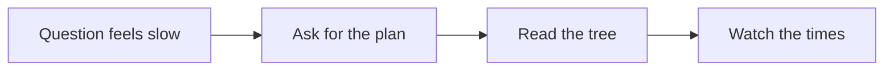
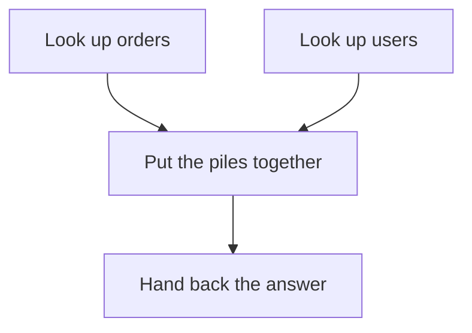

Your question to the database feels **slow**.

Maybe it is looking for one kid’s lunch order. Maybe it is counting every order in the school.

Do **not** guess.

Do not add a sticky note on every shelf “just in case.”

**Ask Postgres for its plan.**



That is the whole trick. The rest of this post is a homework plan, a library, a table of contents, and some sticky notes.

---

## Show me your plan

Postgres is like a kid with a big homework packet.

You can say:

> “Show me your plan **before** you start.”

That is **EXPLAIN**.

Postgres writes the steps. It does **not** do the homework yet.

You can also say:

> “Do the homework. Then write how long each step took.”

That is **EXPLAIN ANALYZE**.

Now Postgres **really runs** the question. Then it writes the real times.


Say it out loud:

> “EXPLAIN is the plan. EXPLAIN ANALYZE is the plan **plus** the stopwatch.”

**Careful.** ANALYZE does the work.

If the question only **reads**, it still has to walk the library. That can be slow. It can also lock some shelves for a bit.

If the question **changes** things — “throw away these orders” — ANALYZE will **really throw them away**.

For this post, we only **look**. We do not throw things away.

```sql
EXPLAIN
SELECT *
FROM orders
WHERE user_id = 42;
```

```sql
EXPLAIN ANALYZE
SELECT *
FROM orders
WHERE user_id = 42;
```

The first one is the treasure map.  
The second one is walking the map **and** writing the times.

---

## The plan is a tree

The plan is not one long sentence.

It is a **tree**.

Big step on top. Little steps tucked under it.

The little steps fetch the books. The big step puts the books together.

**Start from the inside.** Start from the **bottom**.

That is where Postgres first touches the shelves.




Read it like this:

1. What did it do on `orders`?
2. What did it do on `users`?
3. How did it join those piles?
4. Then look at the top.

Each box is a **node**. A node is one job.

Look at the **name** of the job first. Then look at the numbers.

---

## How it looks things up

A table is a library shelf. Each page is a chunk of the book.

### Read every page

**Seq Scan** means: walk the **whole** shelf.

Every page. Every order. Then keep the ones that match.

That is fine for a tiny class list.

That is a long walk for a huge library when you only want **one** kid.

### Use the table of contents

An **index** is the table of contents.

“`user_id` 42 lives on these pages.”

**Index Scan** means: check the table of contents. Then walk to those pages.

**Index Only Scan** is even shorter. The answer is already on the card. You do not walk to the shelf.


### Sticky notes, then one trip

Sometimes many kids match. The table of contents lists lots of page numbers.

**Bitmap Heap Scan** means: write the page numbers on sticky notes. Sort the notes. Then visit each page **once**.

You do not run back to the same aisle ten times.

Sticky notes first. Then one trip.

| Kid thing | What Postgres did |
| --- | --- |
| Walk every shelf | **Seq Scan** |
| Table of contents, then the page | **Index Scan** |
| Answer already on the card | **Index Only Scan** |
| Collect page numbers, then fetch | **Bitmap Heap Scan** |

---

## Numbers on the page

A plan line looks busy. You only need a few numbers.

Here is a tiny made-up line:

```text
Index Scan using orders_user_id_idx on orders
  (cost=0.29..8.31 rows=3 width=84)
  (actual time=0.018..0.021 rows=3 loops=1)
  Index Cond: (user_id = 42)
```

### Guessed rows vs real rows

`rows=3` on the first line is the **guess**.

Postgres guessed: “about 3 orders.”

After ANALYZE, `rows=3` on the **actual** line is the **truth**.

If the guess said 3 and the truth was 30,000, raise a flag.

The treasure map was wrong. The walk may be the wrong walk.

### Cost

**Cost** is “how hard it looks on paper.”

It is not seconds. It is Postgres comparing two homework plans.

The first number is **startup** cost. Work before the first answer row.

The second number is **total** cost. Work to finish the whole job.

A cheap-looking plan can still be the wrong one if the row guess is bad.

### Actual time

**Actual time** is the stopwatch. It is milliseconds.

The first number is startup. Time to the **first** row.

The second number is total. Time to the **last** row.

If you only needed the first ten answers, startup matters a lot.

### Loops

**Loops** means: “I did this step again and again.”

Like the same homework page, once for every friend in the group.

The time on the line is **per loop**.

So 2 ms × 10,000 loops is a long day.

Say it out loud:

> “Guessed rows. Real rows. Paper cost. Real time. How many times.”

---

## Sticky notes that help

An index is a useful sticky note.

You can tell it was used when the node says **Index Scan**, **Index Only Scan**, or **Bitmap Index Scan**.

You can often see the name: `orders_user_id_idx`.

This is the missing-index flag:

- big table
- you wanted **one** kid, or a few kids
- the plan says **Seq Scan**
- then a **Filter** throws almost everyone away

That is “read the whole library, then keep one book.”

Do **not** put a sticky note on every word in every book.

Every new order must update those notes. Writes get slower. Unused notes waste space.

Add an index when a real plan shows a long walk you can skip. Then ask for the plan **again**.

```sql
CREATE INDEX orders_user_id_idx ON orders (user_id);

EXPLAIN
SELECT id, created_at
FROM orders
WHERE user_id = 42;
```

---

## Where the clock is

Do not only look at the last line.

Find the node with the big **actual time**.

That is the slow aisle.

**Startup** is “time until the first paper lands on your desk.”

**Total** is “time until the whole packet is done.”

A sort can sit there a long time before the first row comes out. The pile has to be lined up first.

A scan can drip rows out early. Startup is small. Total still grows if the shelf is long.

Ask:

> “Which box ate the clock? Was it waiting to start, or working the whole time?”

---

## Raise a flag


Check this list. One flag is a clue. Two flags is a loud clue.

- **Seq Scan on a large table** when you expected a lookup. “Find user 42” should not read every page.
- **Huge gap** between guessed rows and real rows. The map was wrong, so the walk may be wrong.
- **Many loops** on a node that is already slow. Same hard step, thousands of times.
- **Sort or Hash ran out of memory desk space.** The pile did not fit on the desk. Postgres stacked boxes on the floor. That extra shuffle is slow.
- **Filter** that throws away almost every row **after** a wide scan. It already walked the whole shelf. Then it said “nope” to nearly everyone.

A Seq Scan is **not** always bad. A tiny table? Read the whole thing. That can be the smart plan.

The flag is when the shelf is huge and you only wanted a few books.

---

## A tiny safe example

Pretend two tables. `users`. `orders`.

We only **look**. We do not change any rows.

```sql
EXPLAIN
SELECT u.name, o.id
FROM users AS u
JOIN orders AS o ON o.user_id = u.id
WHERE u.id = 42;
```

Same question, now with the stopwatch:

```sql
EXPLAIN ANALYZE
SELECT u.name, o.id
FROM users AS u
JOIN orders AS o ON o.user_id = u.id
WHERE u.id = 42;
```

Read the tree from the inside.

Did `users` use the table of contents for `id = 42`?

Did `orders` use an index on `user_id`?

Or did one side read every page?

Then look at guessed rows vs real rows. Then look at the times.

---

## Grown-up names (tiny box)

You do not need this to get the story. It is here so the robot talks make sense later.

| Kid word | Grown-up name |
| --- | --- |
| Homework plan, no work yet | **EXPLAIN** |
| Do the work and time it | **EXPLAIN ANALYZE** |
| One job in the tree | **plan node** |
| Walk every page | **Seq Scan** |
| Table of contents, then the heap | **Index Scan** |
| Answer already in the index | **Index Only Scan** |
| Collect page numbers, then fetch | **Bitmap Index Scan** + **Bitmap Heap Scan** |
| Paper difficulty | **cost** (startup `..` total) |
| Guessed pile size | **rows** (estimate) |
| Stopwatch | **actual time** (ms, per loop) |
| Repeat the same step | **loops** |
| Desk overflow on a sort or hash | **external merge** / hash **batches** (work_mem) |

---

## Say this back

**Don't guess why it is slow. Ask for the plan. Read the tree from the inside. Check the table of contents. Watch the times.**
