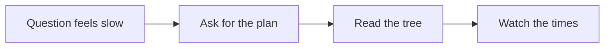
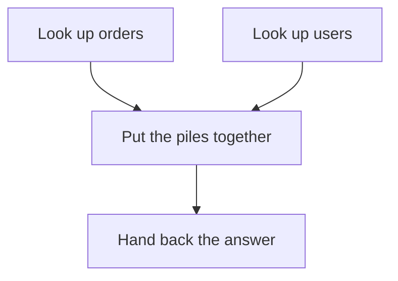
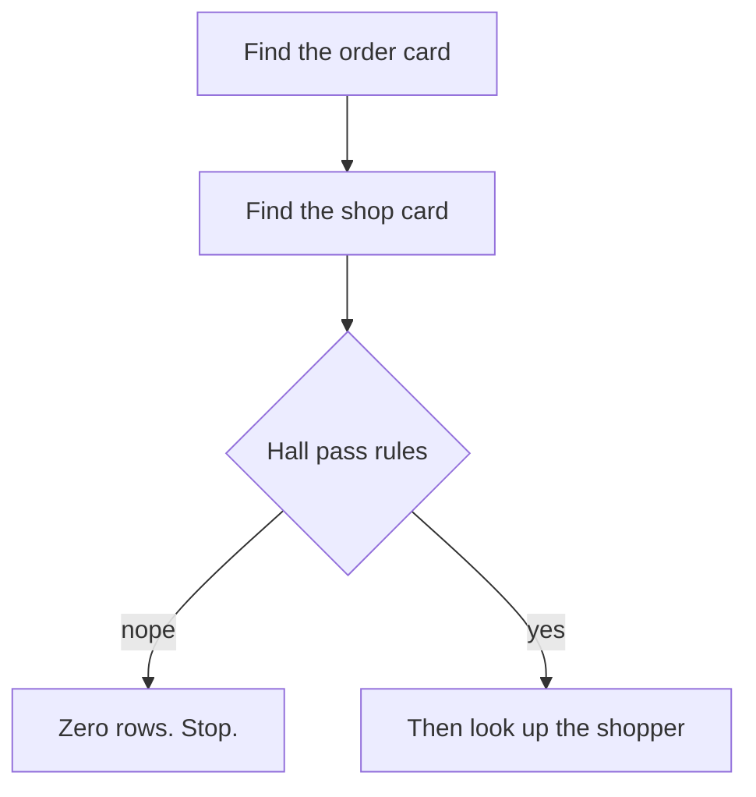

Your question to the database feels **slow**.

Maybe it is looking for one kid’s lunch order. Maybe it is counting every order in the school.

Do **not** guess.

Do not add a sticky note on every shelf “just in case.”

**Ask Postgres for its plan.**



That is the whole trick. The rest of this post is a homework plan, two piles that glue together, a library, a table of contents, and some sticky notes.

---

## Show me your plan

Postgres is like a kid with a big homework packet.

You can say:

> “Show me your plan **before** you start.”

That is **EXPLAIN**.

Postgres writes the steps. It does **not** do the homework yet.

You can also say:

> “Do the homework. Then write how long each step took.”

That is **EXPLAIN ANALYZE**.

Now Postgres **really runs** the question. Then it writes the real times.


Say it out loud:

> “EXPLAIN is the plan. EXPLAIN ANALYZE is the plan **plus** the stopwatch.”

There is a third ask.

> “Do the homework. Write the times. And tell me which library pages were **already on the desk**, and which ones you fetched from the **back room**.”

That is **EXPLAIN (ANALYZE, BUFFERS)**.

You get the plan, the stopwatch, **and** the page-fetch story.

**Careful.** ANALYZE does the work.

If the question only **reads**, it still has to walk the library. That can be slow. It can also lock some shelves for a bit.

If the question **changes** things — “throw away these orders” — ANALYZE will **really throw them away**.

For this post, we only **look**. We do not throw things away.

```sql
EXPLAIN
SELECT *
FROM orders
WHERE user_id = 42;
```

```sql
EXPLAIN ANALYZE
SELECT *
FROM orders
WHERE user_id = 42;
```

```sql
EXPLAIN (ANALYZE, BUFFERS)
SELECT *
FROM orders
WHERE user_id = 42;
```

The first one is the treasure map.  
The second one is walking the map **and** writing the times.  
The third one also counts pages already on the desk versus pages fetched from the back room.

---

## How two piles meet

Sometimes the question needs **two** shelves.

`shops` on the left. `orders` on the right. They match on `shop_id`.

A **JOIN** is the glue.

When you JOIN, the plan tree grows a **join node**. Often **Nested Loop**, **Hash Join**, or **Merge Join**. That node combines the two child scans.


```
INNER       only the overlap
LEFT        all shops + matches
LEFT-ONLY   shops with no order
RIGHT       all orders + matches
RIGHT-ONLY  orders with no shop
FULL        everyone
FULL-ONLY   lonely piles only
```

Say it out loud:

> “Pink is who stays in the answer.”

### Inner — only matching keys

```sql
SELECT s.name, o.id
FROM shops AS s
INNER JOIN orders AS o ON o.shop_id = s.id;
```

Keep a pair only when both piles share a key. Lonely shops and lonely orders stay home.

### Left — every shop

```sql
SELECT s.name, o.id
FROM shops AS s
LEFT JOIN orders AS o ON o.shop_id = s.id;
```

Keep every shop. A matching order glues on. No order? The shop still sits there with an empty seat.

### Left-only — shops with no order

```sql
SELECT s.name
FROM shops AS s
LEFT JOIN orders AS o ON o.shop_id = s.id
WHERE o.id IS NULL;
```

Keep shops whose order seat is empty. The empty seat **is** the point.

### Right — every order

```sql
SELECT s.name, o.id
FROM shops AS s
RIGHT JOIN orders AS o ON o.shop_id = s.id;
```

Keep every order. A matching shop glues on. No shop? The order still sits there with an empty shop seat.

### Right-only — orders with no shop

```sql
SELECT o.id
FROM shops AS s
RIGHT JOIN orders AS o ON o.shop_id = s.id
WHERE s.id IS NULL;
```

Keep orders whose shop seat is empty. Lost tickets. No shop card.

### Full — everyone

```sql
SELECT s.name, o.id
FROM shops AS s
FULL OUTER JOIN orders AS o ON o.shop_id = s.id;
```

Keep every shop and every order. Matches glue. Lonely ones still sit with empty seats.

### Full-only — lonely piles

```sql
SELECT s.name, o.id
FROM shops AS s
FULL OUTER JOIN orders AS o ON o.shop_id = s.id
WHERE s.id IS NULL OR o.id IS NULL;
```

Throw the glued pairs away. Keep only the lonely shops and the lonely orders.

The join **shape** is your question. The join **node** is how Postgres does the glue. Look at that node in the tree next.

---

## The plan is a tree

The plan is not one long sentence.

It is a **tree**.

Big step on top. Little steps tucked under it.

The little steps fetch the books. The big step puts the books together.

**Start from the inside.** Start from the **bottom**.

That is where Postgres first touches the shelves.




Read it like this:

1. What did it do on `orders`?
2. What did it do on `users`?
3. How did it join those piles? That middle box is the **join node**.
4. Then look at the top. A **Limit** can sit there: “stop when you have one yes.”

Each box is a **node**. A node is one job.

Look at the **name** of the job first. Then look at the numbers.

---

## How it looks things up

A table is a library shelf. Each page is a chunk of the book.

### Read every page

**Seq Scan** means: walk the **whole** shelf.

Every page. Every order. Then keep the ones that match.

That is fine for a tiny class list.

That is a long walk for a huge library when you only want **one** kid.

### Use the table of contents

An **index** is the table of contents.

“`user_id` 42 lives on these pages.”

**Index Scan** means: check the table of contents. Then walk to those pages.

**Index Only Scan** is even shorter. The answer is already on the card. You do not walk to the shelf.


### Sticky notes, then one trip

Sometimes many kids match. The table of contents lists lots of page numbers.

**Bitmap Heap Scan** means: write the page numbers on sticky notes. Sort the notes. Then visit each page **once**.

You do not run back to the same aisle ten times.

Sticky notes first. Then one trip.

| Kid thing | What Postgres did |
| --- | --- |
| Walk every shelf | **Seq Scan** |
| Table of contents, then the page | **Index Scan** |
| Answer already on the card | **Index Only Scan** |
| Collect page numbers, then fetch | **Bitmap Heap Scan** |

---

## Numbers on the page

A plan line looks busy. You only need a few numbers.

Here is a tiny made-up line:

```text
Index Scan using orders_user_id_idx on orders
  (cost=0.29..8.31 rows=3 width=84)
  (actual time=0.018..0.021 rows=3 loops=1)
  Index Cond: (user_id = 42)
```

### Guessed rows vs real rows

`rows=3` on the first line is the **guess**.

Postgres guessed: “about 3 orders.”

After ANALYZE, `rows=3` on the **actual** line is the **truth**.

If the guess said 3 and the truth was 30,000, raise a flag.

The treasure map was wrong. The walk may be the wrong walk.

### Cost

**Cost** is “how hard it looks on paper.”

It is not seconds. It is Postgres comparing two homework plans.

The first number is **startup** cost. Work before the first answer row.

The second number is **total** cost. Work to finish the whole job.

A cheap-looking plan can still be the wrong one if the row guess is bad.

### Actual time

**Actual time** is the stopwatch. It is milliseconds.

The first number is startup. Time to the **first** row.

The second number is total. Time to the **last** row.

If you only needed the first ten answers, startup matters a lot.

### Loops

**Loops** means: “I did this step again and again.”

Like the same homework page, once for every friend in the group.

The time on the line is **per loop**.

So 2 ms × 10,000 loops is a long day.

Say it out loud:

> “Guessed rows. Real rows. Paper cost. Real time. How many times.”

---

## Sticky notes that help

An index is a useful sticky note.

You can tell it was used when the node says **Index Scan**, **Index Only Scan**, or **Bitmap Index Scan**.

You can often see the name: `orders_user_id_idx`.

This is the missing-index flag:

- big table
- you wanted **one** kid, or a few kids
- the plan says **Seq Scan**
- then a **Filter** throws almost everyone away

That is “read the whole library, then keep one book.”

Do **not** put a sticky note on every word in every book.

Every new order must update those notes. Writes get slower. Unused notes waste space.

Add an index when a real plan shows a long walk you can skip. Then ask for the plan **again**.

```sql
CREATE INDEX orders_user_id_idx ON orders (user_id);

EXPLAIN
SELECT id, created_at
FROM orders
WHERE user_id = 42;
```

---

## Where the clock is

Do not only look at the last line.

Find the node with the big **actual time**.

That is the slow aisle.

**Startup** is “time until the first paper lands on your desk.”

**Total** is “time until the whole packet is done.”

A sort can sit there a long time before the first row comes out. The pile has to be lined up first.

A scan can drip rows out early. Startup is small. Total still grows if the shelf is long.

Ask:

> “Which box ate the clock? Was it waiting to start, or working the whole time?”

---

## Raise a flag


Check this list. One flag is a clue. Two flags is a loud clue.

- **Seq Scan on a large table** when you expected a lookup. “Find user 42” should not read every page.
- **Huge gap** between guessed rows and real rows. The map was wrong, so the walk may be wrong.
- **Many loops** on a node that is already slow. Same hard step, thousands of times.
- **Sort or Hash ran out of memory desk space.** The pile did not fit on the desk. Postgres stacked boxes on the floor. That extra shuffle is slow.
- **Filter** that throws away almost every row **after** a wide scan. It already walked the whole shelf. Then it said “nope” to nearly everyone.
- **Many Rows Removed by Filter** after an **Index Scan** already found candidates. The table of contents did its job. Then a later rule threw the books away. The walk already happened. Try to push that rule into **Index Cond** — a better index, or a simpler question.

A Seq Scan is **not** always bad. A tiny table? Read the whole thing. That can be the smart plan.

The flag is when the shelf is huge and you only wanted a few books.

---

## A tiny safe example

Pretend two tables. `users`. `orders`.

We only **look**. We do not change any rows.

```sql
EXPLAIN
SELECT u.name, o.id
FROM users AS u
JOIN orders AS o ON o.user_id = u.id
WHERE u.id = 42;
```

Same question, now with the stopwatch:

```sql
EXPLAIN ANALYZE
SELECT u.name, o.id
FROM users AS u
JOIN orders AS o ON o.user_id = u.id
WHERE u.id = 42;
```

Read the tree from the inside.

Did `users` use the table of contents for `id = 42`?

Did `orders` use an index on `user_id`?

Or did one side read every page?

Then look at guessed rows vs real rows. Then look at the times.

---

## A permission check that looks simple

The tiny example asked for names.

This one only asks: **may this kid see this one order?**

Yes or no. One row. Or no row.

It looks like a small hall pass. The plan can still be a tall tree.

Pretend a **toy shop**. Orders. Shops. Shoppers. Clubs. Shop helpers.

Fake IDs. We only **look**.

```sql
EXPLAIN (ANALYZE, BUFFERS)
SELECT 1
FROM orders AS o
JOIN shops AS s
  ON s.id = o.shop_id
JOIN shoppers AS c
  ON c.id = o.shopper_id
WHERE o.id = 1001
  AND s.region_id = 42
  AND (
    COALESCE((s.settings ->> 'open_late')::boolean, false)
    OR EXISTS (
      SELECT 1
      FROM club_members AS cm
      JOIN clubs AS cl
        ON cl.id = cm.club_id
      WHERE cm.shopper_id = o.shopper_id
        AND cl.shop_id = s.id
    )
    OR EXISTS (
      SELECT 1
      FROM shop_admins AS sa
      WHERE sa.shop_id = s.id
        AND sa.shopper_id = 7
    )
  )
LIMIT 1;
```

That question has three hall-pass rules. **Any one** yes is enough.

1. The shop card says `open_late`.
2. Or this shopper is in a club for that shop.
3. Or shopper `7` is a helper at that shop.

`LIMIT 1` and `SELECT 1` mean: “I only need a yes.”

Postgres wrote a tree like this. I shortened it. The names are toy names.

```text
Limit  (cost=0.86..9.20 rows=1 width=4) (actual time=0.412..0.413 rows=0 loops=1)
  Buffers: shared hit=18 read=4
  I/O Timings: shared read=0.186
  ->  Nested Loop  (cost=0.86..9.20 rows=1 width=4) (actual time=0.411..0.411 rows=0 loops=1)
        ->  Nested Loop  (cost=0.58..8.90 rows=1 width=8) (actual time=0.410..0.410 rows=0 loops=1)
              ->  Index Scan using orders_pkey on orders o
                    (cost=0.29..8.31 rows=1 width=12)
                    (actual time=0.016..0.017 rows=1 loops=1)
                    Index Cond: (id = 1001)
                    Buffers: shared hit=3
              ->  Index Scan using shops_id_region_deleted_at on shops s
                    (cost=0.29..0.58 rows=1 width=8)
                    (actual time=0.390..0.390 rows=0 loops=1)
                    Index Cond: ((id = o.shop_id) AND (region_id = 42))
                    Filter: (COALESCE(((settings ->> 'open_late'::text))::boolean, false)
                             OR (hashed SubPlan 1)
                             OR (hashed SubPlan 3))
                    Rows Removed by Filter: 1
                    Buffers: shared hit=15 read=4
                    I/O Timings: shared read=0.186
                    SubPlan 1
                      ->  Hash Join  (cost=8.60..16.90 rows=1 width=0)
                            (actual time=0.210..0.212 rows=0 loops=1)
                            Hash Cond: (cm.club_id = cl.id)
                            ->  Index Scan using club_members_shopper_id_idx
                                  on club_members cm
                                  Index Cond: (shopper_id = o.shopper_id)
                            ->  Hash
                                  ->  Index Only Scan using clubs_pkey on clubs cl
                                        Index Cond: (id = cm.club_id)
                                        Heap Fetches: 0
                    SubPlan 3
                      ->  Index Only Scan using shop_admins_shop_id_shopper_id_key
                            on shop_admins sa
                            (actual time=0.018..0.018 rows=0 loops=1)
                            Index Cond: ((shop_id = s.id) AND (shopper_id = 7))
                            Heap Fetches: 0
        ->  Index Scan using shoppers_pkey on shoppers c
              (cost=0.28..0.30 rows=1 width=4)
              (never executed)
Planning Time: 1.842 ms
Execution Time: 0.468 ms
```



Read it from the **inside**.

### The table of contents vs the later rule

**Index Cond** is the jump in the table of contents.

On `orders`, it jumped to id `1001`. That is the primary key. One card.

On `shops`, it jumped with **two** clues: shop id **and** region `42`.

Look at the index name: `shops_id_region_deleted_at`.

That is one sticky note with more than one word. A **composite** index. It helped the join **and** the region rule.

**Filter** is the later rule. It runs **after** the table of contents already found a candidate.

Here the Filter is the hall pass: `open_late` **or** club **or** helper.

`Rows Removed by Filter: 1` means: the index **did** find a shop. Then the hall pass said **no**.

The walk to that shop already happened. Then the book went back on the shelf.

If you see **lots** of rows removed this way, the expensive work happened **before** the Filter. Try to push that rule into **Index Cond** — a better index, or a simpler question.

### Side quests under the Filter

Those `EXISTS` checks show up as **SubPlan 1** and **SubPlan 3**.

A SubPlan is a side quest. “Quick. Check the club shelf. Check the helper shelf.”

Because the rules are joined with **OR**, Postgres may run those side quests for **each** shop card that reaches the Filter.

SubPlan 1 is a **Hash Join**. It takes an **Index Scan** on `club_members` and an **Index Only Scan** on `clubs`. Two little piles. Then it matches club ids.

SubPlan 3 is shorter. One **Index Only Scan** on `shop_admins`. The helper list used a two-word table of contents: shop id plus shopper `7`.

**Index Only Scan** means the answer was already on the card.

`Heap Fetches: 0` means: it did **not** walk to the book. Zero trips to the shelf. That is the good kind of lazy.

### For each outer row, knock on the inner door

See the two **Nested Loop** boxes stacked up?

That is the **join node** from the two-piles section. A Nested Loop means: **for each** row from the outer step, probe the inner step.

1. Outer: find order `1001`. One row.
2. Inner: use that order’s shop id. Probe `shops`.
3. That Nested Loop feeds another Nested Loop. The next probe would be `shoppers`.

One kid. Then that kid’s shop. Then that shop’s shopper.

It is not “dump both shelves on the floor and mix.” It is knock, knock, knock.

### A door it never knocked on

The last line says **Index Scan** on `shoppers`… `(never executed)`.

Do **not** panic.

The shop step already returned **zero** rows. The hall pass failed. So Postgres skipped the shopper door.

That is a short-circuit. Like the teacher saying “no” on page one, so you do not open page two.

A node that never ran is often a clue that an earlier step already finished the story.

### Pages on the desk vs the back room

`Buffers: shared hit=18 read=4` is the page-fetch story.

- **shared hit** = that library page was **already on the desk** (in memory).
- **shared read** = Postgres had to walk to the **back room** (disk).

`I/O Timings: shared read=0.186` is how long the back-room trip took.

Hits are cheap. Reads can be slow. A tiny question can still wait on the back room.

### Zero books, but you still learned

The plan guessed `rows=1`. “Maybe a yes.”

The truth was `actual rows=0`. The hall pass failed.

You can still see **where** the row died: **Rows Removed by Filter: 1** on `shops`.

The top box is a **Limit**. “Stop when you have one yes.” Cheap when the indexes hit. You still watch the Filter and the SubPlans.

Now look at the last two lines.

**Planning Time: 1.842 ms.**  
**Execution Time: 0.468 ms.**

Thinking up the homework plan took **longer** than doing it.

That can happen on a tiny question. The walk was short. Writing the treasure map was the slow part. Do not only stare at Execution Time.

Say it out loud:

> “The table of contents found the shop. A later rule said no. Then Postgres stopped knocking on other doors.”

---

## Grown-up names (tiny box)

You do not need this to get the story. It is here so the robot talks make sense later.

| Kid word | Grown-up name |
| --- | --- |
| Homework plan, no work yet | **EXPLAIN** |
| Do the work and time it | **EXPLAIN ANALYZE** |
| Plan, stopwatch, and page-fetch story | **EXPLAIN (ANALYZE, BUFFERS)** |
| One job in the tree | **plan node** |
| Walk every page | **Seq Scan** |
| Table of contents, then the heap | **Index Scan** |
| Answer already in the index | **Index Only Scan** |
| Collect page numbers, then fetch | **Bitmap Index Scan** + **Bitmap Heap Scan** |
| Jump in the table of contents | **Index Cond** |
| Later rule, after a candidate is found | **Filter** |
| Books the later rule threw away | **Rows Removed by Filter** |
| Side quest (often an `EXISTS`) | **SubPlan** |
| Page already on the desk / fetched from the back room | **Buffers** (`shared hit` / `shared read`) |
| This door was skipped | **never executed** |
| Glue two shelves | **JOIN** (inner / left / right / full) |
| Empty-seat trick | **anti** (`WHERE` the other key `IS NULL`) |
| Join node: knock per outer row | **Nested Loop** |
| Join node: make a lookup pile | **Hash Join** |
| Join node: walk two sorted piles | **Merge Join** |
| Paper difficulty | **cost** (startup `..` total) |
| Guessed pile size | **rows** (estimate) |
| Stopwatch | **actual time** (ms, per loop) |
| Repeat the same step | **loops** |
| Desk overflow on a sort or hash | **external merge** / hash **batches** (work_mem) |

---

## Say this back

**Don't guess why it is slow. Ask for the plan. Read the tree from the inside. If two piles glue together, look at the join node. Check the table of contents. Watch the times. If a Filter throws a row away, look at Index Cond versus the later rule.**
