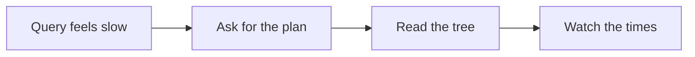
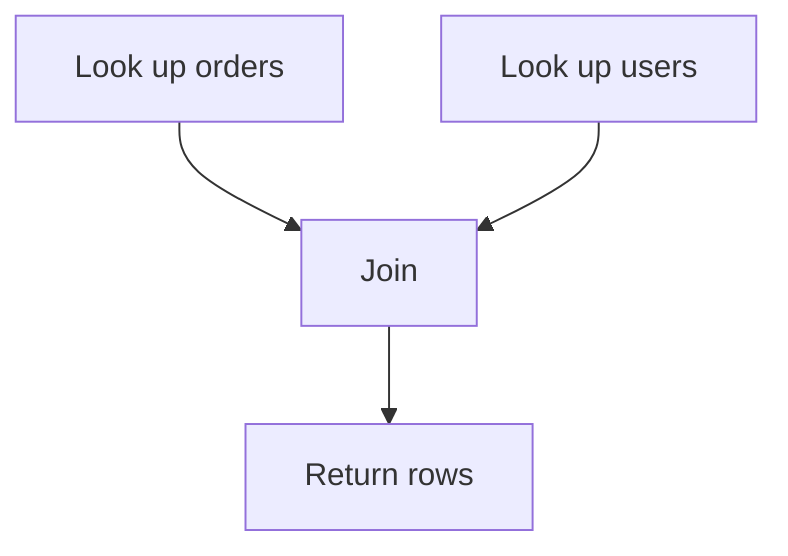
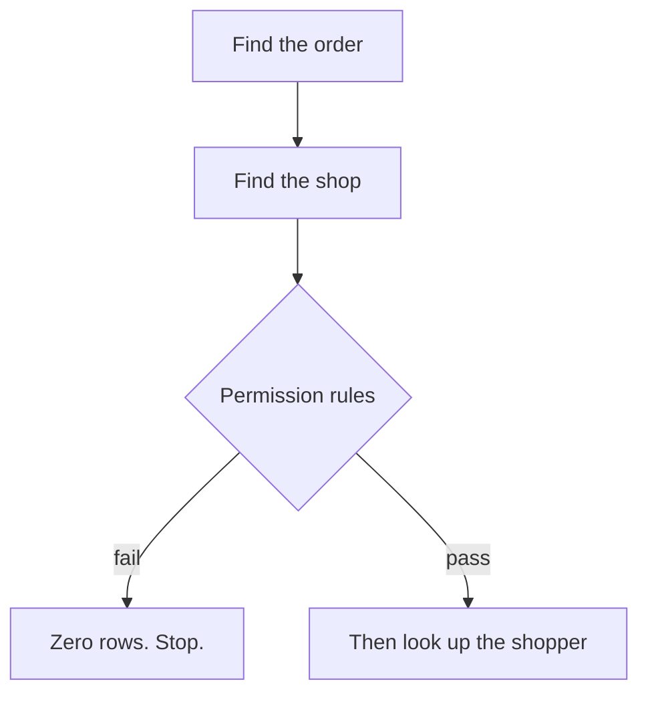

Your query feels **slow**.

Maybe it is looking up one order. Maybe it is scanning a large table.

Do **not** guess.

Do not add an index on every column “just in case.”

**Ask Postgres for its plan.**


```mermaid
flowchart LR
  A[Query feels slow] --> B[Ask for the plan]
  B --> C[Read the tree]
  C --> D[Watch the times]
```

That is the whole idea. The rest of this post is EXPLAIN vs ANALYZE, how JOINs work, how to read a plan tree, scan types, and a few numbers that actually matter.

---

## Show me your plan

You can say:

> Show me your plan **before** you start.

That is **EXPLAIN**.

Postgres writes the steps. It does **not** run the query yet.

You can also say:

> Run the query. Then write how long each step took.

That is **EXPLAIN ANALYZE**.

Now Postgres **really runs** the query. Then it writes the real times.


EXPLAIN is the plan. EXPLAIN ANALYZE is the plan **plus** the stopwatch.

There is a third ask.

> Run the query. Write the times. And tell me which pages were **already in memory**, and which ones you fetched from **disk**.

That is **EXPLAIN (ANALYZE, BUFFERS)**.

You get the plan, the stopwatch, **and** the page-fetch story.

**Careful.** ANALYZE does the work.

If the query only **reads**, it still has to walk the table. That can be slow. It can also take locks for a bit.

If the query **changes** things — `DELETE`, `UPDATE` — ANALYZE will **really change the rows**.

For this post, we only **look**. We do not change data.

```sql
EXPLAIN
SELECT *
FROM orders
WHERE user_id = 42;
```

```sql
EXPLAIN ANALYZE
SELECT *
FROM orders
WHERE user_id = 42;
```

```sql
EXPLAIN (ANALYZE, BUFFERS)
SELECT *
FROM orders
WHERE user_id = 42;
```

The first one is the plan.  
The second one is walking the plan **and** writing the times.  
The third one also counts pages already in memory versus pages fetched from disk.

---

## How two tables meet

Sometimes the query needs **two** tables.

`shops` on the left. `orders` on the right. They match on `shop_id`.

A **JOIN** is how they combine.

When you JOIN, the plan tree grows a **join node**. Often **Nested Loop**, **Hash Join**, or **Merge Join**. That node combines the two child scans.


```
INNER       only the overlap
LEFT        all shops + matches
LEFT-ONLY   shops with no order
RIGHT       all orders + matches
RIGHT-ONLY  orders with no shop
FULL        everyone
FULL-ONLY   unmatched rows only
```

In the GIF, pink is the set of rows you keep.

### Inner — only matching keys

```sql
SELECT s.name, o.id
FROM shops AS s
INNER JOIN orders AS o ON o.shop_id = s.id;
```

Keep a pair only when both tables share a key. Unmatched shops and unmatched orders stay out.

### Left — every shop

```sql
SELECT s.name, o.id
FROM shops AS s
LEFT JOIN orders AS o ON o.shop_id = s.id;
```

Keep every shop. A matching order joins on. No order? The shop still sits there with NULLs on the order side.

### Left-only — shops with no order

```sql
SELECT s.name
FROM shops AS s
LEFT JOIN orders AS o ON o.shop_id = s.id
WHERE o.id IS NULL;
```

Keep shops whose order side is NULL. The empty side **is** the point.

### Right — every order

```sql
SELECT s.name, o.id
FROM shops AS s
RIGHT JOIN orders AS o ON o.shop_id = s.id;
```

Keep every order. A matching shop joins on. No shop? The order still sits there with NULLs on the shop side.

### Right-only — orders with no shop

```sql
SELECT o.id
FROM shops AS s
RIGHT JOIN orders AS o ON o.shop_id = s.id
WHERE s.id IS NULL;
```

Keep orders whose shop side is NULL. Orphan orders. No matching shop.

### Full — everyone

```sql
SELECT s.name, o.id
FROM shops AS s
FULL OUTER JOIN orders AS o ON o.shop_id = s.id;
```

Keep every shop and every order. Matches join. Unmatched rows still sit with NULLs.

### Full-only — unmatched rows

```sql
SELECT s.name, o.id
FROM shops AS s
FULL OUTER JOIN orders AS o ON o.shop_id = s.id
WHERE s.id IS NULL OR o.id IS NULL;
```

Drop the matched pairs. Keep only the unmatched shops and the unmatched orders.

The join **shape** is your question. The join **node** is how Postgres does the work. Look at that node in the tree next.

---

## The plan is a tree

The plan is not one long sentence.

It is a **tree**.

Big step on top. Little steps tucked under it.

The little steps fetch the rows. The big step combines them.

**Start from the inside.** Start from the **bottom**.

That is where Postgres first touches the tables.



```mermaid
flowchart TB
  L[Look up orders] --> J[Join]
  U[Look up users] --> J
  J --> T[Return rows]
```

Read it like this:

1. What did it do on `orders`?
2. What did it do on `users`?
3. How did it join those tables? That middle box is the **join node**.
4. Then look at the top. A **Limit** can sit there: “stop when you have one yes.”

Each box is a **node**. A node is one job.

Look at the **name** of the job first. Then look at the numbers.

---

## How it looks things up

A table is stored in pages. Each page is a chunk of rows.

### Read every page

**Seq Scan** means: walk the **whole** table.

Every page. Every row. Then keep the ones that match.

That is fine for a small table.

That is a long walk for a huge table when you only want **one** row.

### Use an index

An **index** is a lookup structure.

“`user_id` 42 lives on these pages.”

**Index Scan** means: check the index. Then fetch those heap pages.

**Index Only Scan** is even shorter. The answer is already in the index. You do not visit the heap.


### Collect page numbers, then one trip

Sometimes many rows match. The index lists lots of page numbers.

**Bitmap Heap Scan** means: collect the page numbers. Sort them. Then visit each page **once**.

You do not run back to the same page ten times.

Bitmap first. Then one pass over the heap.

| What you see | What Postgres did |
| --- | --- |
| Walk every page | **Seq Scan** |
| Index, then the heap | **Index Scan** |
| Answer already in the index | **Index Only Scan** |
| Collect page numbers, then fetch | **Bitmap Heap Scan** |

---

## Numbers on the page

A plan line looks busy. You only need a few numbers.

Here is a tiny made-up line:

```text
Index Scan using orders_user_id_idx on orders
  (cost=0.29..8.31 rows=3 width=84)
  (actual time=0.018..0.021 rows=3 loops=1)
  Index Cond: (user_id = 42)
```

### Guessed rows vs real rows

`rows=3` on the first line is the **guess**.

Postgres guessed: “about 3 orders.”

After ANALYZE, `rows=3` on the **actual** line is the **truth**.

If the guess said 3 and the truth was 30,000, raise a flag.

The estimate was wrong. The plan may be the wrong plan.

### Cost

**Cost** is “how hard it looks on paper.”

It is not seconds. It is Postgres comparing two plans.

The first number is **startup** cost. Work before the first answer row.

The second number is **total** cost. Work to finish the whole job.

A cheap-looking plan can still be the wrong one if the row guess is bad.

### Actual time

**Actual time** is the stopwatch. It is milliseconds.

The first number is startup. Time to the **first** row.

The second number is total. Time to the **last** row.

If you only needed the first ten answers, startup matters a lot.

### Loops

**Loops** means: “I did this step again and again.”

Same inner scan, once for every outer row.

The time on the line is **per loop**.

So 2 ms × 10,000 loops is a long day.

Guessed rows. Real rows. Paper cost. Real time. How many times.

---

## Indexes that help

An index is useful when the plan actually uses it.

You can tell it was used when the node says **Index Scan**, **Index Only Scan**, or **Bitmap Index Scan**.

You can often see the name: `orders_user_id_idx`.

This is the missing-index flag:

- big table
- you wanted **one** row, or a few rows
- the plan says **Seq Scan**
- then a **Filter** throws almost everyone away

That is “read the whole table, then keep one row.”

Do **not** put an index on every column.

Every new write must update those indexes. Writes get slower. Unused indexes waste space.

Add an index when a real plan shows a long scan you can skip. Then ask for the plan **again**.

```sql
CREATE INDEX orders_user_id_idx ON orders (user_id);

EXPLAIN
SELECT id, created_at
FROM orders
WHERE user_id = 42;
```

---

## Where the clock is

Do not only look at the last line.

Find the node with the big **actual time**.

That is the slow step.

**Startup** is time until the first row comes out.

**Total** is time until the whole job is done.

A sort can sit there a long time before the first row comes out. The pile has to be ordered first.

A scan can drip rows out early. Startup is small. Total still grows if the table is long.

Ask:

> Which node ate the clock? Was it waiting to start, or working the whole time?

---

## Raise a flag


Check this list. One flag is a clue. Two flags is a loud clue.

- **Seq Scan on a large table** when you expected a lookup. “Find user 42” should not read every page.
- **Huge gap** between guessed rows and real rows. The estimate was wrong, so the plan may be wrong.
- **Many loops** on a node that is already slow. Same hard step, thousands of times.
- **Sort or Hash ran out of work_mem.** The working set did not fit in memory. Postgres spilled to disk. That extra shuffle is slow.
- **Filter** that throws away almost every row **after** a wide scan. It already walked the whole table. Then it said no to nearly everyone.
- **Many Rows Removed by Filter** after an **Index Scan** already found candidates. The index did its job. Then a later rule threw the rows away. The fetch already happened. Try to push that rule into **Index Cond** — a better index, or a simpler query.

A Seq Scan is **not** always bad. A tiny table? Read the whole thing. That can be the smart plan.

The flag is when the table is huge and you only wanted a few rows.

---

## A tiny safe example

Pretend two tables. `users`. `orders`.

We only **look**. We do not change any rows.

```sql
EXPLAIN
SELECT u.name, o.id
FROM users AS u
JOIN orders AS o ON o.user_id = u.id
WHERE u.id = 42;
```

Same query, now with the stopwatch:

```sql
EXPLAIN ANALYZE
SELECT u.name, o.id
FROM users AS u
JOIN orders AS o ON o.user_id = u.id
WHERE u.id = 42;
```

Read the tree from the inside.

Did `users` use an index for `id = 42`?

Did `orders` use an index on `user_id`?

Or did one side read every page?

Then look at guessed rows vs real rows. Then look at the times.

---

## A permission check that looks simple

The tiny example asked for names.

This one only asks: **may this shopper see this one order?**

Yes or no. One row. Or no row.

It looks like a small check. The plan can still be a tall tree.

Pretend a shop. Fake tables: orders, shops, shoppers, clubs, shop admins.

Fake IDs. We only **look**.

```sql
EXPLAIN (ANALYZE, BUFFERS)
SELECT 1
FROM orders AS o
JOIN shops AS s
  ON s.id = o.shop_id
JOIN shoppers AS c
  ON c.id = o.shopper_id
WHERE o.id = 1001
  AND s.region_id = 42
  AND (
    COALESCE((s.settings ->> 'open_late')::boolean, false)
    OR EXISTS (
      SELECT 1
      FROM club_members AS cm
      JOIN clubs AS cl
        ON cl.id = cm.club_id
      WHERE cm.shopper_id = o.shopper_id
        AND cl.shop_id = s.id
    )
    OR EXISTS (
      SELECT 1
      FROM shop_admins AS sa
      WHERE sa.shop_id = s.id
        AND sa.shopper_id = 7
    )
  )
LIMIT 1;
```

That query has three permission rules. **Any one** yes is enough.

1. The shop settings say `open_late`.
2. Or this shopper is in a club for that shop.
3. Or shopper `7` is an admin at that shop.

`LIMIT 1` and `SELECT 1` mean: “I only need a yes.”

Postgres wrote a tree like this. I shortened it. The names are toy names.

```text
Limit  (cost=0.86..9.20 rows=1 width=4) (actual time=0.412..0.413 rows=0 loops=1)
  Buffers: shared hit=18 read=4
  I/O Timings: shared read=0.186
  ->  Nested Loop  (cost=0.86..9.20 rows=1 width=4) (actual time=0.411..0.411 rows=0 loops=1)
        ->  Nested Loop  (cost=0.58..8.90 rows=1 width=8) (actual time=0.410..0.410 rows=0 loops=1)
              ->  Index Scan using orders_pkey on orders o
                    (cost=0.29..8.31 rows=1 width=12)
                    (actual time=0.016..0.017 rows=1 loops=1)
                    Index Cond: (id = 1001)
                    Buffers: shared hit=3
              ->  Index Scan using shops_id_region_deleted_at on shops s
                    (cost=0.29..0.58 rows=1 width=8)
                    (actual time=0.390..0.390 rows=0 loops=1)
                    Index Cond: ((id = o.shop_id) AND (region_id = 42))
                    Filter: (COALESCE(((settings ->> 'open_late'::text))::boolean, false)
                             OR (hashed SubPlan 1)
                             OR (hashed SubPlan 3))
                    Rows Removed by Filter: 1
                    Buffers: shared hit=15 read=4
                    I/O Timings: shared read=0.186
                    SubPlan 1
                      ->  Hash Join  (cost=8.60..16.90 rows=1 width=0)
                            (actual time=0.210..0.212 rows=0 loops=1)
                            Hash Cond: (cm.club_id = cl.id)
                            ->  Index Scan using club_members_shopper_id_idx
                                  on club_members cm
                                  Index Cond: (shopper_id = o.shopper_id)
                            ->  Hash
                                  ->  Index Only Scan using clubs_pkey on clubs cl
                                        Index Cond: (id = cm.club_id)
                                        Heap Fetches: 0
                    SubPlan 3
                      ->  Index Only Scan using shop_admins_shop_id_shopper_id_key
                            on shop_admins sa
                            (actual time=0.018..0.018 rows=0 loops=1)
                            Index Cond: ((shop_id = s.id) AND (shopper_id = 7))
                            Heap Fetches: 0
        ->  Index Scan using shoppers_pkey on shoppers c
              (cost=0.28..0.30 rows=1 width=4)
              (never executed)
Planning Time: 1.842 ms
Execution Time: 0.468 ms
```


```mermaid
flowchart TB
  O[Find the order] --> S[Find the shop]
  S --> F{Permission rules}
  F -->|fail| X[Zero rows. Stop.]
  F -->|pass| C[Then look up the shopper]
```

Read it from the **inside**.

### Index Cond vs the later Filter

**Index Cond** is the lookup in the index.

On `orders`, it jumped to id `1001`. That is the primary key. One row.

On `shops`, it jumped with **two** clues: shop id **and** region `42`.

Look at the index name: `shops_id_region_deleted_at`.

That is one index with more than one column. A **composite** index. It helped the join **and** the region rule.

**Filter** is the later rule. It runs **after** the index already found a candidate.

Here the Filter is the permission check: `open_late` **or** club **or** admin.

`Rows Removed by Filter: 1` means: the index **did** find a shop. Then the permission check said **no**.

The fetch of that shop already happened. Then the row was dropped.

If you see **lots** of rows removed this way, the expensive work happened **before** the Filter. Try to push that rule into **Index Cond** — a better index, or a simpler query.

### Side queries under the Filter

Those `EXISTS` checks show up as **SubPlan 1** and **SubPlan 3**.

A SubPlan is a nested query. “Check the club table. Check the admin table.”

Because the rules are joined with **OR**, Postgres may run those SubPlans for **each** shop row that reaches the Filter.

SubPlan 1 is a **Hash Join**. It takes an **Index Scan** on `club_members` and an **Index Only Scan** on `clubs`. Two small inputs. Then it matches club ids.

SubPlan 3 is shorter. One **Index Only Scan** on `shop_admins`. The admin lookup used a two-column index: shop id plus shopper `7`.

**Index Only Scan** means the answer was already in the index.

`Heap Fetches: 0` means: it did **not** visit the heap. Zero heap trips. That is the cheap kind.

### For each outer row, probe the inner side

See the two **Nested Loop** boxes stacked up?

That is the **join node** from the two-tables section. A Nested Loop means: **for each** row from the outer step, probe the inner step.

1. Outer: find order `1001`. One row.
2. Inner: use that order’s shop id. Probe `shops`.
3. That Nested Loop feeds another Nested Loop. The next probe would be `shoppers`.

One order. Then that order’s shop. Then that shop’s shopper.

It is not “dump both tables and mix.” It is probe, probe, probe.

### A join it never ran

The last line says **Index Scan** on `shoppers`… `(never executed)`.

Do **not** panic.

The shop step already returned **zero** rows. The permission check failed. So Postgres skipped the shopper lookup.

That is a short-circuit. An earlier step already finished the story, so the later join never ran.

A node that never ran is often a clue that an earlier step already decided.

### Pages in memory vs disk

`Buffers: shared hit=18 read=4` is the page-fetch story.

- **shared hit** = that page was **already in memory** (shared buffers).
- **shared read** = Postgres had to fetch it from **disk**.

`I/O Timings: shared read=0.186` is how long the disk reads took.

Hits are cheap. Reads can be slow. A tiny query can still wait on disk.

### Zero rows, but you still learned

The plan guessed `rows=1`. “Maybe a yes.”

The truth was `actual rows=0`. The permission check failed.

You can still see **where** the row died: **Rows Removed by Filter: 1** on `shops`.

The top box is a **Limit**. “Stop when you have one yes.” Cheap when the indexes hit. You still watch the Filter and the SubPlans.

Now look at the last two lines.

**Planning Time: 1.842 ms.**  
**Execution Time: 0.468 ms.**

Planning the query took **longer** than running it.

That can happen on a tiny query. The walk was short. Building the plan was the slow part. Do not only stare at Execution Time.

The index found the shop. A later Filter said no. Then Postgres stopped probing other tables.

---

## Terms used in this post

You do not need this table to follow the examples. It is only a quick lookup.

| Term | Meaning |
| --- | --- |
| **EXPLAIN** | The plan, no work yet |
| **EXPLAIN ANALYZE** | Run the query and time it |
| **EXPLAIN (ANALYZE, BUFFERS)** | Plan, stopwatch, and page-fetch story |
| **plan node** | One job in the tree |
| **Seq Scan** | Read every page |
| **Index Scan** | Index lookup, then the heap |
| **Index Only Scan** | Answer already in the index |
| **Bitmap Index Scan** + **Bitmap Heap Scan** | Collect page numbers, then fetch once |
| **Index Cond** | Lookup condition used by the index |
| **Filter** | Later rule, after a candidate is found |
| **Rows Removed by Filter** | Rows the later rule threw away |
| **SubPlan** | Nested query (often an `EXISTS`) |
| **Buffers** | `shared hit` = in memory; `shared read` = from disk |
| **never executed** | This node was skipped |
| **JOIN** | Combine two tables (inner / left / right / full) |
| **anti** | `WHERE` the other key `IS NULL` |
| **Nested Loop** | For each outer row, probe the inner side |
| **Hash Join** | Build a hash table, then probe it |
| **Merge Join** | Walk two sorted inputs |
| **cost** | Paper difficulty (startup `..` total) |
| **rows** | Estimated row count |
| **actual time** | Stopwatch (ms, per loop) |
| **loops** | How many times this node ran |
| **external merge** / hash **batches** | Disk spill when work_mem is too small |

---

## In short

**Don't guess why it is slow. Ask for the plan. Read the tree from the inside. If two tables join, look at the join node. Check whether an index was used. Watch the times. If a Filter throws a row away, look at Index Cond versus the later rule.**
