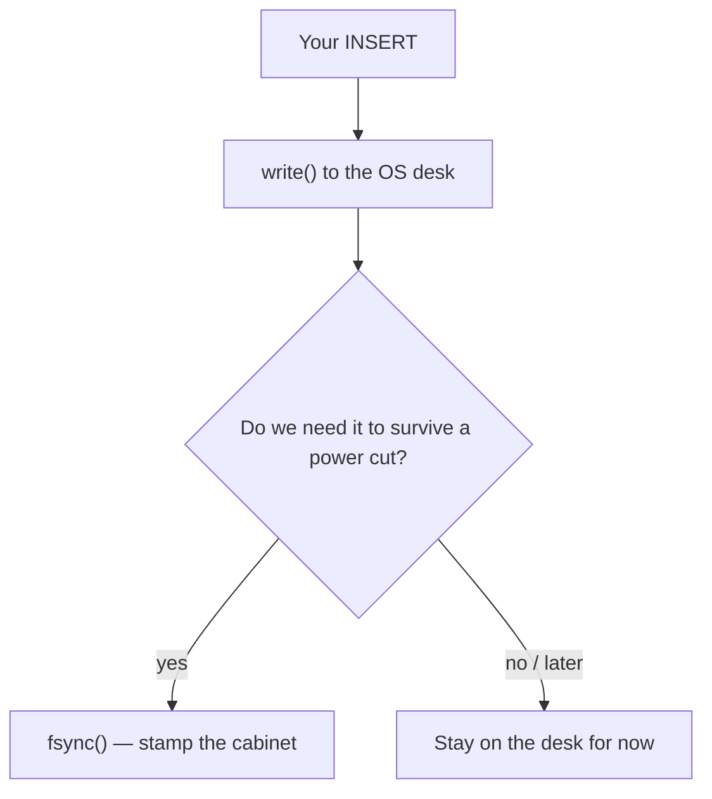

A tiny notebook database can feel **slow**.

You save one lunch note. You wait. You save the next. You wait again.

**Tanay Karnik** (Foo Community) asked a sharper question: what is the wait *made of*?

In his talk he took a default SQLite notebook near **300** writes a second and climbed toward **one million**. Those are **his demo numbers** — his machine, his workload. Not ours. Not a promise for your laptop.

The original write-up is on [Foo Community](https://foo.community/blog/the-physics-of-database-speed). The full talk (~18 min) is on [YouTube](https://www.youtube.com/watch?v=vOEL_pHFYK0). Tanay is at [tanay.xyz](https://tanay.xyz) (`tanayvk` on GitHub and X).

Later shortened recaps of that same Foo / YouTube card are **reactions**. They are **not** the experiment. Do **not** credit a reactor as the person who ran the 1M TPS demo.


That is the whole trick. The rest of this post is a desk, a locked cabinet, a log tape, a bus over a narrow bridge, and a brain that finally gets tired.

---

## Tanay’s speed ladder

Use **Tanay’s** chapter numbers. Some shortened recaps squeezed two sync steps into one “optimize sync” graphic (~12k) and then jumped to batching. Prefer the fuller ladder.

| Step | What changes | Tanay’s reported TPS (approx) |
| --- | --- | --- |
| Baseline | Default rollback journal, durable commits | ~**300–338** |
| Enable WAL | Write-ahead log; fewer stamps per commit | ~**1,100** |
| `synchronous = OFF` | Extreme durability trade-off (**demo**) | ~**100,000** |
| `synchronous = NORMAL` | Common “faster but weaker power-loss” trade-off | ~**12,000** |
| Group commit / batching | Many logical tickets share one durable stamp | up to ~**1,000,000** |
| New limit | Disk is no longer the ceiling → **CPU** | — |

In the talk he also shows a first batching test (~**5,500**) and then a bigger batch window before the million. Hardware-specific. Workload-specific. **His** stopwatch.

Say it out loud:

> “These are Tanay’s demo numbers. We did not measure 1M TPS.”

---

## Why the default waits

A **durable** save means: if the lights go out, the note is still there.

SQLite’s default notebook uses a **rollback journal**. Before it changes a page, it photocopies the old page into a side file. If the save fails, it can put the old page back.

That safety is not free.

`write()` often only puts paper on the operating system’s **desk** (the page cache). The desk is fast. The desk forgets when power dies.

**Durability** waits on `fsync` — or something like it. That is the **stamp** into the locked cabinet.

Tanay walks a classic journal story with **four disk stamps** per transaction (chapter “The 4 `fsync`s bottleneck”). SQLite’s own [atomic commit](https://www.sqlite.org/atomiccommit.html) write-up matches the shape:

1. Stamp the journal pages.
2. Stamp the journal header.
3. Write the new notebook pages.
4. Stamp the notebook. Then you may still pay for creating or deleting the journal file.

Four trips to the locked cabinet. One lunch note.


That is why a default durable SQLite can sit near a few hundred TPS on ordinary hardware. The CPU is not the problem yet. The **stamp** is.

---

## The desk vs the locked cabinet

Memory is a **desk**.

Disk is a **locked cabinet**.



- **RAM** is fast. It is also forgetful. Power loss wipes the desk.
- **`write()`** often means “I handed the paper to the OS.” Not “it is carved in stone.”
- **`fsync()`** means “do not come back until the cabinet has the stamp.”

Tanay measures `fsync` with a tiny `dd` test in the talk. The number changes by disk. The lesson does not: **waiting for the cabinet is the expensive part**.


Say it out loud:

> “On the desk is not the same as in the cabinet.”

---

## WAL: write the log first

A **write-ahead log** flips the story.

The old notebook stays readable. New changes are **appended** to a log tape (`-wal`). A commit can be “the special end-of-ticket mark is on the tape.” Readers keep using the old pages. One writer adds to the end.

SQLite docs: readers do not block the writer, and the writer does not block readers. There is still only **one** writer at a time. Later, a **checkpoint** copies the tape back into the notebook.

At **FULL** durability, WAL typically needs **one** stamp of the log per commit — not four stamps of a rollback journal. ([SQLite WAL](https://www.sqlite.org/wal.html): writers sync the WAL on every commit when `synchronous` is FULL.)

```sql
PRAGMA journal_mode = WAL;
```

Tanay’s demo: default ~338 TPS → WAL ~**1,100** TPS.

That is faster. It is **not** 10×–20× on this workload. He calls out that misconception in the talk.


Checkpointing still matters. A long tape makes readers work harder. SQLite’s default auto-checkpoint is about **1000 pages**. That is a grown-up knob, not this post’s main story.

---

## How hard do we stamp?

`PRAGMA synchronous` is the “how scared are we of a power cut?” knob.

| Setting | Kid idea | Official caution (short) |
| --- | --- | --- |
| **FULL** (or **EXTRA**) | Wait for the cabinet every important time | Safest usual story. EXTRA adds extra directory stamps in rollback mode. |
| **NORMAL** | Stamp at the *most* critical moments | Common speed choice. In WAL, you can lose the **last** tickets on power loss. The notebook should not go corrupt. |
| **OFF** | Skip the stamp. Trust the desk. | **Demo / rebuildable** work. OS crash or power loss can lose data or even **corrupt** the file. |

Official docs: [PRAGMA synchronous](https://www.sqlite.org/pragma.html#pragma_synchronous) and [WAL](https://www.sqlite.org/wal.html).

Tanay’s demo on this knob (again: **his** numbers):

- `synchronous = OFF` → ~**100,000** TPS. Extreme. Teaching tool. Not a production slogan.
- `synchronous = NORMAL` → ~**12,000** TPS. The common “faster, weaker power-loss” trade-off. He notes many ORMs pick NORMAL for speed.


SQLite’s own matrix is blunt:

| | Rollback journal | WAL |
| --- | --- | --- |
| EXTRA | ACID | ACID |
| FULL | Maybe not durable | ACID |
| NORMAL | Maybe not consistent | Maybe not durable |
| OFF | Not consistent | Not consistent |

Say it out loud:

> “NORMAL is a trade. OFF is a dare.”

---

## Many tickets, one bus

Picture a **narrow bridge**.

One stamp at a time can cross.

If every kid walks alone, the bridge is empty most of the second. If a **bus** waits a tiny window and carries many kids, one crossing serves a whole class.

That is **group commit** / **batching**. One durable sync window covers many logical tickets.

Tanay’s analogy in the talk: the narrow bridge and the bus. First batching test ~**5,500** TPS. Bigger batch windows later. Then his demo hits **1,000,000** TPS.


The tickets are still real to the app. The **cabinet** only got one expensive stamp for the group.

This is not magic durability. You still chose how hard to stamp. You only stopped paying **once per ticket**.

---

## Then the brain is the wall

When the cabinet stops being the wait, **Amdahl** shows up.

The leftover work is CPU: parse the SQL, walk the B-tree, copy bytes, bookkeep the ticket.

Tanay’s talk: once disk waits shrink, **CPU** is the new ceiling. He cites about **5,300 clock cycles per transaction** on that demo.

Disk is no longer the lid. The brain is.


You do not “tune fsync” out of that last wall. You change how much thinking each ticket needs — or you accept the cap.

---

## A tiny toy notebook

Pretend a class list. Toy names. No real people. No production schema.

```sql
CREATE TABLE lunch_notes (
  id INTEGER PRIMARY KEY,
  kid TEXT NOT NULL,
  snack TEXT NOT NULL
);

-- Default story: rollback journal + durable stamps
PRAGMA journal_mode = DELETE;
PRAGMA synchronous = FULL;

BEGIN;
INSERT INTO lunch_notes (kid, snack) VALUES ('Sam', 'apple');
COMMIT;
```

Same toy, WAL, still asking for a full stamp:

```sql
PRAGMA journal_mode = WAL;
PRAGMA synchronous = FULL;
```

Same toy, the common speed trade (weaker on power loss):

```sql
PRAGMA journal_mode = WAL;
PRAGMA synchronous = NORMAL;
```

`OFF` is the demo dare. Do not paste it into a money notebook unless you can rebuild the file from scratch.

We are **not** publishing a stopwatch from this folder. If you want *your* TPS, you must run *your* workload.

---

## Honest caveats

- **Tanay ran the ladder.** Foo Community published it. Later recaps only reacted.
- **TPS numbers are demo numbers.** Hardware, disk, batch size, and the exact SQL all move them.
- **`synchronous = OFF` can lose recent work** — or worse — on crash / power loss. SQLite says this plainly.
- **NORMAL is not “no risk.”** In WAL it is usually “no corruption, maybe missing last tickets.”
- **WAL is not a free 20×.** Tanay’s own WAL step was about 338 → 1,100.
- **One writer** in WAL. Many readers. Checkpointing is real work.
- Do **not** invent that Vijay or Intelliwise measured a million TPS.

---

## Grown-up names (tiny box)

You do not need this to get the story. It is here so the robot talks make sense later.

| Kid word | Grown-up name |
| --- | --- |
| Notebook file | **SQLite database** |
| Side photocopy | **rollback journal** (`journal_mode=DELETE`) |
| Log tape | **WAL** (`journal_mode=WAL`) |
| Paper on the teacher’s desk | **OS page cache** after `write()` |
| Stamp into the locked cabinet | **`fsync` / VFS `xSync`** |
| How hard we stamp | **`PRAGMA synchronous`** |
| Copy the tape back into the notebook | **checkpoint** |
| Many tickets, one stamp | **group commit / batching** |
| Writes per second | **TPS** |
| Leftover thinking time | **CPU / Amdahl limit** |

---

Official references:

- [The Physics of Database Speed (Tanay Karnik / Foo Community)](https://foo.community/blog/the-physics-of-database-speed)
- [YouTube: The Physics of Database Speed (~18 min)](https://www.youtube.com/watch?v=vOEL_pHFYK0)
- [Tanay Karnik](https://tanay.xyz)
- [PRAGMA synchronous](https://www.sqlite.org/pragma.html#pragma_synchronous)
- [Write-Ahead Logging](https://www.sqlite.org/wal.html)
- [Atomic Commit In SQLite](https://www.sqlite.org/atomiccommit.html)

---

## Say this back

**Default SQLite is slow because a durable save waits on disk stamps — sometimes several. WAL writes a log so you stamp less. Softer sync is a power-loss trade, not free speed. One stamp can cover a whole bus of tickets. When the cabinet is no longer the wait, the CPU is.**
