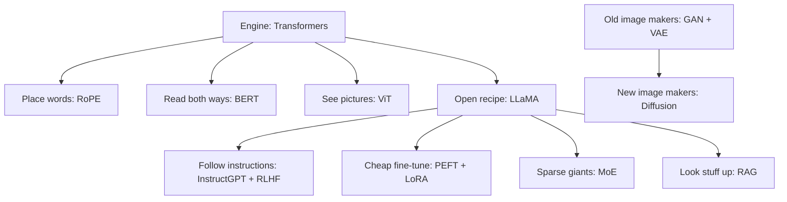
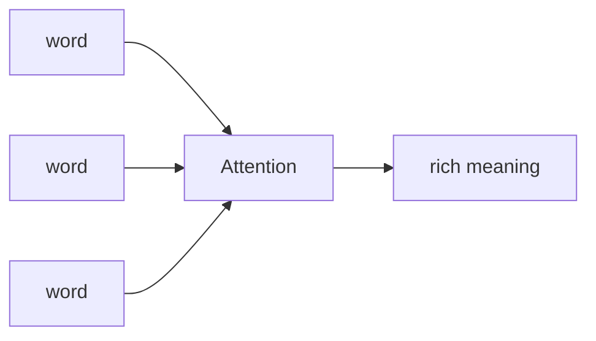
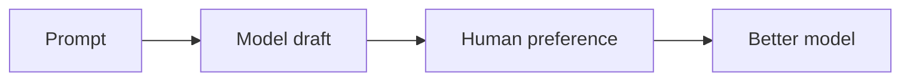

Fourteen research papers every AI engineer keeps hearing about.

The common list is a **checklist**. This post is the **lunch-box map**.

Same 14 names. Grouped so a ten-year-old (and a busy adult) can see *why* each box exists, and *which box to open first*.

We did **not** invent these papers. We only sorted the tray.

Say it out loud:

> “Do not memorize 14 titles. Learn seven lunch boxes.”

---

## The 14 names (common list order)

| # | Short name | One kid line |
| --- | --- | --- |
| 1 | **Attention Is All You Need** | The engine that looks at every word at once |
| 2 | **LoRA** | Stick a tiny sticky note on a big model to teach it |
| 3 | **PEFT** | The family name for “cheap fine-tuning” |
| 4 | **ViT** | Cut a photo into patches; use a transformer |
| 5 | **GANs** | Artist vs critic fighting to make fakes look real |
| 6 | **BERT** | Read left *and* right to understand a sentence |
| 7 | **Diffusion** | Start from noise; slowly clean into a picture |
| 8 | **RAG** | Look up notes before you answer |
| 9 | **MoE** | Many small experts; only a few wake up |
| 10 | **RLHF** | Humans score answers; the model learns taste |
| 11 | **LLaMA** | Meta’s open-ish large language model recipe |
| 12 | **RoPE** | A smart way to tell the model *where* a word sits |
| 13 | **InstructGPT** | Train the model to follow instructions |
| 14 | **VAE** | Squeeze a picture into a small code, then rebuild |

Now the boxes.

---

## Box 1 — The engine room

### Attention Is All You Need (Transformers)

Before this, models often read words **one after another**, like a single-file line.

**Attention** lets every word look at every other word and ask: “Who matters for me right now?”

That paper (2017) is why ChatGPT-style models exist.

**Read when:** you want the root of modern LLMs.

---

## Box 2 — Where am I in the line?

### RoPE (Rotary Position Embedding)

Transformers need to know **order**. “Dog bites man” ≠ “Man bites dog.”

**RoPE** rotates number arrows so position is baked into attention in a neat way. Many open models (including LLaMA-style stacks) use ideas like this.

**Kid line:** stickers that remember *seat number*, not just the name on the shirt.

---

## Box 3 — Reading both ways

### BERT

**BERT** is an **encoder** transformer. It looks left **and** right.

Great for understanding: search, classify, fill blanks. Not the usual “write an essay” bot by itself.

**Kid line:** reading the whole sentence before you judge one word.

---

## Box 4 — Eyes for transformers

### ViT (Vision Transformer)

Chop a picture into little **patches**, like stamp tiles. Treat each tile like a “word.” Run a transformer.

**Kid line:** a photo becomes a comic strip of tiles, then attention reads the strip.

---

## Box 5 — An open language recipe

### LLaMA

**LLaMA** (Meta) shared a strong **large language model** recipe with the research world. Many later open models rhyme with it.

**Kid line:** a public cookbook for “big text brains,” not a magic spell.

---

## Box 6 — Teach it to listen

### InstructGPT + RLHF

A raw LLM can babble. People want it to **follow instructions** and be helpful.

- **InstructGPT**: train / tune so the model obeys prompts better.
- **RLHF**: humans (or preference data) score answers; the model moves toward “better taste.”

**Read when:** you care why chatbots feel polite and useful.

---

## Box 7 — Cheap fine-tuning

### PEFT + LoRA

Full fine-tuning touches **all** the weights. That is expensive.

**PEFT** = Parameter-Efficient Fine-Tuning (the family).

**LoRA** = a famous PEFT trick: freeze the big model; train tiny low-rank add-ons.

**Kid line:** keep the whole textbook; only rewrite a sticky note.

---

## Box 8 — Sparse giants

### MoE (Mixture of Experts)

Instead of one huge brain always on, keep **many expert** brains. For each token, wake **only a few**.

**Kid line:** a school with many teachers; only the right ones stand up.

---

## Box 9 — Look it up first

### RAG (Retrieval-Augmented Generation)

Models forget and hallucinate. **RAG** fetches fresh notes from your files / search, then asks the model to answer **with** those notes.

**Kid line:** open the binder before you raise your hand.

---

## Box 10 — Picture makers (classic)

### GANs + VAE

**GAN:** a forger and a detective. The forger gets better until fakes fool the detective.

**VAE:** squeeze an image into a small code, then rebuild. Good for smooth “latents.”

**Kid line:** art contest (GAN) vs zip-and-unzip (VAE).

---

## Box 11 — Picture makers (now)

### Diffusion (Stable Diffusion lineage)

Start with **TV static**. Step by step, remove noise until a clean picture appears. Modern image models lean hard on this idea (often with a VAE latent space).

**Kid line:** messy chalk → wipe carefully → drawing.

---

## Suggested reading order (busy people)

1. **Attention Is All You Need** — the engine  
2. **BERT** *or* skim a LLaMA overview — understand vs generate  
3. **RoPE** (short) — position  
4. **InstructGPT + RLHF** — why chat feels aligned  
5. **LoRA / PEFT** — how you customize cheaply  
6. **RAG** — how products stay factual  
7. **MoE** — how giants stay fast enough  
8. **ViT** — same engine, eyes  
9. **VAE → Diffusion** (and peek at **GANs** for history)

You do **not** need all 14 in one weekend.

---

## Honest caveats

- A common list is a **map**, not a PhD.  
- Paper titles evolve (RAG stacks, diffusion variants, LLaMA versions). Learn the **idea**, then check the latest version.  
- More lists may exist — we only teach this fourteen.

---

## Sources

- Landmark papers / lineages named above (Vaswani et al. Transformer; Devlin et al. BERT; Hu et al. LoRA; Dosovitskiy et al. ViT; Goodfellow et al. GAN; Kingma & Welling VAE; Lewis et al. RAG; InstructGPT / RLHF literature; LLaMA; RoFormer/RoPE; diffusion / latent diffusion). Prefer the official PDFs when you sit down to read.

---

## Say this back

**Fourteen famous papers are really about seven lunch boxes: the transformer engine, position, deep reading, vision tiles, open LLM recipes, instruction + human taste, cheap adapters, sparse experts, retrieval, and three ways to make pictures. Learn the box, then open the paper.**
