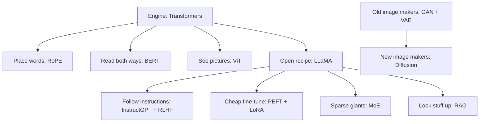
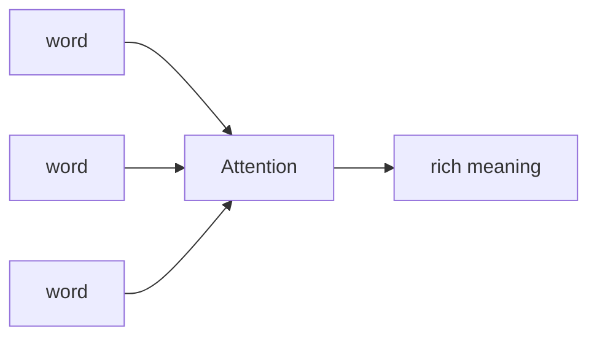
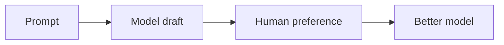

Fourteen research papers every AI engineer keeps hearing about.

The common list is a **checklist**. This post is the **lunch-box map**.

Same 14 names. Grouped so a ten-year-old (and a busy adult) can see *why* each box exists, and *which box to open first*.

We did **not** invent these papers. We only sorted the tray.

Each paper has **three layers**:

1. **This map** — why the box exists, a short **Quick easy read**, and the diagrams.
2. **A longer guide** — still brief, enough idea that you do not need to grind the PDF. Linked from the table and from each paper. These guides live under this post. They are **not** listed on the Writing index or in the RSS feed.
3. **The real paper** — official abstract, PDF, conference page, and a **Dataset** link only when a public corpus is honestly tied to that paper.

Skim the map. Open the longer guide when you want more idea. Open the paper when you want the proof.

```mermaid
flowchart TB
  A[Engine: Transformers] --> B[Place words: RoPE]
  A --> C[Read both ways: BERT]
  A --> D[See pictures: ViT]
  A --> E[Open recipe: LLaMA]
  E --> F[Follow instructions: InstructGPT + RLHF]
  E --> G[Cheap fine-tune: PEFT + LoRA]
  E --> H[Sparse giants: MoE]
  E --> I[Look stuff up: RAG]
  J[Old image makers: GAN + VAE] --> K[New image makers: Diffusion]
```

Say it out loud:

> “Do not memorize 14 titles. Learn seven lunch boxes.”

---

## The 14 names (common list order)

Names jump to the box. **Paper** goes to the official abstract. **Longer guide** is the unlisted sub-page.

| # | Short name | One kid line | Longer guide |
| --- | --- | --- | --- |
| 1 | [**Attention Is All You Need**](#attention) · [paper](https://arxiv.org/abs/1706.03762) | The engine that looks at every word at once | [guide]({{ '/posts/14-ai-papers-lunch-box-map/attention-is-all-you-need/' | relative_url }}) |
| 2 | [**LoRA**](#lora) · [paper](https://arxiv.org/abs/2106.09685) | Stick a tiny sticky note on a big model to teach it | [guide]({{ '/posts/14-ai-papers-lunch-box-map/lora/' | relative_url }}) |
| 3 | [**PEFT**](#peft) · [docs](https://huggingface.co/docs/peft/en/index) | The family name for “cheap fine-tuning” | [guide]({{ '/posts/14-ai-papers-lunch-box-map/peft/' | relative_url }}) |
| 4 | [**ViT**](#vit) · [paper](https://arxiv.org/abs/2010.11929) | Cut a photo into patches; use a transformer | [guide]({{ '/posts/14-ai-papers-lunch-box-map/vit/' | relative_url }}) |
| 5 | [**GANs**](#gans) · [paper](https://arxiv.org/abs/1406.2661) | Artist vs critic fighting to make fakes look real | [guide]({{ '/posts/14-ai-papers-lunch-box-map/gans/' | relative_url }}) |
| 6 | [**BERT**](#bert) · [paper](https://aclanthology.org/N19-1423/) | Read left *and* right to understand a sentence | [guide]({{ '/posts/14-ai-papers-lunch-box-map/bert/' | relative_url }}) |
| 7 | [**Diffusion**](#diffusion) · [paper](https://arxiv.org/abs/2006.11239) | Start from noise; slowly clean into a picture | [guide]({{ '/posts/14-ai-papers-lunch-box-map/diffusion/' | relative_url }}) |
| 8 | [**RAG**](#rag) · [paper](https://arxiv.org/abs/2005.11401) | Look up notes before you answer | [guide]({{ '/posts/14-ai-papers-lunch-box-map/rag/' | relative_url }}) |
| 9 | [**MoE**](#moe) · [paper](https://arxiv.org/abs/2101.03961) | Many small experts; only a few wake up | [guide]({{ '/posts/14-ai-papers-lunch-box-map/moe-switch-transformers/' | relative_url }}) |
| 10 | [**RLHF**](#rlhf) · [paper](https://arxiv.org/abs/1706.03741) | Humans score answers; the model learns taste | [guide]({{ '/posts/14-ai-papers-lunch-box-map/rlhf-christiano/' | relative_url }}) |
| 11 | [**LLaMA**](#llama) · [paper](https://arxiv.org/abs/2302.13971) | Meta’s open-ish large language model recipe | [guide]({{ '/posts/14-ai-papers-lunch-box-map/llama/' | relative_url }}) |
| 12 | [**RoPE**](#rope) · [paper](https://arxiv.org/abs/2104.09864) | A smart way to tell the model *where* a word sits | [guide]({{ '/posts/14-ai-papers-lunch-box-map/rope-roformer/' | relative_url }}) |
| 13 | [**InstructGPT**](#instructgpt) · [paper](https://arxiv.org/abs/2203.02155) | Train the model to follow instructions | [guide]({{ '/posts/14-ai-papers-lunch-box-map/instructgpt/' | relative_url }}) |
| 14 | [**VAE**](#vae) · [paper](https://arxiv.org/abs/1312.6114) | Squeeze a picture into a small code, then rebuild | [guide]({{ '/posts/14-ai-papers-lunch-box-map/vae/' | relative_url }}) |

Now the boxes.

---

## Box 1 — The engine room

<h3 id="attention">Attention Is All You Need (Transformers)</h3>

<strong>Longer guide</strong> → <a href="{{ '/posts/14-ai-papers-lunch-box-map/attention-is-all-you-need/' | relative_url }}">more idea without grinding the PDF</a>

Before this, models often read words **one after another**, like a single-file line.

**Attention** lets every word look at every other word and ask: “Who matters for me right now?”

That paper (2017) is why ChatGPT-style models exist.

```mermaid
flowchart LR
  W1[word] --> A[Attention]
  W2[word] --> A
  W3[word] --> A
  A --> O[rich meaning]
```

**Read when:** you want the root of modern LLMs.

<h4 id="attention-quick">Quick easy read</h4>

**What it is**

- A new engine for reading sequences. No slow “one word, then the next” loop as the main trick.
- Every token can look at every other token in one go (**self-attention**).
- Stack those looks with a little feed-forward maths: that stack is a **Transformer**.
- The 2017 paper tested it on translation. The same engine later showed up in chat, code, and pictures.

**Why people care**

- GPUs like work they can do in parallel. Attention is much more parallel than old recurrent nets.
- One engine, many jobs: text, code, images (see [ViT](#vit)), even tools that call other tools.
- If you only open one paper on this tray, open this one.

**Tiny picture**

Imagine a classroom where every kid can glance at every other kid at the same time, instead of whispering down a single-file line. “Bank” looks at “river” *and* “money” and decides which neighbours matter.

**Links:** [Paper (arXiv)](https://arxiv.org/abs/1706.03762) · [NeurIPS 2017](https://proceedings.neurips.cc/paper/2017/hash/3f5ee243547dee91fbd053c1c4a845aa-Abstract.html) · [Dataset: WMT 2014 translation task](https://www.statmt.org/wmt14/translation-task.html) (the paper’s English–German / English–French news tests)

---

## Box 2 — Where am I in the line?

<h3 id="rope">RoPE (Rotary Position Embedding)</h3>

<strong>Longer guide</strong> → <a href="{{ '/posts/14-ai-papers-lunch-box-map/rope-roformer/' | relative_url }}">more idea without grinding the PDF</a>

Transformers need to know **order**. “Dog bites man” ≠ “Man bites dog.”

**RoPE** rotates number arrows so position is baked into attention in a neat way. Many open models (including LLaMA-style stacks) use ideas like this.

**Kid line:** stickers that remember *seat number*, not just the name on the shirt.

<h4 id="rope-quick">Quick easy read</h4>

**What it is**

- Attention is great at “who talks to whom.” It is deaf to *where* unless you tell it.
- **RoPE** (from the RoFormer paper) turns each token’s numbers a little, like rotating a clock hand, based on seat number.
- Nearby seats rotate a little. Far seats rotate a lot. Relative distance falls out of the rotation.

**Why people care**

- Order is not optional in language, logs, or code.
- Lots of later open LLMs (LLaMA-family and cousins) use rotary-style position.
- It stretches to longer lines more kindly than some older “add a seat vector” tricks.

**Tiny picture**

Two kids on a spinning playground. How much one has spun relative to the other *is* how far apart they sit. You do not need a separate name tag that says “seat 7.”

**Links:** [Paper — RoFormer / Su et al. (arXiv)](https://arxiv.org/abs/2104.09864)

---

## Box 3 — Reading both ways

<h3 id="bert">BERT</h3>

<strong>Longer guide</strong> → <a href="{{ '/posts/14-ai-papers-lunch-box-map/bert/' | relative_url }}">more idea without grinding the PDF</a>

**BERT** is an **encoder** transformer. It looks left **and** right.

Great for understanding: search, classify, fill blanks. Not the usual “write an essay” bot by itself.

**Kid line:** reading the whole sentence before you judge one word.

<h4 id="bert-quick">Quick easy read</h4>

**What it is**

- A Transformer that **reads both ways** (bidirectional), then gets fine-tuned for a job.
- Pre-training games: hide a word and guess it; sometimes guess if sentence B really follows sentence A.
- After that, a thin extra head can do search ranking, sentiment, span answers, and similar “understand this text” work.

**Why people care**

- For years this was the default way to make text *features* for products: classify a ticket, match a query, tag a span.
- It showed that one pretrained encoder plus a little extra training beats many custom architectures.
- Chat bots that *write* usually use decoder stacks. BERT is the “read the ticket first” cousin.

**Tiny picture**

A teacher covers one word in a sentence and asks the class to guess it — but everyone already saw the words on **both** sides. That is the fill-in-the-blank game BERT practised at huge scale.

**Links:** [Paper (ACL Anthology)](https://aclanthology.org/N19-1423/) · [arXiv](https://arxiv.org/abs/1810.04805) · [Pretraining corpus: English Wikipedia dumps](https://dumps.wikimedia.org/) (BERT used text passages, not lists/tables) · [BooksCorpus source paper (Zhu et al., 2015)](https://arxiv.org/abs/1506.06724) (the original BookCorpus dump is **not** a simple public download today)

---

## Box 4 — Eyes for transformers

<h3 id="vit">ViT (Vision Transformer)</h3>

<strong>Longer guide</strong> → <a href="{{ '/posts/14-ai-papers-lunch-box-map/vit/' | relative_url }}">more idea without grinding the PDF</a>

Chop a picture into little **patches**, like stamp tiles. Treat each tile like a “word.” Run a transformer.

**Kid line:** a photo becomes a comic strip of tiles, then attention reads the strip.

<h4 id="vit-quick">Quick easy read</h4>

**What it is**

- Same Transformer engine as text, pointed at **images**.
- Cut the photo into a grid of squares (often 16×16 pixels). Each square is a token.
- Train big, then transfer to smaller picture jobs. The paper’s headline result is image classification at scale.

**Why people care**

- You do not need a special “vision-only” backbone if you have enough data and compute.
- The same attention story now covers pixels and words — handy when a product mixes both.
- It is the clean “eyes” box on this tray: one idea, not a zoo of convolution tricks.

**Tiny picture**

Take a poster, cut it into postage stamps, line the stamps up like a sentence, and let attention read the sentence. A cat’s ear tile looks at the whisker tiles and decides “cat.”

**Links:** [Paper — Dosovitskiy et al. (arXiv)](https://arxiv.org/abs/2010.11929) · [Dataset: ImageNet](https://www.image-net.org/) (ViT pretrains on large labelled photo sets such as ImageNet-21k, then transfers to ImageNet-style tests; access is for research, not a random public zip)

---

## Box 5 — An open language recipe

<h3 id="llama">LLaMA</h3>

<strong>Longer guide</strong> → <a href="{{ '/posts/14-ai-papers-lunch-box-map/llama/' | relative_url }}">more idea without grinding the PDF</a>

**LLaMA** (Meta) shared a strong **large language model** recipe with the research world. Many later open models rhyme with it.

**Kid line:** a public cookbook for “big text brains,” not a magic spell.

<h4 id="llama-quick">Quick easy read</h4>

**What it is**

- A family of **decoder** Transformers (7B to 65B in the first paper) trained on a lot of public text.
- Meta showed you can get strong results without a secret private corpus as the whole story.
- The recipe leaked into a thousand later models: same-shaped stacks, same “open weights + paper” habit.

**Why people care**

- Engineers can read a real training recipe, not only an API card.
- Smaller LLaMA-13B beating much bigger GPT-3 on many tests was the “wait, data and tokens matter” moment.
- If you ship on open weights, you will meet this family tree.

**Tiny picture**

Not a magic spell. A published cookbook: flour, water, oven time. Other kitchens copy the loaf shape and change the toppings.

**Links:** [Paper — Touvron et al. (arXiv)](https://arxiv.org/abs/2302.13971) · [Code / model card (Meta Llama GitHub)](https://github.com/meta-llama/llama) · [Hugging Face LLaMA docs](https://huggingface.co/docs/transformers/en/model_doc/llama)

---

## Box 6 — Teach it to listen

A raw LLM can babble. People want it to **follow instructions** and be helpful. These two papers travel in one box.

```mermaid
flowchart LR
  P[Prompt] --> M[Model draft]
  M --> H[Human preference]
  H --> M2[Better model]
```

**Read when:** you care why chatbots feel polite and useful.

<h3 id="instructgpt">InstructGPT</h3>

<strong>Longer guide</strong> → <a href="{{ '/posts/14-ai-papers-lunch-box-map/instructgpt/' | relative_url }}">more idea without grinding the PDF</a>

**InstructGPT**: train / tune so the model obeys prompts better. The OpenAI paper that named the chat-style habit: supervised demos, then preference training.

<h4 id="instructgpt-quick">Quick easy read</h4>

**What it is**

- Start from a big pretrained model (here: GPT-3).
- Step 1: humans write good answers to prompts. Train on those (supervised fine-tune).
- Step 2: humans rank model answers. Train a **reward model**, then bump the policy toward the ranks (**RLHF**).
- The 1.3B InstructGPT was often preferred to 175B GPT-3 on their prompt set — size is not the same as “does what I asked.”

**Why people care**

- This is why “write a polite email” works better than raw next-token dump.
- Product people meet this as alignment, safety filters, and “the model got nicer after we collected ranks.”
- Later chat models reuse the same three-step skeleton, with extra tricks.

**Tiny picture**

A student first copies marked homework (demos). Then a teacher points at two essays: “this one, not that one.” The student practises toward the pointing finger, not toward a written rulebook.

**Links:** [Paper — Ouyang et al. (arXiv)](https://arxiv.org/abs/2203.02155)

<h3 id="rlhf">RLHF</h3>

<strong>Longer guide</strong> → <a href="{{ '/posts/14-ai-papers-lunch-box-map/rlhf-christiano/' | relative_url }}">more idea without grinding the PDF</a>

**RLHF**: humans (or preference data) score answers; the model moves toward “better taste.”

InstructGPT *uses* RLHF. The older landmark is Christiano et al.: teach an agent from **human preference** instead of a hand-written reward.

<h4 id="rlhf-quick">Quick easy read</h4>

**What it is**

- You often cannot write a perfect score function for “be helpful” or “do a backflip nicely.”
- Show a human two clips (or two answers). They pick a winner.
- Fit a reward model to those picks. Train the agent with RL on that reward.
- InstructGPT is the language-model version of this loop.

**Why people care**

- Taste, tone, and “don’t be rude” are preference problems, not unit tests.
- This is the named method behind a lot of chat fine-tunes — and behind a lot of later debate about whose taste got encoded.
- If you only remember one sentence: **humans compare, the model climbs**.

**Tiny picture**

Two robot dance videos. You tap the less-awkward one. You never write the physics of dancing. The robot still gets better at dancing.

**Links:** [Paper — Christiano et al. (arXiv)](https://arxiv.org/abs/1706.03741) · [Language-model version: InstructGPT](https://arxiv.org/abs/2203.02155)

---

## Box 7 — Cheap fine-tuning

Full fine-tuning touches **all** the weights. That is expensive.

**PEFT** is the family name. **LoRA** is the sticky-note trick most teams actually ship.

<h3 id="lora">LoRA</h3>

<strong>Longer guide</strong> → <a href="{{ '/posts/14-ai-papers-lunch-box-map/lora/' | relative_url }}">more idea without grinding the PDF</a>

**LoRA** = freeze the big model; train tiny low-rank add-ons.

**Kid line:** keep the whole textbook; only rewrite a sticky note.

<h4 id="lora-quick">Quick easy read</h4>

**What it is**

- Leave the pretrained weights **frozen**.
- Beside some big matrices (often attention projections), train two thin matrices whose product is a small “update.”
- At serve time you can **merge** that update back in, so you do not pay extra latency like some older adapter stacks.

**Why people care**

- One base checkpoint, many cheap specialist patches (support tone, internal jargon, a tool habit).
- Disk and GPU memory stay sane. You are not storing 13 copies of a 13B model.
- This is the default “we fine-tuned it” in a lot of real stacks.

**Tiny picture**

A huge printed textbook stays on the shelf. You teach a new course by sticking a few notes on the hard pages. Swap the notes; the book stays.

**Links:** [Paper — Hu et al. (arXiv)](https://arxiv.org/abs/2106.09685)

<h3 id="peft">PEFT</h3>

<strong>Longer guide</strong> → <a href="{{ '/posts/14-ai-papers-lunch-box-map/peft/' | relative_url }}">more idea without grinding the PDF</a>

**PEFT** = Parameter-Efficient Fine-Tuning. Not one paper. A **family**: LoRA, adapters, prompt/prefix tuning, and friends.

Use LoRA unless you have a reason not to. Treat the rest as “know why it exists.”

<h4 id="peft-quick">Quick easy read</h4>

**What it is**

- Same job as full fine-tune: specialise a strong base model.
- Change only a **small** set of extra numbers (or a small add-on), not every weight.
- **Adapters** (Houlsby et al.) were an early member: tiny bottleneck layers slid into a frozen BERT. **LoRA** later became the popular low-rank version.
- Hugging Face **PEFT** is the library most engineers actually import.

**Why people care**

- Full copies of a 70B model per customer task do not fit a budget.
- You can keep one frozen backbone and hot-swap skills, like plugins.
- If someone says “we did PEFT,” ask *which* method. Often they mean LoRA.

**Tiny picture**

The library building stays put. Each new subject gets a thin pamphlet, not a second building.

**Links:** [Hugging Face PEFT docs](https://huggingface.co/docs/peft/en/index) · [LoRA paper](https://arxiv.org/abs/2106.09685) · [Adapter paper — Houlsby et al. (arXiv)](https://arxiv.org/abs/1902.00751) · [PMLR / ICML version](https://proceedings.mlr.press/v97/houlsby19a.html) · [Google Research page](https://research.google/pubs/parameter-efficient-transfer-learning-for-nlp/)

---

## Box 8 — Sparse giants

<h3 id="moe">MoE (Mixture of Experts)</h3>

<strong>Longer guide</strong> → <a href="{{ '/posts/14-ai-papers-lunch-box-map/moe-switch-transformers/' | relative_url }}">more idea without grinding the PDF</a>

Instead of one huge brain always on, keep **many expert** brains. For each token, wake **only a few**.

**Kid line:** a school with many teachers; only the right ones stand up.

This box’s primary paper is **Switch Transformers** (Fedus, Zoph, Shazeer): a Transformer MoE that routes each token to **one** expert. The older root is Shazeer et al. 2017 (sparsely-gated MoE).

<h4 id="moe-quick">Quick easy read</h4>

**What it is**

- A dense model uses **all** of its weights for every token. An **MoE** keeps a roster of expert feed-forward blocks.
- A small **router** picks which expert(s) see this token.
- Switch: pick **one** expert (simpler, cheaper communication than older top-*k* MoE).
- You can grow *parameter count* a lot without growing *compute per token* as fast.

**Why people care**

- This is how some “trillion parameter” language models stay runnable: most experts sleep.
- Same bill of GPU-time, more capacity — if routing stays healthy (load balance is the engineering tax).
- If a vendor says “sparse model,” they often mean this lunch box.

**Tiny picture**

A hospital with many specialists. The triage nurse sends you to *one* doctor. The other doctors keep working on other patients. You do not convene the whole staff for a sore throat.

**Links:** [Primary paper — Switch Transformers (arXiv)](https://arxiv.org/abs/2101.03961) · [Lineage — Shazeer et al., sparsely-gated MoE (arXiv)](https://arxiv.org/abs/1701.06538) · [C4 corpus (defined in the T5 paper)](https://arxiv.org/abs/1910.10683) (Switch pretrains on the Colossal Clean Crawled Corpus)

---

## Box 9 — Look it up first

<h3 id="rag">RAG (Retrieval-Augmented Generation)</h3>

<strong>Longer guide</strong> → <a href="{{ '/posts/14-ai-papers-lunch-box-map/rag/' | relative_url }}">more idea without grinding the PDF</a>

Models forget and hallucinate. **RAG** fetches fresh notes from your files / search, then asks the model to answer **with** those notes.

**Kid line:** open the binder before you raise your hand.

<h4 id="rag-quick">Quick easy read</h4>

**What it is**

- Two memories: the weights (what the model already “knows”) and a **search index** (notes you can update).
- At question time: retrieve a few passages, then generate an answer **conditioned on** those passages.
- Lewis et al. used a seq2seq generator plus a dense index of **Wikipedia**.
- Today’s product RAG is the same sandwich: retrieve → stuff into the prompt → generate. The 2020 paper is the named origin.

**Why people care**

- You can fix facts by editing documents, not by retraining a 70B model.
- Provenance: you can point at the paragraph you used.
- This is the usual engineering answer to “the model made up a policy.”

**Tiny picture**

Open-book test. The student is allowed to grab three photocopies from the binder, then write. Closed-book is hoping they memorised the binder.

**Links:** [Paper — Lewis et al. (arXiv)](https://arxiv.org/abs/2005.11401) · [Retrieval corpus: Wikipedia dumps](https://dumps.wikimedia.org/) (the paper indexes Wikipedia passages)

---

## Box 10 — Picture makers (classic)

Two older ways to make pictures. Diffusion (next box) mostly won the “pretty image from a prompt” race. These two still matter for the maths and for latent spaces.

<h3 id="gans">GANs</h3>

<strong>Longer guide</strong> → <a href="{{ '/posts/14-ai-papers-lunch-box-map/gans/' | relative_url }}">more idea without grinding the PDF</a>

**GAN:** a forger and a detective. The forger gets better until fakes fool the detective.

<h4 id="gans-quick">Quick easy read</h4>

**What it is**

- Two nets train together: a **generator** makes fakes from noise; a **discriminator** says real vs fake.
- The generator’s job is to fool the discriminator. That fight is the training signal.
- Goodfellow et al. (2014) is the landmark. Later years were a zoo of GAN variants.

**Why people care**

- First time many people saw *sharp* generated photos, not blurry averages.
- The “two players” idea shows up in other training tricks (including parts of modern image stacks).
- History box: know it so you know what diffusion replaced in products.

**Tiny picture**

Art forger vs museum detective. Every week the forger studies what got caught. The paintings get scarily good. Nobody wrote “draw a cat” as a loss; the fight was enough.

**Links:** [Paper — Goodfellow et al. (arXiv)](https://arxiv.org/abs/1406.2661) · [Dataset used in the paper: CIFAR-10](https://www.cs.toronto.edu/~kriz/cifar.html)

<h3 id="vae">VAE</h3>

<strong>Longer guide</strong> → <a href="{{ '/posts/14-ai-papers-lunch-box-map/vae/' | relative_url }}">more idea without grinding the PDF</a>

**VAE:** squeeze an image into a small code, then rebuild. Good for smooth “latents.”

**Kid line:** art contest (GAN) vs zip-and-unzip (VAE).

<h4 id="vae-quick">Quick easy read</h4>

**What it is**

- An **encoder** maps a picture to a small cloud of numbers (a latent).
- A **decoder** rebuilds the picture from a sample of that cloud.
- The training deal: rebuild well, but keep the cloud simple (usually “look like a standard bell curve”).
- Kingma & Welling (2013/14) is the landmark **variational autoencoder**.

**Why people care**

- Latent spaces you can walk through: morph one face toward another.
- Modern image generators still **compress** with a VAE-like autoencoder, then do the fancy work in that smaller space (see [Diffusion](#diffusion)).
- If someone says “latent,” this is the zip-file intuition.

**Tiny picture**

Stuff a poster into a tiny envelope of numbers, then unpack it. Nearby envelopes unpack into similar posters. That neighbourhood is the latent space.

**Links:** [Paper — Kingma & Welling (arXiv)](https://arxiv.org/abs/1312.6114)

---

## Box 11 — Picture makers (now)

<h3 id="diffusion">Diffusion (Stable Diffusion lineage)</h3>

<strong>Longer guide</strong> → <a href="{{ '/posts/14-ai-papers-lunch-box-map/diffusion/' | relative_url }}">more idea without grinding the PDF</a>

Start with **TV static**. Step by step, remove noise until a clean picture appears. Modern image models lean hard on this idea (often with a VAE latent space).

**Kid line:** messy chalk → wipe carefully → drawing.

<h4 id="diffusion-quick">Quick easy read</h4>

**What it is**

- **DDPM** (Ho, Jain, Abbeel): add noise to real photos until they are static; train a net to **undo** one noise step. Repeat the undo until you have a picture.
- **Latent Diffusion** (Rombach et al.): do that denoising in a **small latent grid** from an autoencoder, not on every pixel. That is the Stable Diffusion lineage this box names.
- Text can steer the undo via cross-attention (“a red bicycle in the rain”).

**Why people care**

- This is how most “type words, get a picture” tools work now.
- Latent diffusion made high-res generation cheap enough to run outside a giant lab.
- Same “iterative cleanup” idea later jumped to audio and video.

**Tiny picture**

A dusty chalkboard. You do not draw the cat in one stroke. You wipe a little dust, then a little more, until the cat is there. Start from a blank dusty board (pure noise) and wipe toward the prompt.

**Links:** [DDPM — Ho et al. (arXiv)](https://arxiv.org/abs/2006.11239) · [Latent Diffusion / Stable Diffusion lineage — Rombach et al. (arXiv)](https://arxiv.org/abs/2112.10752) · [LAION-400M (text-to-image training in the LDM paper)](https://arxiv.org/abs/2111.02114) · [LAION-400M project page](https://laion.ai/blog/laion-400-open-dataset/) · [MS-COCO (eval set in that paper)](https://cocodataset.org/)

---

## Suggested reading order (busy people)

1. [**Attention Is All You Need**](#attention) — the engine
2. [**BERT**](#bert) *or* skim a [LLaMA](#llama) overview — understand vs generate
3. [**RoPE**](#rope) (short) — position
4. [**InstructGPT**](#instructgpt) + [**RLHF**](#rlhf) — why chat feels aligned
5. [**LoRA**](#lora) / [**PEFT**](#peft) — how you customize cheaply
6. [**RAG**](#rag) — how products stay factual
7. [**MoE**](#moe) — how giants stay fast enough
8. [**ViT**](#vit) — same engine, eyes
9. [**VAE**](#vae) → [**Diffusion**](#diffusion) (and peek at [**GANs**](#gans) for history)

You do **not** need all 14 in one weekend.

---

## Honest caveats

- A common list is a **map**, not a PhD.
- Paper titles evolve (RAG stacks, diffusion variants, LLaMA versions). Learn the **idea**, then check the latest version.
- Dataset links are only where a public corpus is clearly named in the landmark paper. Some famous training sets (InstructGPT ranks, original BookCorpus dumps) are **not** a clean public zip.
- More lists may exist — we only teach this fourteen.

---

## Sources

Official abstracts and resources used in this post (prefer these over roundups):

1. Vaswani et al., [Attention Is All You Need](https://arxiv.org/abs/1706.03762)
2. Hu et al., [LoRA: Low-Rank Adaptation of Large Language Models](https://arxiv.org/abs/2106.09685)
3. [Hugging Face PEFT](https://huggingface.co/docs/peft/en/index); Houlsby et al., [Parameter-Efficient Transfer Learning for NLP](https://arxiv.org/abs/1902.00751)
4. Dosovitskiy et al., [An Image is Worth 16×16 Words](https://arxiv.org/abs/2010.11929); [ImageNet](https://www.image-net.org/)
5. Goodfellow et al., [Generative Adversarial Nets](https://arxiv.org/abs/1406.2661)
6. Devlin et al., [BERT](https://aclanthology.org/N19-1423/) ([arXiv](https://arxiv.org/abs/1810.04805)); [Wikipedia dumps](https://dumps.wikimedia.org/); BooksCorpus via [Zhu et al.](https://arxiv.org/abs/1506.06724)
7. Ho et al., [Denoising Diffusion Probabilistic Models](https://arxiv.org/abs/2006.11239); Rombach et al., [Latent Diffusion Models](https://arxiv.org/abs/2112.10752)
8. Lewis et al., [Retrieval-Augmented Generation for Knowledge-Intensive NLP Tasks](https://arxiv.org/abs/2005.11401)
9. Fedus, Zoph & Shazeer, [Switch Transformers](https://arxiv.org/abs/2101.03961); Shazeer et al., [Sparsely-Gated Mixture-of-Experts](https://arxiv.org/abs/1701.06538)
10. Christiano et al., [Deep Reinforcement Learning from Human Preferences](https://arxiv.org/abs/1706.03741)
11. Touvron et al., [LLaMA: Open and Efficient Foundation Language Models](https://arxiv.org/abs/2302.13971); [Meta Llama GitHub](https://github.com/meta-llama/llama)
12. Su et al., [RoFormer: Enhanced Transformer with Rotary Position Embedding](https://arxiv.org/abs/2104.09864)
13. Ouyang et al., [Training language models to follow instructions with human feedback](https://arxiv.org/abs/2203.02155)
14. Kingma & Welling, [Auto-Encoding Variational Bayes](https://arxiv.org/abs/1312.6114)

---

## Say this back

**Fourteen famous papers are really about seven lunch boxes: the transformer engine, position, deep reading, vision tiles, open LLM recipes, instruction + human taste, cheap adapters, sparse experts, retrieval, and three ways to make pictures. Learn the box on this map, open the longer guide if you want more idea, then open the paper.**
