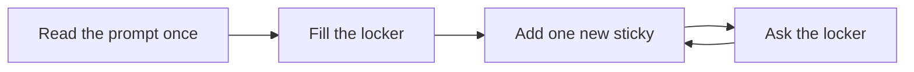
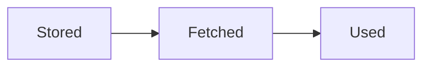
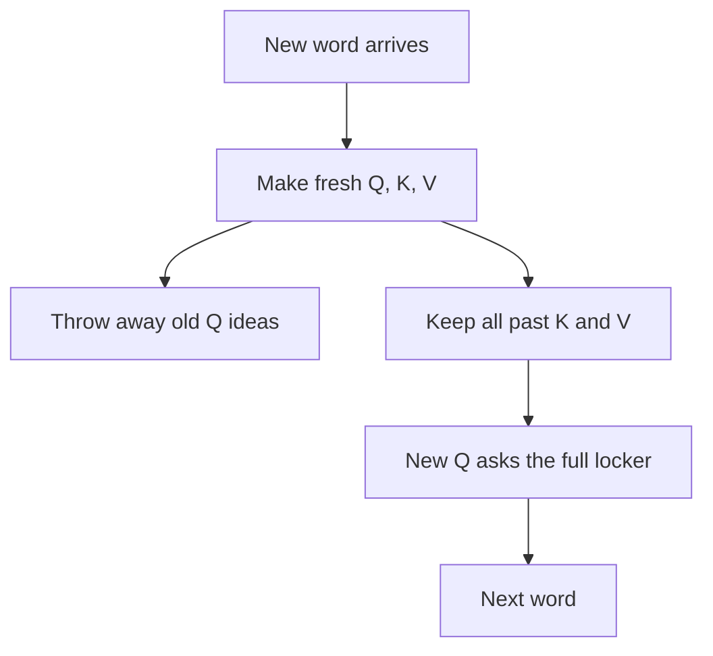
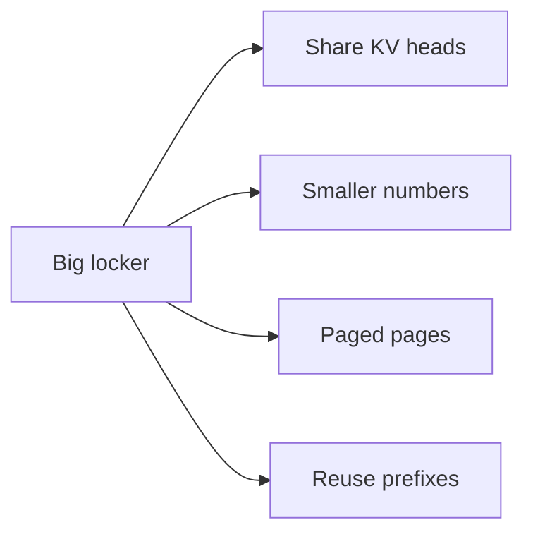

A chatbot answers **one word at a time**.

You type a long question. It starts typing back. Word. Word. Word.

Here is the trick people miss:

> The model should **not** re-read your whole chat from scratch for every new word.

That would feel like erasing the blackboard and rewriting every old sentence just to add one new letter.

The fix is a **locker of sticky notes**. Grown-ups call it the **KV cache**.



That is the whole idea. The rest of this post is sticky notes, a growing locker, and why memory gets tight.

An Instagram teaching reel by **@academy_thc** asked the same kid question in Hinglish: why does ChatGPT answer so fast, and what does KV cache actually buy you? We used that spark, then wrote our own simple walkthrough (and checked public explainers for the mechanics).

---

## Three sticky notes per word

Inside a transformer, each word (a **token**) gets three sticky notes:

| Note | Kid name | Job |
| --- | --- | --- |
| **Q** | Query | “What am I looking for?” |
| **K** | Key | “What label do I wear?” |
| **V** | Value | “What info do I carry?” |

Attention is a matching game:

1. The new word’s **Q** looks at every earlier word’s **K**.
2. Good matches get higher scores.
3. Those scores mix the matching words’ **V** notes into one answer for “what should I say next?”

Say it out loud:

> “Q asks. K labels. V carries.”


---

## Two phases: fill, then drip

Generation has two phases.

### Prefill — fill the locker

The model reads your **whole prompt** once.

For every prompt word it makes K and V notes and **stores** them.

Then it predicts the **first** output word.

Prefill is usually the big “wait before the first letter shows up” (time to first token).

### Decode — drip one word

For each new output word:

1. Make **q, k, v** for **only that new word**.
2. Put the new **k** and **v** into the locker.
3. Use the new **q** against **all** cached keys.
4. Mix the cached values.
5. Pick the next word.
6. Repeat.

Those past notes sit in fast GPU memory (**VRAM**). Decode uses them like this:



- **Stored** — old K and V sit in the locker.
- **Fetched** — pull them out of VRAM.
- **Used** — the new Q asks them.


---

## Why keep K and V, but not old Q?

This is the interview question.

To pick the **next** word, the model only needs a fresh **Q** for the **newest** word.

It still needs **every past K and V**, because the new Q must match against the whole history.

Old Q notes already did their job when those older words were predicted. They are not needed again for *this* next word.

Past K and V for a finished position **do not change**. So recompute them every step would be silly.



Say it out loud:

> “We cache Keys and Values. Not a QKV cache.”


---

## Without the locker (the slow story)

Imagine the prompt:

`The cat sat`

Without a cache, when the model adds `on`, it might redo K and V for:

`The` · `cat` · `sat` · `on`

Then for `the`:

`The` · `cat` · `sat` · `on` · `the`

…and so on. The stack grows. The redo grows. Wasteful.

Say it out loud:

> “More words means more work. Without the locker, each new word remakes every old sticky — twice the chat is way more than twice the redo.”

With a cache:

- Prefill already stored K/V for `The cat sat`.
- For `on`, only make new k/v for `on` and **append**.
- Ask the locker. Done.

| Path | Kid cost |
| --- | --- |
| **RECOMPUTE** | Remake every old sticky. Lots of redo. |
| **CACHE** | Keep old stickies. Pay locker space (VRAM) instead. |

Say it out loud:

> “Cache trades locker space for less redo. It is not free, and it is not magic zero-work.”


That is why streaming chat feels possible. Decode still has to **read** the growing locker, but it does not **rebuild** every old sticky from scratch.

---

## The tradeoff: the locker eats space

The locker lives in fast GPU memory (**VRAM** / HBM) while the answer is being written.

It grows with:

- how many words so far (prompt + answer)
- how many transformer layers (each layer has its own locker shelf)
- how many KV heads
- how many bytes per number (FP16, FP8, …)
- how many chats share the same GPU at once

Kid formula (rough shape):

> tokens × layers × 2 (K + V) × size-of-each-vector × bytes

Long context is often a **memory** problem before it is a math problem.

During decode, each new word often means **reading the whole locker again**. That is why long chats can get slower even when the “thinking” per new word looks small: the bottleneck is moving sticky notes, not inventing them.


Example sizes you will see in articles (not our stopwatch): for a big model at tens of thousands of tokens, the KV locker alone can be **many gigabytes per chat**. Batch many chats and the locker can rival the model weights.

We did **not** measure those figures on Intelliwise hardware. Treat them as teaching examples from public write-ups.

---

## How grown-ups shrink the locker

| Kid idea | Grown-up name | What it does |
| --- | --- | --- |
| Many askers share one key label | **MQA** / **GQA** | Fewer KV heads → smaller locker (GQA is common in modern open models) |
| Write smaller numbers on the stickies | **KV quantization** | FP8 / INT8 / INT4 cut bytes; tiny quality risk if done well |
| Rent locker pages only when needed | **PagedAttention** (e.g. vLLM) | Like OS virtual memory — less wasted empty space |
| Same opening paragraph for many users | **Prefix caching** | Reuse the locker for a shared system prompt / RAG prefix |
| Spill cold pages to cheaper shelves | **Offloading** | Keep hot stickies on GPU; park cold ones on CPU / disk |




---

## A tiny toy walkthrough

Toy only. No real customer data.

Prompt tokens:

```text
["The", "cat", "sat"]
```

**Prefill**

- Compute K and V for all three.
- Store them in the locker.
- Predict first output, say `on`.

**Decode step for `on`**

```text
q_on, k_on, v_on = project("on")
K = concat(K_cache, k_on)
V = concat(V_cache, v_on)
scores = q_on · K
mix = softmax(scores) · V
next_token = pick_from(mix)
```

Then append again for the next word. Same dance until the answer ends.

When the reply is finished, that chat’s locker can be **freed**. It is request memory, not a forever database.

---

## Honest caveats

- KV cache is an **inference** trick. Training has a different story.
- Caching K/V does **not** remove attention over history. It removes **recomputing** old K/V.
- Longer context still costs more memory and more locker reads.
- Prefix cache hits need **exact** matching token prefixes. One space change can miss.
- Example GB figures in articles depend on model size, GQA, precision, and length. Do not treat them as a promise for your laptop.

---

## Grown-up names (tiny box)

| Kid word | Grown-up name |
| --- | --- |
| Word piece | **token** |
| Looking-for sticky | **query (Q)** |
| Label sticky | **key (K)** |
| Info sticky | **value (V)** |
| Locker of past K/V | **KV cache** |
| Fast GPU shelf | **VRAM** / **HBM** |
| Read the prompt once | **prefill** |
| Drip one output word | **decode** |
| Wait before first letter | **TTFT** (time to first token) |
| Gap between letters | **ITL** / inter-token latency |
| Share KV across query heads | **MQA / GQA** |
| Rent locker pages | **PagedAttention** |
| Reuse shared openings | **prefix caching** |

---

## Sources and further reading

Public explainers we used while writing (mechanics, not our measurements):

- [KV Cache Explained (Learn Code Camp)](https://learncodecamp.net/kv-cache-explained/)
- [KV cache and context memory costs (Wes Kennedy)](https://wes.today/series/inference/what-happens/prefill-decode/kv-cache/)
- [KV cache concept note (ZeroEntropy)](https://zeroentropy.dev/concepts/kv-cache/)
- Instagram teaching reel by [@academy_thc](https://www.instagram.com/academy_thc/) ([reel](https://www.instagram.com/reel/DdnXKNVMbi4/)): ChatGPT feels fast because past Key/Value matrices are cached; without that, an autoregressive model would redo prior-token work for every new token. On-screen frames used **STORED → FETCHED → USED**, **RECOMPUTE** vs **CACHE**, and “more tokens = more work.” Inspiration only — full teaching is our rewrite.

---

## Say this back

**A chatbot answers one word at a time. It keeps past Keys and Values in a locker so it does not rebuild every old sticky for every new word. Fresh Queries still ask the whole locker. That makes streaming fast — and makes long chats hungry for GPU memory.**
