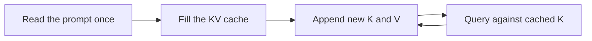
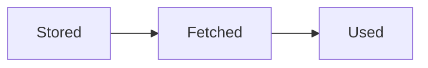
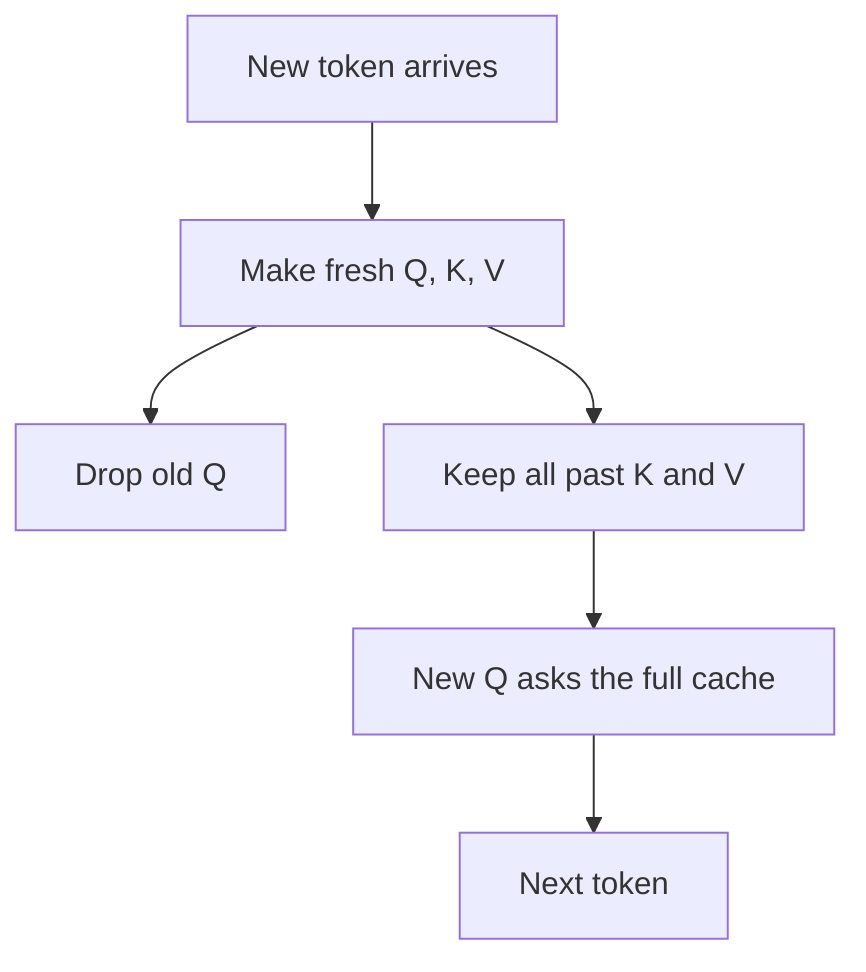
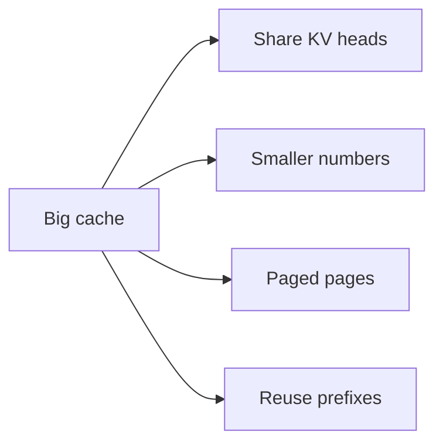

A chatbot answers **one token at a time**.

You type a long question. It starts typing back. Token. Token. Token.

The model should **not** recompute your whole chat from scratch for every new token.

That would mean redoing every old attention step just to add one new token.

The fix is a cache of past **Keys** and **Values**. That store is the **KV cache**.


```mermaid
flowchart LR
  A[Read the prompt once] --> B[Fill the KV cache]
  B --> C[Append new K and V]
  C --> D[Query against cached K]
  D --> C
```

That is the whole idea. The rest of this post is Q, K, V, a growing cache, and why memory gets tight.

---

## Three vectors per token

Inside a transformer, each token gets three vectors:

| Vector | Name | Job |
| --- | --- | --- |
| **Q** | Query | What am I looking for? |
| **K** | Key | What label do I wear? |
| **V** | Value | What info do I carry? |

Attention is a matching step:

1. The new token’s **Q** looks at every earlier token’s **K**.
2. Good matches get higher scores.
3. Those scores mix the matching tokens’ **V** vectors into one result for “what should I say next?”

Q asks. K labels. V carries.


---

## Two phases: prefill, then decode

Generation has two phases.

### Prefill — fill the cache

The model reads your **whole prompt** once.

For every prompt token it makes K and V vectors and **stores** them.

Then it predicts the **first** output token.

Prefill is usually the big “wait before the first token shows up” (time to first token).

### Decode — one token at a time

For each new output token:

1. Make **q, k, v** for **only that new token**.
2. Put the new **k** and **v** into the cache.
3. Use the new **q** against **all** cached keys.
4. Mix the cached values.
5. Pick the next token.
6. Repeat.

Those past vectors sit in fast GPU memory (**VRAM**). Decode uses them like this:


```mermaid
flowchart LR
  A[Stored] --> B[Fetched]
  B --> C[Used]
```

- **Stored** — old K and V sit in the cache.
- **Fetched** — pull them out of VRAM.
- **Used** — the new Q asks them.


---

## Why keep K and V, but not old Q?

This is the interview question.

To pick the **next** token, the model only needs a fresh **Q** for the **newest** token.

It still needs **every past K and V**, because the new Q must match against the whole history.

Old Q vectors already did their job when those older tokens were predicted. They are not needed again for *this* next token.

Past K and V for a finished position **do not change**. So recomputing them every step would be wasteful.


```mermaid
flowchart TB
  A[New token arrives] --> B[Make fresh Q, K, V]
  B --> C[Drop old Q]
  B --> D[Keep all past K and V]
  D --> E[New Q asks the full cache]
  E --> F[Next token]
```

We cache Keys and Values. Not a QKV cache.


---

## Without the cache (the slow story)

Imagine the prompt:

`The cat sat`

Without a cache, when the model adds `on`, it might redo K and V for:

`The` · `cat` · `sat` · `on`

Then for `the`:

`The` · `cat` · `sat` · `on` · `the`

…and so on. The sequence grows. The redo grows. Wasteful.

More tokens means more work. Without the cache, each new token remakes every old K and V — twice the chat is way more than twice the redo.

With a cache:

- Prefill already stored K/V for `The cat sat`.
- For `on`, only make new k/v for `on` and **append**.
- Query the cache. Done.

| Path | Cost |
| --- | --- |
| **RECOMPUTE** | Remake every old K and V. Lots of redo. |
| **CACHE** | Keep old K and V. Pay GPU memory (VRAM) instead. |

Cache trades GPU memory for less recompute. It is not free, and it is not magic zero-work.


That is why streaming chat feels possible. Decode still has to **read** the growing cache, but it does not **rebuild** every old K and V from scratch.

---

## The tradeoff: the cache eats space

The cache lives in fast GPU memory (**VRAM** / HBM) while the answer is being written.

It grows with:

- how many tokens so far (prompt + answer)
- how many transformer layers (each layer has its own cache)
- how many KV heads
- how many bytes per number (FP16, FP8, …)
- how many chats share the same GPU at once

Rough shape:

> tokens × layers × 2 (K + V) × size-of-each-vector × bytes

Long context is often a **memory** problem before it is a math problem.

During decode, each new token often means **reading the whole cache again**. That is why long chats can get slower even when the “thinking” per new token looks small: the bottleneck is moving K and V, not inventing them.


Example sizes you will see in articles (not our stopwatch): for a big model at tens of thousands of tokens, the KV cache alone can be **many gigabytes per chat**. Batch many chats and the cache can rival the model weights.

We did **not** measure those figures on Intelliwise hardware. Treat them as teaching examples from public write-ups.

---

## How people shrink the cache

| Idea | Name | What it does |
| --- | --- | --- |
| Many query heads share one key | **MQA** / **GQA** | Fewer KV heads → smaller cache (GQA is common in modern open models) |
| Store smaller numbers | **KV quantization** | FP8 / INT8 / INT4 cut bytes; tiny quality risk if done well |
| Allocate cache pages only when needed | **PagedAttention** (e.g. vLLM) | Like OS virtual memory — less wasted empty space |
| Same opening tokens for many users | **Prefix caching** | Reuse the cache for a shared system prompt / RAG prefix |
| Spill cold pages to cheaper memory | **Offloading** | Keep hot K/V on GPU; park cold ones on CPU / disk |


```mermaid
flowchart LR
  A[Big cache] --> B[Share KV heads]
  A --> C[Smaller numbers]
  A --> D[Paged pages]
  A --> E[Reuse prefixes]
```


---

## A tiny toy walkthrough

Toy only. No real customer data.

Prompt tokens:

```text
["The", "cat", "sat"]
```

**Prefill**

- Compute K and V for all three.
- Store them in the cache.
- Predict first output, say `on`.

**Decode step for `on`**

```text
q_on, k_on, v_on = project("on")
K = concat(K_cache, k_on)
V = concat(V_cache, v_on)
scores = q_on · K
mix = softmax(scores) · V
next_token = pick_from(mix)
```

Then append again for the next token. Same dance until the answer ends.

When the reply is finished, that chat’s cache can be **freed**. It is request memory, not a forever database.

---

## Honest caveats

- KV cache is an **inference** trick. Training has a different story.
- Caching K/V does **not** remove attention over history. It removes **recomputing** old K/V.
- Longer context still costs more memory and more cache reads.
- Prefix cache hits need **exact** matching token prefixes. One space change can miss.
- Example GB figures in articles depend on model size, GQA, precision, and length. Do not treat them as a promise for your laptop.

---

## Terms used in this post

| Term | Meaning |
| --- | --- |
| **token** | Word piece the model reads or writes |
| **query (Q)** | “What am I looking for?” |
| **key (K)** | “What label do I wear?” |
| **value (V)** | “What info do I carry?” |
| **KV cache** | Stored past K and V |
| **VRAM** / **HBM** | Fast GPU memory |
| **prefill** | Read the prompt once and fill the cache |
| **decode** | Emit one output token at a time |
| **TTFT** | Time to first token |
| **ITL** | Inter-token latency — gap between tokens |
| **MQA / GQA** | Share KV across query heads |
| **PagedAttention** | Allocate cache pages on demand |
| **prefix caching** | Reuse a shared prompt prefix |

---

## Sources and further reading

Public explainers we used while writing (mechanics, not our measurements):

- [KV Cache Explained (Learn Code Camp)](https://learncodecamp.net/kv-cache-explained/)
- [KV cache and context memory costs (Wes Kennedy)](https://wes.today/series/inference/what-happens/prefill-decode/kv-cache/)
- [KV cache concept note (ZeroEntropy)](https://zeroentropy.dev/concepts/kv-cache/)

---

## In short

**A chatbot answers one token at a time. It keeps past Keys and Values in a cache so it does not rebuild every old K and V for every new token. Fresh Queries still ask the whole cache. That makes streaming fast — and makes long chats hungry for GPU memory.**
