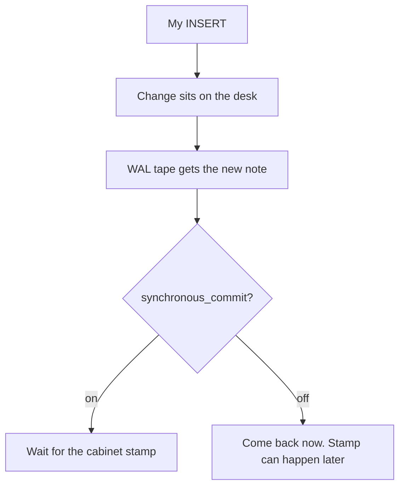

A durable save can feel **slow**.

I write one lunch note. I wait. I write the next. I wait again.

I wanted to know what that wait is *made of* — on **my** box, with **my** stopwatch.

So I started **Postgres 16** in Docker. I made a toy `lunch_notes` table. I ran a tiny Python load script. I counted **commits per minute** (RPM) for **12 seconds** at a time.


That is the whole trick. The rest of this post is a desk, a locked cabinet, a wait knob, a bus of notes, and four kids writing together.

---

## Why I cared

A **durable** save means: if the lights go out, the note is still there.

Memory is a **desk**. Disk is a **locked cabinet**.

- Paper on the desk is fast.
- Paper on the desk forgets when power dies.
- A stamp into the cabinet is the expensive wait.

I did not want a story from someone else’s laptop. I wanted **this** Docker notebook, on **this** shared box, with numbers I can point at.

---

## I started Postgres in Docker

Port **5432** was already busy on the box. So I bound the container to **127.0.0.1:55432**.

Local disposable login only: user `demo`, password `demo`, database `lunchbox`.

```bash
sudo docker run -d --name intelliwise-pg-demo \
  -p 127.0.0.1:55432:5432 \
  -e POSTGRES_PASSWORD=demo \
  -e POSTGRES_USER=demo \
  -e POSTGRES_DB=lunchbox \
  postgres:16
```

The image reported **PostgreSQL 16.15**. Default `synchronous_commit` was **on**. WAL level was **replica**.


Say it out loud:

> “The notebook lives in a box on my machine. Port 55432 is the door.”

---

## Desk vs cabinet

Postgres **always** writes a **WAL** — a write-ahead log. Think of a tape of every change.

The wait knob is **not** “do we have a log?”

The wait knob is **does `COMMIT` sit still until that log is stamped into the cabinet?**

That knob is `synchronous_commit`.



| Kid idea | What I set |
| --- | --- |
| Wait for the cabinet every commit | `SET synchronous_commit = on` |
| Do not wait. Stamp later | `SET synchronous_commit = off` |

**Off** does **not** mean “no WAL.” The tape is still written. `COMMIT` just stops waiting for the locked cabinet.

Official caution, short: if the machine or the database crashes before the flush, you can lose the **last** commits. The notebook should not go silly. The newest tickets can still vanish.

Say it out loud:

> “On the desk is not the same as in the cabinet.”

---

## Baseline: wait for every stamp

First run. The careful setting.

- `synchronous_commit = on`
- one client
- one row, then `COMMIT`
- **12.0** seconds

I counted **49,892** commits. That is **249,454.2** RPM, or about **4,157.6** commits a second.


Every **2.0** seconds the script printed a window. Those windows bounced around **235,995.8** to **271,250.4** RPM. The number I cite is the full **12.0 s** run: **249,454.2**.

That is already a lot of tickets. The box is a shared **8**-CPU VM with **15.6 GiB** of RAM. Fast local Docker storage. A Python client. So this baseline is “my loop,” not a promise for your laptop.

---

## I turned the wait knob off

Same pattern. One row. One commit. Only the knob changed.

- `SET synchronous_commit = off`
- **12.0** seconds
- **56,593** commits
- **282,964.0** RPM
- about **1.13×** the baseline (**1.134×**)


The lift was **small** here.

That is honest. On this box the Python client and the localhost round-trip already limit how fast one row can commit. The disk stamp was not the only wait. Fast Docker storage also makes the cabinet cheaper than a slow laptop disk.

The risk is still real:

> If the OS or the database crashes before WAL flush, those last commits can disappear.

Say it out loud:

> “Off is a dare. Here it was only about 1.13 times faster.”

---

## Many notes, one bus

Picture a **narrow bridge**.

If every kid walks alone, the bridge is empty most of the second. If a **bus** carries fifty kids, one crossing serves a whole class.

That is **batching**. Fifty lunch notes. **One** `COMMIT`.

- `synchronous_commit = on` (cabinet wait is back on)
- `executemany` **50** rows, then one commit
- **12.001** seconds
- **14,560** commits
- **728,000** rows
- **3,639,835.0** **row** RPM
- commit RPM was only **72,796.7**


This was the **big climb**.

Row RPM was about **14.59×** the baseline commit RPM. I paid the expensive stamp once per bus, not once per kid.

The tickets are still real. The cabinet only got one stamp for the group.

Say it out loud:

> “I did not make the stamp free. I stopped paying it for every single note.”

---

## Four kids writing at once

Then I kept the careful knob and added friends.

- `synchronous_commit = on`
- **4** Python clients
- each client still does one row, then `COMMIT`
- **12.014** seconds
- **79,064** commits together
- **394,865.3** RPM
- about **1.58×** the baseline (**1.583×**)


Four writers helped. They did **not** help like batching helped.

Postgres can take more than one writer. My Python loop still has to talk, wait, and come back. Four loops share the work. Fifty notes on one bus skip most of the trips.

---

## A peek at the stats

After the ladder I asked Postgres two grown-up notebooks: `pg_stat_bgwriter` and `pg_stat_database`. I also asked **EXPLAIN** on a toy `INSERT` — the plan, not a new stopwatch.


Numbers from **after** that same load ladder (`lunchbox`):

| Notebook | What I saw |
| --- | --- |
| `pg_stat_bgwriter` | timed checkpoints **0**, requested checkpoints **1**, buffers at checkpoint **923**, buffers from backends **8,488**, buffers allocated **11,739** |
| `pg_stat_database` | commits **237,574**, rollbacks **8**, rows inserted **951,005**, block hits **3,258,591**, block reads **238** |

Those counters are the whole afternoon on that database, not one 12-second mode. Lots of hits. Almost no reads. The desk already had the pages.

---

## The four runs on one card

Cite these. They are the **12 s** runs.

| What I changed | Setting | What I counted | This run |
| --- | --- | --- | ---: |
| Baseline | sync **on**, 1 row / commit, 1 client | commit RPM | **249,454.2** |
| Wait knob off | sync **off**, same pattern | commit RPM | **282,964.0** (~**1.13×**) |
| Batching | sync **on**, **50** rows / commit | **row** RPM | **3,639,835.0** |
| Batching (same) | (same) | commit RPM | 72,796.7 |
| Four clients | sync **on**, 4 clients, 1 row / commit | commit RPM | **394,865.3** (~**1.58×**) |

RPM means “this many a minute,” guessed from a short wall-clock window. For batching, the headline is **rows** per minute. The others are **commits** per minute.

---

## A tiny toy notebook

Pretend a class list. Toy names. No real people. No production schema.

```sql
CREATE TABLE lunch_notes (
  id bigserial PRIMARY KEY,
  kid text NOT NULL,
  snack text NOT NULL,
  noted_at timestamptz NOT NULL DEFAULT now()
);
```

Baseline — wait for the cabinet, one note at a time:

```sql
SET synchronous_commit = on;

BEGIN;
INSERT INTO lunch_notes (kid, snack) VALUES ('Sam', 'apple');
COMMIT;
```

Same toy, the wait knob off (can lose recent commits on crash before WAL flush):

```sql
SET synchronous_commit = off;

BEGIN;
INSERT INTO lunch_notes (kid, snack) VALUES ('Sam', 'apple');
COMMIT;
```

Same toy, fifty notes, one stamp:

```sql
SET synchronous_commit = on;

BEGIN;
-- 50 inserts in one go (I used Python executemany)
INSERT INTO lunch_notes (kid, snack) VALUES
  ('Sam', 'apple'),
  ('Alex', 'pear');
  -- ...48 more rows...
COMMIT;
```

A peek at the plan (it does **not** run a load test):

```sql
EXPLAIN
INSERT INTO lunch_notes (kid, snack) VALUES ('Sam', 'apple');
```

These snippets match the settings I used. They are **not** a second stopwatch.

---

## Honest caveats

- **These numbers are one run.** Shared **8**-vCPU VM. **15.6 GiB** RAM. Other containers were up. Expect the next run to wiggle.
- **Port 5432 was already in use.** The demo door was **127.0.0.1:55432**.
- **The client is Python 3.13** with **psycopg 3.3.6**. Talking from Python is part of the wait. That is why sync-off only reached about **1.13×**.
- **Local Docker storage was fast.** A slow laptop disk can make the cabinet wait look much bigger.
- **`synchronous_commit = off` can lose recent work** if the OS or the database crashes before WAL flush. Official docs say this. I still used it as a teaching knob.
- **Batching changed the unit.** **3,639,835.0** is **row** RPM. Baseline **249,454.2** is **commit** RPM. Do not mix those two and call it magic.
- **RPM is extrapolated** from 12-second windows printed every 2 seconds.
- **Demo login is disposable.** `demo` / `demo` / `lunchbox`. Not a real password. Not a public server.
- I am **not** promising these RPM numbers on your machine.

---

## Grown-up names (tiny box)

You do not need this to get the story. It is here so the robot talks make sense later.

| Kid word | Grown-up name |
| --- | --- |
| Lunch notebook | **PostgreSQL 16** in Docker (`postgres:16`) |
| Door on my box | **127.0.0.1:55432** → container **5432** |
| Log tape | **WAL** (write-ahead log) |
| Paper on the desk | memory / OS buffers |
| Stamp into the locked cabinet | WAL **flush** / durable wait |
| Wait-for-cabinet knob | **`synchronous_commit`** |
| Many notes, one stamp | **batching** / group commit |
| Four kids writing | **4 client threads** |
| Commits (or rows) per minute | **RPM** |
| Commits per second | **TPS** |
| Homework plan, no load test | **EXPLAIN** |
| Background stamp helper | **`pg_stat_bgwriter`** |
| Database counters | **`pg_stat_database`** |

---

Official references (Postgres docs only):

- [Write-Ahead Logging (WAL)](https://www.postgresql.org/docs/current/wal-intro.html)
- [`synchronous_commit`](https://www.postgresql.org/docs/current/runtime-config-wal.html#GUC-SYNCHRONOUS-COMMIT)
- [WAL reliability](https://www.postgresql.org/docs/current/wal-reliability.html)
- [EXPLAIN](https://www.postgresql.org/docs/current/sql-explain.html)
- [The Statistics Collector](https://www.postgresql.org/docs/current/monitoring-stats.html)

---

## Say this back

**A durable Postgres save waits for the WAL stamp. The log is always there. `synchronous_commit` only chooses whether COMMIT waits. On my Docker run, turning the wait off was a small lift (~1.13×). Putting 50 notes on one bus was the big climb (~3.64M row RPM). Four clients helped (~1.58×). These are my 12-second numbers on a shared VM — not a promise.**
