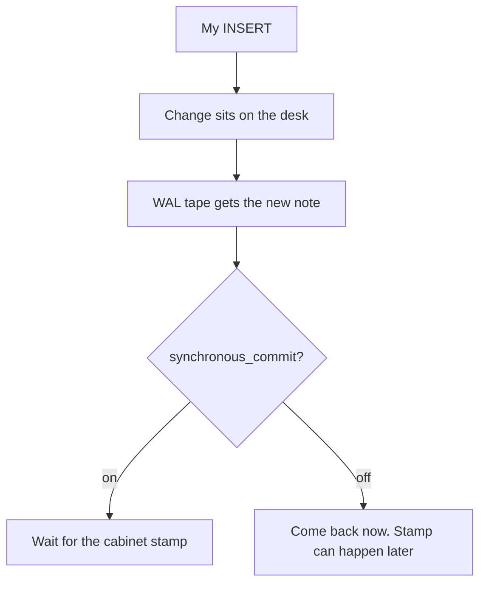

A durable save can feel **slow**. I write one lunch note. I wait. I write the next. I wait again.

I wanted numbers from **this** box, not a story from someone else's laptop. So I started **Postgres 16** in Docker, made a toy `lunch_notes` table, and ran a tiny Python load script. I counted **commits per minute** (RPM) for **12 seconds** at a time.

## Desk vs cabinet

A **durable** save means: if the lights go out, the note is still there.

- Memory is a **desk**. Fast. Forgets when power dies.
- Disk is a **locked cabinet**. The stamp into the cabinet is the expensive wait.

Postgres **always** writes a **WAL** (write-ahead log) — a tape of every change. The wait knob is not “do we have a log?” It is: does `COMMIT` sit still until that tape is stamped into the cabinet?

That knob is `synchronous_commit`.


```mermaid
flowchart TB
  A[My INSERT] --> B[Change sits on the desk]
  B --> C[WAL tape gets the new note]
  C --> D{synchronous_commit?}
  D -->|on| E[Wait for the cabinet stamp]
  D -->|off| F[Come back now. Stamp can happen later]
```

| Kid idea | What I set |
| --- | --- |
| Wait for the cabinet every commit | `SET synchronous_commit = on` |
| Do not wait. Stamp later | `SET synchronous_commit = off` |

**Off** does **not** mean “no WAL.” The tape is still written. `COMMIT` just stops waiting for the locked cabinet. If the machine or the database crashes before the flush, you can lose the **last** commits. The notebook should not go silly. The newest tickets can still vanish.

## Docker setup

Port **5432** was already busy, so I bound the container to **127.0.0.1:55432**.

Disposable login only: user `demo`, password `demo`, database `lunchbox`.

```bash
sudo docker run -d --name intelliwise-pg-demo \
  -p 127.0.0.1:55432:5432 \
  -e POSTGRES_PASSWORD=demo \
  -e POSTGRES_USER=demo \
  -e POSTGRES_DB=lunchbox \
  postgres:16
```

The image reported **PostgreSQL 16.15**. Default `synchronous_commit` was **on**. WAL level was **replica**.


## Four runs

Same toy table. Same ~12 second stopwatch. One change at a time. Shared VM, Python client — “my loop,” not a promise for your laptop.

**1. Baseline** — wait for every stamp

- `synchronous_commit = on`, 1 client, 1 row then `COMMIT`, **12.0** s
- **49,892** commits (~**4,157.6** a second)
- Every **2.0** s the script printed a window. Those bounced **235,995.8** to **271,250.4** RPM. I cite the full **12.0** s run.

**2. Wait knob off** — same pattern, only the knob

- `SET synchronous_commit = off`, **12.0** s
- **56,593** commits
- Small lift. Talking from Python on localhost and back was already a wait. The disk stamp was not the only wait. Fast Docker storage also makes the cabinet cheaper than a slow laptop disk.
- If the OS or the database crashes before WAL flush, those last commits can disappear.


**3. Batching** — fifty notes, one bus

A **narrow bridge**: one kid at a time leaves it empty. A bus of fifty kids crosses once.

- `synchronous_commit = on`, `executemany` **50** rows then one `COMMIT`, **12.001** s
- **14,560** commits, **728,000** rows
- Row RPM was about **14.59×** the baseline *commit* RPM. I did not make the stamp free. I paid it once per bus.


**4. Four clients** — careful knob, more writers

- `synchronous_commit = on`, **4** Python clients, each still 1 row then `COMMIT`, **12.014** s
- **79,064** commits together
- Four writers helped. They did not help like batching helped. Four loops share the wait. Fifty notes on one bus skip most of the trips.


### The 12-second card

| What I changed | Setting | What I counted | This run |
| --- | --- | --- | ---: |
| Baseline | sync **on**, 1 row / commit, 1 client | commit RPM | **249,454.2** |
| Wait knob off | sync **off**, same pattern | commit RPM | **282,964.0** (~**1.13×**, **1.134×**) |
| Batching | sync **on**, **50** rows / commit | **row** RPM | **3,639,835.0** |
| Batching (same) | (same) | commit RPM | 72,796.7 |
| Four clients | sync **on**, 4 clients, 1 row / commit | commit RPM | **394,865.3** (~**1.58×**, **1.583×**) |

RPM means “this many a minute,” guessed from a short wall-clock window. For batching, the headline is **rows** per minute. The others are **commits** per minute.

### Stats after the ladder

I asked `pg_stat_bgwriter` and `pg_stat_database` on `lunchbox`. I also asked **EXPLAIN** on a toy `INSERT` — the plan, not a new stopwatch.

| Notebook | What I saw |
| --- | --- |
| `pg_stat_bgwriter` | timed checkpoints **0**, requested checkpoints **1**, buffers at checkpoint **923**, buffers from backends **8,488**, buffers allocated **11,739** |
| `pg_stat_database` | commits **237,574**, rollbacks **8**, rows inserted **951,005**, block hits **3,258,591**, block reads **238** |

Those counters are the whole afternoon on that database, not one 12-second mode. Lots of hits. Almost no reads. The desk already had the pages.

## Toy SQL

Toy names. No real people. No production schema.

```sql
CREATE TABLE lunch_notes (
  id bigserial PRIMARY KEY,
  kid text NOT NULL,
  snack text NOT NULL,
  noted_at timestamptz NOT NULL DEFAULT now()
);

-- 1. Baseline: wait for the cabinet, one note
SET synchronous_commit = on;
BEGIN;
INSERT INTO lunch_notes (kid, snack) VALUES ('Sam', 'apple');
COMMIT;

-- 2. Wait knob off (can lose recent commits on crash before WAL flush)
SET synchronous_commit = off;
BEGIN;
INSERT INTO lunch_notes (kid, snack) VALUES ('Sam', 'apple');
COMMIT;

-- 3. Fifty notes, one stamp (I used Python executemany)
SET synchronous_commit = on;
BEGIN;
INSERT INTO lunch_notes (kid, snack) VALUES
  ('Sam', 'apple'),
  ('Alex', 'pear');
  -- ...48 more rows...
COMMIT;

-- Plan only. Not a load test.
EXPLAIN
INSERT INTO lunch_notes (kid, snack) VALUES ('Sam', 'apple');
```

These snippets match the settings I used. They are **not** a second stopwatch.

## Honest caveats

- **One run.** Shared **8**-CPU / **8**-vCPU VM. **15.6 GiB** RAM. Other containers were up. Expect the next run to wiggle.
- **Port 5432 was already in use.** The demo door was **127.0.0.1:55432**.
- **The client is Python 3.13** with **psycopg 3.3.6**. Talking from Python is part of the wait. That is why sync-off only reached about **1.13×**.
- **Local Docker storage was fast.** A slow laptop disk can make the cabinet wait look much bigger.
- **`synchronous_commit = off` can lose recent work** if the OS or the database crashes before WAL flush. Official docs say this. I still used it as a teaching knob.
- **Batching changed the unit.** **3,639,835.0** is **row** RPM. Baseline **249,454.2** is **commit** RPM. Do not mix those two and call it magic.
- **RPM is guessed** from 12-second windows printed every 2 seconds.
- **Demo login is disposable.** `demo` / `demo` / `lunchbox`. Not a real password. Not a public server.
- I am **not** promising these RPM numbers on your machine.

## Grown-up names

You do not need this to get the story.

| Kid word | Grown-up name |
| --- | --- |
| Lunch notebook | **PostgreSQL 16** in Docker (`postgres:16`) |
| Door on my box | **127.0.0.1:55432** → container **5432** |
| Log tape | **WAL** (write-ahead log) |
| Paper on the desk | memory / OS buffers |
| Stamp into the locked cabinet | WAL **flush** / durable wait |
| Wait-for-cabinet knob | **`synchronous_commit`** |
| Many notes, one stamp | **batching** / group commit |
| Four kids writing | **4 client threads** |
| Commits (or rows) per minute | **RPM** |
| Commits per second | **TPS** |
| Homework plan, no load test | **EXPLAIN** |
| Background stamp helper | **`pg_stat_bgwriter`** |
| Database counters | **`pg_stat_database`** |

Official references (Postgres docs only):

- [Write-Ahead Logging (WAL)](https://www.postgresql.org/docs/current/wal-intro.html)
- [`synchronous_commit`](https://www.postgresql.org/docs/current/runtime-config-wal.html#GUC-SYNCHRONOUS-COMMIT)
- [WAL reliability](https://www.postgresql.org/docs/current/wal-reliability.html)
- [EXPLAIN](https://www.postgresql.org/docs/current/sql-explain.html)
- [The Statistics Collector](https://www.postgresql.org/docs/current/monitoring-stats.html)

## Say this back

**A durable Postgres save waits for the WAL stamp. The log is always there. `synchronous_commit` only chooses whether COMMIT waits. On my Docker run, turning the wait off was a small lift (~1.13×). Putting 50 notes on one bus was the big climb (~3.64M row RPM). Four clients helped (~1.58×). These are my 12-second numbers on a shared VM — not a promise.**
