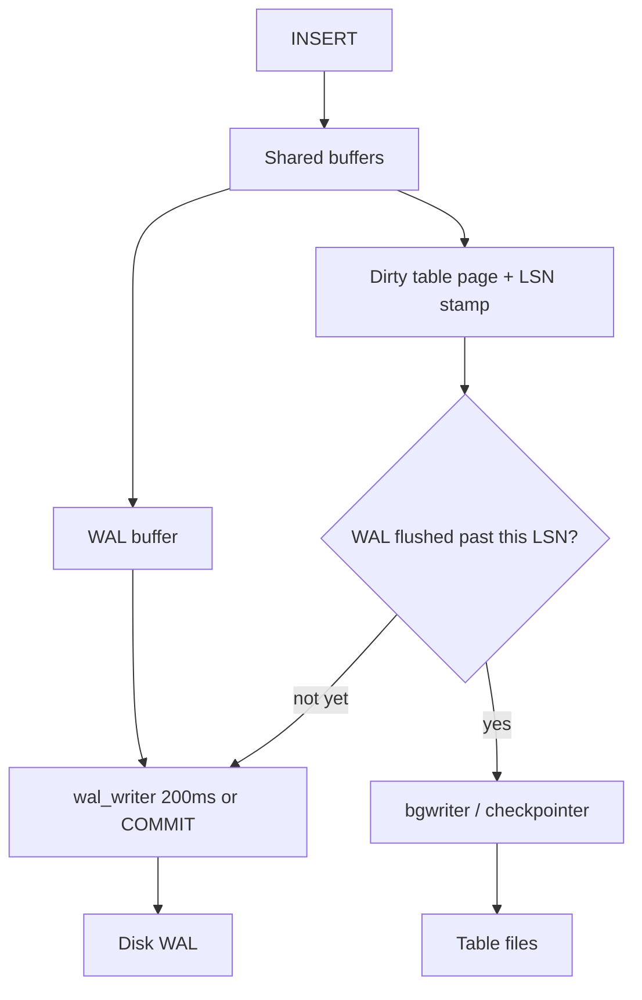
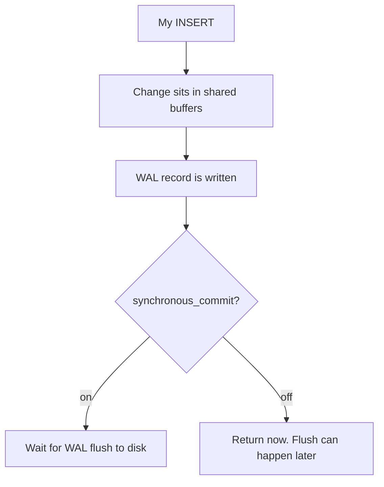

A durable write can feel **slow**. I insert one row. I wait. I insert the next. I wait again.

I wanted numbers from **this** machine, not a story from someone else's laptop. So I started **Postgres 16** in Docker, made a toy `lunch_notes` table, and ran a small Python load script. I counted **commits per minute** (RPM) for **12 seconds** at a time.

Before the stopwatch: what a write actually does.

## Foundation — what happens on a write

A row does **not** go straight to disk.

First it lands in **shared buffers** — RAM that the whole instance shares.

From there, **two jobs start at the same time**. They do not wait for each other.


### Job 1: WAL

- A **WAL record** is written into the **WAL buffer** — still memory.
- Later that record is flushed to the **WAL on disk**.
- A helper called **`wal_writer`** wakes on a timer (`wal_writer_delay`, default **200 ms**) and flushes what it can.
- **`COMMIT`** can also force a flush **right now**.

### Job 2: the dirty page

- The **table page** in shared buffers is now **dirty** (it has a change that is not on disk yet).
- Later the **background writer** or the **checkpointer** copies that page into the **table files**.
- The background writer wakes every **200 ms** (`bgwriter_delay`). It also wakes when shared buffers are getting full (**buffer pressure**).

### The LSN gate

The two jobs can run at different speeds. The **on-disk order** is still strict.

Postgres stamps every dirty page with an **LSN** — the WAL position of the record that changed it.

How the gate works:

- A dirty page in shared buffers holds an **LSN**. That is the WAL position of the record that changed it.
- The WAL stream is a line of records with **increasing** LSNs: 10, then 20, then 30, then 42…
- Before that page may be written to the **table file on disk**, Postgres asks one question: has WAL been flushed **at least past this page's LSN**?
- If the flush is still behind, the page **waits at the gate**. It does not sneak into the table files.
- When the WAL flush catches up past that LSN, the gate opens. Then the page may hit the table files.


| At the gate | What it means |
| --- | --- |
| Page **LSN** | WAL position stamped on this dirty page |
| WAL **flush position** | how far WAL has been flushed to disk |
| Flush **behind** the page LSN | page waits |
| Flush **past** the page LSN | page may write to the table files |

Before the background writer or the checkpointer writes a page to the table files, it looks at the **WAL flush position**.

- If that LSN is **already** on disk in WAL: write the page.
- If it is **not** on disk yet: **flush WAL first**, then write the page.

You cannot write the table page to disk until the matching WAL record is already on disk. Crash recovery can replay WAL. It cannot invent a page that WAL never mentioned.


```mermaid
flowchart TB
  A[INSERT] --> B[Shared buffers]
  B --> C[WAL buffer]
  B --> D[Dirty table page + LSN stamp]
  C --> E["wal_writer 200ms or COMMIT"]
  E --> F[Disk WAL]
  D --> G{WAL flushed past this LSN?}
  G -->|not yet| E
  G -->|yes| H[bgwriter / checkpointer]
  H --> I[Table files]
```

### Helpers at a glance

| Helper | When it wakes | What it writes |
| --- | --- | --- |
| `wal_writer` | every **200 ms** (`wal_writer_delay`), and **COMMIT** can force it | WAL buffer → WAL on disk |
| background writer | every **200 ms** (`bgwriter_delay`), and when shared buffers are full | dirty pages → table files (after the LSN gate) |
| checkpointer | on its own checkpoint schedule | a bigger pile of dirty pages → table files (same LSN gate) |

### The wait knob

`synchronous_commit` only changes whether **you** wait for WAL to reach disk.

| Knob | What COMMIT does |
| --- | --- |
| **on** | Wait until WAL is on **disk**. |
| **off** | Return now. COMMIT returns once the WAL record is in the **OS page cache** (memory). It does not wait for the disk flush. |

What **off** changes, and what it does not:

- The commit session no longer waits for WAL to reach **disk**.
- COMMIT returns once the WAL record is in the **OS page cache** (memory).
- This only affects the **commit wait**.
- The **LSN gate** between shared buffers and table files still applies **exactly the same** whether the knob is on or off. Dirty pages still cannot hit table files until WAL is flushed past their LSN.

**Off** is not "skip WAL." WAL is still written. You just stop waiting. Think fire-and-forget, like UDP. If the machine crashes, the newest commits can vanish.

### Why batching is cheaper

Each **COMMIT** can force a disk sync of WAL.

- 50 rows, 50 commits = **50** WAL flushes.
- 50 rows, **one** commit = **one** WAL flush.

Batching only groups **WAL records**. You get fewer, larger WAL disk writes — one COMMIT flush for many rows.

It does **not** batch how **table pages** (the heap) are written to disk. Those dirty pages still sit in shared buffers. The background writer still flushes them on its own schedule, one page at a time, and each of those writes still goes through the **LSN gate**.

The four runs below keep the durable wait **on**, then flip the knob, then put fifty rows in one commit.

## What COMMIT waits for

You already saw shared buffers and the two disk paths. The four runs only flip one knob: does **COMMIT** wait for the **WAL** flush to disk?


```mermaid
flowchart TB
  A[My INSERT] --> B[Change sits in shared buffers]
  B --> C[WAL record is written]
  C --> D{synchronous_commit?}
  D -->|on| E[Wait for WAL flush to disk]
  D -->|off| F[Return now. Flush can happen later]
```

**Off** does **not** mean “no WAL.” WAL is still written. `COMMIT` just stops waiting for the disk flush. If the machine or the database crashes before the flush, you can lose the **last** commits. Crash recovery still works. The newest commits can still vanish.

## Docker setup

Port **5432** was already busy, so I bound the container to **127.0.0.1:55432**.

Disposable login only: user `demo`, password `demo`, database `lunchbox`.

```bash
sudo docker run -d --name intelliwise-pg-demo \
  -p 127.0.0.1:55432:5432 \
  -e POSTGRES_PASSWORD=demo \
  -e POSTGRES_USER=demo \
  -e POSTGRES_DB=lunchbox \
  postgres:16
```

The image reported **PostgreSQL 16.15**. Default `synchronous_commit` was **on**. WAL level was **replica**.


## Four runs

Same toy table. Same ~12 second window. One change at a time. Shared VM, Python client — this is my loop, not a promise for your laptop.

**1. Baseline** — wait for every WAL flush

- `synchronous_commit = on`, 1 client, 1 row then `COMMIT`, **12.0** s
- **49,892** commits (~**4,157.6** a second)
- Every **2.0** s the script printed a window. Those bounced **235,995.8** to **271,250.4** RPM. I report the full **12.0** s run.

**2. Wait knob off** — same pattern, only the knob

- `SET synchronous_commit = off`, **12.0** s
- **56,593** commits
- Small lift. Talking from Python on localhost and back was already a wait. The disk flush was not the only wait. Fast Docker storage also makes the flush cheaper than a slow laptop disk.
- If the OS or the database crashes before WAL flush, those last commits can disappear.


**3. Batching** — fifty rows, one commit

One row per commit pays the flush every time. Fifty rows in one commit pay it once.

- `synchronous_commit = on`, `executemany` **50** rows then one `COMMIT`, **12.001** s
- **14,560** commits, **728,000** rows
- Row RPM was about **14.59×** the baseline *commit* RPM. I did not make the flush free. I paid it once per batch.


**4. Four clients** — wait still on, more writers

- `synchronous_commit = on`, **4** Python clients, each still 1 row then `COMMIT`, **12.014** s
- **79,064** commits together
- Four writers helped. They did not help like batching helped. Four loops still wait on each commit. Fifty rows in one commit skip most of those waits.


### The 12-second card

| What I changed | Setting | What I counted | This run |
| --- | --- | --- | ---: |
| Baseline | sync **on**, 1 row / commit, 1 client | commit RPM | **249,454.2** |
| Wait knob off | sync **off**, same pattern | commit RPM | **282,964.0** (~**1.13×**, **1.134×**) |
| Batching | sync **on**, **50** rows / commit | **row** RPM | **3,639,835.0** |
| Batching (same) | (same) | commit RPM | 72,796.7 |
| Four clients | sync **on**, 4 clients, 1 row / commit | commit RPM | **394,865.3** (~**1.58×**, **1.583×**) |

RPM means “this many a minute,” guessed from a short wall-clock window. For batching, the headline is **rows** per minute. The others are **commits** per minute.

### Stats after the ladder

I asked `pg_stat_bgwriter` and `pg_stat_database` on `lunchbox`. I also asked **EXPLAIN** on a toy `INSERT` — the plan, not a new stopwatch.

| View | What I saw |
| --- | --- |
| `pg_stat_bgwriter` | timed checkpoints **0**, requested checkpoints **1**, buffers at checkpoint **923**, buffers from backends **8,488**, buffers allocated **11,739** |
| `pg_stat_database` | commits **237,574**, rollbacks **8**, rows inserted **951,005**, block hits **3,258,591**, block reads **238** |

Those counters are the whole afternoon on that database, not one 12-second mode. Lots of hits. Almost no reads. Shared buffers already had the pages.

## Toy SQL

Toy names. No real people. No production schema.

```sql
CREATE TABLE lunch_notes (
  id bigserial PRIMARY KEY,
  kid text NOT NULL,
  snack text NOT NULL,
  noted_at timestamptz NOT NULL DEFAULT now()
);

-- 1. Baseline: wait for WAL flush, one row
SET synchronous_commit = on;
BEGIN;
INSERT INTO lunch_notes (kid, snack) VALUES ('Sam', 'apple');
COMMIT;

-- 2. Wait knob off (can lose recent commits on crash before WAL flush)
SET synchronous_commit = off;
BEGIN;
INSERT INTO lunch_notes (kid, snack) VALUES ('Sam', 'apple');
COMMIT;

-- 3. Fifty rows, one commit (I used Python executemany)
SET synchronous_commit = on;
BEGIN;
INSERT INTO lunch_notes (kid, snack) VALUES
  ('Sam', 'apple'),
  ('Alex', 'pear');
  -- ...48 more rows...
COMMIT;

-- Plan only. Not a load test.
EXPLAIN
INSERT INTO lunch_notes (kid, snack) VALUES ('Sam', 'apple');
```

These snippets match the settings I used. They are **not** a second stopwatch.

## Honest caveats

- **One run.** Shared **8**-CPU / **8**-vCPU VM. **15.6 GiB** RAM. Other containers were up. Expect the next run to wiggle.
- **Port 5432 was already in use.** The demo port was **127.0.0.1:55432**.
- **The client is Python 3.13** with **psycopg 3.3.6**. Talking from Python is part of the wait. That is why sync-off only reached about **1.13×**.
- **Local Docker storage was fast.** A slow laptop disk can make the WAL flush wait look much bigger.
- **`synchronous_commit = off` can lose recent work** if the OS or the database crashes before WAL flush. Official docs say this. I still used it as a teaching knob.
- **Batching changed the unit.** **3,639,835.0** is **row** RPM. Baseline **249,454.2** is **commit** RPM. Do not mix those two.
- **RPM is guessed** from 12-second windows printed every 2 seconds.
- **Demo login is disposable.** `demo` / `demo` / `lunchbox`. Not a real password. Not a public server.
- I am **not** promising these RPM numbers on your machine.

## Terms used in this post

You do not need this table to follow the runs. It is only a quick lookup.

| Term | Meaning |
| --- | --- |
| Demo database | **PostgreSQL 16** in Docker (`postgres:16`) |
| Port on my machine | **127.0.0.1:55432** → container **5432** |
| Shared buffers | RAM the instance uses for table pages |
| WAL | write-ahead log |
| WAL buffer | WAL still in RAM |
| OS page cache | memory the OS keeps for a file |
| `wal_writer` | WAL flush helper (`wal_writer_delay`, default **200 ms**) |
| background writer | dirty-page helper (`bgwriter_delay`, default **200 ms**) |
| checkpointer | larger flush of dirty pages |
| LSN | log sequence number — WAL position on a dirty page |
| LSN vs WAL flush position | “Has this WAL record reached disk yet?” |
| Table files | relation files on disk |
| WAL flush | durable write of WAL to disk |
| `synchronous_commit` | wait-for-WAL-flush knob |
| Batching | many rows, one commit / group commit |
| 4 client threads | four writers in parallel |
| RPM | commits (or rows) per minute |
| TPS | commits per second |
| EXPLAIN | the plan, no load test |
| `pg_stat_bgwriter` | background writer counters |
| `pg_stat_database` | database counters |

Official references (Postgres docs only):

- [Write-Ahead Logging (WAL)](https://www.postgresql.org/docs/current/wal-intro.html)
- [WAL internals](https://www.postgresql.org/docs/current/wal-internals.html)
- [`synchronous_commit`](https://www.postgresql.org/docs/current/runtime-config-wal.html#GUC-SYNCHRONOUS-COMMIT)
- [`wal_writer_delay`](https://www.postgresql.org/docs/current/runtime-config-wal.html#GUC-WAL-WRITER-DELAY)
- [`bgwriter_delay`](https://www.postgresql.org/docs/current/runtime-config-resource.html#GUC-BGWRITER-DELAY)
- [WAL reliability](https://www.postgresql.org/docs/current/wal-reliability.html)
- [EXPLAIN](https://www.postgresql.org/docs/current/sql-explain.html)
- [The Statistics Collector](https://www.postgresql.org/docs/current/monitoring-stats.html)

## In short

**A write lands in shared buffers. Two jobs start at once: a WAL record, and a dirty page. The LSN gate will not write the page to the table files until that WAL position is on disk. That gate is the same with the wait knob on or off. COMMIT's wait knob is only the WAL flush. Batching only groups WAL records, not table-page writes. On my Docker run, turning the wait off was a small lift (~1.13×). Putting 50 rows in one commit was the big climb (~3.64M row RPM). Four clients helped (~1.58×). These are my 12-second numbers on a shared VM — not a promise.**
