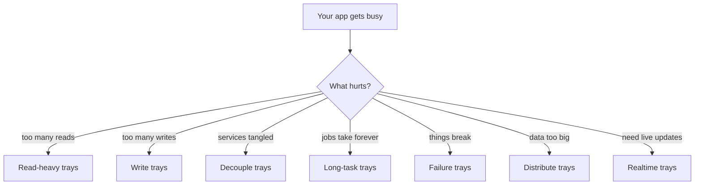
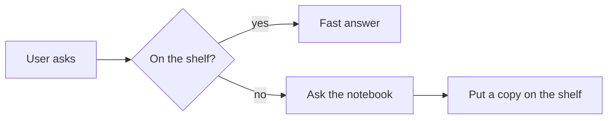
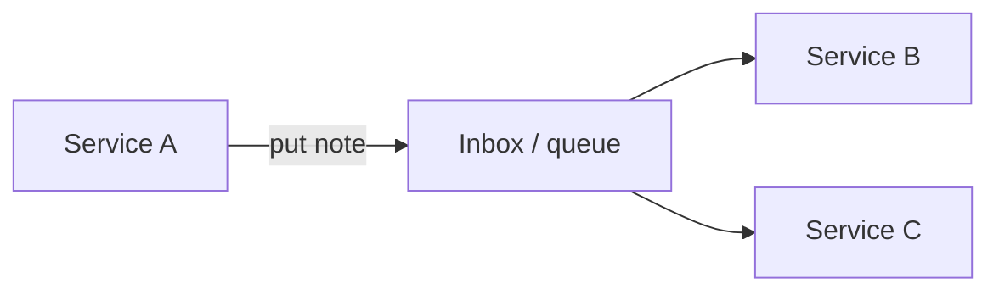

System design interviews sound scary.

They are mostly **picking the right lunch tray** for the problem.

A reel by **@ikritika.mishra** (Kritika Mishra) — [https://www.instagram.com/reel/DdjJDRfPOVW/](https://www.instagram.com/reel/DdjJDRfPOVW/) — lists the core trays in one sweep. We used that checklist as a spark, then wrote our own simple map — with why each tray exists, when to reach for it, and a tiny picture in your head.

Say it out loud:

> “Name the pain. Then pick the tray.”

---

## 1. Read-heavy systems

**Pain:** millions of people ask for the **same** thing. The database sweats.

| Pattern | Kid idea | Grown-up line from the reel |
| --- | --- | --- |
| **Caching** | Keep the popular snack on a nearby shelf | “Reuse frequently requested data” |
| **Read replicas** | Extra photocopies of the notebook for readers | “Offload reads to database copies” |
| **Indexing** | A book’s table of contents | “Accelerate selective lookups” |

**Watch out:** a cache can go **stale**. Replicas can lag the main notebook by a little.

---

## 2. Write bottlenecks

**Pain:** everyone wants to **save** at once. The pen is too slow.

| Pattern | Kid idea | Reel line |
| --- | --- | --- |
| **Batching** | Drop many letters in one mail bag | “Group writes to reduce overhead” |
| **Async processing** | Stamp “we got it” now; finish later | “Move work off the request path” |
| **Sharding** | Many notebooks, split by letter | “Spread writes across data shards” |

**Watch out:** batching adds a tiny wait. Async means the user might see “pending.” Sharding needs a rule for *which* notebook owns which row.

---

## 3. Decouple services

**Pain:** Service A rings Service B, which rings C… one sneeze breaks the chain.

| Pattern | Kid idea | Reel line |
| --- | --- | --- |
| **Message queues** | A school inbox between classrooms | “Buffer messages between services” |
| **Event-driven architecture** | Post a note on the board; people react | “React to published events” |
| **Pub/Sub** | One announcement, many listeners | “Deliver events to subscribers” |

**Watch out:** queues need retries and dead-letter shelves for stuck notes.

---

## 4. Long-running tasks

**Pain:** the user waits while you bake a huge cake.

| Pattern | Kid idea | Reel line |
| --- | --- | --- |
| **Background workers** | Kitchen staff, not the waiter | “Run work outside the request” |
| **Job queues** | Ticket spike for the kitchen | “Queue jobs for available workers” |
| **Workflow engines** | Recipe card with steps and retries | “Coordinate steps, state and retries” |

**Watch out:** tell the user a **job id** so they can check later. Workflows must remember which step already finished.

---

## 5. Handle failures

**Pain:** the network hiccups. Bad code retries forever and makes it worse.

| Pattern | Kid idea | Reel line |
| --- | --- | --- |
| **Retries with backoff** | Knock, wait longer, knock again | “Retry with increasing delays” |
| **Timeouts** | Stop waiting after the bell | “Limit the caller’s waiting time” |
| **Circuit breakers** | Fuse box flips off a smoking outlet | “Temporarily block failing calls” |
| **Idempotency** | Same order ticket twice → one pizza | “Repeat calls; keep the same effect” |

Say it out loud:

> “Retry gently. Stop waiting. Trip the fuse. Same ticket, same result.”

---

## 6. Distribute data

**Pain:** one notebook cannot hold the whole school.

| Pattern | Kid idea | Reel line |
| --- | --- | --- |
| **Partitioning** | Split the class list into folders | “Split data into subsets” |
| **Sharding** | Folders live on different shelves | “Store subsets on different nodes” |
| **Consistent hashing** | Add a shelf without reshuffling every folder | “Limit remapping as nodes change” |

**Watch out:** cross-shelf questions are harder. Plan how you pick the shelf key (user id, region, …).

---

## 7. Real-time updates

**Pain:** the user wants news **now**, not on refresh.

| Pattern | Kid idea | Reel line |
| --- | --- | --- |
| **WebSockets** | Walkie-talkie both ways | “Keep a two-way channel open” |
| **Server-Sent Events** | Radio from school to kids | “Stream server events to the client” |
| **Long polling** | Kid asks “any news?”, waits, asks again | “Wait, respond, request again” |

**Quick pick:** chat / games → WebSockets. One-way live feed → SSE. Old clients → long polling.

---

## Interview cheat card

| If they say… | Reach for… |
| --- | --- |
| Hot reads | Cache → replicas → indexes |
| Hot writes | Batch → async → shard |
| Tight coupling | Queue / events / pub-sub |
| Slow request | Workers + job queue (+ workflow) |
| Flaky deps | Timeout, backoff, breaker, idempotency |
| Huge data | Partition / shard / consistent hash |
| Live UI | WebSocket / SSE / long poll |

---

## Honest caveats

- Patterns are **tools**, not magic stickers. Wrong tool hurts.
- Every tray adds **ops cost**: monitoring, failure modes, money.
- The Instagram reel is a **checklist**. This post is the **why**.
- We did not invent these patterns; they are common industry practice.

---

## Sources

- Instagram teaching reel by [@ikritika.mishra](https://www.instagram.com/ikritika.mishra/) ([reel](https://www.instagram.com/reel/DdjJDRfPOVW/)): core system-design pattern checklist (read / write / decouple / long tasks / failures / distribute / realtime). Caption is a “comment notes” CTA.
- Standard public SD interview guides (caching, replicas, queues, breakers, sharding, realtime transports) used to expand each one-liner into kid-clear why/when.

---

## Say this back

**Name the pain. Pick the tray. Read-heavy → cache, replicas, indexes. Write-heavy → batch, async, shard. Untangle with queues and events. Long work leaves the request. Failures need timeouts, gentle retries, fuses, and idempotency. Big data spreads across shelves. Live updates use a walkie-talkie, a radio, or ask-again.**
