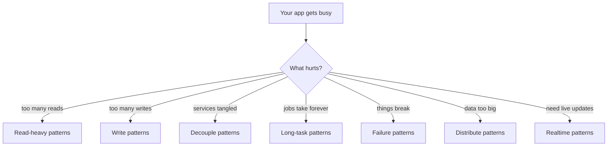
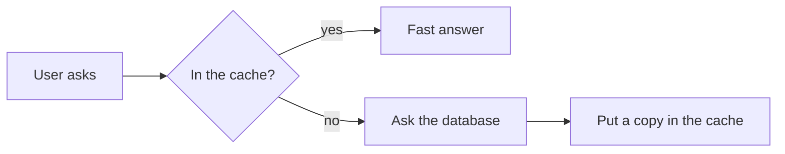
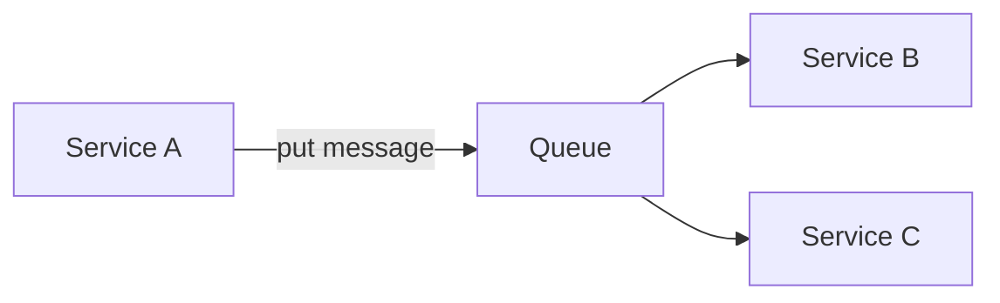

System design interviews sound scary.

They are mostly **picking the right pattern** for the problem.

This map covers the core ones — why each exists, when to reach for it, and a tiny picture in your head.

```mermaid
flowchart TB
  A[Your app gets busy] --> B{What hurts?}
  B -->|too many reads| C[Read-heavy patterns]
  B -->|too many writes| D[Write patterns]
  B -->|services tangled| E[Decouple patterns]
  B -->|jobs take forever| F[Long-task patterns]
  B -->|things break| G[Failure patterns]
  B -->|data too big| H[Distribute patterns]
  B -->|need live updates| I[Realtime patterns]
```

Name the pain. Then pick the pattern.

---

## 1. Read-heavy systems

**Pain:** millions of people ask for the **same** thing. The database sweats.

| Pattern | In plain English | What it does |
| --- | --- | --- |
| **Caching** | Keep hot data close | Reuse frequently requested data |
| **Read replicas** | Extra copies of the database for readers | Offload reads to database copies |
| **Indexing** | A lookup structure | Accelerate selective lookups |

```mermaid
flowchart LR
  U[User asks] --> C{In the cache?}
  C -->|yes| F[Fast answer]
  C -->|no| D[Ask the database]
  D --> C2[Put a copy in the cache]
```

**Watch out:** a cache can go **stale**. Replicas can lag the primary by a little.

---

## 2. Write bottlenecks

**Pain:** everyone wants to **save** at once. One writer is too slow.

| Pattern | In plain English | What it does |
| --- | --- | --- |
| **Batching** | Group many writes into one trip | Reduce per-write overhead |
| **Async processing** | Accept now, finish later | Move work off the request path |
| **Sharding** | Split writes across many stores | Spread writes across data shards |

**Watch out:** batching adds a tiny wait. Async means the user might see “pending.” Sharding needs a rule for *which* shard owns which row.

---

## 3. Decouple services

**Pain:** Service A calls Service B, which calls C… one failure breaks the chain.

| Pattern | In plain English | What it does |
| --- | --- | --- |
| **Message queues** | A buffer between services | Buffer messages between services |
| **Event-driven architecture** | Publish a change; others react | React to published events |
| **Pub/Sub** | One event, many listeners | Deliver events to subscribers |

```mermaid
flowchart LR
  A[Service A] -->|put message| Q[Queue]
  Q --> B[Service B]
  Q --> C[Service C]
```

**Watch out:** queues need retries and dead-letter queues for stuck messages.

---

## 4. Long-running tasks

**Pain:** the user waits while you run a huge job.

| Pattern | In plain English | What it does |
| --- | --- | --- |
| **Background workers** | Work outside the request | Run work outside the request |
| **Job queues** | A list of jobs for workers | Queue jobs for available workers |
| **Workflow engines** | Steps, state, and retries | Coordinate steps, state and retries |

**Watch out:** tell the user a **job id** so they can check later. Workflows must remember which step already finished.

---

## 5. Handle failures

**Pain:** the network hiccups. Bad code retries forever and makes it worse.

| Pattern | In plain English | What it does |
| --- | --- | --- |
| **Retries with backoff** | Wait longer between tries | Retry with increasing delays |
| **Timeouts** | Stop waiting after a limit | Limit the caller’s waiting time |
| **Circuit breakers** | Stop calling a failing dependency | Temporarily block failing calls |
| **Idempotency** | Same request twice → one effect | Repeat calls; keep the same effect |

Retry gently. Stop waiting. Trip the breaker. Same request, same result.

---

## 6. Distribute data

**Pain:** one database cannot hold the whole dataset.

| Pattern | In plain English | What it does |
| --- | --- | --- |
| **Partitioning** | Split one dataset into subsets | Split data into subsets |
| **Sharding** | Put those subsets on different nodes | Store subsets on different nodes |
| **Consistent hashing** | Add a node without moving every key | Limit remapping as nodes change |

**Watch out:** cross-shard queries are harder. Plan how you pick the shard key (user id, region, …).

---

## 7. Real-time updates

**Pain:** the user wants news **now**, not on refresh.

| Pattern | In plain English | What it does |
| --- | --- | --- |
| **WebSockets** | A two-way channel | Keep a two-way channel open |
| **Server-Sent Events** | Server pushes events one way | Stream server events to the client |
| **Long polling** | Client waits, then asks again | Wait, respond, request again |

**Quick pick:** chat / games → WebSockets. One-way live feed → SSE. Old clients → long polling.

---

## Interview cheat card

| If they say… | Reach for… |
| --- | --- |
| Hot reads | Cache → replicas → indexes |
| Hot writes | Batch → async → shard |
| Tight coupling | Queue / events / pub-sub |
| Slow request | Workers + job queue (+ workflow) |
| Flaky deps | Timeout, backoff, breaker, idempotency |
| Huge data | Partition / shard / consistent hash |
| Live UI | WebSocket / SSE / long poll |

---

## Honest caveats

- Patterns are **tools**, not stickers. Wrong tool hurts.
- Every pattern adds **ops cost**: monitoring, failure modes, money.
- The common list is a **checklist**. This post is the **why**.
- We did not invent these patterns; they are common industry practice.

---

## Sources

- Standard public system-design interview guides (caching, replicas, queues, breakers, sharding, realtime transports) used to expand each one-liner into why and when.

---

## In short

**Name the pain. Pick the pattern. Read-heavy → cache, replicas, indexes. Write-heavy → batch, async, shard. Untangle with queues and events. Long work leaves the request. Failures need timeouts, gentle retries, circuit breakers, and idempotency. Big data spreads across shards. Live updates use WebSockets, SSE, or long polling.**
