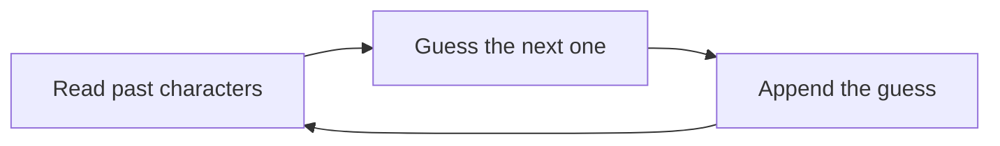
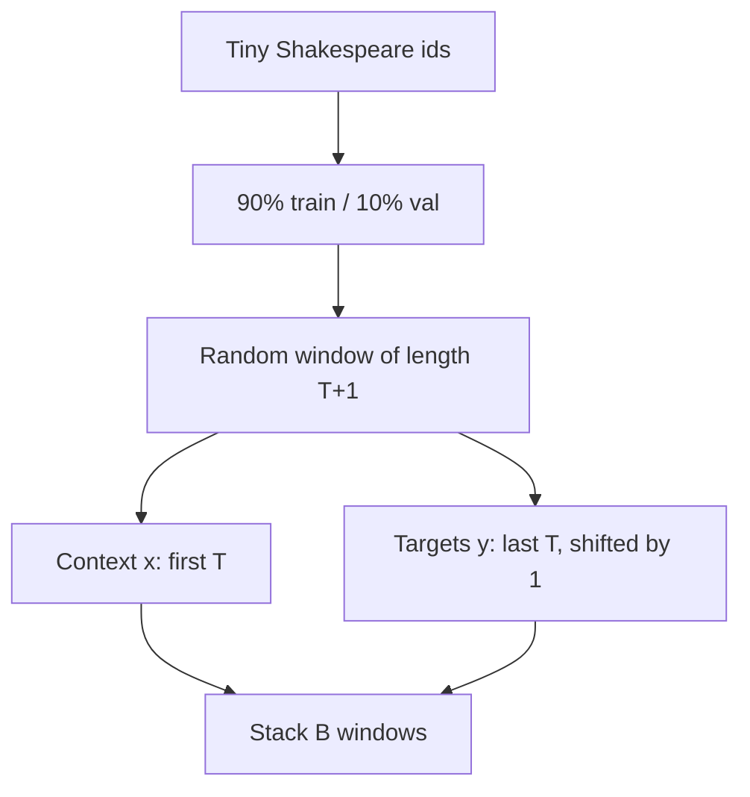
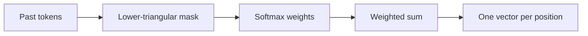
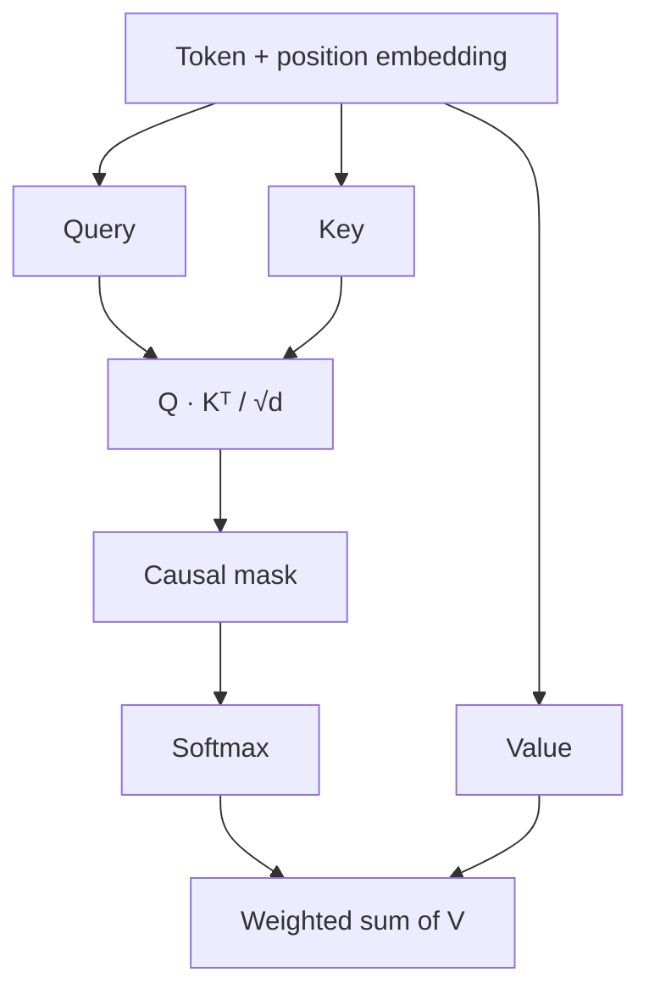
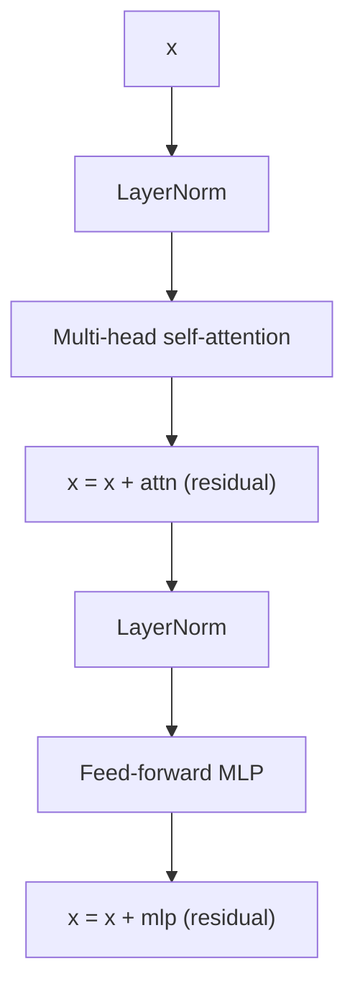
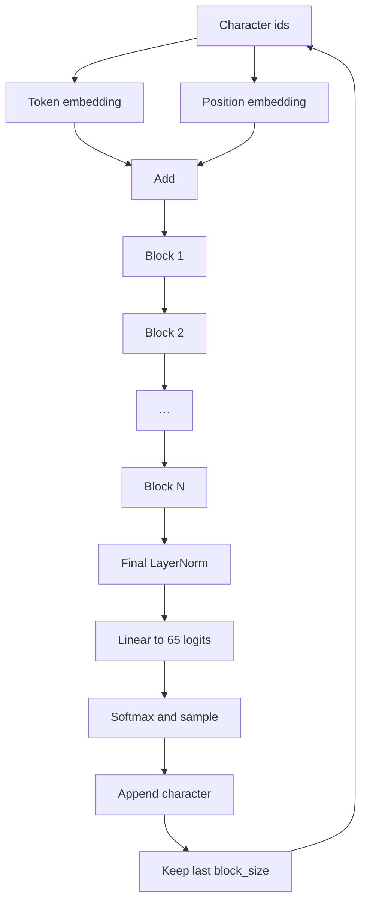

ChatGPT looks like it is writing a whole answer. Under the hood it is doing autocomplete.

It guesses the **next token**. It sticks that token on the end. Then it guesses again.

In this post the token is one **character**. The training text is a small dump of Shakespeare. The model is tiny. The **shape** is the same shape as GPT.

I am walking the same path as Andrej Karpathy's lecture [Let's build GPT: from scratch, in code, spelled out](https://www.youtube.com/watch?v=kCc8FmEb1nY). This is a concept post, not a line-by-line code dump. You can run the code later. Links are at the end.

> **Want the code side?** The [Tiny GPT code walkthrough]({{ '/posts/build-gpt-from-scratch-character-level/code-walkthrough/' | relative_url }}) goes through the Colab notebook and `gpt.py` step by step. This page stays on the ideas.

---

## What ChatGPT is doing

A **language model** is a next-token machine.

- You give it a sequence.
- It returns a list of probabilities for what comes next.
- You sample from that list (or pick the top item).
- You append the chosen token and repeat.

Same prompt can give a different answer. That is not a bug. The model is **probabilistic**. If "e" has 40% and "o" has 25%, sometimes you get "e", sometimes "o".

**GPT** means Generative Pre-trained Transformer.

| Word | Plain meaning |
| --- | --- |
| Generative | It writes the next piece of the sequence. |
| Pre-trained | First it learns language from a lot of text. Extra stages can come later. |
| Transformer | The 2017 neural net design from [Attention Is All You Need](https://arxiv.org/abs/1706.03762). |

ChatGPT sits on that idea, at huge scale, plus extra training. We are **not** rebuilding ChatGPT here. We are building the small educational cousin: a character-level model on about 1 MB of plays.

Karpathy's earlier [Zero to Hero](https://karpathy.ai/zero-to-hero.html) videos (including **makemore**) already trained tiny character models with simpler nets. This lecture upgrades that idea to a Transformer.

---

## Tiny Shakespeare is the playground

The dataset is **tiny Shakespeare**: a public dump of Shakespeare plays, roughly **1 million characters**, about **1 MB**.

You do not feed the whole book in one shot. You cut it into short windows and ask, again and again: given this window, what is the next character?

A trained toy model starts to babble in a Shakespeare-like way. You will see `ROMEO:`, `thou`, and line breaks. You will also see nonsense. That is expected. The data is small. The model is small. The tokenizer is one character at a time.

Think of it as a practice ground, not a product.

---

## Tokens and the 65-character alphabet

Open the file. Collect every unique character. Sort them. In this dataset you get **65** symbols:

- letters (`a`–`z`, `A`–`Z`)
- digits
- space, newline
- punctuation (`.`, `,`, `?`, `!`, `:`, and a few more)

Each character gets an integer id. Encode turns text into ids. Decode turns ids back into text. The exact tables are in the [code walkthrough]({{ '/posts/build-gpt-from-scratch-character-level/code-walkthrough/' | relative_url }}). The idea is simple: **the network only sees integers**.

### Character tokens vs subword tokens

Real systems almost never use one token per character.

| Style | Vocab size (order of) | Sequence length | Who uses it |
| --- | --- | --- | --- |
| Character | tens (65 here) | Long. "Hello" is 5 tokens. | This lecture, for simplicity |
| Subword (BPE / SentencePiece) | tens of thousands | Shorter. Common words are 1 token. | OpenAI [tiktoken](https://github.com/openai/tiktoken), Google SentencePiece, most ChatGPT-class models |

Trade-off:

- Small vocab → embedding table is small, but sequences get long.
- Large vocab → sequences get short, but the embedding table is huge.

We keep character-level so the story stays visible. You can watch `T`, then `o`, then space.

---

## We never train on the whole play at once

Split the encoded file **90% train / 10% val**. The val slice is for checking. Do not tune as if you had already seen it.

Two size knobs matter more than the rest.

| Knob | What it is | Lecture toy | Later scaled run |
| --- | --- | --- | --- |
| **block size** (`T`) | How many past tokens the model may look at | 8 | 256 |
| **batch size** (`B`) | How many independent chunks in one GPU step | 4 | 64 |

A chunk of length **T + 1** packs **T** training examples. Take 9 characters. You get 8 (context → next character) pairs.

Example with `Hello!??` (8 context steps):

| Context the model sees | It must guess |
| --- | --- |
| `H` | `e` |
| `He` | `l` |
| `Hel` | `l` |
| `Hell` | `o` |
| `Hello` | `!` |
| `Hello!` | `?` |
| `Hello!?` | `?` |
| `Hello!??` | next char after the window |

Why train on length 1, 2, 3, … up to `block_size`? Generation often starts from **one** token (sometimes just a newline). The model has to work with a short context, not only a full window.

The batch dim stacks many such chunks. They do **not** talk to each other. Shape to keep in your head: **B × T** predictions per step.

---

## A weak start: only look at the last character

The first model is a **bigram**.

Each token has a row in an embedding table. That row is used as the logits for "what comes next". Token 47 does not look at token 18. Tokens do not talk.

- Optimizer: **AdamW**
- Loss: cross-entropy on the 65-way guess
- Random start: about \(-\ln(1/65) \approx 4.17\)
- After a short train in the lecture: loss in the **~2.5** region

Those loss numbers are from Karpathy's educational run, not from a stopwatch on my machine.

Generation from a bigram is local. It can learn that `q` likes `u`, or that `:` often starts a new line. It cannot hold "we are inside a Romeo speech" across a sentence. There is no conversation between positions.

---

## First, a matrix trick: average the past

Before Q, K, and V, the lecture builds a simpler idea.

For each position, take a **weighted mix of the past** (and the present). Do not look at the future.

A Python loop can do that. A lower-triangular matrix can do it in one multiply.

- Put 1s on and below the diagonal.
- Put 0s above it.
- Multiply. Position 3 only sees positions 0, 1, 2, 3.

Turn those 0/1 weights into a softmax, and you get a soft average. That is the skeleton of attention. The missing piece is: the weights should depend on **content**, not only on "is this in the past?".

---

## How tokens talk: query, key, value

Now each token builds three vectors from its embedding (plus its position, once we add those):

| Name | Job in one line | Everyday picture |
| --- | --- | --- |
| **Query (Q)** | What am I looking for? | The question this character is asking the past |
| **Key (K)** | What do I offer to match? | The label on this character's sticky note |
| **Value (V)** | What do I pass along if you pick me? | The actual information in that note |

Attention, for one head:

1. Every token makes Q, K, and V.
2. Affinity of "me" to "you" is the dot product of my Q with your K.
3. Divide by \(\sqrt{d}\) so the dots do not explode before softmax. \(d\) is the head size.
4. Hide the future with a **causal mask** (next section).
5. Softmax turns scores into weights that sum to 1.
6. Mix the V vectors with those weights.

\[
\mathrm{Attention}(Q,K,V)=\mathrm{softmax}\left(\frac{QK^{\top}}{\sqrt{d}}+M\right)V
\]

\(M\) is 0 where looking is allowed, and \(-\infty\) on the future, so those weights become 0 after softmax.

The Linear layers, the `(B, T, T)` weight matrix, and the `tril` mask are in the [code walkthrough]({{ '/posts/build-gpt-from-scratch-character-level/code-walkthrough/' | relative_url }}).

If the current character is `?` at the end of `To be or not to be?`, its Query can match Keys that look like a question setup. Those positions then donate their Values. The model is weighing how useful each past character is **for this next guess**.

### Notes that save later confusion

- Attention is **communication**. Tokens send messages. You can draw it as a graph: a node per token, an edge when the weight is non-zero.
- Attention has **no built-in sense of order**. Swap the tokens and the dots still work. That is why we add **position embeddings**. "I am character 3" is extra information, added to the token embedding.
- Rows in a batch stay **independent**. Window A does not attend to window B.
- **Self-attention**: Q, K, V all come from the same sequence (the play so far).
- **Cross-attention**: Q comes from one sequence, K and V from another. The original translation Transformer uses this so the decoder can read the encoder.
- The \(\sqrt{d}\) scale is from the 2017 paper. Without it, softmax gets peaky and gradients get weak.

---

## Do not peek at the future

If the target at position 3 is the character that actually sits at position 4, the model must not read position 4 while it predicts. That would be copying the answer.

So we use a **causal** (lower-triangular) mask.

For the five characters `T o _ b e`:

| From \ to | T | o | _ | b | e |
| --- | --- | --- | --- | --- | --- |
| **T** | yes | no | no | no | no |
| **o** | yes | yes | no | no | no |
| **_** | yes | yes | yes | no | no |
| **b** | yes | yes | yes | yes | no |
| **e** | yes | yes | yes | yes | yes |

A group chat where you may only read messages that already arrived. You cannot read the ones that are still being typed.

This masked self-attention is why people call GPT a **decoder-only** Transformer. The 2017 encoder is allowed to look left and right. A GPT block is not.

---

## Many heads, then a private think step

**Multi-head attention** is several of those Q/K/V channels in parallel.

- Head A might track "are we in a speaker name?"
- Head B might track "should a comma come next?"
- Head C might track "did a question start?"

Each head is smaller (`n_embd / n_head`). We concat the heads and project back to the model width.

After they talk, each token still needs to **think on its own**. That is a small MLP (feed-forward net) applied at every position, same weights everywhere:

1. Widen (in the lecture, to `4 × n_embd`).
2. ReLU.
3. Project back.
4. Dropout.

Attention = communicate. MLP = compute. That pair is one **block**. Then you repeat the block.

The lecture's `gpt.py` uses **pre-norm**: LayerNorm, then the sub-layer, then add. The 2017 paper drew post-norm (add, then norm). Pre-norm is common now because it trains more calmly.

---

## Residual roads and LayerNorm

Deep stacks need two boring, important tricks.

**Residual (skip) connection.** The block output is `x + sublayer(x)`, not just `sublayer(x)`. The original signal still has a highway through the stack. Gradients can travel that highway during training. Without it, a 6-layer toy already gets harder to train.

**LayerNorm.** For each token, rescale the vector so the numbers stay in a sane range. Combined with residuals, this keeps the hidden states from drifting.

**Dropout.** Randomly drop some activations in attention weights, projections, and the MLP. On a 1 MB dataset this is regularisation. The lecture's bigger run uses `dropout = 0.2`.

---

## The full GPT shape

Put the pieces in order.

1. Token embedding (65 rows, each of size `n_embd`).
2. Position embedding (`block_size` rows).
3. Add them.
4. Repeat `n_layer` blocks: masked multi-head attention, then MLP, each with residual + LayerNorm + dropout.
5. Final LayerNorm.
6. Linear head to 65 logits.
7. Softmax → sample → append → crop to the last `block_size` tokens → repeat.

This is a **decoder-only** Transformer.

The original 2017 Transformer was built for translation. It has two stacks:

| Piece | Looks at | Job |
| --- | --- | --- |
| Encoder | Full source sentence (both directions) | Read the French (or whatever source) |
| Decoder, masked self-attention | Past English only | Write the next English token |
| Decoder, cross-attention | Encoder outputs | Pull meaning from the source |

GPT throws away the encoder and the cross-attention. There is only one stream: continue the text you already have. Chat-style models still look like this. Your prompt and the reply sit in the **same** sequence. The causal mask makes sure the model does not read the reply while it is still predicting it.

---

## Scale up, still not ChatGPT

The lecture starts tiny (`block_size = 8`, a few channels) so you can print tensors and see the mask. Then it scales to a small-but-real toy. Numbers below are from that educational `gpt.py` run, not from us.

| Knob | Tiny walkthrough | Scaled lecture run |
| --- | --- | --- |
| `batch_size` | 4 | 64 |
| `block_size` | 8 | 256 |
| `n_embd` | 32 | 384 |
| `n_head` | 4 | 6 (head size 64) |
| `n_layer` | a few | 6 |
| `dropout` | 0 | 0.2 |
| learning rate | `1e-3` | `3e-4` |
| `max_iters` | 5000 | 5000 |
| parameters | very small | about **10.7M** |
| val loss | bigram ~2.5; tiny GPT better | about **1.48** |
| wall time | laptop minutes | about **15 min on an A100** |

At 1.48 the samples look more like a play. You still would not stage them.

Finished, cleaned-up code lives in two places:

- Lecture notebook and scripts: [karpathy/ng-video-lecture](https://github.com/karpathy/ng-video-lecture) (`bigram.py`, `gpt.py`)
- The later, more serious repo: [karpathy/nanoGPT](https://github.com/karpathy/nanoGPT)

nanoGPT is the same idea pointed at GPT-2-scale training. It is still not ChatGPT.

---

## What this tiny model skipped

| This post / lecture toy | A ChatGPT-class system |
| --- | --- |
| ~1 MB of Shakespeare | Internet-scale text, then more stages |
| 65 character ids | ~50k+ subword ids (BPE / tiktoken) |
| Context 8, then 256 characters | Thousands to hundreds of thousands of tokens |
| ~10M parameters, 6 layers | Billions of parameters, many layers |
| Next-character cross-entropy only | Pre-train, then instruction tune, often RLHF / preference training |
| One GPU, minutes | Huge clusters, weeks or months |
| Decoder-only, trained from scratch | Same core shape, plus serving tricks (KV cache, quantisation, tools) |

Honest limit: **this is a teaching model**. It shows the skeleton. It does not write reliable essays, follow policies, or use tools. Keep the architecture in your head. Do not treat the samples as a real play, or as ChatGPT.

---

## Try it yourself

These are labs, not social posts.

- Lecture video (full walkthrough, not only one timestamp): [Let's build GPT: from scratch, in code, spelled out](https://www.youtube.com/watch?v=kCc8FmEb1nY)
- Browser notebook: [Colab — nanoGPT / lecture companion](https://colab.research.google.com/drive/1JMLa53HDuA-i7ZBmqV7ZnA3c_fvtXnx-?usp=sharing)
- Code: [github.com/karpathy/ng-video-lecture](https://github.com/karpathy/ng-video-lecture)
- Cleaner follow-on: [github.com/karpathy/nanoGPT](https://github.com/karpathy/nanoGPT)
- The 2017 paper: [Attention Is All You Need](https://arxiv.org/abs/1706.03762)
- Subword tokenizers, when you leave character-level: [tiktoken](https://github.com/openai/tiktoken), [SentencePiece](https://github.com/google/sentencepiece)
- Tiny Shakespeare source used in the lecture: the classic [char-rnn input.txt](https://raw.githubusercontent.com/karpathy/char-rnn/master/data/tinyshakespeare/input.txt)

If you only have one hour: watch the video with the Colab open. Print one batch. Print the causal mask. Generate 200 characters from the bigram, then from the GPT. The gap is the point of the lecture.

For the line-by-line path through those files, use the [Tiny GPT code walkthrough]({{ '/posts/build-gpt-from-scratch-character-level/code-walkthrough/' | relative_url }}).

---

## Glossary

| Term | Meaning here |
| --- | --- |
| Token | The atom the model sees. Here: one character. |
| Vocab | The set of tokens. Here: 65. |
| Logits | Raw scores for each next-token choice, before softmax. |
| Softmax | Turn scores into probabilities that add to 1. |
| Context / block size | How far back the model may look. |
| Batch | Independent windows stacked for the GPU. |
| Bigram | Next-token guess that only uses the last token. |
| Self-attention | Tokens in one sequence look at each other. |
| Query / Key / Value | Ask / label / payload inside one attention head. |
| Causal mask | Block the future so training cannot cheat. |
| Multi-head | Several attention channels, then concat. |
| MLP / feed-forward | Per-token compute after the talk step. |
| Residual | Add the input back: `x + layer(x)`. |
| LayerNorm | Per-token rescale, keeps values stable. |
| Dropout | Randomly zero some values while training. |
| Decoder-only | Masked self-attention only. No encoder stack. |
| Encoder-decoder | Read a source with full attention, write a target with a mask plus cross-attention. |
| nanoGPT | Karpathy's cleaned repo for training GPT-2-like models. |

---

## Sources

- [Let's build GPT: from scratch, in code, spelled out](https://www.youtube.com/watch?v=kCc8FmEb1nY) — Andrej Karpathy
- [Lecture Colab](https://colab.research.google.com/drive/1JMLa53HDuA-i7ZBmqV7ZnA3c_fvtXnx-?usp=sharing)
- [ng-video-lecture](https://github.com/karpathy/ng-video-lecture) (`bigram.py`, `gpt.py`)
- [nanoGPT](https://github.com/karpathy/nanoGPT)
- Vaswani et al., [Attention Is All You Need](https://arxiv.org/abs/1706.03762) (2017)
- [Zero to Hero](https://karpathy.ai/zero-to-hero.html) / makemore (prior context)
- [tiktoken](https://github.com/openai/tiktoken)

Loss figures, hyper-parameters, and the "about 15 minutes on an A100" note are from that lecture run. Treat them as teaching examples.

---

## In short

A language model guesses the next character, then the next, then the next. Training is many windows of "past → next character" and a weight update (AdamW) that makes the right character more likely. A bigram cannot let those characters talk. Self-attention can: Query asks, Key labels, Value carries, a causal mask hides the future, and softmax mixes the past. Stack multi-head attention, a per-token MLP, residuals, LayerNorm, and dropout, and you have a decoder-only Transformer — the GPT shape — trained here on tiny Shakespeare. ChatGPT is that shape at a much larger scale, with subword tokens and extra training stages. This post is the small version you can actually hold in your head.

Want the tensors and the training loop? Open the [Tiny GPT code walkthrough]({{ '/posts/build-gpt-from-scratch-character-level/code-walkthrough/' | relative_url }}).
