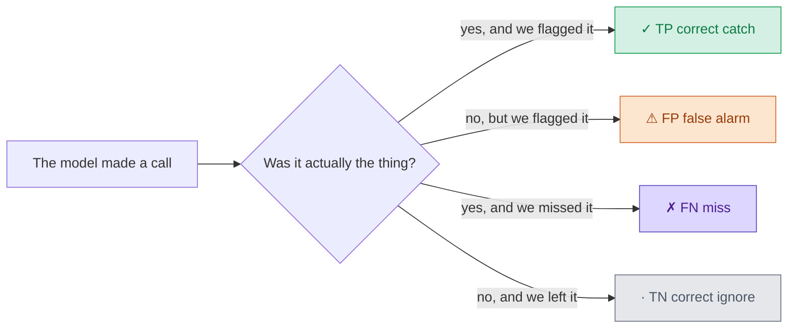
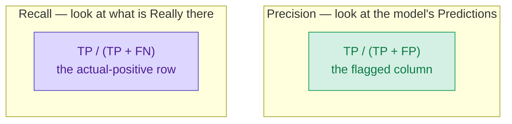
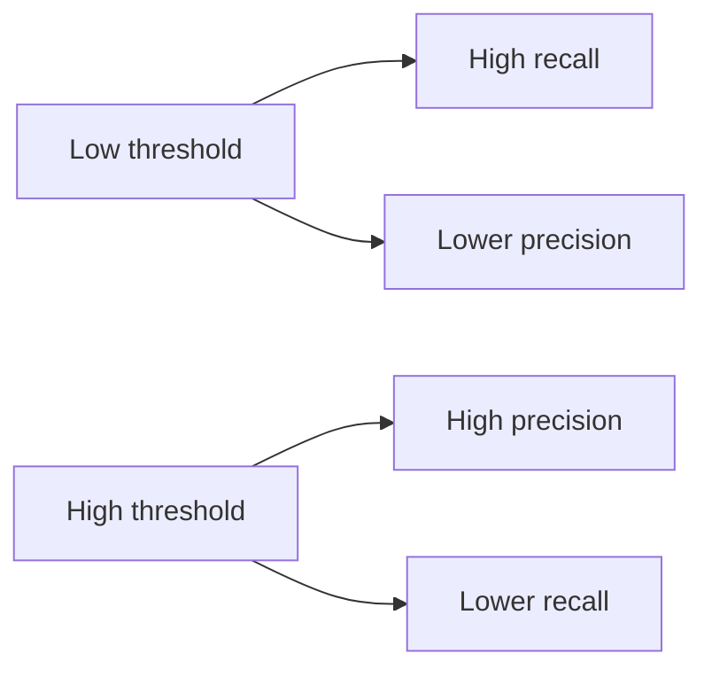

A spam filter can be **99% accurate** and still be useless.

Here is a toy inbox. **10,000** mails. **100** of them are spam. The other **9,900** are normal.

A lazy model says "not spam" for every mail.

- It is right on 9,900 mails.
- Accuracy = 9,900 / 10,000 = **99%**.
- It caught **zero** spam.
- Recall = 0 / 100 = **0%**.

Accuracy looks like a score. When the thing you care about is rare, it can hide a model that never even tries.

The fix is two questions, not one. I keep them on four colours for the rest of this post. The colours do not change.

**Colour legend** (same chips in the text, the tables, the formulas, and the GIFs):

<span style="background:#d4f0e4;color:#0d7a45;font-weight:600;padding:2px 8px;border-radius:4px">✓ TP</span>
correct catch &nbsp;
<span style="background:#fde6d0;color:#9a3b0a;font-weight:600;padding:2px 8px;border-radius:4px">⚠ FP</span>
false alarm &nbsp;
<span style="background:#ddd6fe;color:#4c1d95;font-weight:600;padding:2px 8px;border-radius:4px">✗ FN</span>
miss &nbsp;
<span style="background:#e5e7eb;color:#4b5563;font-weight:600;padding:2px 8px;border-radius:4px">· TN</span>
correct ignore

False alarms are orange, not red, so you are not asked to tell red from green. Each cell also has a mark. The colour is a helper, not the only signal.



---

## Four outcomes, in plain words

Every binary call lands in one box.

| Mark | Cell | Plain meaning | One-line hook |
| --- | --- | --- | --- |
| ✓ | <span style="background:#d4f0e4;color:#0d7a45;font-weight:600;padding:1px 7px;border-radius:4px">TP</span> True Positive | It was spam, and we flagged it | correct catch |
| ⚠ | <span style="background:#fde6d0;color:#9a3b0a;font-weight:600;padding:1px 7px;border-radius:4px">FP</span> False Positive | It was normal, and we flagged it | false alarm |
| ✗ | <span style="background:#ddd6fe;color:#4c1d95;font-weight:600;padding:1px 7px;border-radius:4px">FN</span> False Negative | It was spam, and we missed it | miss |
| · | <span style="background:#e5e7eb;color:#4b5563;font-weight:600;padding:1px 7px;border-radius:4px">TN</span> True Negative | It was normal, and we left it | correct ignore |

"Positive" here means **the class we are hunting**. Spam. Fraud. A customer who will leave. Not "good news".

---

## The confusion matrix, coloured

From here I use one small inbox so the arithmetic stays in your head.

**100** mails. **20** are spam. **80** are normal. The model flags **16** as spam.

<table>
  <thead>
    <tr>
      <th></th>
      <th>Predicted spam</th>
      <th>Predicted normal</th>
    </tr>
  </thead>
  <tbody>
    <tr>
      <td><strong>Actual spam</strong></td>
      <td style="background:#d4f0e4;color:#0d7a45;text-align:center;padding:12px"><strong>✓ TP = 12</strong><br>correct catch</td>
      <td style="background:#ddd6fe;color:#4c1d95;text-align:center;padding:12px"><strong>✗ FN = 8</strong><br>miss</td>
    </tr>
    <tr>
      <td><strong>Actual normal</strong></td>
      <td style="background:#fde6d0;color:#9a3b0a;text-align:center;padding:12px"><strong>⚠ FP = 4</strong><br>false alarm</td>
      <td style="background:#e5e7eb;color:#4b5563;text-align:center;padding:12px"><strong>· TN = 76</strong><br>correct ignore</td>
    </tr>
  </tbody>
</table>

Check the margins. They have to add up.

- Real spam = <span style="background:#d4f0e4;color:#0d7a45;font-weight:600;padding:1px 7px;border-radius:4px">12 TP</span> + <span style="background:#ddd6fe;color:#4c1d95;font-weight:600;padding:1px 7px;border-radius:4px">8 FN</span> = **20**
- Flagged spam = <span style="background:#d4f0e4;color:#0d7a45;font-weight:600;padding:1px 7px;border-radius:4px">12 TP</span> + <span style="background:#fde6d0;color:#9a3b0a;font-weight:600;padding:1px 7px;border-radius:4px">4 FP</span> = **16**
- Real normal = <span style="background:#fde6d0;color:#9a3b0a;font-weight:600;padding:1px 7px;border-radius:4px">4 FP</span> + <span style="background:#e5e7eb;color:#4b5563;font-weight:600;padding:1px 7px;border-radius:4px">76 TN</span> = **80**
- Total = 12 + 4 + 8 + 76 = **100**

Accuracy on this inbox is (12 + 76) / 100 = **88%**. Fine as a headline. It still does not tell you *how* the 12 mistakes happened.


**Layout note:** this teaching grid puts <span style="background:#d4f0e4;color:#0d7a45;font-weight:600;padding:1px 7px;border-radius:4px">TP</span> top-left. scikit-learn's `confusion_matrix` with `labels=[0, 1]` prints <span style="background:#e5e7eb;color:#4b5563;font-weight:600;padding:1px 7px;border-radius:4px">TN</span> top-left. Same four numbers. Different corner. Read the labels before you quote a cell.

---

## Precision: of everything we flagged, how much was right?

Precision looks at the **predicted-positive column**. Here that is "flagged as spam".

<p style="font-size:1.2em;line-height:1.8">
  <strong>Precision</strong> =
  <span style="background:#d4f0e4;color:#0d7a45;font-weight:600;padding:2px 8px;border-radius:4px">TP</span>
  /
  (
  <span style="background:#d4f0e4;color:#0d7a45;font-weight:600;padding:2px 8px;border-radius:4px">TP</span>
  +
  <span style="background:#fde6d0;color:#9a3b0a;font-weight:600;padding:2px 8px;border-radius:4px">FP</span>
  )
</p>

- **Sentence:** of everything the model flagged, how much was right?
- **Question:** how many of the flagged items are relevant?
- **This inbox:** 12 / (12 + 4) = 12 / 16 = **75%**

Four of the 16 flags were false alarms. Those are invoices sitting in junk, or customers you rang for no reason.


---

## Recall: of everything that was really there, how much did we catch?

Recall looks at the **actually-positive row**. Here that is "really spam".

<p style="font-size:1.2em;line-height:1.8">
  <strong>Recall</strong> =
  <span style="background:#d4f0e4;color:#0d7a45;font-weight:600;padding:2px 8px;border-radius:4px">TP</span>
  /
  (
  <span style="background:#d4f0e4;color:#0d7a45;font-weight:600;padding:2px 8px;border-radius:4px">TP</span>
  +
  <span style="background:#ddd6fe;color:#4c1d95;font-weight:600;padding:2px 8px;border-radius:4px">FN</span>
  )
</p>

- **Sentence:** of everything that was really there, how much did the model catch?
- **Question:** how many of the relevant items did we flag?
- **This inbox:** 12 / (12 + 8) = 12 / 20 = **60%**

Eight spam mails reached the inbox. Those are the misses.

Recall is also called **True Positive Rate (TPR)** and **sensitivity**. Same fraction. Same row.




---

## A memory trick that stays accurate

- **P**recision looks at the model's **P**redictions. That is the flagged **column**.
- **R**ecall looks at what is **R**eally there. That is the actual-positive **row**.

Both start with <span style="background:#d4f0e4;color:#0d7a45;font-weight:600;padding:1px 7px;border-radius:4px">TP</span>. They divide by a different partner.

| Metric | Numerator | Extra in the denominator | What you ignore |
| --- | --- | --- | --- |
| Precision | <span style="background:#d4f0e4;color:#0d7a45;font-weight:600;padding:1px 7px;border-radius:4px">TP</span> | <span style="background:#fde6d0;color:#9a3b0a;font-weight:600;padding:1px 7px;border-radius:4px">FP</span> false alarms | misses and correct ignores |
| Recall | <span style="background:#d4f0e4;color:#0d7a45;font-weight:600;padding:1px 7px;border-radius:4px">TP</span> | <span style="background:#ddd6fe;color:#4c1d95;font-weight:600;padding:1px 7px;border-radius:4px">FN</span> misses | false alarms and correct ignores |

---

## The fishing net

Think of catching fish in a lake.

The fish are the real positives — the spam, the fraud, the customers who will churn. Rocks look a bit like fish from far away.

A **wide net** scoops almost every fish. You miss very few. That is high recall. The net also picks up a pile of rocks. Those rocks are false alarms. Precision is lower.

A **small net** that you dip only where you are sure: almost everything in the net is a fish. Precision is high. Many fish are still swimming in the lake. Those are misses. Recall is lower.

You cannot usually have a net that is both very wide and very picky. The size of the net is your decision threshold.

| In the lake | In the matrix |
| --- | --- |
| Fish in the net | <span style="background:#d4f0e4;color:#0d7a45;font-weight:600;padding:1px 7px;border-radius:4px">✓ TP</span> |
| Rocks in the net | <span style="background:#fde6d0;color:#9a3b0a;font-weight:600;padding:1px 7px;border-radius:4px">⚠ FP</span> |
| Fish still in the lake | <span style="background:#ddd6fe;color:#4c1d95;font-weight:600;padding:1px 7px;border-radius:4px">✗ FN</span> |
| Rocks left in the lake | <span style="background:#e5e7eb;color:#4b5563;font-weight:600;padding:1px 7px;border-radius:4px">· TN</span> |

On the GIF lake there are **8** fish and **6** rocks.

- Wide net: 6 fish + 4 rocks. Precision 6/10 = **60%**. Recall 6/8 = **75%**.
- Small net: 4 fish + 0 rocks. Precision 4/4 = **100%**. Recall 4/8 = **50%**.


---

## A churn model, worked out

Same four boxes. Different business.

Last quarter you had **200** customers. **50** actually left. Your model flagged **40** as "will churn".

Of those 40 flags, **32** did leave. **8** stayed. You missed **18** who left. You correctly left **142** stayers alone.

<table>
  <thead>
    <tr>
      <th></th>
      <th>Predicted churn</th>
      <th>Predicted stay</th>
    </tr>
  </thead>
  <tbody>
    <tr>
      <td><strong>Actually left</strong></td>
      <td style="background:#d4f0e4;color:#0d7a45;text-align:center;padding:12px"><strong>✓ TP = 32</strong></td>
      <td style="background:#ddd6fe;color:#4c1d95;text-align:center;padding:12px"><strong>✗ FN = 18</strong></td>
    </tr>
    <tr>
      <td><strong>Actually stayed</strong></td>
      <td style="background:#fde6d0;color:#9a3b0a;font-weight:600;padding:12px;text-align:center"><strong>⚠ FP = 8</strong></td>
      <td style="background:#e5e7eb;color:#4b5563;text-align:center;padding:12px"><strong>· TN = 142</strong></td>
    </tr>
  </tbody>
</table>

Margins:

- Real churn = 32 + 18 = **50**
- Flags = 32 + 8 = **40**
- Real stay = 8 + 142 = **150**
- Total = 32 + 8 + 18 + 142 = **200**

Now the two questions, slowly.

1. Precision = 32 / (32 + 8) = 32 / 40 = **80%**.
   Of the people we rang with a retention offer, 80% were actually going to leave.
2. Recall = 32 / (32 + 18) = 32 / 50 = **64%**.
   Of the people who actually left, we had flagged 64% in time.
3. Accuracy = (32 + 142) / 200 = 174 / 200 = **87%**.
   Looks healthy. It still hides those 18 misses and 8 false alarms.

If a retention call costs money, the 8 false alarms are wasted calls. If a lost customer costs more, the 18 misses hurt more. That is the next section.

---

## 100% precision, 100% recall, and why you rarely get both

**100% precision** means <span style="background:#fde6d0;color:#9a3b0a;font-weight:600;padding:1px 7px;border-radius:4px">FP = 0</span>. Every flag was right. You can still miss a pile of real cases. A model that flags only one obvious spam mail, and gets it right, has perfect precision and terrible recall.

**100% recall** means <span style="background:#ddd6fe;color:#4c1d95;font-weight:600;padding:1px 7px;border-radius:4px">FN = 0</span>. You caught every real case. You can still flood people with false alarms. Flag every mail as spam and recall is 100%. Precision is 20 / 100 = **20%** on the toy inbox.

Most models output a **score**, then you pick a cut. That cut is the net size.

| Move the cut | What happens |
| --- | --- |
| Raise the threshold (picky net) | Fewer flags. Usually fewer <span style="background:#fde6d0;color:#9a3b0a;font-weight:600;padding:1px 7px;border-radius:4px">⚠ FP</span>. Precision tends to **rise**. More <span style="background:#ddd6fe;color:#4c1d95;font-weight:600;padding:1px 7px;border-radius:4px">✗ FN</span>. Recall **falls**. |
| Lower the threshold (wide net) | More flags. Usually fewer misses. Recall **rises**. More false alarms. Precision **falls**. |

Toy scores I made for the slider GIF. Four real positives at 0.94, 0.86, 0.78, 0.52. Four real negatives at 0.64, 0.40, 0.22, 0.08.

| Threshold | ✓ TP | ⚠ FP | ✗ FN | · TN | Precision | Recall |
| --- | --- | --- | --- | --- | --- | --- |
| 0.30 | 4 | 2 | 0 | 2 | 4/6 = **67%** | 4/4 = **100%** |
| 0.60 | 3 | 1 | 1 | 3 | 3/4 = **75%** | 3/4 = **75%** |
| 0.85 | 2 | 0 | 2 | 4 | 2/2 = **100%** | 2/4 = **50%** |

Same eight points. Three different nets.




---

## When to care more about which

Pick the metric that matches the **cost**.

A <span style="background:#fde6d0;color:#9a3b0a;font-weight:600;padding:1px 7px;border-radius:4px">⚠ false alarm</span> wastes time or hides a real message. A <span style="background:#ddd6fe;color:#4c1d95;font-weight:600;padding:1px 7px;border-radius:4px">✗ miss</span> lets the bad thing through.

| Situation | Lean toward | Cost of ⚠ false alarm | Cost of ✗ miss |
| --- | --- | --- | --- |
| Spam in the inbox | **Precision** | A real invoice lands in junk. Someone misses a payment. | One more junk mail in the inbox. Annoying, usually cheap. |
| Cancer screening | **Recall** | Extra test, extra worry. Recoverable. | A sick person goes home untreated. |
| Fraud alerts | **Recall** | An analyst reviews a clean payment. | Money has already left. |
| Search results on page one | **Precision** | A junk link in the first five results. People bounce. | A good page sits on page three. Often acceptable. |
| Legal document review | **Recall** | Extra reading for the legal team. | The one document that would have won the case is never seen. |
| Churn offers | **Depends** | Wasted coupon / wasted call. | A customer leaves with no offer. |
| Factory defect check | **Recall** | A good part is pulled for a second look. | A bad part ships to a customer. |

There is no universal winner. Write down the two costs. Then pick the net size.

---

## F1, in one page

If someone asks for **one** number, F1 is the usual one. It is the **harmonic mean** of precision and recall:

<p style="font-size:1.15em">
  <strong>F1</strong> = 2 × Precision × Recall / (Precision + Recall)
</p>

On the 100-mail inbox: 2 × 0.75 × 0.60 / (0.75 + 0.60) = 0.90 / 1.35 = **0.667**, which people write as **66.7%** or **0.67**.

Why harmonic, not the plain average?

The harmonic mean is pulled toward the **smaller** of the two numbers. If one of them is terrible, F1 is terrible.

| Model | Precision | Recall | Plain average | F1 |
| --- | --- | --- | --- | --- |
| A — picky but blind | 90% | 10% | 50% | 2 × 0.90 × 0.10 / 1.00 = **18%** |
| B — even on both | 50% | 50% | 50% | 2 × 0.50 × 0.50 / 1.00 = **50%** |

Same 50% average. Model A almost never finds the thing you care about. F1 says that. The plain average does not.


On the churn toy: 2 × 0.80 × 0.64 / (0.80 + 0.64) = 1.024 / 1.44 = **0.711**, or **71.1%**.

**False Positive Rate** is the other axis people plot. FPR = <span style="background:#fde6d0;color:#9a3b0a;font-weight:600;padding:1px 7px;border-radius:4px">FP</span> / (<span style="background:#fde6d0;color:#9a3b0a;font-weight:600;padding:1px 7px;border-radius:4px">FP</span> + <span style="background:#e5e7eb;color:#4b5563;font-weight:600;padding:1px 7px;border-radius:4px">TN</span>). On the 100-mail inbox that is 4 / (4 + 76) = 4 / 80 = **5%**. It asks: of the normal mails, how many did we wrongly flag?

A **ROC curve** plots recall (TPR) against FPR as you slide the threshold. A **precision-recall curve** plots precision against recall on the same slide. When positives are rare, the PR curve is usually the clearer picture. That is the 99% accuracy trap in graph form.

---

## A tiny scikit-learn check

Same 100 labels as the teaching matrix. `1` is spam. `0` is normal mail (`ham` in the report). I ran this. The printout below is the real output.

```python
from sklearn.metrics import (
    confusion_matrix,
    precision_score,
    recall_score,
    f1_score,
    classification_report,
)

# 20 spam, 80 ham.
# Predictions: 12 TP, 4 FP, 8 FN, 76 TN.
y_true = [1] * 20 + [0] * 80
y_pred = [1] * 12 + [0] * 8 + [1] * 4 + [0] * 76

print(confusion_matrix(y_true, y_pred, labels=[0, 1]))
print("precision", precision_score(y_true, y_pred, pos_label=1))
print("recall", recall_score(y_true, y_pred, pos_label=1))
print("f1", f1_score(y_true, y_pred, pos_label=1))
print(classification_report(y_true, y_pred, target_names=["ham", "spam"]))
```

```
[[76  4]
 [ 8 12]]
precision 0.75
recall 0.6
f1 0.6666666666666666
              precision    recall  f1-score   support

         ham       0.90      0.95      0.93        80
        spam       0.75      0.60      0.67        20

    accuracy                           0.88       100
   macro avg       0.83      0.77      0.80       100
weighted avg       0.87      0.88      0.87       100
```

Read the sklearn matrix as:

<table>
  <tbody>
    <tr>
      <td></td>
      <td>Pred ham (0)</td>
      <td>Pred spam (1)</td>
    </tr>
    <tr>
      <td>Actual ham (0)</td>
      <td style="background:#e5e7eb;color:#4b5563;text-align:center"><strong>76 TN</strong></td>
      <td style="background:#fde6d0;color:#9a3b0a;text-align:center"><strong>4 FP</strong></td>
    </tr>
    <tr>
      <td>Actual spam (1)</td>
      <td style="background:#ddd6fe;color:#4c1d95;text-align:center"><strong>8 FN</strong></td>
      <td style="background:#d4f0e4;color:#0d7a45;text-align:center"><strong>12 TP</strong></td>
    </tr>
  </tbody>
</table>

Spam precision 0.75, spam recall 0.60, spam F1 0.67. Same fractions as the hand working.

Official docs: [`precision_score`](https://scikit-learn.org/stable/modules/generated/sklearn.metrics.precision_score.html), [`recall_score`](https://scikit-learn.org/stable/modules/generated/sklearn.metrics.recall_score.html), [`f1_score`](https://scikit-learn.org/stable/modules/generated/sklearn.metrics.f1_score.html), [`confusion_matrix`](https://scikit-learn.org/stable/modules/generated/sklearn.metrics.confusion_matrix.html), [`classification_report`](https://scikit-learn.org/stable/modules/generated/sklearn.metrics.classification_report.html).

---

## Cheat sheet

| Want | Formula | Question |
| --- | --- | --- |
| Precision | <span style="background:#d4f0e4;color:#0d7a45;font-weight:600;padding:1px 6px;border-radius:4px">TP</span> / (<span style="background:#d4f0e4;color:#0d7a45;font-weight:600;padding:1px 6px;border-radius:4px">TP</span> + <span style="background:#fde6d0;color:#9a3b0a;font-weight:600;padding:1px 6px;border-radius:4px">FP</span>) | How many of the flagged items are relevant? |
| Recall / TPR / sensitivity | <span style="background:#d4f0e4;color:#0d7a45;font-weight:600;padding:1px 6px;border-radius:4px">TP</span> / (<span style="background:#d4f0e4;color:#0d7a45;font-weight:600;padding:1px 6px;border-radius:4px">TP</span> + <span style="background:#ddd6fe;color:#4c1d95;font-weight:600;padding:1px 6px;border-radius:4px">FN</span>) | How many of the relevant items did we flag? |
| Accuracy | (<span style="background:#d4f0e4;color:#0d7a45;font-weight:600;padding:1px 6px;border-radius:4px">TP</span> + <span style="background:#e5e7eb;color:#4b5563;font-weight:600;padding:1px 6px;border-radius:4px">TN</span>) / all | How often was the call right? Can look fine when positives are rare. |
| F1 | 2PR / (P + R) | One number that stays low if either P or R is low. |
| FPR | <span style="background:#fde6d0;color:#9a3b0a;font-weight:600;padding:1px 6px;border-radius:4px">FP</span> / (<span style="background:#fde6d0;color:#9a3b0a;font-weight:600;padding:1px 6px;border-radius:4px">FP</span> + <span style="background:#e5e7eb;color:#4b5563;font-weight:600;padding:1px 6px;border-radius:4px">TN</span>) | Of the true negatives, how many did we wrongly flag? |

| Cell | Colour | Mark | Hook |
| --- | --- | --- | --- |
| True Positive | green `#1a9e55` | ✓ | correct catch |
| False Positive | orange `#d46a2e` | ⚠ | false alarm |
| False Negative | purple `#5b4cc4` | ✗ | miss |
| True Negative | grey `#6b7280` | · | correct ignore |

100-mail toy: P = 75%, R = 60%, Acc = 88%, F1 = 66.7%.
Churn toy: P = 80%, R = 64%, Acc = 87%, F1 = 71.1%.

---

## In short

Accuracy can print 99% while the model never catches the rare thing you hired it for. Split the story. Precision asks, of the flags, how many were real. Recall asks, of the real cases, how many did we flag. I keep that as four colours: <span style="background:#d4f0e4;color:#0d7a45;font-weight:600;padding:1px 7px;border-radius:4px">✓ TP</span> catch, <span style="background:#fde6d0;color:#9a3b0a;font-weight:600;padding:1px 7px;border-radius:4px">⚠ FP</span> false alarm, <span style="background:#ddd6fe;color:#4c1d95;font-weight:600;padding:1px 7px;border-radius:4px">✗ FN</span> miss, <span style="background:#e5e7eb;color:#4b5563;font-weight:600;padding:1px 7px;border-radius:4px">· TN</span> correct ignore. Precision is the flagged column. Recall is the real-positive row. A wide net raises recall and lets rocks in. A small net raises precision and leaves fish in the lake. You pick the net from the cost of a false alarm versus the cost of a miss. F1 is the harmonic mean when you need one number. sklearn will print the same fractions if you give it the same labels.
