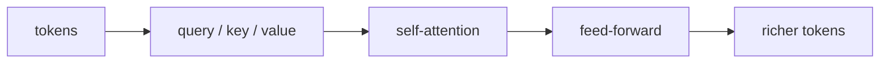

This is the **engine room** on the [lunch-box map]({{ '/posts/14-ai-papers-lunch-box-map/' | relative_url }}). The map’s Quick easy read is the gist. This page is the next layer: enough idea that a busy engineer can *get* the Transformer without grinding the PDF.

## What problem it solves

**Kid line:** old models read words in a single-file line. This one lets every word glance at every other word at the same time.

**Adult line:** recurrent nets (and the “one step, then the next” habit) were hard to train on long sentences and wasted GPU parallelism. Vaswani et al. (2017) showed a stack of **self-attention** plus small feed-forward layers could beat those pipelines on translation — and the same stack later became the default for chat, code, and pictures.

| Before | After this paper |
| --- | --- |
| Hidden state walks left → right | Every token attends to every token in one shot |
| Hard to parallelise across the sentence | GPUs love the big matrix multiplies |
| Separate tricks for “who is who” | Attention *is* the alignment |

## How the idea works

Think of each word as a kid in a classroom who can look around.

1. **Turn words into numbers.** Each token becomes a vector (a short list of numbers).
2. **Ask, look, answer.** For each token, the model builds three views of that vector:
   - **Query** — “what am I looking for?”
   - **Key** — “what do I advertise?”
   - **Value** — “what do I actually pass along if you pick me?”
3. **Score the looks.** Query of *bank* is compared to the keys of *river*, *money*, *the*, … Softmax turns those scores into “how much to listen.”
4. **Mix the values.** The token’s new meaning is a weighted mix of the values it listened to.
5. **Many heads.** Several of these looks run in parallel (grammar vs topic vs punctuation). Then a small feed-forward net cleans the mix.
6. **Stack.** Repeat. Early layers catch local glue. Later layers catch “this whole sentence is about a loan.”

The original paper is an **encoder–decoder** for translation: the encoder reads the source sentence both ways; the decoder writes the target one token at a time, attending to what it has already written *and* to the encoder. Later chat models often keep only a **decoder** (next-token prediction). Same attention idea.

Two other pieces you will meet in every later paper:

- **Position.** Attention itself does not know order. The 2017 paper *adds* a seat-number signal (sinusoidal position). Later open models often use [RoPE]({{ '/posts/14-ai-papers-lunch-box-map/rope-roformer/' | relative_url }}) instead.
- **No recurrence as the main trick.** Residual connections and layer-norm keep the deep stack trainable.

## Why it mattered / what it unlocked

- **Parallel training.** You can chew a whole sentence (or a whole batch) without waiting for token 17 before token 18.
- **One engine, many jobs.** [BERT]({{ '/posts/14-ai-papers-lunch-box-map/bert/' | relative_url }}) reads both ways. GPT-style stacks write. [ViT]({{ '/posts/14-ai-papers-lunch-box-map/vit/' | relative_url }}) treats image patches as tokens. Same lunch box.
- **The “if you only open one paper” paper.** Most of this tray is “Transformer + a new habit” (position, retrieval, adapters, experts).
- **The cost you now feel.** Attention is \(O(n^2)\) in sequence length. That is why later work cares about context windows, [RoPE]({{ '/posts/14-ai-papers-lunch-box-map/rope-roformer/' | relative_url }}), and sparse tricks.

The paper’s own test was **machine translation** on **WMT 2014** English–German and English–French news, not a chatbot. The chatbot era borrowed the engine.

## What to remember

- Self-attention = every token asks “who matters for me *right now*?” and mixes those answers.
- Multi-head = several of those questions at once.
- The stack + residuals is the Transformer; attention is the new primitive, not a side gadget.
- Position must be added somehow. The 2017 recipe is not the only recipe.
- If a later paper feels mysterious, ask: “what did they change *around* this engine?”

## When to read the real paper

Open the PDF when you want:

- the exact Q/K/V scaled-dot-product formula and the “why divide by \(\sqrt{d_k}\)” note
- encoder–decoder attention vs self-attention
- the WMT setup, BLEU numbers, and the ablation table (how many heads, how deep)
- the original sinusoidal position formula

Skip the grind if you only needed “why ChatGPT-shaped models exist.” You already have that.

## Links

- [Paper — Vaswani et al., arXiv 1706.03762](https://arxiv.org/abs/1706.03762)
- [NeurIPS 2017 proceedings](https://proceedings.neurips.cc/paper/2017/hash/3f5ee243547dee91fbd053c1c4a845aa-Abstract.html)
- [Dataset: WMT 2014 translation task](https://www.statmt.org/wmt14/translation-task.html) (the paper’s English–German / English–French news tests)

Back on the tray: [lunch-box map]({{ '/posts/14-ai-papers-lunch-box-map/' | relative_url }}) · next habit [RoPE]({{ '/posts/14-ai-papers-lunch-box-map/rope-roformer/' | relative_url }})
