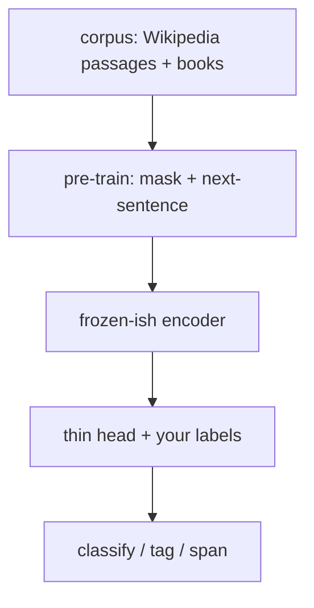

This is the **“read both ways”** box on the [lunch-box map]({{ '/posts/14-ai-papers-lunch-box-map/' | relative_url }}). BERT is the understanding cousin of chat models: great at tickets, queries, and spans; not the usual “write an essay” bot by itself.

## What problem it solves

**Kid line:** do not judge a word until you have seen the words on **both** sides.

**Adult line:** before BERT (Devlin et al., 2018/19), a lot of NLP systems were either left-to-right language models or custom task architectures. BERT showed one **bidirectional Transformer encoder**, pretrained on cheap games, then fine-tuned with a thin head, could set the default for classification, tagging, and extractive QA.

| Job | BERT-shaped? | Chat-decoder shaped? |
| --- | --- | --- |
| Is this ticket angry? | Yes | Overkill |
| Find the answer span in a paragraph | Yes | Possible, different habit |
| Write a new paragraph | Not the original design | Yes |
| Rank a search snippet | Yes (and later cousins) | Possible |

## How the idea works

Start from the [Transformer]({{ '/posts/14-ai-papers-lunch-box-map/attention-is-all-you-need/' | relative_url }}) **encoder**. Throw away the translation decoder. Keep the “every token looks at every token” stack.

**Pre-training games** (the cheap homework):

1. **Masked language model.** Hide about 15% of WordPiece tokens. Guess the blanks from *left and right*. That is the “teacher covers a word” picture.
2. **Next-sentence prediction.** Pack two spans. Ask: did B really follow A in the source text? (Later papers argued this game is the weaker of the two. The *mask* game is the one people still copy.)

**Then fine-tune:** glue a small classifier (or span head) on top. Train on your labelled set. The heavy encoder already knows English-ish structure.

**Input packing (the only “gotcha” worth knowing):** BERT sees `[CLS] … sentence A … [SEP] … sentence B … [SEP]`, plus a segment id so it knows which span is which. `[CLS]` is the usual “whole example” vector for classification.

Two sizes in the paper: **BERT-base** (12 layers) and **BERT-large** (24). Same idea.

## Why it mattered / what it unlocked

- **Pretrain once, specialise many times.** That product habit (one backbone, many heads) is now obvious. In 2018 it flattened a zoo of task-specific nets.
- **Search and classify era.** For years, “we use BERT” meant features for tickets, moderation, and retrieval — not a chatbot.
- **It made the encoder famous.** Chat stacks are mostly decoders. If your job is *understand this text*, you still want this lunch box (or a later encoder cousin).
- **The fine-tune reflex.** [PEFT]({{ '/posts/14-ai-papers-lunch-box-map/peft/' | relative_url }}) / [LoRA]({{ '/posts/14-ai-papers-lunch-box-map/lora/' | relative_url }}) later made *cheap* specialisation. BERT made *specialisation after pretraining* the default.

**Honest corpus note.** BERT’s English pretraining used **BooksCorpus** (Zhu et al., 2015) and **English Wikipedia** (text passages, not lists/tables). Wikipedia dumps are public. The original BookCorpus dump is **not** a simple public zip today. Do not chase a random “BookCorpus.zip.”

## What to remember

- Encoder + both directions + mask game + thin head.
- Bidirectional ≠ “it writes.” Writing usually wants a decoder (see [LLaMA]({{ '/posts/14-ai-papers-lunch-box-map/llama/' | relative_url }})).
- `[CLS]` / `[SEP]` are packing tokens, not magic.
- The 2019 ACL version is the citable venue; the arXiv preprint is the same story with an earlier date.
- If someone says “BERT embeddings,” they mean the encoder states, often the `[CLS]` vector or a pooled mix.

## When to read the real paper

Open Devlin et al. when you want:

- exact mask / random-replace / keep rates
- the GLUE, SQuAD, and SWAG numbers that made the splash
- WordPiece, document-level packing, and the two model sizes
- why they claim bidirectional pretraining beats left-to-right + shallow right context

Skip the grind if you only needed “read both ways, then fine-tune.”

## Links

- [Paper — ACL Anthology N19-1423](https://aclanthology.org/N19-1423/)
- [arXiv 1810.04805](https://arxiv.org/abs/1810.04805)
- [Pretraining corpus: English Wikipedia dumps](https://dumps.wikimedia.org/) (BERT used text passages, not lists/tables)
- [BooksCorpus source paper — Zhu et al., 2015](https://arxiv.org/abs/1506.06724) (the original BookCorpus dump is **not** a simple public download today)

Back on the tray: [lunch-box map]({{ '/posts/14-ai-papers-lunch-box-map/' | relative_url }}) · engine [Attention]({{ '/posts/14-ai-papers-lunch-box-map/attention-is-all-you-need/' | relative_url }}) · eyes [ViT]({{ '/posts/14-ai-papers-lunch-box-map/vit/' | relative_url }})
