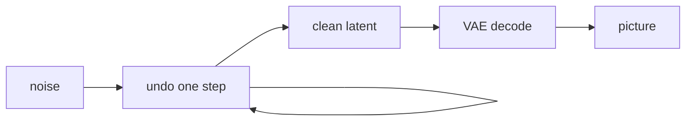

This is the **picture makers (now)** box on the [lunch-box map]({{ '/posts/14-ai-papers-lunch-box-map/' | relative_url }}). Two papers share the tray: **DDPM** (Ho, Jain, Abbeel) for the cleanup loop, and **Latent Diffusion** (Rombach et al.) for the Stable Diffusion lineage — denoise in a [VAE]({{ '/posts/14-ai-papers-lunch-box-map/vae/' | relative_url }})-sized grid, not on every pixel.

## What problem it solves

**Kid line:** messy chalk → wipe carefully → drawing.

**Adult line:** you want high-quality image samples without a GAN’s two-player mood. Diffusion models learn to **reverse a noise process**. Add Gaussian noise to real photos until they are static; train a net to predict the noise (or the clean image) at each step; at generate-time, start from static and **undo** step by step. Latent diffusion does that undo in a **compressed** grid so high-res images fit a single GPU story.

| DDPM (2020) | Latent Diffusion (2021) |
| --- | --- |
| Denoise in **pixel** space | Denoise in an **autoencoder latent** |
| Landmark maths / quality | The cheap “type words, get a picture” lineage |
| CIFAR / LSUN-style tests in the paper | LAION-scale text-to-image in the LDM paper |

## How the idea works

**Forward (destroy):** for timestep \(t = 1 \ldots T\), mix the photo with a little more noise. At large \(T\) you have TV static. This process is fixed; you do not learn it.

**Reverse (clean):** a neural net (U-Net in both landmark papers) sees a noisy canvas plus \(t\), and guesses the noise that was added. Subtract a bit. Repeat.

**Latent twist:**

1. Train (or reuse) an autoencoder that packs a photo into a small spatial code — this is the [VAE]({{ '/posts/14-ai-papers-lunch-box-map/vae/' | relative_url }}) lunch box.
2. Run DDPM-style denoising **on that code**.
3. Decode once at the end to pixels.
4. **Text:** encode the prompt; let the U-Net **cross-attend** to those tokens (“a red bicycle in the rain”).

**Tiny picture:** a dusty chalkboard. You do not draw the cat in one stroke. You wipe a little dust, then a little more. Start from a blank dusty board (pure noise) and wipe toward the prompt.

**Why so many steps?** Each undo is easy. A hundred easy undos beat one impossible “paint a cat from scratch” shot. Distillation later *reduces* steps for products. The landmark papers are the many-step story.

## Why it mattered / what it unlocked

- **This is how most prompt-to-image tools work now.** The brand on the box changes. The undo loop + latent zipper keeps showing up.
- **Latent diffusion made the compute honest.** Pixel-space DDPM at high res is a lab sport. A 8× smaller latent is a product.
- **Cross-attention as a steering wheel.** Text (and later layout / pose) plug in without inventing a new engine.
- **The same cleanup idea jumped.** Audio and video diffusion are this box with extra axes, not a new lunch tray.
- **History vs now.** [GANs]({{ '/posts/14-ai-papers-lunch-box-map/gans/' | relative_url }}) were the sharp-sample kings. Diffusion took the product crown. Keep both on the map.

**Honest data notes (same as the map).** The LDM paper talks about **LAION-400M** for large text-to-image training and uses **MS-COCO** as an evaluation set. Those are the links we keep. Do not invent a “Stable Diffusion official zip” that is not in the paper.

## What to remember

- Destroy with noise; learn to undo one step; repeat.
- DDPM = pixel (or small-image) landmark. LDM = latent + text lineage.
- The zipper is a VAE-like autoencoder. The artist is the denoiser.
- Prompts steer via cross-attention, not via a second GAN fight.
- Step count is quality vs speed. Products distill; papers show the long walk.

## When to read the real papers

Open **DDPM** when you want:

- the discrete Markov chain, the loss that reduces to “predict the noise,” and the CIFAR/LSUN figures

Open **Latent Diffusion** when you want:

- the autoencoder + U-Net + cross-attention recipe
- how they condition on text
- LAION-400M / MS-COCO experimental notes

Skip both PDFs if you only needed “static → wipe → picture, often in a small code.”

## Links

- [DDPM — Ho et al., arXiv 2006.11239](https://arxiv.org/abs/2006.11239)
- [Latent Diffusion / Stable Diffusion lineage — Rombach et al., arXiv 2112.10752](https://arxiv.org/abs/2112.10752)
- [LAION-400M (text-to-image training in the LDM paper)](https://arxiv.org/abs/2111.02114)
- [LAION-400M project page](https://laion.ai/blog/laion-400-open-dataset/)
- [MS-COCO (eval set in that paper)](https://cocodataset.org/)

Back on the tray: [lunch-box map]({{ '/posts/14-ai-papers-lunch-box-map/' | relative_url }}) · zipper [VAE]({{ '/posts/14-ai-papers-lunch-box-map/vae/' | relative_url }}) · history [GANs]({{ '/posts/14-ai-papers-lunch-box-map/gans/' | relative_url }})
