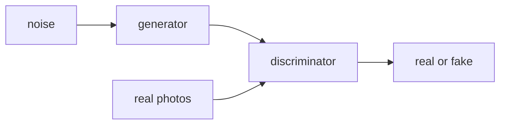

This is the **art contest** half of the classic picture-makers box on the [lunch-box map]({{ '/posts/14-ai-papers-lunch-box-map/' | relative_url }}). [VAE]({{ '/posts/14-ai-papers-lunch-box-map/vae/' | relative_url }}) is zip-and-unzip. [Diffusion]({{ '/posts/14-ai-papers-lunch-box-map/diffusion/' | relative_url }}) mostly won the “type words, get a picture” race. GANs are why a lot of people first saw *sharp* fakes.

## What problem it solves

**Kid line:** artist vs critic, fighting until the fakes look real.

**Adult line:** you want a machine that **samples** new photos from the same “looks like the training set” distribution. Maximum-likelihood density models were blurry or painful. Goodfellow et al. (2014) set up a **two-player game**: a generator \(G\) maps noise to a fake; a discriminator \(D\) says real vs fake. The equilibrium they aim at is “\(D\) is 50/50 and \(G\)’s fakes match the data.”

| Player | Job | Signal |
| --- | --- | --- |
| Generator | Turn random noise into a picture | Fool \(D\) |
| Discriminator | Label real vs fake | Catch \(G\) |

## How the idea works

1. Draw a noise vector \(z\) (the “random scribble”).
2. \(G(z)\) paints a fake.
3. \(D\) sees either a real training image or a fake, and outputs “probability this is real.”
4. Update \(D\) to be a better detective. Update \(G\) so \(D(G(z))\) looks real.
5. Repeat. Neither player is allowed to win forever; if \(D\) is perfect too early, \(G\) gets no useful gradient.

**Tiny picture:** art forger vs museum detective. Every week the forger studies what got caught. Nobody wrote “draw a cat” as a loss; the fight was enough.

**What they trained on.** The landmark paper shows MNIST, the TFD face set, and **CIFAR-10**. CIFAR-10 is the honest public dataset link on this tray. Later GAN papers (Progressive GAN, StyleGAN, …) are other years and other photos. Do not paste those citations onto 1406.2661.

**Training is famously moody.** Mode collapse (the forger paints three faces forever), vanishing gradients, hyperparameter folklore — that is why this box is also a *history* box. The idea is clean. The optimisation is a sport.

## Why it mattered / what it unlocked

- **Sharp samples.** For a stretch of the 2010s, GANs were the way to get crisp generated faces and bedrooms, not the blurry averages people associated with some likelihood models.
- **The two-player habit.** Adversarial losses showed up in other corners (domain adapt, some text GANs, parts of later image stacks). Steal the *idea* carefully; it is easy to overfit a blog post to 2016 Twitter.
- **What products replaced.** Prompt-to-image tools you meet now are usually [diffusion]({{ '/posts/14-ai-papers-lunch-box-map/diffusion/' | relative_url }}) (often with a [VAE]({{ '/posts/14-ai-papers-lunch-box-map/vae/' | relative_url }}) latent). Know GANs so you know what got replaced, and why people still mention them.

## In a real stack (mostly: you will not start here)

If you are shipping **text-to-image** in 2026, you are probably on [diffusion]({{ '/posts/14-ai-papers-lunch-box-map/diffusion/' | relative_url }}). Reach for a GAN when:

- you already have a StyleGAN-era checkpoint and a face/domain pipeline that works
- you need **one forward pass** (no 50-step undo) and you can afford the training sport
- you are reading old papers and must decode the word “adversarial”

For “understand the 2014 idea,” CIFAR-10 + the forger picture is enough. For “ship pretty pictures from a prompt,” change boxes.

## What to remember

- \(G\) paints from noise. \(D\) referees real vs fake. The fight *is* the training.
- 2014 paper + CIFAR-10 / MNIST demos, not Stable Diffusion.
- Collapse and unstable training are part of the folklore for a reason.
- A later “StyleGAN” headline is a descendant, not this PDF.
- History box: still worth one lunch, not your production default for text-to-image.

## When to read the real paper

Open Goodfellow et al. when you want:

- the minimax value function and the “optimal \(D\)” derivation
- the early figures (the ones that look modest next to 2022 models)
- the CIFAR-10 / MNIST experimental setup
- the original “this is a new framework” framing, before the zoo

Skip the grind if you only needed “forger vs detective.”

## Links

- [Paper — Goodfellow et al., arXiv 1406.2661](https://arxiv.org/abs/1406.2661)
- [Dataset used in the paper: CIFAR-10](https://www.cs.toronto.edu/~kriz/cifar.html)

Back on the tray: [lunch-box map]({{ '/posts/14-ai-papers-lunch-box-map/' | relative_url }}) · [VAE]({{ '/posts/14-ai-papers-lunch-box-map/vae/' | relative_url }}) · [Diffusion]({{ '/posts/14-ai-papers-lunch-box-map/diffusion/' | relative_url }})
