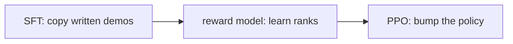

This is half of the **“teach it to listen”** box on the [lunch-box map]({{ '/posts/14-ai-papers-lunch-box-map/' | relative_url }}). InstructGPT is the named chat-style recipe. [RLHF]({{ '/posts/14-ai-papers-lunch-box-map/rlhf-christiano/' | relative_url }}) is the older preference engine it uses.

## What problem it solves

A raw model can ramble. People want it to **do what they asked**, in a useful way.

A pretrained LM is a next-token engine. It will complete “how to build a bomb” or a rude rant if that looks likely. Ouyang et al. (2022) start from GPT-3 and add a three-step alignment loop so the model **follows instructions** on a held-out prompt set — often so well that a **1.3B InstructGPT beats 175B GPT-3** in human preference. Size is not the same as “does what I asked.”

| Symptom of a raw LM | What this paper aims at |
| --- | --- |
| Ignores the ask; keeps completing the genre | Follow the instruction |
| Toxic or unhelpful by default | Preferred answers on their label set |
| “Bigger is better” as the only knob | A small aligned model can win a taste test |

## How the idea works

Three steps. Remember them in order.

1. **Supervised fine-tune (SFT).** Labelers write good answers to prompts (from users + crafted sets). Train the pretrained model to imitate those answers. This already helps a lot.
2. **Reward model (RM).** Show a labeler several model answers to the same prompt. They **rank** them. Fit a model that scores a `(prompt, answer)` pair the way those ranks go.
3. **RL (PPO) against the RM.** Sample answers, get a reward, update the policy. Add a **KL penalty** so the model does not flee the pretrained language for empty high-score babble.

**Simple picture:** a junior first copies marked homework. Then a reviewer points at two answers: “this one, not that one.” The junior practises toward the finger, not toward a written rulebook.

**What they measured.** Labelers preferred InstructGPT to GPT-3 on their prompt distribution. The paper also talks about truthfulness and toxicity — better, not solved. Public NLP benchmarks were **not** the main trophy; some even moved a little the wrong way. That is part of the story: the objective was *human preference on instructions*, not GLUE.

## Why it mattered / what it unlocked

- **This is why chat UIs feel like products.** “Write a polite email” is an instruction. Raw completion is a different job.
- **The three-step skeleton leaked.** Later “helpful assistant” models reuse SFT → preference → RL (or a simpler preference loss). Extra tricks change; the skeleton stays.
- **Preference is someone’s taste.** Labelers were contractors following a guide. “Aligned” here means *aligned to that guide and those ranks*, not to a universal moral law.
- **Honesty about data.** The preference ranks and demo answers are **not** a public dump. Do not chase an “InstructGPT dataset.zip.” The paper is the artefact.

## What to remember

- SFT copies demos. RM learns ranks. RL climbs the RM. KL keeps language on a leash.
- A smaller instructed model can beat a larger raw model on “did you do the task?”
- InstructGPT *uses* [RLHF]({{ '/posts/14-ai-papers-lunch-box-map/rlhf-christiano/' | relative_url }}). Christiano et al. is the older “humans compare two clips” paper.
- Safety and “don’t be rude” in products are this lunch box plus a lot of later filters.
- If you only ship prompts against an API, you still live *downstream* of this recipe.

## When to read the real paper

Open Ouyang et al. when you want:

- labeler instructions, rank collection, and the PPO + KL details
- the 1.3B vs 175B preference plots
- what improved (following, some toxicity) and what did not (hallucination is not gone)
- the honest limits section — whose values, what they did not measure

Skip the grind if you only needed “demos, then ranks, then climb.”

## Links

- [Paper — Ouyang et al., arXiv 2203.02155](https://arxiv.org/abs/2203.02155)
- Older preference engine: [Christiano et al. RLHF guide]({{ '/posts/14-ai-papers-lunch-box-map/rlhf-christiano/' | relative_url }}) · [arXiv 1706.03741](https://arxiv.org/abs/1706.03741)

No public InstructGPT preference dump. If you need a dataset, look at later *open* preference corpora — those are other papers, not this one.

Back on the tray: [lunch-box map]({{ '/posts/14-ai-papers-lunch-box-map/' | relative_url }}) · [RLHF]({{ '/posts/14-ai-papers-lunch-box-map/rlhf-christiano/' | relative_url }}) · raw recipe [LLaMA]({{ '/posts/14-ai-papers-lunch-box-map/llama/' | relative_url }})
