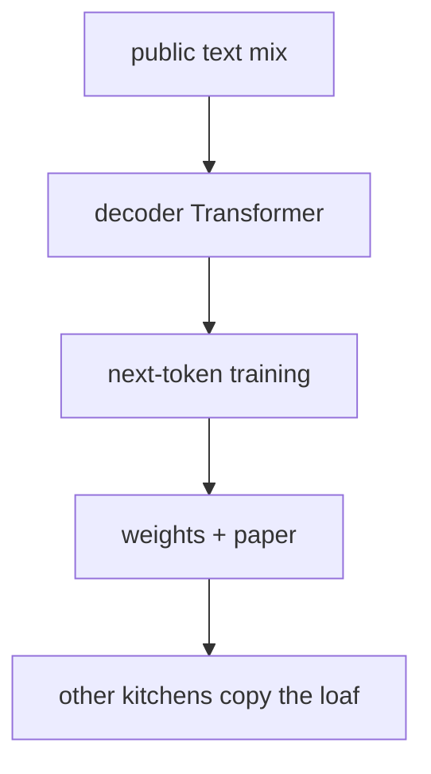

This is the **open language recipe** box on the [lunch-box map]({{ '/posts/14-ai-papers-lunch-box-map/' | relative_url }}). LLaMA is not a new engine. It is a **published stack** that a thousand later models rhyme with.

## What problem it solves

**Kid line:** a public cookbook for “big text brains,” not a magic spell.

**Adult line:** by early 2023, the strongest language models lived behind APIs. Touvron et al. (Meta) showed a family of **decoder** Transformers — 7B, 13B, 33B, 65B in the first paper — trained mostly on **publicly available** text, competitive with much larger closed models on many academic tests. The point was *efficiency of the recipe*, not a new attention formula.

| What LLaMA is | What LLaMA is not |
| --- | --- |
| A documented pretraining recipe + weights (under a licence) | A chat product by itself (that is later instruction / preference work) |
| Decoder-only Transformer | An encoder like [BERT]({{ '/posts/14-ai-papers-lunch-box-map/bert/' | relative_url }}) |
| “Open-ish” research release | A promise that every later Llama version is the same licence or the same mix |

## How the idea works

Keep the [Transformer]({{ '/posts/14-ai-papers-lunch-box-map/attention-is-all-you-need/' | relative_url }}) decoder: predict the next token, left to right.

The paper’s “idea” is the **engineering bill of materials**:

1. **Architecture knobs people still copy.** Pre-norm Transformer, SwiGLU-style feed-forward, [RoPE]({{ '/posts/14-ai-papers-lunch-box-map/rope-roformer/' | relative_url }}) for position, no biases in a few places. None of those is unique to Meta; the *combination* became a dialect.
2. **Data mix, named.** Common Crawl (filtered), C4, GitHub, Wikipedia, books, arXiv, Stack Exchange — the paper gives **percentages**. That table is why engineers still cite LLaMA when they talk about “what did they train on?”
3. **Tokens, not only parameters.** A 13B model trained on more tokens beating a 175B model trained on fewer tokens was the “wait, we were under-training” moment.
4. **Release habit.** Paper + weights + a GitHub card. Later “Llama 2 / 3 / …” are newer cookbooks. This lunch-box page is the **first** paper (2302.13971).

**Tiny picture:** flour, water, oven time. Other kitchens copy the loaf shape and change the toppings ([InstructGPT]({{ '/posts/14-ai-papers-lunch-box-map/instructgpt/' | relative_url }})-style listening, [LoRA]({{ '/posts/14-ai-papers-lunch-box-map/lora/' | relative_url }}) sticky notes, [RAG]({{ '/posts/14-ai-papers-lunch-box-map/rag/' | relative_url }}) binders).

## Why it mattered / what it unlocked

- **A readable recipe.** You could argue about filters and percentages, not only about an API card.
- **The open-weights family tree.** Most “we fine-tuned a 7B/8B/70B” stories you hear still sit on this shape, even when the brand name changed.
- **Compute narrative flipped.** For a while the industry story was “bigger hidden size wins.” LLaMA pushed “more tokens on a smaller stack” back into the centre.
- **Licence is part of the product.** “Open-ish” here means *you can read the paper and (if you qualify) use the weights under Meta’s terms* — not “public domain.” Read the card before you ship.

No extra GIF on the tray is LLaMA-specific. The map overview is the right picture: this box feeds instruction, adapters, experts, and retrieval.

## What to remember

- Decoder Transformer + public-ish mix + published weights.
- RoPE + SwiGLU + pre-norm is the dialect, not the headline science.
- Smaller model + more tokens can beat a larger, hungrier model on many tests.
- Instruction-following is a **later** box. Raw LLaMA completes text; it does not owe you a polite email.
- Always check *which* Llama year you are on. The 2023 paper is the origin story, not the latest model card.

## When to read the real paper

Open Touvron et al. when you want:

- the exact data-mix table and filtering notes
- architecture hyperparameters per size
- the benchmark suite (common-sense, code, maths) and the “13B vs GPT-3 175B” comparisons
- carbon / infra comments in the paper’s later sections

Skip the grind if you only needed “open cookbook, decoder stack, later models rhyme with it.”

## Links

- [Paper — Touvron et al., arXiv 2302.13971](https://arxiv.org/abs/2302.13971)
- [Code / model card — Meta Llama GitHub](https://github.com/meta-llama/llama)
- [Hugging Face LLaMA docs](https://huggingface.co/docs/transformers/en/model_doc/llama)

The paper *names* public sources (Common Crawl, C4, Wikipedia, …). Those are not one zip called “the LLaMA dataset.” Follow each source’s own access rules.

Back on the tray: [lunch-box map]({{ '/posts/14-ai-papers-lunch-box-map/' | relative_url }}) · position [RoPE]({{ '/posts/14-ai-papers-lunch-box-map/rope-roformer/' | relative_url }}) · listening [InstructGPT]({{ '/posts/14-ai-papers-lunch-box-map/instructgpt/' | relative_url }})
