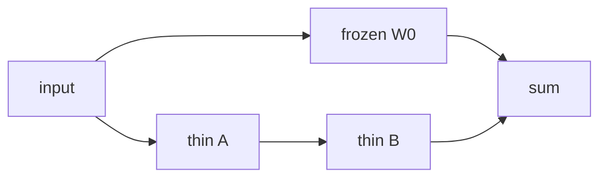

This is the famous member of the **cheap fine-tuning** box on the [lunch-box map]({{ '/posts/14-ai-papers-lunch-box-map/' | relative_url }}). [PEFT]({{ '/posts/14-ai-papers-lunch-box-map/peft/' | relative_url }}) is the family name. **LoRA** is the sticky note most teams actually ship.

## What problem it solves

**Kid line:** keep the whole textbook; only rewrite a sticky note.

**Adult line:** full fine-tuning writes a new copy of every weight. For a 7B–70B model that is money, disk, and a merge nightmare if you want *many* specialists. Hu et al. (2021) freeze the pretrained matrix \(W_0\) and learn a **low-rank** update \(BA\) beside it. Same task quality on their GPT-2 / GPT-3 / RoBERTa / DeBERTa / CLIP-style tests, far fewer trainable numbers.

| Full fine-tune | LoRA |
| --- | --- |
| Every weight moves | \(W_0\) frozen; only \(A\) and \(B\) train |
| One full checkpoint per skill | One base + a small adapter file per skill |
| Serve is “just the model” | You can **merge** \(W_0 + BA\) and serve as one |

## How the idea works

Pick a big linear map inside the net — the paper’s favourite targets are **attention projections** (query / value, sometimes more).

1. Leave \(W_0\) as it was at pretraining.
2. Add \(\Delta W = BA\), where \(B\) is tall-and-thin, \(A\) is short-and-wide, and the inner size is **rank \(r\)** (often 4, 8, 16…).
3. Scale the update (the paper’s \(\alpha / r\) habit). That is the volume knob.
4. Forward pass: \(h = W_0 x + BA x\).
5. At deploy time, **fold** \(BA\) into \(W_0\) if you want zero extra latency. Or keep adapters unmerged and hot-swap files.

**Why “low rank” is a bet.** The paper’s claim: the *change* you need for a downstream task lives in a small subspace. You do not need a full \(d \times d\) delta. If the bet is wrong for your task, raise \(r\) — or admit you wanted a full fine-tune.

**Tiny picture:** the printed textbook stays on the shelf. A new course is a few notes on the hard pages. Swap the notes; the book stays.

## Why it mattered / what it unlocked

- **Default “we fine-tuned it.”** In a lot of real stacks, that sentence means LoRA (or QLoRA: same sticky note, 4-bit base).
- **Many skills, one backbone.** Support tone, internal jargon, a tool habit — three files, not three 13B copies.
- **Fits the PEFT plugin story.** Hugging Face [PEFT](https://huggingface.co/docs/peft/en/index) is where most engineers import this. The paper is the maths; the library is the door.
- **Mergeability.** Unlike some older adapter stacks, you are not forced to pay extra depth at serve if you bake the note in.

This site already has a longer engineer tour of the whole family: [PEFT, LoRA, and QLoRA]({{ '/posts/peft-lora-qlora-guide/' | relative_url }}). This page stays on **Hu et al.**

## What to remember

- Frozen \(W_0\) + \(BA\) with small rank \(r\).
- Target modules matter (often `q_proj` / `v_proj`; more modules → more capacity).
- \(\alpha\) and \(r\) are the two knobs people actually turn.
- Merge to serve cheap; keep unmerged to swap skills.
- LoRA is one PEFT method. If someone says “we did PEFT,” ask *which*.

## When to read the real paper

Open Hu et al. when you want:

- the rank / \(\alpha\) ablations and which layers they adapt
- GPT-2 / GPT-3 / NLU tables vs full fine-tune and vs other adapters
- the “intrinsic dimension” intuition they lean on
- why they argue merge has no extra inference latency

Skip the grind if you only needed “sticky note, freeze the book.”

## Links

- [Paper — Hu et al., arXiv 2106.09685](https://arxiv.org/abs/2106.09685)
- Family page: [PEFT longer guide]({{ '/posts/14-ai-papers-lunch-box-map/peft/' | relative_url }})
- [Hugging Face PEFT docs](https://huggingface.co/docs/peft/en/index)

No special “LoRA dataset.” They reuse ordinary downstream sets from the models they adapt.

Back on the tray: [lunch-box map]({{ '/posts/14-ai-papers-lunch-box-map/' | relative_url }}) · [PEFT]({{ '/posts/14-ai-papers-lunch-box-map/peft/' | relative_url }})
