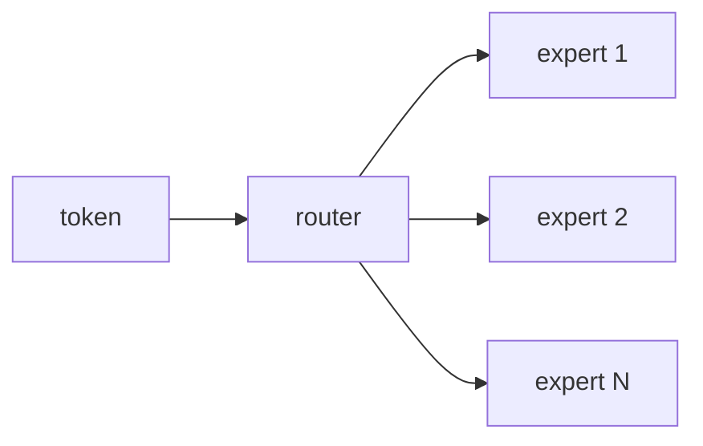

This is the **sparse giants** box on the [lunch-box map]({{ '/posts/14-ai-papers-lunch-box-map/' | relative_url }}). The tray’s primary paper is **Switch Transformers** (Fedus, Zoph, Shazeer, 2021). The older root is **Shazeer et al. 2017** (sparsely-gated mixture of experts).

## What problem it solves

Many specialists; only the right ones stand up.

A dense Transformer uses **every** feed-forward weight for **every** token. That is quality, and it is expensive. An **MoE** replaces some dense MLPs with a roster of expert MLPs plus a **router**. You grow *parameter count* (capacity) faster than you grow *compute per token* — if routing stays healthy.

| Dense stack | MoE stack |
| --- | --- |
| One FFN, always on | *N* expert FFNs |
| FLOPs scale with all weights | FLOPs scale with the experts you **wake** |
| Simple to implement | Router + load balance is the tax |

## How the idea works

Keep the [Transformer]({{ '/posts/14-ai-papers-lunch-box-map/attention-is-all-you-need/' | relative_url }}) attention as usual (Switch still attends densely). Change the **feed-forward** block:

1. A small **router** looks at the token and scores the experts (a linear + softmax / noisy top-k in older work).
2. **Switch:** send the token to **exactly one** expert (top-1). Older MoE often used top-2.
3. That expert’s FFN runs. The others sleep for this token.
4. Add a **load-balancing** loss so one popular expert does not eat the whole batch (capacity factor, auxiliary loss — this is the engineering).

**Simple picture:** a hospital with many specialists. The triage nurse sends you to *one* doctor. You do not call the whole staff for a sore throat.

**Why Switch simplified the 2017 idea.** Shazeer et al. showed sparsely-gated experts can scale translation / LM quality. Top-*k* (k>1) means more communication between devices: each token may fly to two experts. Switch’s slogan is **route to one**, keep the quality, cut the comms. They train very large parameter counts on **C4** (the Colossal Clean Crawled Corpus defined in the T5 paper).

No dedicated MoE GIF on the tray. The map overview is the right “sparse giants” picture.

## Why it mattered / what it unlocked

- **The “trillion parameter” sentence.** Those headlines are often *sparse* parameter counts. Most weights sleep on a given token.
- **Same GPU-time, more capacity** — when the router is not pathological. When it is, you get expert collapse (everyone picks expert 3) and you debug routing, not attention.
- **Vendor vocabulary.** “Sparse model,” “expert parallelism,” “MoE layer” — this lunch box.
- **Lineage, not a single recipe.** Grok / Mixtral-style later models are cousins (often top-2 again). Learn Switch + Shazeer, then read the model card in front of you.

## In a real stack

You will not “turn on MoE” in a single config flag without paying for **expert parallelism**:

- Experts live on different devices. The router is a tiny all-to-all: tokens fly to the expert that won.
- **Capacity factor** = how many tokens an expert is allowed to take. Too small → tokens drop. Too big → you wasted the sparse bet.
- Eval in production: watch **expert load histograms**, not only perplexity. A pretty loss with one hot expert is a dense model in a trench coat.

If a vendor says “sparse 8×7B,” ask: top-1 or top-2? shared experts? what fails when traffic is one domain all afternoon?

## What to remember

- Attention can stay dense; the FFN becomes a routed roster.
- Switch = top-1 expert. Older / later stacks may use top-2.
- Load balance is the real systems problem.
- Parameter count ≠ compute. Quote both.
- C4 is the named Switch pretrain corpus, via the T5 paper — not a mystery private zip invented here.

## When to read the real papers

Open **Switch** when you want:

- the top-1 router, capacity factor, and auxiliary loss
- the scaling plots (parameters vs quality vs TPU time)
- instability notes (they are honest about training blow-ups)

Open **Shazeer 2017** when you want the original sparsely-gated MoE (noisy top-k, the first big “experts as a layer” picture).

Skip both PDFs if you only needed “many specialists, few wake up.”

## Links

- [Primary paper — Switch Transformers, arXiv 2101.03961](https://arxiv.org/abs/2101.03961)
- [Lineage — Shazeer et al., sparsely-gated MoE, arXiv 1701.06538](https://arxiv.org/abs/1701.06538)
- [C4 corpus (defined in the T5 paper)](https://arxiv.org/abs/1910.10683) (Switch pretrains on the Colossal Clean Crawled Corpus)

Back on the tray: [lunch-box map]({{ '/posts/14-ai-papers-lunch-box-map/' | relative_url }}) · engine [Attention]({{ '/posts/14-ai-papers-lunch-box-map/attention-is-all-you-need/' | relative_url }}) · recipe [LLaMA]({{ '/posts/14-ai-papers-lunch-box-map/llama/' | relative_url }})
