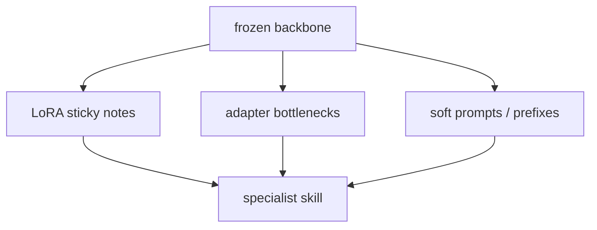

This is the **family** page in the cheap-tuning box on the [lunch-box map]({{ '/posts/14-ai-papers-lunch-box-map/' | relative_url }}). Not one paper. **PEFT** = Parameter-Efficient Fine-Tuning. [LoRA]({{ '/posts/14-ai-papers-lunch-box-map/lora/' | relative_url }}) is the member you should default to. This page is the roster.

## What problem it solves

**Kid line:** the library building stays put. Each new subject gets a thin pamphlet, not a second building.

**Adult line:** you have a strong pretrained model and a real task set. Full fine-tuning works and is wasteful: you store and train *all* weights, once per skill. PEFT methods specialise the model by training a **small** add-on (or a small slice of weights) so one frozen backbone can wear many skills.

| Use PEFT when | Do not start with PEFT when |
| --- | --- |
| You can train (you have weights, a GPU, a dataset) | You only have a closed API key |
| Prompting / [RAG]({{ '/posts/14-ai-papers-lunch-box-map/rag/' | relative_url }}) keep missing a *habit* | The missing facts live in documents — try RAG first |
| You want several specialists of one base | You need a one-off answer (that is a prompt) |

## How the idea works

Same job as a full fine-tune: move the model toward your distribution. Different **where the new numbers live**.

**A short family tree (honest, not complete):**

1. **Adapters (Houlsby et al., 2019).** Tiny bottleneck layers slid *inside* a frozen BERT (down-project → nonlinearity → up-project). Early, clear PEFT. Extra depth at run time unless you get clever.
2. **LoRA (Hu et al., 2021).** Low-rank update beside a frozen linear map. Mergeable. Today’s default. [Own guide]({{ '/posts/14-ai-papers-lunch-box-map/lora/' | relative_url }}).
3. **Prompt / prefix / P-tuning.** Do not touch the backbone internals. Learn extra **vectors** that sit in the input (or in every layer as a prefix). Great when you want a light touch; often weaker than LoRA for heavy style/tool habits.
4. **BitFit, IA3, and friends.** Even smaller slices (biases only, or learned rescales). Know they exist. Do not start here.
5. **QLoRA (later).** Same LoRA maths, 4-bit frozen base so a bigger model fits. Not a 2019–2021 landmark on this tray; you will meet it in tools.

**Hugging Face PEFT** is the library most engineers import. It is **not** a paper. It is the drawer where these pamphlets live.

**Tiny picture:** plugins. The app binary stays. You drop in a small module per customer.

## Why it mattered / what it unlocked

- **Budget maths.** Seventy billion weights × *N* customers does not fit a disk or a procurement meeting.
- **Hot-swap skills.** Train overnight, ship a few megabytes, leave the base checkpoint where it is.
- **A shared vocabulary.** “We did PEFT” is now a sentence in design docs. Push for the method name.
- **Adapters were the proof.** Houlsby et al. showed *BERT + tiny inserts* ≈ full fine-tune on GLUE-style work. LoRA later won the LLM era on simplicity + merge.

Deeper tour of knobs (rank, alpha, QLoRA): [PEFT, LoRA, and QLoRA]({{ '/posts/peft-lora-qlora-guide/' | relative_url }}) on this site. That post is a listed Writing piece. This page stays a lunch-box satellite.

## What to remember

- PEFT is a **family**, not a single algorithm.
- Default: LoRA. If the base will not fit, QLoRA. Else, know why.
- Houlsby adapters = early bottleneck inserts, especially on BERT-era encoders.
- HF PEFT = the import path, not the citation.
- If the knowledge is in files, retrieval is cheaper to iterate than a training run.

## When to read the real papers / docs

- **Library you will actually click:** [Hugging Face PEFT](https://huggingface.co/docs/peft/en/index) — configs, supported methods, how adapters attach.
- **Houlsby et al.** when you want the original adapter diagrams and GLUE-style tables.
- **Hu et al.** when you want the LoRA maths (see the [LoRA guide]({{ '/posts/14-ai-papers-lunch-box-map/lora/' | relative_url }})).

Skip a full-family survey if you only needed “cheap specialise; start with LoRA.”

## Links

- [Hugging Face PEFT docs](https://huggingface.co/docs/peft/en/index)
- [LoRA paper — Hu et al.](https://arxiv.org/abs/2106.09685)
- [Adapter paper — Houlsby et al., arXiv 1902.00751](https://arxiv.org/abs/1902.00751)
- [PMLR / ICML version](https://proceedings.mlr.press/v97/houlsby19a.html)
- [Google Research page](https://research.google/pubs/parameter-efficient-transfer-learning-for-nlp/)

Back on the tray: [lunch-box map]({{ '/posts/14-ai-papers-lunch-box-map/' | relative_url }}) · [LoRA]({{ '/posts/14-ai-papers-lunch-box-map/lora/' | relative_url }})
