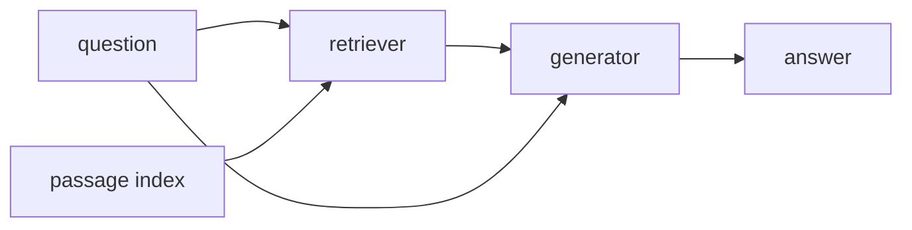

This is the **look it up first** box on the [lunch-box map]({{ '/posts/14-ai-papers-lunch-box-map/' | relative_url }}). Lewis et al. (2020) named the sandwich. Today’s “stuff three chunks in the prompt” products are the same lunch box with a thinner generator.

## What problem it solves

Open the binder before you answer.

A closed-book LM must store facts in weights. Facts go stale. The model invents a confident policy. **Retrieval-Augmented Generation** keeps a **non-parametric** memory (an index of passages you can update) and a **parametric** memory (the generator). At question time you fetch, then condition generation on what you fetched.

| Closed book | RAG |
| --- | --- |
| Hope the weight memorised it | Hope the **index** contains it |
| Fix a fact → retrain | Fix a fact → edit / reindex a doc |
| Hard to cite | You can point at the passage |

## How the idea works

Lewis et al.’s original stack (not a 2024 vector-DB vendor slide):

1. **Index Wikipedia passages** with a dense retriever (DPR-style: a question encoder and a passage encoder, inner product search, FAISS in the paper).
2. A **query** is encoded. Top-*k* passages come back.
3. A **seq2seq generator** (they use BART) writes the answer **conditioned on** the query plus those passages.
4. They study a few ways to combine passages (one latent doc vs mixing several). You do not need the marginalisation algebra to steal the product idea.

**Simple picture:** open-book test. Grab three photocopies from the binder, then write. Closed-book is hoping you memorised the binder.

**What “RAG” means in a shipping app (same sandwich, different bread):**

- Retriever: BM25, embeddings, hybrid. Index: files, tickets, wikis — **your** corpus, not only Wikipedia.
- Generator: any decoder / chat model. The 2020 paper is seq2seq; 2024 is usually a prompt template.
- The failure modes stayed: bad chunking, stale index, retrieved junk, generator ignores the notes.

This site’s listed piece [Semantic caching]({{ '/posts/rag-semantic-caching/' | relative_url }}) is about *not repeating* similar questions. Different knob. Same lunch-box neighbourhood.

## Why it mattered / what it unlocked

- **The usual engineering answer to hallucination.** Not a cure. A control surface: documents, chunking, eval on *your* questions.
- **Provenance.** Even a sloppy citation (“we used paragraph 4”) beats a bare next-token shrug.
- **A named origin.** People said “memory nets” and “open-domain QA” before 2020. RAG is the paper most product decks mean.
- **It does not replace fine-tuning.** [LoRA]({{ '/posts/14-ai-papers-lunch-box-map/lora/' | relative_url }}) changes *habit*. RAG changes *what notes are in reach*. Use both when you need both.

## In a real stack

A shipping RAG service is usually four boring pieces:

| Piece | What goes wrong |
| --- | --- |
| Chunking | Too big → retrieval is mush. Too small → no sentence of context |
| Index + metadata | You forgot to filter by tenant, language, or “do not use” |
| Prompt template | “Use the notes” is weaker than “if the notes do not say, say you do not know” |
| Eval set | Ten golden questions with the passage you *expect*. Without this you are guessing |

You can swap the 2020 BART generator for any hosted chat model. You cannot skip the index quality.

## What to remember

- Retrieve → condition → generate. Two memories.
- The 2020 corpus is **Wikipedia passages**. Your product corpus is whatever you index.
- Updating docs is the cheap fact fix; retraining a 70B is not.
- If the retriever misses, the generator cannot honestly know.
- “RAG” on a slide is this box even when the generator is a hosted chat API.

## When to read the real paper

Open Lewis et al. when you want:

- the RAG-Sequence vs RAG-Token combination rules
- Natural Questions / TriviaQA / FEVER-style numbers vs closed-book seq2seq
- how they train retriever + generator together
- the original FAISS + DPR + BART bill of materials

Skip the grind if you only needed “open the binder, then speak.”

## Links

- [Paper — Lewis et al., arXiv 2005.11401](https://arxiv.org/abs/2005.11401)
- [Retrieval corpus: Wikipedia dumps](https://dumps.wikimedia.org/) (the paper indexes Wikipedia passages)

Back on the tray: [lunch-box map]({{ '/posts/14-ai-papers-lunch-box-map/' | relative_url }}) · cheap habit [LoRA]({{ '/posts/14-ai-papers-lunch-box-map/lora/' | relative_url }})
