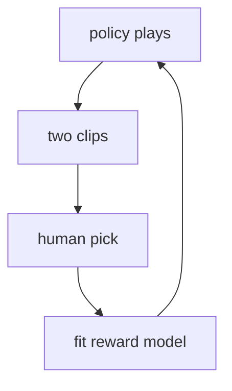

This is the other half of the **“teach it to listen”** box on the [lunch-box map]({{ '/posts/14-ai-papers-lunch-box-map/' | relative_url }}). [InstructGPT]({{ '/posts/14-ai-papers-lunch-box-map/instructgpt/' | relative_url }}) is the language-model product form. **Christiano et al. (2017)** is the named origin: **deep reinforcement learning from human preferences**.

## What problem it solves

**Kid line:** you cannot write a perfect rule for “that was a nice backflip.” You can point at the better video.

**Adult line:** RL needs a **reward**. For Atari you can use the game score. For “looks like a real backflip” or “be a helpful assistant,” a hand-written reward is either missing or a cheat the agent will game. Christiano et al. replace the written reward with a **learned** one, fit to humans choosing the winner of two short clips.

| If you can… | Then use… |
| --- | --- |
| Write a trustworthy number (game score, latency) | Ordinary RL |
| Only say “A is better than B” | This paper’s loop |
| Write a full good answer | Supervised imitation (InstructGPT’s first step) |

## How the idea works

1. The agent acts in an environment (here: Atari, and a simulated robot). You record short trajectory snippets.
2. A human sees **two** snippets and picks a winner (or a rare “can’t tell”).
3. Fit a **reward model** \(r_\theta\) so that preferred snippets get higher return than the losers (a Bradley–Terry-style ranking loss).
4. Train the **policy** with RL on \(r_\theta\) (they use an A2C / PPO-family setup in the paper’s stack).
5. Keep collecting comparisons on the *current* policy, or the reward model goes stale.

**Tiny picture:** two robot dance videos. You tap the less-awkward one. You never write the physics of dancing. The robot still gets better at dancing.

**What they showed.** With surprisingly few comparison hours, agents learned Atari games and a backflip from preference, sometimes matching or beating reward-from-the-game baselines. The paper is **not** about GPT. It is about *preference as a reward interface*.

## Why it mattered / what it unlocked

- **A method name that stuck.** “RLHF” in 2022–2024 chat papers is this loop, moved from pixels-and-joysticks to prompts-and-answers.
- **Taste is a ranking problem.** Tone, “don’t be rude,” “this explanation is clearer” — those are comparisons, not unit tests.
- **It made the later debate possible.** If the reward is a model of *someone’s* picks, you can ask: whose picks? how many? how gamed? That debate is downstream of this paper, not a reason to skip the idea.
- **InstructGPT is the LM port.** SFT + RM + PPO in Ouyang et al. is Christiano’s preference engine wearing a language-model body.

## What to remember

- Humans compare two traces. A reward model fits the picks. RL climbs that model.
- Use this when the true score is “I know it when I see it.”
- The 2017 environments are games and MuJoCo-style robots, not chat.
- Preference data can be stale; the loop is **online-ish**, not a one-shot label dump.
- “RLHF” on a model card almost always means this box + an InstructGPT-shaped pipeline.

## When to read the real paper

Open Christiano et al. when you want:

- the exact preference loss and how they query humans
- Atari / robot results and how many comparison hours they spent
- the “reward hacking” discussion — the agent will exploit a sloppy \(r_\theta\)
- the original figures (clip UI, learning curves)

Skip the grind if you only needed “humans compare, the model climbs,” then go to [InstructGPT]({{ '/posts/14-ai-papers-lunch-box-map/instructgpt/' | relative_url }}) for the chat version.

## Links

- [Paper — Christiano et al., arXiv 1706.03741](https://arxiv.org/abs/1706.03741)
- Language-model version: [InstructGPT guide]({{ '/posts/14-ai-papers-lunch-box-map/instructgpt/' | relative_url }}) · [Ouyang et al., arXiv 2203.02155](https://arxiv.org/abs/2203.02155)

No public “Christiano preference dump” for these robots/Atari clips as a modern LM dataset. Do not invent one.

Back on the tray: [lunch-box map]({{ '/posts/14-ai-papers-lunch-box-map/' | relative_url }}) · [InstructGPT]({{ '/posts/14-ai-papers-lunch-box-map/instructgpt/' | relative_url }})
