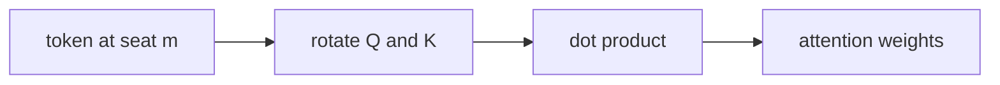

This is the **“where am I in the line?”** box on the [lunch-box map]({{ '/posts/14-ai-papers-lunch-box-map/' | relative_url }}). Short paper, big habit: almost every LLaMA-shaped open model you meet uses a rotary-style position story.

## What problem it solves

The engine can see *who* is in the room, but not *who sat where*, unless you tell it.

Self-attention is permutation-sensitive only if you inject position. Absolute “add a seat vector” works, but relative distance (token *i* vs token *j*) is what language and code actually need. **RoPE** (Rotary Position Embedding), from Su et al.’s **RoFormer** paper, bakes *relative* position into the Q/K product by rotating pairs of dimensions as a function of index.

| Habit | What it does | Felt limit |
| --- | --- | --- |
| Absolute add-on (2017 Transformer) | Add a seat vector to each token | “Seat 4096” was never in training |
| Relative bias (some later stacks) | Add a learned *i−j* bonus to attention scores | Extra table to store and train |
| **RoPE** | Rotate Q and K so the dot product *knows* *i−j* | Still not magic at infinite length, but stretches more kindly |

## How the idea works

Keep the [Transformer]({{ '/posts/14-ai-papers-lunch-box-map/attention-is-all-you-need/' | relative_url }}) picture. Before attention scores are computed:

1. Take the query (and key) vector for a token at seat *m*.
2. Split that vector into 2-D pairs, like little clock hands.
3. **Rotate** each pair by an angle that depends on *m* (far dimensions rotate slower; that is the “wavelength” trick).
4. Do the usual query · key. Because both sides were rotated, the score depends on **how far apart the seats are**, not only on the two words.

You do not attach a sticker that says “I am seat 7.” The rotation *is* the seat.

**Simple picture:** two people on a spinning ride. How much one has turned relative to the other *is* how far apart they sit.

No extra GIF on the tray is RoPE-specific. The attention GIF still holds: this page is only about *seat numbers* inside those looks.

## Why it mattered / what it unlocked

- **Open LLM default.** [LLaMA]({{ '/posts/14-ai-papers-lunch-box-map/llama/' | relative_url }})-family stacks (and a lot of cousins) use rotary embeddings. If you read a model card and see “RoPE,” this is that line.
- **Relative by construction.** “Dog bites man” vs “man bites dog” is a distance-and-order problem. RoPE puts that into the same multiply the GPU already does.
- **Longer lines.** Teams still extend or interpolate RoPE for 32k+ context. That is engineering on top of this idea, not a different lunch box.
- **Small paper, large surface area.** You will see RoPE mentioned more often in code than in slide decks. That is a good sign it leaked into the stack.

The RoFormer paper also argues rotary embeddings help the model use the **full** hidden size for content *and* position, instead of spending some dimensions only on an added seat vector. You do not need that proof to use the habit.

## What to remember

- Attention is deaf to order until you inject position.
- RoPE injects position by **rotating** Q and K; relative distance falls out of the rotation.
- It is a drop-in *inside* the Transformer, not a new engine.
- LLaMA-shaped models almost always mean “this box.”
- Long-context headlines are usually “RoPE + extra stretch tricks,” not “we deleted position.”

## When to read the real paper

Open Su et al. when you want:

- the 2-D rotation matrix and the complex-number write-up
- why they claim it encodes relative position in the attention inner product
- the RoFormer experiments (text classification, machine translation) — this is **not** a 70B training report

You do **not** need the PDF to follow a LLaMA diagram that just says “apply RoPE to q and k.”

## Links

- [Paper — RoFormer / Su et al., arXiv 2104.09864](https://arxiv.org/abs/2104.09864)

No honest public “RoPE dataset” zip. The paper’s experiments are ordinary NLP tasks; the idea is the rotation, not a new corpus.

Back on the tray: [lunch-box map]({{ '/posts/14-ai-papers-lunch-box-map/' | relative_url }}) · engine [Attention]({{ '/posts/14-ai-papers-lunch-box-map/attention-is-all-you-need/' | relative_url }}) · recipe [LLaMA]({{ '/posts/14-ai-papers-lunch-box-map/llama/' | relative_url }})
