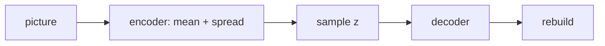

This is the **zip-and-unzip** half of the classic picture-makers box on the [lunch-box map]({{ '/posts/14-ai-papers-lunch-box-map/' | relative_url }}). [GANs]({{ '/posts/14-ai-papers-lunch-box-map/gans/' | relative_url }}) fight. **VAEs** compress. [Diffusion]({{ '/posts/14-ai-papers-lunch-box-map/diffusion/' | relative_url }}) still borrows the compressor.

## What problem it solves

Stuff a poster into a tiny envelope of numbers, then unpack it.

You want a **latent** — a small code you can sample from — plus a decoder that turns a code back into data. A plain autoencoder can reconstruct, but its code space may have holes (a random code unpacks to garbage). Kingma & Welling (2013/14), **Auto-Encoding Variational Bayes**, force the encoder to talk in a simple language (usually “looks like a standard bell curve”) so you can **draw new codes** and decode them.

| Plain autoencoder | VAE |
| --- | --- |
| Encode → decode, rebuild well | Rebuild well **and** keep the code distribution simple |
| Latent holes are common | You can sample z ~ N(0, I) and decode |
| No official “how to sample” | A generative model with an ELBO objective |

## How the idea works

1. **Encoder** qφ(z | x): map a picture x to a **cloud** — usually a mean and a variance per latent dimension, not one frozen point.
2. **Sample** z from that cloud. The **reparameterisation trick** is:

\[z = \mu + \sigma \odot \varepsilon,\quad \varepsilon \sim \mathcal{N}(0,I)\]

That rewrite is why gradients can flow through the sample with ordinary backprop.

3. **Decoder** pθ(x | z): unpack z into a rebuilt picture.
4. **Train with two pressures:**
   - rebuild (reconstruction)
   - keep each cloud close to the prior (KL to N(0, I)). That is the “don’t make a wild private language” tax.

The paper’s name for the training deal is the **ELBO** (evidence lower bound). You do not need to recite the bound to steal the picture.

**Simple picture:** nearby envelopes unpack into similar posters. Walk from one envelope toward another and the posters morph. That neighbourhood is the latent space.

**Blur vs sharpness (honest).** Classic VAEs are often a bit blurry next to a well-trained GAN or a modern diffusion sample. Their gift is the **smooth code**, not the 2022 art contest. That is exactly why latent diffusion *keeps* a VAE-like autoencoder and does the fancy denoising in the small grid.

## Why it mattered / what it unlocked

- **A practical way to do variational inference** with neural nets — the paper is as much “how to train this” as “pretty pictures.”
- **Latent walks.** Interpolate faces, digits, spectrograms. The code is a place you can travel.
- **The compressor in modern image stacks.** Stable Diffusion’s autoencoder is this lunch box wearing 2021 clothes. See [Diffusion]({{ '/posts/14-ai-papers-lunch-box-map/diffusion/' | relative_url }}).
- **A word you will hear forever.** When someone says “latent,” start from zip-file intuition, then ask which paper they mean.

## In a real stack

You will meet a VAE as a **codec**, not as the whole product:

- Image generators: encode pixels → small grid, do diffusion there, decode once.
- Speech / video cousins: same zipper idea, different data.
- “Walk the latent” demos: pick two codes, interpolate, decode the path.

If a dashboard says “latent dimension 4” or “KL weight 1e-6,” someone is turning the two pressures on this page. Too much KL → codes ignore the picture. Too little → pretty rebuilds, ugly samples.

## What to remember

- Encoder → cloud → sample → decoder.
- Reparameterisation is why this trains with ordinary backprop.
- Reconstruction + KL-to-prior is the deal.
- Smooth latents > razor-sharp 2014 samples.
- Diffusion products still *use* this box as the zipper.

## When to read the real paper

Open Kingma & Welling when you want:

- the ELBO derivation and the reparameterisation trick written cleanly
- the original AEVB algorithm
- the early density-modelling experiments (this is not a CIFAR-10 GAN bake-off)

Skip the grind if you only needed “zip, keep the codes simple, unzip.”

## Links

- [Paper — Kingma & Welling, arXiv 1312.6114](https://arxiv.org/abs/1312.6114)

No extra public “the VAE dataset” on this tray. The paper is a method paper; later image work names its own corpora.

Back on the tray: [lunch-box map]({{ '/posts/14-ai-papers-lunch-box-map/' | relative_url }}) · [GANs]({{ '/posts/14-ai-papers-lunch-box-map/gans/' | relative_url }}) · [Diffusion]({{ '/posts/14-ai-papers-lunch-box-map/diffusion/' | relative_url }})
