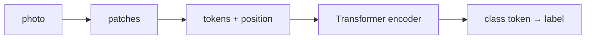

This is the **eyes** box on the [lunch-box map]({{ '/posts/14-ai-papers-lunch-box-map/' | relative_url }}). Same engine as text. Different tokens: **patches**, not words.

## What problem it solves

A photo becomes a strip of tiles, then attention reads the strip.

Computer vision spent a decade on convolutional backbones (local filters, hand-built inductive bias). Dosovitskiy et al. asked: if you have **enough labelled photos and compute**, can a nearly-plain Transformer match or beat those CNNs on image classification? **ViT** (Vision Transformer) says yes — especially when you pretrain big, then transfer.

| Old habit | ViT habit |
| --- | --- |
| Slide small filters over pixels | Cut a fixed grid of patches |
| Built-in “nearby pixels matter” | Attention *learns* which tiles talk |
| Vision-only zoo of blocks | Text engine, new tokenizer (the cutter) |

## How the idea works

1. **Resize** the photo to a square the model expects (the paper talks in 224-ish land; products vary).
2. **Cut patches.** Classic setting: 16×16 pixels. A 224×224 image → 14×14 = 196 tiles. That is the “16×16 words” title.
3. **Flatten each tile** and project it to the Transformer width (a linear layer). Now you have a sequence, like WordPieces.
4. **Add position** (learned 1-D embeddings in the paper — “this is tile 7,” not RoPE).
5. **Stick a `[CLS]`-style token** at the front. After the encoder stack, that token’s vector goes to a classification head.
6. **Pretrain on a large labelled set**, then fine-tune on the target (ImageNet-style tests in the headlines).

The tray GIF that sits on BERT also sits here: left-and-right looks, but the “words” are stamps.

**The data catch (the paper is honest about it).** A ViT trained *only* on ImageNet-1k from scratch is not automatically better than a well-tuned CNN. The win shows up when you pretrain on **larger** labelled photo sets (the paper’s ImageNet-21k / JFT-style story) and then transfer. Inductive bias was not free; it was *bought with data*.

## Why it mattered / what it unlocked

- **One building block for pixels and words.** Multimodal stacks later mix patch tokens and text tokens in the same attention soup.
- **“Eyes” without a CNN religion.** You can still use convolutions (many hybrids do). ViT made “maybe we don’t have to” a serious option.
- **Transfer as the product move.** Same as BERT: heavy pretrain, thin specialise.
- **It did not delete CNNs overnight.** Efficiency, small-data, and dense prediction (segmentation) kept convs and later hybrids in the race. Learn the box, then check the year.

## In a real stack

| You have… | ViT-shaped move |
| --- | --- |
| A pile of labelled photos and a classification head | This paper’s recipe |
| Text + image in one model | Patch tokens and word tokens in the same attention soup (later papers) |
| Tiny data, no extra pretrain | A well-tuned CNN or a **pretrained** ViT you only fine-tune |
| Dense prediction (masks, boxes) | A later detector/segmenter that *uses* a ViT backbone, not the 2020 classifier head |

The 16×16 cutter is a tokenizer. You can change patch size the way you change BPE; smaller tiles → longer sequences → more attention cost.

## What to remember

- Patch = token. 16×16 is the slogan, not a law.
- Encoder + class token + linear head is the original classifier.
- Needs **scale** to beat convs at their own game; small data still likes bias.
- Position is still required. The ViT paper’s position is a learned add-on, not [RoPE]({{ '/posts/14-ai-papers-lunch-box-map/rope-roformer/' | relative_url }}).
- When a product says “vision transformer,” ask whether they mean this classifier recipe or a later detector/segmenter cousin.

## When to read the real paper

Open Dosovitskiy et al. when you want:

- the exact patch-embedding maths and the class-token setup
- ImageNet / ImageNet-21k / JFT comparison tables
- the “how much data until we beat ResNets” plots
- the appendix on hybrid conv-stem variants

Skip the grind if you only needed “tiles, then Transformer.”

## Links

- [Paper — Dosovitskiy et al., arXiv 2010.11929](https://arxiv.org/abs/2010.11929)
- [Dataset: ImageNet](https://www.image-net.org/) (ViT pretrains on large labelled photo sets such as ImageNet-21k, then transfers to ImageNet-style tests; access is for research, not a random public zip)

Back on the tray: [lunch-box map]({{ '/posts/14-ai-papers-lunch-box-map/' | relative_url }}) · engine [Attention]({{ '/posts/14-ai-papers-lunch-box-map/attention-is-all-you-need/' | relative_url }}) · reader [BERT]({{ '/posts/14-ai-papers-lunch-box-map/bert/' | relative_url }})
