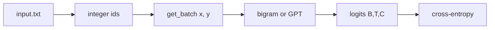
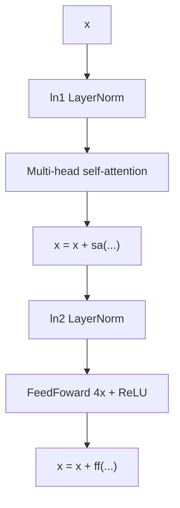

This page sits under [How a tiny GPT learns]({{ '/posts/build-gpt-from-scratch-character-level/' | relative_url }}). That post is the idea. This one is the code.

I am walking the [Colab notebook](https://colab.research.google.com/drive/1JMLa53HDuA-i7ZBmqV7ZnA3c_fvtXnx-?usp=sharing) and the [ng-video-lecture](https://github.com/karpathy/ng-video-lecture) repo (`bigram.py`, `gpt.py`, `input.txt`). The notebook is titled **Building a GPT**. It is the companion to the [Zero to Hero](https://karpathy.ai/zero-to-hero.html) lecture [Let's build GPT: from scratch, in code, spelled out](https://www.youtube.com/watch?v=kCc8FmEb1nY).

The repo is **MIT** licensed (see the README). Short snippets below are from that code, written by Andrej Karpathy. I am explaining them, not rewriting the lecture as my own work.




---

## What you are looking at

| File | What it is |
| --- | --- |
| [Colab notebook](https://colab.research.google.com/drive/1JMLa53HDuA-i7ZBmqV7ZnA3c_fvtXnx-?usp=sharing) | Cells in lecture order: data, bigram, the matrix trick, one attention head, notes, then a full finished script |
| `input.txt` | Tiny Shakespeare. The notebook downloads it with `wget` from the old [char-rnn](https://raw.githubusercontent.com/karpathy/char-rnn/master/data/tinyshakespeare/input.txt) dump |
| [`bigram.py`](https://github.com/karpathy/ng-video-lecture/blob/master/bigram.py) | The weak model only. Ready to run as a script |
| [`gpt.py`](https://github.com/karpathy/ng-video-lecture/blob/master/gpt.py) | The scaled decoder-only Transformer from the end of the lecture |
| [README](https://github.com/karpathy/ng-video-lecture/blob/master/README.md) | Says this is the lecture code. Also notes that weight init is better in [nanoGPT](https://github.com/karpathy/nanoGPT) |

The Colab and the two `.py` files tell the same story. The notebook is slower and more talkative. The scripts are the "run this" version.

I fetched the notebook (Drive export) and the raw GitHub files while writing this. Cell order below matches that notebook.

---

## Shapes you will see everywhere

PyTorch comments in this repo use **B**, **T**, **C**.

| Letter | Name | Meaning here |
| --- | --- | --- |
| **B** | batch | How many independent windows sit in one GPU step |
| **T** | time / block | How many characters in one window (`block_size`) |
| **C** | channels | Width of a vector. For the bigram, C is 65 (vocab). For GPT, C is `n_embd` (384 in `gpt.py`) |

| Tensor | Shape | What is inside |
| --- | --- | --- |
| `idx` / `x` | `(B, T)` | Character ids |
| `y` | `(B, T)` | Next-character ids (x, shifted by one) |
| token + position embed | `(B, T, C)` | One vector per character |
| attention weights | `(B, T, T)` | For each query position, a score on every key position |
| logits | `(B, T, vocab_size)` | Next-character scores |
| loss | scalar | Cross-entropy after flattening to `(B*T, vocab_size)` |


---

## 1. Load tiny Shakespeare

The notebook starts by downloading the file, then reading it:

```python
# Colab cell: download, then inspect
!wget https://raw.githubusercontent.com/karpathy/char-rnn/master/data/tinyshakespeare/input.txt

with open('input.txt', 'r', encoding='utf-8') as f:
    text = f.read()
print("length of dataset in characters: ", len(text))
print(text[:1000])
```

On that public file, `len(text)` is **1,115,394**. About 1 MB. The first line is `First Citizen:`.

`bigram.py` and `gpt.py` skip the `wget`. They just open `input.txt` in the current folder. Download it once, then run the script.

---

## 2. `chars`, `vocab_size`, `stoi` / `itos`, `encode` / `decode`

```python
chars = sorted(list(set(text)))
vocab_size = len(chars)
# 65 unique characters

stoi = {ch: i for i, ch in enumerate(chars)}
itos = {i: ch for i, ch in enumerate(chars)}
encode = lambda s: [stoi[c] for c in s]
decode = lambda l: ''.join([itos[i] for i in l])

print(encode("hii there"))
# [46, 47, 47, 1, 58, 46, 43, 56, 43]
print(decode(encode("hii there")))
# hii there
```

What this is doing:

- `set(text)` = every unique character.
- `sorted(...)` = a stable alphabet. Newline comes first, then space, then punctuation, then letters.
- `vocab_size` is **65** on this file.
- `stoi` = string to integer. `itos` = integer to string.
- `encode` walks each character. `decode` joins them back.

The network never sees the letter `h`. It sees `46`.

The parent post already explained why real ChatGPT-class models use subword tokenizers ([tiktoken](https://github.com/openai/tiktoken), SentencePiece) instead. Here we stay at one character = one token so the tensors stay readable.


---

## 3. One long tensor, then a 90/10 split

```python
data = torch.tensor(encode(text), dtype=torch.long)
n = int(0.9 * len(data))  # first 90% train, rest val
train_data = data[:n]
val_data = data[n:]
```

- `data` is a 1-D `torch.long` tensor of length 1,115,394.
- First 90% is train. Last 10% is val.
- Val is for checking. Do not treat it as extra training text.

`get_batch('train')` and `get_batch('val')` pick from the matching slice.

---

## 4. `block_size`, `batch_size`, and `get_batch`

The notebook first sets `block_size = 8` and prints one window:

```python
x = train_data[:block_size]
y = train_data[1:block_size+1]
for t in range(block_size):
    context = x[:t+1]
    target = y[t]
    print(f"when input is {context} the target: {target}")
```

`y` is `x` shifted left by one. Every prefix of the window is a training example.

Worked example with letters (same rule as the notebook, easier to read than raw ids):

| Step `t` | Context the model sees (`x[:t+1]`) | Target (`y[t]`) |
| --- | --- | --- |
| 0 | `H` | `e` |
| 1 | `He` | `l` |
| 2 | `Hel` | `l` |
| 3 | `Hell` | `o` |
| 4 | `Hello` | `!` |
| 5 | `Hello!` | `?` |
| 6 | `Hello!?` | `?` |
| 7 | `Hello!??` | next char after the 8 |

That is why a chunk of length **T + 1** packs **T** predictions. Generation often starts from one token (the scripts start from a single 0, which decodes as newline). The model has to work with a short context, not only a full block.

Then the notebook builds a real batch:

```python
batch_size = 4   # notebook walkthrough
block_size = 8

def get_batch(split):
    data = train_data if split == 'train' else val_data
    ix = torch.randint(len(data) - block_size, (batch_size,))
    x = torch.stack([data[i:i+block_size] for i in ix])
    y = torch.stack([data[i+1:i+block_size+1] for i in ix])
    return x, y
```

- Pick `B` random start indexes. Each start is far enough from the end that `i + block_size` still fits.
- `x` is characters `[i : i+T]`.
- `y` is characters `[i+1 : i+T+1]`.
- Stack them. Shapes are `(B, T)` and `(B, T)`.

The scripts also move the batch to `device` (`cuda` if present, else `cpu`).

Windows in a batch do **not** attend to each other. That is the B dimension.

---

## 5. `BigramLanguageModel`: a lookup table

```python
class BigramLanguageModel(nn.Module):
    def __init__(self, vocab_size):
        super().__init__()
        self.token_embedding_table = nn.Embedding(vocab_size, vocab_size)

    def forward(self, idx, targets=None):
        logits = self.token_embedding_table(idx)  # (B, T, C)
        if targets is None:
            return logits, None
        B, T, C = logits.shape
        logits = logits.view(B * T, C)
        targets = targets.view(B * T)
        loss = F.cross_entropy(logits, targets)
        return logits, loss
```

Plain reading:

- `nn.Embedding(65, 65)` is a 65×65 table.
- Row 46 is the next-character scores after seeing id 46 (`h`).
- Tokens do not talk. Position 3 does not look at position 2.
- `logits` come out as `(B, T, 65)`.
- `F.cross_entropy` wants `(N, C)` and a 1-D target of length `N`. So we flatten to `(B*T, 65)` and `(B*T,)`.

### Why the first loss is about 4.17

A fresh table is random. It has no reason to prefer `e` over `q`.

If every character is equally likely:

\[
-\ln(1/65) \approx 4.17
\]

That is the "I have no idea" loss. The lecture's trained bigram then sits around **~2.5**. Those figures are from the lecture run, not from a stopwatch on my machine.


### `generate`: softmax, then a dice roll

```python
def generate(self, idx, max_new_tokens):
    for _ in range(max_new_tokens):
        logits, loss = self(idx)
        logits = logits[:, -1, :]          # (B, C) — last time step only
        probs = F.softmax(logits, dim=-1)  # (B, C)
        idx_next = torch.multinomial(probs, num_samples=1)
        idx = torch.cat((idx, idx_next), dim=1)
    return idx
```

- Take the last position's 65 scores.
- Softmax turns them into probabilities that add to 1.
- `torch.multinomial` samples one id. Same prompt can give a different next character. That is on purpose.
- Append and repeat.

The bigram `generate` does **not** crop the context. It does not need to. There is no position table. `gpt.py` will crop. See below.

The scripts start generation from `torch.zeros((1, 1))`. Id 0 is newline in this alphabet.

---

## 6. The training loop

```python
optimizer = torch.optim.AdamW(model.parameters(), lr=learning_rate)

for iter in range(max_iters):
    if iter % eval_interval == 0:
        losses = estimate_loss()
        print(f"step {iter}: train loss ... val loss ...")

    xb, yb = get_batch('train')
    logits, loss = model(xb, yb)
    optimizer.zero_grad(set_to_none=True)
    loss.backward()
    optimizer.step()
```

| Line | What it does |
| --- | --- |
| `AdamW(...)` | The optimiser. It keeps a moving average of gradients and updates the table (and later, all the Linear layers) |
| `zero_grad` | Clear old gradients. `set_to_none=True` is a small PyTorch speed habit |
| `backward` | Compute gradients of `loss` w.r.t. every weight |
| `step` | Nudge the weights a little so the correct next character scores higher |

`estimate_loss` is the honest meter:

```python
@torch.no_grad()
def estimate_loss():
    out = {}
    model.eval()
    for split in ['train', 'val']:
        losses = torch.zeros(eval_iters)
        for k in range(eval_iters):
            X, Y = get_batch(split)
            logits, loss = model(X, Y)
            losses[k] = loss.item()
        out[split] = losses.mean()
    model.train()
    return out
```

- `@torch.no_grad()` = do not store gradients. Faster, less memory.
- `model.eval()` = turn dropout off (and any other train-only behaviour).
- Average `eval_iters` (200) random batches so one lucky batch does not fool you.
- `model.train()` = put dropout back before the next real update.

In the notebook's first play cell, they train the bigram for 100 steps at `lr=1e-3` just to see it move. `bigram.py` uses `max_iters = 3000`, `lr = 1e-2`, `batch_size = 32`.

---

## 7. The mathematical trick: three ways to average the past

The notebook section is titled **The mathematical trick in self-attention**. Goal:

> For each position `t`, mix information from positions `0..t`. Do not look at the future.

### Version 1 — a Python loop

```python
# We want x[b,t] = mean_{i<=t} x[b,i]
xbow = torch.zeros((B, T, C))
for b in range(B):
    for t in range(T):
        xprev = x[b, :t+1]       # (t, C)
        xbow[b, t] = torch.mean(xprev, 0)
```

Correct. Slow. Fine for teaching.

### Version 2 — `torch.tril` and one multiply

```python
wei = torch.tril(torch.ones(T, T))
wei = wei / wei.sum(1, keepdim=True)
xbow2 = wei @ x   # (T, T) @ (B, T, C) -> (B, T, C)
# torch.allclose(xbow, xbow2) is True
```

`torch.tril` is the lower triangle. 1s on and below the diagonal, 0s above. Divide each row by its sum and you get "average the past". The `@` does it for the whole batch at once.

### Version 3 — softmax plus `-inf`

```python
tril = torch.tril(torch.ones(T, T))
wei = torch.zeros((T, T))
wei = wei.masked_fill(tril == 0, float('-inf'))
wei = F.softmax(wei, dim=-1)
xbow3 = wei @ x
# torch.allclose(xbow, xbow3) is True
```

Softmax of 0 on the allowed cells, and `-inf` on the future, is the same uniform average. Softmax(`-inf`) is 0, so the future is gone.

All three tensors match. Version 3 is the one attention will use, because next we **stop using zeros** for `wei` and fill it with Query·Key scores instead.


---

## 8. One self-attention head

Notebook "version 4", then the `Head` class in `gpt.py`. Same idea.

```python
# Colab version 4 (toy sizes: B=4, T=8, C=32, head_size=16)
key = nn.Linear(C, head_size, bias=False)
query = nn.Linear(C, head_size, bias=False)
value = nn.Linear(C, head_size, bias=False)
k = key(x)    # (B, T, 16)
q = query(x)  # (B, T, 16)
wei = q @ k.transpose(-2, -1)  # (B, T, T)

tril = torch.tril(torch.ones(T, T))
wei = wei.masked_fill(tril == 0, float('-inf'))
wei = F.softmax(wei, dim=-1)
v = value(x)
out = wei @ v
```

`gpt.py` writes the scaled form and keeps a `tril` buffer:

```python
wei = q @ k.transpose(-2, -1) * k.shape[-1]**-0.5
wei = wei.masked_fill(self.tril[:T, :T] == 0, float('-inf'))
wei = F.softmax(wei, dim=-1)
out = wei @ v
```

| Piece | Shape | Job |
| --- | --- | --- |
| `x` | `(B, T, C)` | Token (+ position) vectors |
| `q`, `k`, `v` | `(B, T, head_size)` | Ask / label / payload |
| `wei` before mask | `(B, T, T)` | Raw affinities |
| `wei` after softmax | `(B, T, T)` | Weights that sum to 1 along the last dim |
| `out` | `(B, T, head_size)` | Mixed values |

### Why divide by `sqrt(head_size)`

The notebook note is the clean version:

> Scaled attention divides `wei` by `1/sqrt(head_size)`. When Q and K are unit variance, `wei` stays near unit variance. Softmax stays diffuse and does not saturate.

If you skip the scale, dots get large, softmax becomes almost one-hot, and the head only listens to one past token. The notebook shows this with `softmax(scores)` vs `softmax(scores * 8)`.

\[
\mathrm{Attention}(Q,K,V)=\mathrm{softmax}\left(\frac{QK^{\top}}{\sqrt{d}}+M\right)V
\]


### Encoder vs decoder, self vs cross

From the notebook notes, in the same words the lecture uses:

- Attention is a **communication** mechanism. Nodes in a graph mix information with a weighted sum.
- Attention has **no notion of space**. That is why we add position embeddings.
- Batch rows never talk to each other.
- **Decoder** block = keep the `tril` mask (language modelling).
- **Encoder** block = delete the mask line. Every token may look at every token. BERT-style.
- **Self-attention** = Q, K, V all come from `x`.
- **Cross-attention** = Q from `x`, K and V from another stream (the encoder, in the 2017 translation model).

The Colab even draws a French → English sketch: encode the source, then decode the target with a `<START>` token.

GPT in this repo is **decoder-only**. No encoder. No cross-attention.

---

## 9. Multi-head, feed-forward, and one `Block`

```python
class MultiHeadAttention(nn.Module):
    def __init__(self, num_heads, head_size):
        super().__init__()
        self.heads = nn.ModuleList([Head(head_size) for _ in range(num_heads)])
        self.proj = nn.Linear(head_size * num_heads, n_embd)
        self.dropout = nn.Dropout(dropout)

    def forward(self, x):
        out = torch.cat([h(x) for h in self.heads], dim=-1)
        out = self.dropout(self.proj(out))
        return out
```

Several small heads run in parallel. Concat on the channel dim. Project back to `n_embd`. In `gpt.py`, `n_embd = 384` and `n_head = 6`, so each head is size 64.

The class name in the repo is `FeedFoward` (one 'r'). Search for that spelling.

```python
class FeedFoward(nn.Module):
    def __init__(self, n_embd):
        super().__init__()
        self.net = nn.Sequential(
            nn.Linear(n_embd, 4 * n_embd),
            nn.ReLU(),
            nn.Linear(4 * n_embd, n_embd),
            nn.Dropout(dropout),
        )
```

Widen 4×, ReLU, project back. This runs **per token**. No mixing across time. Attention mixed. This thinks.

```python
class Block(nn.Module):
    def forward(self, x):
        x = x + self.sa(self.ln1(x))
        x = x + self.ffwd(self.ln2(x))
        return x
```

That is the whole block:

1. LayerNorm.
2. Multi-head attention.
3. Add the residual (`x + ...`).
4. LayerNorm.
5. Feed-forward.
6. Add the residual again.

This is **pre-norm**: norm, then the sub-layer, then add. The 2017 paper drew post-norm. Pre-norm is what `gpt.py` uses.




Dropout sits on attention weights, on the projection, and in the MLP. `gpt.py` uses `dropout = 0.2`.

---

## 10. Position embeddings, and why `generate` crops

Attention does not know order. If you swap two characters, the dots still run. So `gpt.py` adds a second table:

```python
self.token_embedding_table = nn.Embedding(vocab_size, n_embd)
self.position_embedding_table = nn.Embedding(block_size, n_embd)
```

In `forward`:

```python
tok_emb = self.token_embedding_table(idx)                         # (B, T, C)
pos_emb = self.position_embedding_table(torch.arange(T, device=device))  # (T, C)
x = tok_emb + pos_emb
```

"I am the letter `e`" plus "I sit at index 4".

The position table only has `block_size` rows (256 in `gpt.py`). If the generated string grows past that, you cannot look up position 257. So `generate` crops:

```python
idx_cond = idx[:, -block_size:]
logits, loss = self(idx_cond)
```

Keep the full story in `idx` (so you can decode the whole sample). Feed only the last 256 ids into the net.

The bigram script has no position table, so it does not crop.


---

## 11. `gpt.py` knobs

These are the values at the top of [`gpt.py`](https://github.com/karpathy/ng-video-lecture/blob/master/gpt.py). The lecture's scaled run used this script.

| Knob | `gpt.py` value | What it does |
| --- | --- | --- |
| `batch_size` | 64 | Independent windows per step. Bigger = smoother gradients, more VRAM |
| `block_size` | 256 | Maximum characters the model may look at |
| `max_iters` | 5000 | How many AdamW steps |
| `eval_interval` | 500 | How often to print train/val loss |
| `eval_iters` | 200 | Batches averaged inside `estimate_loss` |
| `learning_rate` | `3e-4` | AdamW step size. Smaller than the bigram's `1e-2` |
| `n_embd` | 384 | Channel width C. Token and position vectors are this long |
| `n_head` | 6 | Parallel attention heads. Head size = 384 / 6 = 64 |
| `n_layer` | 6 | How many `Block`s are stacked |
| `dropout` | 0.2 | Fraction dropped in attention / projection / MLP |
| `device` | `cuda` if available else `cpu` | Where tensors live |

The script prints `sum(p.numel() for p in m.parameters())/1e6`. That count is about **10.7M** parameters.

The lecture reports a val loss around **1.48** after about **15 minutes on an A100**. Those are the lecture's numbers, not mine.

`gpt.py` also calls `_init_weights` (normal init, std 0.02). The repo README says this was **not** covered in the original video, and that [nanoGPT's `model.py`](https://github.com/karpathy/nanoGPT/blob/master/model.py) is the cleaner init story.

---

## 12. How to run it yourself

### Colab

1. Open the [lecture Colab](https://colab.research.google.com/drive/1JMLa53HDuA-i7ZBmqV7ZnA3c_fvtXnx-?usp=sharing).
2. File → Save a copy in Drive, so you are not writing to the shared notebook.
3. Runtime → Change runtime type → **GPU** (T4 is enough for the walkthrough cells).
4. Run from the top. The first cell `wget`s `input.txt`.
5. For the full finished cell at the bottom, expect minutes on a Colab GPU, not seconds. On CPU it will feel slow. Shrink `n_layer`, `n_embd`, and `max_iters` if the session is dragging.

### Local scripts

```bash
wget https://raw.githubusercontent.com/karpathy/char-rnn/master/data/tinyshakespeare/input.txt
python bigram.py
python gpt.py
```

You need PyTorch. A GPU is optional for `bigram.py`. For `gpt.py` as written (6 layers, 384 width, 5000 steps), a laptop CPU will take a long time. I did not time it on this machine, so I will not invent a number.

Laptop CPU tips:

- `n_layer = 2`
- `n_embd = 128` (keep it divisible by `n_head`)
- `block_size = 64`
- `batch_size = 16`
- `max_iters = 500`
- You will not hit the lecture's 1.48 val loss. You will still see the loss drop and the samples get less random.

If you have a CUDA GPU, the scripts already pick `device = 'cuda'`.

---

## 13. Common gotchas

| Symptom | Likely cause |
| --- | --- |
| `RuntimeError` about shape, often `cross_entropy` | Logits are still `(B, T, C)` and targets are `(B, T)`. Flatten to `(B*T, C)` and `(B*T,)` |
| `size of tensor a (257) must match size of tensor b (256)` in `generate` | You forgot `idx[:, -block_size:]`. The position table only has `block_size` rows |
| `Expected all tensors to be on the same device` | Batch is on CPU, model is on CUDA (or the reverse). `get_batch` in the scripts calls `.to(device)`. Do the same for `context` |
| Loss printed as `nan` | Learning rate too high, or `-inf` mask applied on the wrong dim. Check `masked_fill` uses `tril[:T, :T]` |
| Train loss keeps falling, val loss rises | Overfitting. 1 MB of Shakespeare and a 10M model can memorise. Dropout (0.2) is already there. You can also stop earlier |
| Samples look like Shakespeare but mean nothing | That is normal. The model copies **local style** (names, colons, `thou`). It is not thinking about the plot |
| `FileNotFoundError: input.txt` | The scripts do not download the file. `wget` it first, or run the Colab cell that does |
| Searching for `FeedForward` finds nothing | The class is spelled `FeedFoward` in this repo |

---

## 14. `bigram.py` vs `gpt.py`

| | `bigram.py` | `gpt.py` |
| --- | --- | --- |
| Idea | Next-char lookup table | Decoder-only Transformer |
| `batch_size` | 32 | 64 |
| `block_size` | 8 | 256 |
| `max_iters` | 3000 | 5000 |
| `learning_rate` | `1e-2` | `3e-4` |
| Token embed | `(65, 65)` — already the logits | `(65, 384)` |
| Position embed | no | yes, 256 × 384 |
| Attention | no | 6 heads × 6 layers, causal mask |
| MLP | no | 4× width, ReLU |
| Residual + LayerNorm | no | pre-norm in every block |
| Dropout | no | 0.2 |
| `generate` crop | no | `idx[:, -block_size:]` |
| Lecture-reported loss | ~2.5 after a short train | ~1.48 val on an A100 ~15 min |
| Parameters | tiny (65×65 plus nothing much) | about 10.7M |

Same data. Same encode/decode. Same `get_batch` idea. The second file is "let the tokens talk".

---

## 15. Where to go next

- Parent post (ideas only): [How a tiny GPT learns]({{ '/posts/build-gpt-from-scratch-character-level/' | relative_url }})
- Lecture video: [Let's build GPT: from scratch, in code, spelled out](https://www.youtube.com/watch?v=kCc8FmEb1nY)
- Cleaner, faster follow-on: [karpathy/nanoGPT](https://github.com/karpathy/nanoGPT)
- The 2017 paper: [Attention Is All You Need](https://arxiv.org/abs/1706.03762)
- Subword tokenizers, when you leave character-level: [tiktoken](https://github.com/openai/tiktoken)

If you only change one thing after this walkthrough, print `xb`, `yb`, and `wei[0]` once. The rest of GPT is those three tensors, stacked.

---

## Sources

- [Colab — Building a GPT](https://colab.research.google.com/drive/1JMLa53HDuA-i7ZBmqV7ZnA3c_fvtXnx-?usp=sharing)
- [karpathy/ng-video-lecture](https://github.com/karpathy/ng-video-lecture) (`bigram.py`, `gpt.py`, README; MIT)
- Tiny Shakespeare: [char-rnn `input.txt`](https://raw.githubusercontent.com/karpathy/char-rnn/master/data/tinyshakespeare/input.txt) (1,115,394 characters, 65 unique, checked on that file)
- [Zero to Hero](https://karpathy.ai/zero-to-hero.html)
- Vaswani et al., [Attention Is All You Need](https://arxiv.org/abs/1706.03762)

Loss, wall-clock, and "about 10.7M" figures are from the lecture / `gpt.py` printout. Treat them as teaching examples.
